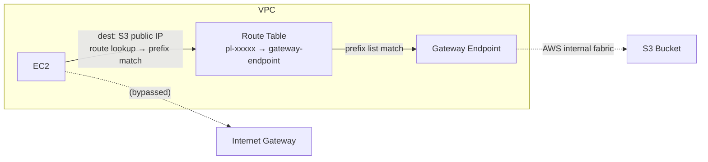
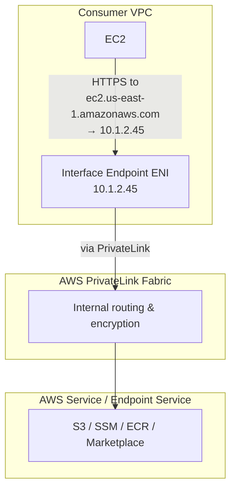
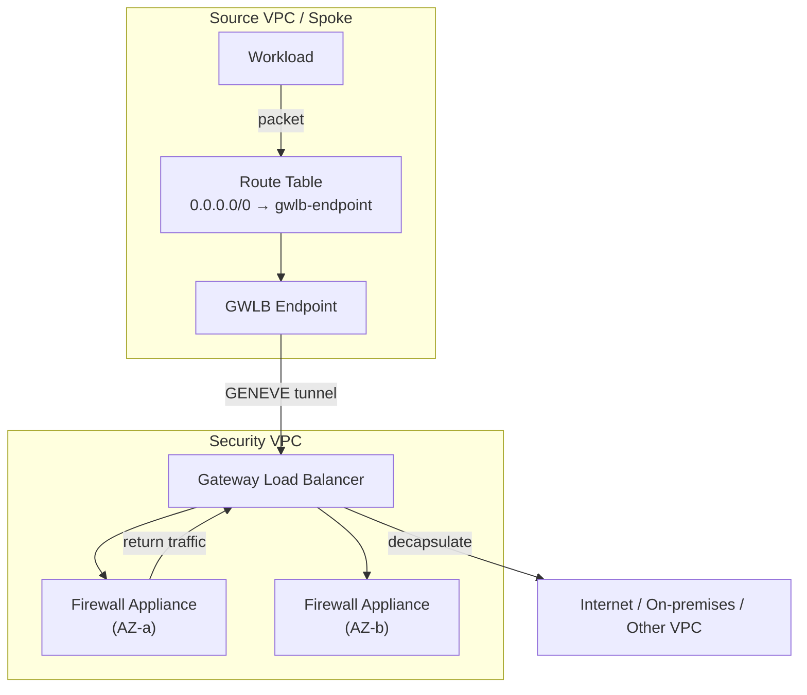
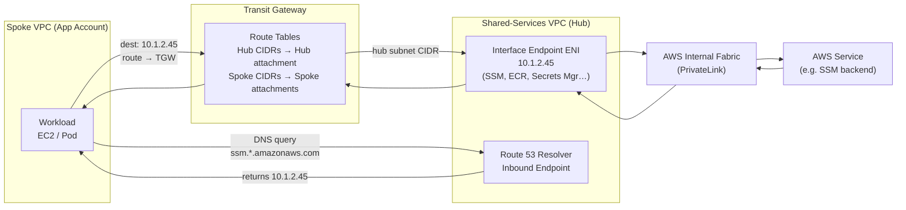
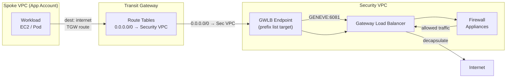

# Centralized VPC Endpoints & Private DNS Resolution

## Table of Contents

| Section | Topic | Description |
| :---: | :--- | :--- |
| **01** | [Why Centralize VPC Endpoints?](#1-why-centralize-vpc-endpoints) | The cost and operational problem that centralization solves. |
| **02** | [The Three Endpoint Types](#2-the-three-endpoint-types) | Gateway, Interface (PrivateLink), and Gateway Load Balancer — core distinctions, routing mechanics, and where each type belongs. |
| **02a** | [Gateway Endpoints: S3 & DynamoDB](#2a-gateway-endpoints-s3--dynamodb) | Prefix list mechanics, route propagation limits, bucket policies with sourceVpce, and why they cannot be centralized. |
| **02b** | [Interface Endpoints: AWS PrivateLink](#2b-interface-endpoints-aws-privatelink) | ENI mechanics, pricing breakdown, private DNS generation, and the PHZ association pattern for cross-account access. |
| **02c** | [Gateway Load Balancer Endpoints](#2c-gateway-load-balancer-endpoints) | GWLB endpoint internals, appliance integration models, traffic flow for security inspection, and centralized vs distributed deployment. |
| **03** | [The Centralized Hub Architecture](#3-the-centralized-hub-architecture) | Shared-services VPC design, TGW attachment, and traffic flow. |
| **04** | [Private DNS & PHZ Sharing](#4-private-dns-phz-sharing) | How Route 53 Private Hosted Zones are associated across accounts, and why it is non-trivial. |
| **05** | [DNS Resolution Flow End-to-End](#5-dns-resolution-flow-end-to-end) | Step-by-step DNS lookup path from a spoke workload to the endpoint. |
| **06** | [Route 53 Resolver: Inbound & Outbound Rules](#6-route-53-resolver-inbound-outbound-rules) | Where Resolver endpoints live, and the forwarding rule design for spoke accounts. |
| **07** | [Security Controls & Endpoint Policies](#7-security-controls-endpoint-policies) | Endpoint-level resource policies, SCPs, and network-layer controls. |
| **08** | [Operational Considerations & Trade-offs](#8-operational-considerations-trade-offs) | Availability, blast radius, latency, and when not to centralize. |

---

## 1. Why Centralize VPC Endpoints?

In a multi-account AWS Landing Zone, every spoke VPC that needs private access to AWS services — S3, EC2, SSM, ECR, Secrets Manager, and dozens of others — would, by default, provision its own set of VPC endpoints. At scale, this becomes expensive and operationally noisy.

Interface endpoints are billed per hour per Availability Zone plus per-GB data processing. A single Interface Endpoint for SSM across three AZs costs roughly $0.01/hr × 3 AZs × 730 hrs ≈ **~$22/month per endpoint per spoke VPC**. Multiply that by 15 services and 30 spoke accounts and the idle infrastructure cost alone reaches tens of thousands of dollars monthly before a single byte of traffic flows.

Centralization collapses that sprawl into a single shared-services VPC that owns the endpoints on behalf of every spoke account. The spoke VPCs reach those endpoints over Transit Gateway, and DNS resolution is handled by Route 53 Resolver forwarding rules that push endpoint hostname queries to the hub's private resolvers. The result is a hub-and-spoke PrivateLink topology where the infrastructure is provisioned once and consumed by many.

The trade-off is added architectural complexity — particularly around DNS — and a single point of failure that requires deliberate availability design. Both are discussed in later sections.

---

## 2. The Three Endpoint Types

AWS VPC Endpoints come in three distinct families: **Gateway**, **Interface (PrivateLink)**, and **Gateway Load Balancer**. Each operates at a different layer of the network stack and suits a different category of use case. A well-architected Landing Zone uses all three in combination.

| Property | Gateway Endpoint | Interface Endpoint | GWLB Endpoint |
| :--- | :--- | :--- | :--- |
| **Services** | S3, DynamoDB only | 100+ AWS services + Marketplace | Third-party appliances (firewall, IDS/IPS) |
| **Billing** | Free | Per-AZ hourly + per-GB data | Per-GWLB-hour + per-GB appliance data |
| **Network layer** | L3 (route table prefix list) | L4 (ENI with private IP) | L3 (GENEVE tunnel to appliances) |
| **DNS override** | No | Yes (auto-generated PHZ) | No |
| **Centralizable** | No — per-VPC only | Yes — via PHZ sharing + TGW | Yes — via TGW + GWLB endpoints |

---

## 2a. Gateway Endpoints: S3 & DynamoDB

### How They Work

Gateway Endpoints are not a network interface. They are a **routing construct** — a prefix list injected into the VPC route table. When a resource in that VPC resolves `s3.amazonaws.com` (or DynamoDB), it gets a public IP. The packet is routed according to the VPC's route table, which now has a prefix list entry pointing to the gateway endpoint. The packet is intercepted by AWS's internal fabric before it reaches the internet gateway and forwarded to the S3 or DynamoDB service endpoint.



The prefix list is specific to each service and region. When you create an S3 Gateway Endpoint in `us-east-1`, AWS injects the prefix list for S3 in that region into the VPC route table. All traffic to those S3 IP prefixes is redirected through the endpoint.

### Why They Cannot Be Centralized

**Transit Gateway does not propagate prefix list routes.** If you create a Gateway Endpoint in a hub VPC, the prefix list entry exists only in that hub VPC's route table. Spoke VPCs connected via TGW do not inherit the prefix list. Their route tables have no entry pointing to the hub's gateway endpoint — so traffic from spoke workloads to S3 public IPs will either exit through a NAT Gateway/IGW or fail entirely if no internet route exists.

There is no architectural workaround for this. Gateway Endpoints are fundamentally non-transitive. Every VPC that needs private S3 or DynamoDB access must own its own gateway endpoint.

### Cost Implication

This limitation is painless: **Gateway Endpoints are free.** No hourly charge, no data processing fee. Provisioning one per spoke VPC adds zero marginal cost. The only overhead is operational — ensuring each new VPC gets gateway endpoints during account vending.

### S3-Specific Patterns

**Bucket policies with `aws:SourceVpce`.** Once a gateway endpoint exists in a VPC, you can restrict S3 bucket access to traffic originating through that endpoint using the `aws:SourceVpce` condition key:

```json
{
    "Effect": "Deny",
    "Principal": "*",
    "Action": "s3:*",
    "Resource": [
        "arn:aws:s3:::my-sensitive-bucket",
        "arn:aws:s3:::my-sensitive-bucket/*"
    ],
    "Condition": {
        "StringNotEquals": {
            "aws:SourceVpce": "vpce-xxxxx"
        }
    }
}
```

This is an S3-level control, not a VPC routing control. It does not care about which VPC or account the traffic originated from — only that it transited the specified endpoint.

**Gateway vs Interface for S3.** S3 can also be accessed via an Interface Endpoint (PrivateLink). The decision matrix:

| Factor | Gateway Endpoint | Interface Endpoint |
| :--- | :--- | :--- |
| Cost | Free | ~$22/month per AZ |
| Throughput | Up to 100 Gbps | 10 Gbps per ENI (burst to 25 Gbps) |
| DNS | Public hostname only | Private DNS hostname available |
| Security | Bucket policy with `aws:SourceVpce` | Endpoint policy + bucket policy |
| On-prem access | Not supported from on-prem | Supported via PrivateLink + Direct Connect |
| Cross-region | Same-region only | Same-region only |

For most multi-account architectures, **gateway endpoints are the default for S3 and DynamoDB**. Interface Endpoints for S3 are only justified when you need private DNS hostnames or on-premises access via Direct Connect.

### DynamoDB Patterns

DynamoDB Gateway Endpoints work identically to S3 — same prefix list mechanism, same non-transitive limitation, same cost advantage. The `aws:SourceVpce` condition also works with DynamoDB.

One important distinction: DynamoDB Accelerator (DAX) does not use gateway endpoints. DAX clusters run inside your VPC and communicate with DynamoDB over the public endpoint or through an Interface Endpoint. If you use DAX, the DAX-to-DynamoDB path still benefits from the gateway endpoint in the same VPC.

---

## 2b. Interface Endpoints: AWS PrivateLink

### How They Work

Interface Endpoints provision one or more **Elastic Network Interfaces** (ENIs) directly inside the VPC subnets where the endpoint is created. Each ENI receives a private IP address from the subnet's CIDR range. AWS's internal PrivateLink fabric connects those ENIs to the target service's backend — whether that is an AWS-managed service or a third-party service in another account.



### ENI Placement and Availability

When you create an Interface Endpoint, you specify one subnet per AZ. An ENI is provisioned in each specified subnet. AWS assigns a DNS record that resolves to all ENI IPs — the order is randomized for load distribution. If an ENI becomes unhealthy, AWS removes it from DNS rotation and the remaining ENIs handle the traffic.

**Multi-AZ is mandatory for production.** A single-AZ endpoint creates a single point of failure. In a centralized hub model, this failure would affect all spoke accounts.

### Pricing

| Component | Cost | Notes |
| :--- | :--- | :--- |
| Hourly charge | ~$0.01/hr per AZ per endpoint | $0.01 × 3 AZs × 730 hrs = ~$22/month/endpoint |
| Data processing | ~$0.01/GB | Charged on data processed through the endpoint |
| Typical 20-endpoint hub | ~$440/month | 20 endpoints × $22/month, before data charges |

### DNS Behavior Deep Dive

When you create an Interface Endpoint with **private DNS enabled**, AWS creates a **Private Hosted Zone** (PHZ) for that endpoint's service DNS name. For example, an SSM Interface Endpoint produces a PHZ for `ssm.us-east-1.amazonaws.com` containing A records pointing to the ENI IPs. This PHZ is automatically associated with the VPC that owns the endpoint.

Resources inside that VPC resolve the service hostname to the ENI private IPs. Resources outside that VPC — including spoke VPCs connected over TGW — resolve the same hostname to the **public** IP of the service because they are not associated with the PHZ.

This DNS split is the central challenge of centralized Interface Endpoints. The solution is **cross-account PHZ association** or **Route 53 Resolver forwarding rules**, both discussed in Sections 4-6.

### Cross-Account Sharing Model

Interface Endpoints are directly shareable only via the endpoint's private DNS mechanism. The `vpce` DNS name (e.g., `vpce-xxxxx-ec2.us-east-1.vpce.amazonaws.com`) is resolvable from any network that can reach the ENI IPs — but that is rarely what applications use. Applications use the standard service DNS name (`ec2.us-east-1.amazonaws.com`), which requires the PHZ association.

The sharing pattern is:
1. Hub VPC owns the Interface Endpoints and their PHZs.
2. Each spoke VPC gets the hub's PHZs associated (cross-account).
3. Spoke workloads resolve service DNS names to ENI IPs.
4. Routing over TGW delivers traffic to the ENI IPs.

---

## 2c. Gateway Load Balancer Endpoints

### How They Work

Gateway Load Balancer Endpoints are a routing construct that intercepts traffic and tunnels it to a Gateway Load Balancer (GWLB) using **GENEVE encapsulation**. Unlike Interface Endpoints which terminate traffic at the ENI, GWLB endpoints are transparent — they forward packets to backend appliances (firewalls, IDS/IPS) that inspect and return the traffic.

The traffic flow has three stages:

1. **Interception.** A route table entry (prefix list) in the source VPC matches the destination (e.g., `0.0.0.0/0` for internet-bound traffic, or a specific CIDR) and points to the GWLB endpoint as the next hop.
2. **Encapsulation.** The GWLB endpoint wraps the original packet in a GENEVE tunnel and sends it to the Gateway Load Balancer.
3. **Inspection and return.** The GWLB distributes traffic to registered appliances. After inspection, the appliance returns the packet to the GWLB, which decapsulates and forwards it to the original destination.



### Key Properties

| Property | Detail |
| :--- | :--- |
| **Supported services** | Third-party appliances (Fortinet, Palo Alto, Check Point, Cisco, etc.) |
| **Billing** | Per-GWLB-hour + data processing through GWLB |
| **Encapsulation** | GENEVE (Generic Network Virtualization Encapsulation) — port 6081 |
| **DNS behaviour** | No DNS component — purely a routing mechanism |
| **Routing mechanism** | Prefix list in source VPC route table points to GWLB endpoint |
| **Cross-account sharing** | GWLB endpoint can be in one account, appliances in another |
| **Transparency** | Traffic is routed through, not terminated at, the endpoint |

### Use Cases

| Use Case | Description |
| :--- | :--- |
| **Internet egress inspection** | Centralize outbound traffic from spoke VPCs through a security VPC with firewall appliances before reaching the internet. |
| **Transit VPC inspection** | Inspect traffic between spoke VPCs (east-west) using a central inspection VPC. |
| **Inbound traffic inspection** | Filter traffic entering the AWS environment from Direct Connect or VPN before it reaches application VPCs. |
| **Traffic mirroring** | Send copies of traffic to monitoring appliances for analysis (IDS). |

### Centralized vs Distributed GWLB Endpoints

| Model | Traffic Flow | Pros | Cons |
| :--- | :--- | :--- | :--- |
| **Centralized (inspection VPC)** | Spokes → TGW → Security VPC → GWLB → appliances → internet | Single policy point, cost consolidation, simpler appliance licensing | TGW hop adds latency, single blast radius for inspection failure |
| **Distributed (per spoke GWLB)** | Spoke → GWLB endpoint in same VPC → GWLB in security VPC → appliances | Lower latency, isolated blast radius | More GWLB endpoints to manage, policy must be coordinated |

For most Landing Zone designs, the **centralized model** is preferred because the cost and operational benefits of a single security policy domain outweigh the latency and blast-radius trade-offs. The GWLB endpoint itself is a lightweight construct — the heavy lifting is in the appliances and the GENEVE tunnel terminating at the GWLB.

### Relationship to the Centralized Endpoint Hub

GWLB Endpoints live in the same family of VPC endpoints but serve a fundamentally different purpose. Interface Endpoints give you private access to AWS services. Gateway Endpoints give you free access to S3 and DynamoDB. GWLB Endpoints give you **traffic inspection and security controls** from third-party appliances.

In a centralized hub architecture:
- The **hub VPC** hosts Interface Endpoints for AWS service access.
- A separate **security/inspection VPC** (or the same hub, if policy allows) hosts the GWLB and appliances.
- Both use TGW attachments to connect to spoke VPCs.

> [!TIP]
> For a complete deep dive on GWLB-based egress inspection, including appliance integration patterns, routing design, and failure mode runbooks, see the dedicated guide: [Egress Inspection with AWS Gateway Load Balancer](egress-inspection-gwlb.md).

---

## 3. The Centralized Hub Architecture

The shared-services VPC acts as the endpoint hub. It is a purpose-built VPC inside a dedicated network or shared-services AWS account, connected to all spoke VPCs via Transit Gateway.

### Hub VPC Layout

The hub VPC is typically small in CIDR — there are no workloads running here, only endpoint ENIs and resolver infrastructure. A `/24` or `/25` per AZ dedicated to endpoint subnets is common. The subnets hosting endpoint ENIs should be isolated from internet-facing routing and protected by security groups that restrict inbound traffic to the RFC1918 CIDR ranges of your spoke VPCs.

In architectures that also need traffic inspection, a separate **security VPC** or the same hub VPC hosts Gateway Load Balancer endpoints and the associated appliance targets. The routing design for GWLB traffic is distinct — it uses prefix list entries (not ENI IPs) and GENEVE encapsulation — so the subnet and security group design must account for the additional traffic flows.

Every Interface Endpoint is deployed across all active Availability Zones in the hub VPC. This is non-negotiable for a shared infrastructure layer: a single-AZ endpoint becomes a blast-radius risk for all downstream spoke accounts during AZ-level impairments. The same applies to GWLB — the Gateway Load Balancer itself must be multi-AZ, and appliances must be deployed in at least two AZs for the inspection path to survive an AZ failure.

### Transit Gateway Attachment

The hub VPC attaches to the Transit Gateway like any other spoke. What distinguishes it is its role in the TGW route tables. A dedicated **Inspection** or **Shared Services** route table in TGW should have a static route that attracts traffic destined for the endpoint ENI subnets. Spoke VPCs propagate their CIDRs into this table, and the hub VPC is the default or next-hop for traffic that is not destined for another spoke.

The key routing requirement: spoke VPCs must have a route for the hub VPC's endpoint subnet CIDRs pointing at the TGW attachment. This is usually achieved via propagation from the hub VPC attachment into the spoke route tables, or via static routes in the TGW route table with return routes pushed to spoke VPCs.

### Traffic Flow — Interface Endpoint (AWS Service Access)

Once DNS resolution is working correctly (covered in the next section), the actual data-plane flow for a spoke workload calling, for example, the SSM service is:

1. Workload in Spoke VPC sends a packet destined for the SSM endpoint ENI IP (e.g., `10.1.2.45`).
2. Spoke VPC route table matches the hub subnet CIDR and forwards to TGW attachment.
3. TGW route table routes the packet to the hub VPC attachment.
4. Hub VPC routes the packet to the endpoint subnet, where the ENI receives it.
5. AWS PrivateLink carries the request to the SSM service backend over AWS internal fabric.
6. Return traffic follows the reverse path.

No traffic ever leaves the AWS network. No NAT gateway is involved. The flow is symmetric and deterministic.



### Traffic Flow — Gateway Load Balancer Endpoint (Security Inspection)

When the hub also provides traffic inspection via GWLB, the path differs fundamentally — it is a routing-based intercept rather than a DNS-based destination:

1. Workload in Spoke VPC sends a packet destined for the internet (e.g., `0.0.0.0/0`) or a specific inspection CIDR.
2. Spoke VPC route table matches the destination and forwards to TGW attachment.
3. TGW route table routes the traffic to the security VPC attachment.
4. Security VPC route table has a prefix list entry for the GWLB endpoint — traffic is intercepted.
5. GWLB endpoint encapsulates the packet in GENEVE and forwards to the Gateway Load Balancer.
6. GWLB distributes to a registered appliance (firewall) for inspection.
7. After inspection, the appliance returns the packet to GWLB, which decapsulates and forwards to the internet or the final destination.



This is a fundamentally different traffic pattern from Interface Endpoints. Interface Endpoints are **destination-based** — you reach a specific service by its DNS name resolving to an ENI IP. GWLB Endpoints are **intercept-based** — traffic is redirected based on route table prefix list matches, regardless of the final destination.

---

## 4. Private DNS & PHZ Sharing

This is where most engineers encounter friction. Understanding it requires understanding how AWS generates and manages DNS for Interface Endpoints.

### What AWS Creates Automatically

When you create an Interface Endpoint with **private DNS enabled**, AWS does two things:

1. It creates a **Private Hosted Zone** (PHZ) in Route 53 scoped to the endpoint's service hostname — for example, `ssm.us-east-1.amazonaws.com`. This PHZ contains an `A` record (or alias) that resolves to the ENI private IPs.
2. It **associates that PHZ with the VPC** that owns the endpoint.

Any EC2 instance or resource inside that VPC will resolve `ssm.us-east-1.amazonaws.com` to the ENI IPs automatically. Resources outside the VPC — including those in spoke VPCs reachable over TGW — do not benefit from this association. They will resolve `ssm.us-east-1.amazonaws.com` to the public AWS SSM endpoints, and their traffic will either fail (if they have no internet route) or take a suboptimal public path.

### Cross-Account PHZ Association

Route 53 allows a PHZ owned in one account to be associated with a VPC in a different account. This is the mechanism that makes centralized endpoint DNS work. The process involves an authorization step from the PHZ-owning account, followed by an association request from the VPC-owning account.

Crucially, AWS does not expose PHZ cross-account association in the console — it is an API-only operation, typically automated via Lambda or Terraform during account vending. The association must be explicitly authorized by the network account, and it must be repeated for every new spoke VPC that is onboarded.

| Step | Actor | Action |
| :---: | :--- | :--- |
| 1 | Network account (hub) | Authorizes the spoke VPC to associate with the PHZ: `aws route53 create-vpc-association-authorization` |
| 2 | Spoke account | Executes the association: `aws route53 associate-vpc-with-hosted-zone` |
| 3 | Network account (hub) | Optionally deletes the authorization record after association is confirmed |

Once the association is in place, any resource inside the spoke VPC that queries `ssm.us-east-1.amazonaws.com` will receive the ENI IPs from the hub VPC — and route over TGW to reach them.

### The Scale Problem with PHZ Association

A centralized endpoint design with 20 services means 20 PHZs. A Landing Zone with 50 spoke VPCs means 50 associations per PHZ — 1,000 association operations total during initial build, plus new ones for every account onboarded afterward. This must be automated; manual management is not viable at any meaningful scale.

The preferred pattern is to trigger PHZ association as part of the account vending pipeline, typically via an EventBridge rule that fires when a new TGW attachment is created, invoking a Lambda in the network account that performs the authorization and kicks off an association workflow.

---

## 5. DNS Resolution Flow End-to-End

With centralized endpoints and PHZ associations in place, the full DNS and data-plane flow for a spoke workload looks like this:

### Step-by-Step Resolution

**Step 1 — Application query.** A workload in a spoke VPC issues a DNS query for `ssm.us-east-1.amazonaws.com`.

**Step 2 — VPC Resolver receives the query.** Every VPC has an implicit DNS resolver at the base CIDR + 2 address (e.g., `10.2.0.2`). The spoke VPC's resolver receives the query.

**Step 3 — Resolver checks Route 53 Resolver rules.** If a Resolver forwarding rule is attached to the spoke VPC for the domain `ssm.us-east-1.amazonaws.com` (or a wildcard covering it), the query is forwarded to the Inbound Resolver Endpoints in the hub VPC. If no forwarding rule exists, the resolver checks the PHZ associations — and if the PHZ is associated, resolves locally. If neither, it falls through to public DNS.

**Step 4 — Hub VPC resolves the query.** The Inbound Resolver Endpoint in the hub VPC receives the forwarded query. Because the hub VPC owns the endpoint and has the PHZ associated, its resolver returns the ENI private IPs.

**Step 5 — Response returned to spoke.** The ENI IPs (e.g., `10.1.2.45`, `10.1.3.61`) are returned to the workload in the spoke VPC.

**Step 6 — Traffic routed over TGW.** The workload connects to the ENI IP. The spoke VPC route table routes the packet over TGW to the hub VPC.

There are two valid paths for step 3: either PHZ association alone (without Resolver forwarding rules), or Resolver forwarding rules pointing at the hub. Both work. The difference is discussed in the next section.

---

## 6. Route 53 Resolver: Inbound & Outbound Rules

### Two DNS Delivery Mechanisms

| Approach | How it works | When to prefer |
| :--- | :--- | :--- |
| **PHZ association only** | Spoke VPCs have the hub's PHZs directly associated. Spoke's local resolver answers from the PHZ. | Simpler; works well when all spoke VPCs are in the same AWS organization and PHZ automation is solid. |
| **Resolver forwarding rules** | Spoke VPCs forward specific domains to Inbound Resolver Endpoints in the hub. Hub resolver answers. | Required when spoke VPCs are in a different organization or when centralized DNS policy control is needed. |

Most Landing Zone designs use a hybrid: PHZ association for AWS service endpoints, and Resolver forwarding rules for custom internal domains. For the centralized endpoint use case specifically, PHZ association is typically sufficient if the account vending pipeline reliably performs the associations.

### Inbound Resolver Endpoints

Inbound Resolver Endpoints are ENIs provisioned in the hub VPC that accept DNS queries forwarded from spoke VPCs. They should be deployed in at least two AZs for availability. Their IP addresses are static within the hub VPC's subnets and are referenced in the Outbound Resolver rules of spoke VPCs.

```
Hub VPC Endpoint Subnet (AZ-a): Inbound Resolver ENI → 10.1.2.10
Hub VPC Endpoint Subnet (AZ-b): Inbound Resolver ENI → 10.1.3.10
```

Spoke VPCs configure a Resolver rule targeting these IPs for each domain that should resolve to the hub.

### Outbound Resolver Rules (Spoke VPCs)

Each spoke VPC needs a Route 53 Resolver rule that matches the relevant service hostnames and forwards to the hub's Inbound Resolver IPs. In a Landing Zone, these rules are created centrally in the network account and shared to spoke accounts via AWS RAM, then associated to spoke VPCs during account vending.

The domain patterns to forward typically follow `*.us-east-1.amazonaws.com` or, more specifically, `ssm.us-east-1.amazonaws.com`, `ec2.us-east-1.amazonaws.com`, etc. Using a wildcard rule is operationally simpler but may forward more traffic than intended. Per-service rules are more precise but require updating as new endpoints are added.

---

## 7. Security Controls & Endpoint Policies

Centralizing endpoints does not mean abandoning endpoint-level security. Interface Endpoints support resource-based **Endpoint Policies** — IAM-style JSON policies attached to the endpoint itself that control which principals, actions, and resources can be accessed through it.

### Endpoint Policy Design

A well-designed centralized endpoint policy should express three things:

- **Who can use the endpoint** — typically restricted to principals within the AWS Organization, using the `aws:PrincipalOrgID` condition key.
- **What actions are permitted** — either a broad allow for all actions on the service, or a tighter list for sensitive services like KMS or Secrets Manager.
- **Which resources are accessible** — for S3 Interface Endpoints, you can restrict access to specific bucket ARNs belonging to your organization.

An illustrative policy for an SSM Interface Endpoint that restricts usage to your organization looks like:

```json
{
  "Statement": [
    {
      "Effect": "Allow",
      "Principal": "*",
      "Action": "ssm:*",
      "Resource": "*",
      "Condition": {
        "StringEquals": {
          "aws:PrincipalOrgID": "o-xxxxxxxxxxxx"
        }
      }
    }
  ]
}
```

This ensures that even if an attacker were to route traffic to the endpoint ENI IPs from outside the organization, the endpoint policy would deny the request at the PrivateLink layer.

### SCP Guardrails

Service Control Policies complement endpoint policies at the organizational level. Common SCP patterns that reinforce centralized endpoint usage include:

- **Deny creation of VPC endpoints in spoke accounts** — forces all endpoint provisioning to happen in the network account, preventing spoke teams from creating duplicate or uncentralized endpoints.
- **Deny access to services if not via VPC endpoint** — using the `aws:sourceVpce` condition to require that API calls to sensitive services traverse a specific endpoint.

The `deny endpoint creation` SCP is particularly important for operational hygiene. Without it, spoke teams can create their own endpoints that bypass the centralized model, creating DNS split-horizon scenarios that are difficult to troubleshoot.

### Security Group Design

The security group attached to each endpoint ENI should:

- Allow inbound HTTPS (TCP 443) only from the RFC1918 CIDR ranges used across your spoke VPCs.
- Deny all other inbound traffic.
- Allow all outbound (or restrict to the ENI's own VPC subnets if you prefer strict egress).

Avoid using overly broad security groups that accept traffic from `0.0.0.0/0` — the endpoint subnets should not be internet-routable anyway, but defence in depth applies here.

---

## 8. Operational Considerations & Trade-offs

### Availability

A centralized endpoint hub is shared infrastructure. Its availability envelope directly determines whether spoke workloads can reach AWS services privately. The mitigation is straightforward: deploy endpoints across all AZs and ensure TGW attachments have multi-AZ coverage. Route 53 Resolver Inbound endpoints similarly need multi-AZ deployment.

For GWLB-based inspection, availability requirements are more stringent because the inspection path is stateful. The Gateway Load Balancer must be deployed in at least two AZs, with appliances in each AZ configured in an **active-active** pair. A single-AZ GWLB deployment causes a full traffic outage if that AZ fails — every spoke that routes through the security VPC loses connectivity.

Design for the case where the hub VPC itself becomes unreachable — for example, if the TGW route table is misconfigured or if a hub VPC security group change inadvertently blocks traffic. In that scenario, spoke workloads will fail to reach endpoints even if the endpoints themselves are healthy. Monitoring should cover TGW attachment state, Resolver endpoint health, GWLB appliance health, and endpoint ENI reachability.

### Blast Radius

A misconfiguration in the hub VPC — an endpoint policy that is too restrictive, a PHZ record that resolves to wrong IPs, or a security group rule update — will affect all spoke accounts simultaneously. Change management for hub VPC configurations should be gated behind a review and approval process with mandatory staging deployment in a non-production environment.

For GWLB configurations, the blast radius includes appliance misconfigurations that drop or misroute traffic. A firewall rule change intended for a single spoke account that accidentally blocks all traffic affects every account routing through the security VPC. Testing GWLB routing changes in a non-production TGW route table or a staging security VPC is essential.

### Latency

Traffic from spoke VPCs to the hub's endpoint ENIs traverses TGW. TGW adds single-digit millisecond latency in most configurations. For the vast majority of AWS API calls (SSM, ECR, Secrets Manager, etc.), this is imperceptible. For extremely latency-sensitive workloads making high-frequency API calls to services like DynamoDB, a local endpoint in the spoke VPC may be preferable — though this is a rare edge case given DynamoDB also supports a free Gateway Endpoint.

### When Not to Centralize

| Scenario | Recommendation |
| :--- | :--- |
| Fewer than 5 spoke VPCs | Per-VPC endpoints are likely cheaper and simpler. |
| Spoke VPCs span multiple AWS organizations | PHZ cross-organization association is not supported; Resolver forwarding is required, adding complexity. |
| Latency-critical PrivateLink to third-party services | Evaluate per-VPC endpoints; TGW hop adds latency that may matter for p99. |
| Teams with strict blast-radius requirements | Consider per-team endpoint accounts rather than a single shared hub. |

The centralized model pays off reliably at 10+ spoke VPCs with a consistent set of AWS service endpoints. Below that threshold, the operational overhead of PHZ automation and TGW routing management may outweigh the cost savings.