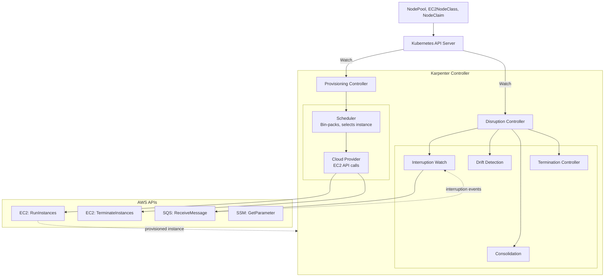
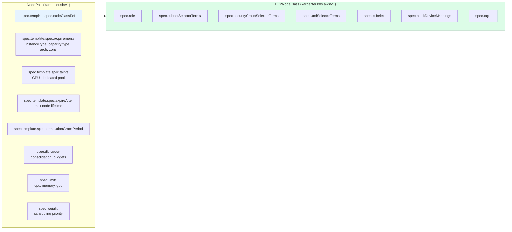

# Karpenter — Automatic Node Provisioning on EKS

## Table of Contents

| Section | Topic | Description |
| :---: | :--- | :--- |
| **01** | [What Karpenter Is](#1-what-karpenter-is) | Group-less auto scaling for EKS — how Karpenter differs from Cluster Autoscaler and why it is the default recommendation as of 2026. |
| **02** | [Architecture Overview](#2-architecture-overview) | Controller loop, NodeClaim lifecycle, NodePool → EC2NodeClass relationship, and the disruption controller. |
| **03** | [Installation & Prerequisites](#3-installation-prerequisites) | IAM roles, SQS queue, Helm installation, IRSA configuration, and cluster access entries. |
| **04** | [NodePool CRD](#4-nodepool-crd-karpentershv1) | Complete spec reference for `karpenter.sh/v1` NodePool: requirements, taints, limits, disruption, budgets, replicas, and weight. |
| **05** | [EC2NodeClass CRD](#5-ec2nodeclass-crd-karpenterk8sawsv1) | Complete spec reference for `karpenter.k8s.aws/v1` EC2NodeClass: subnet/SG/AMI discovery, kubelet, block devices, tags, userData, and metadata options. |
| **06** | [Disruption & Consolidation](#6-disruption-consolidation) | Consolidation policies, drift detection, expiration, interruption handling, node auto-repair, termination grace periods, and budgets. |
| **07** | [Multi-NodePool Patterns](#7-multi-nodepool-patterns) | Spot + on-demand mixed pools, GPU workloads, environment isolation, dedicated AZ pools, and weighted scheduling. |
| **08** | [Migration from Cluster Autoscaler](#8-migration-from-cluster-autoscaler) | Conversion steps, annotation mapping, NodePool design considerations, and coexistence during migration. |
| **09** | [Production Best Practices](#9-production-best-practices) | Security, cost, reliability, monitoring, and operations. |

---

## 1. What Karpenter Is

Karpenter is an **open-source, group-less node provisioning system** for Kubernetes. It was developed by AWS and is now a CNCF Sandbox project. Since **May 2026**, Karpenter v1 is the **default recommended node scheduler** for new EKS clusters, replacing Cluster Autoscaler.

### How It Differs from Cluster Autoscaler

| Aspect | Cluster Autoscaler | Karpenter |
|--------|--------------------|-----------|
| **Scaling unit** | Node Group (ASG) — all instances in a group must be identical | **Group-less** — each NodePool can mix instance types freely |
| **Instance selection** | Adds nodes to an existing ASG; limited to that ASG's instance type | **Bin-packs** across all allowed instance types and picks the cheapest fit |
| **Bin packing** | Limited — pods are spread across existing nodes first | **Tight** — evaluates total pod resource requests vs instance specs |
| **Consolidation** | Not built-in; relies on ASG min/max and custom solutions | **Built-in** — continuously optimizes for cost (replace, delete, or underutilized) |
| **Node lifecycle** | ASG-managed | NodePool + NodeClaim CRDs |
| **API surface** | Cloud provider-specific (AWS ASG APIs) | Kubernetes-native CRDs (`NodePool`, `EC2NodeClass`, `NodeClaim`) |
| **Installation** | Part of EKS cluster setup or managed add-on | Helm chart in `karpenter` namespace |
| **Scaling speed** | ASG launch times + kubelet registration | **Faster** — pre-warmed instances, direct EC2 API calls |

> **Karpenter's fundamental insight:** Traditional node groups force all instances to be identical, which wastes money and limits flexibility. Karpenter treats every pod as an individual scheduling decision against a broad menu of instance types.

### When to Use Karpenter

| Use Case | Verdict |
|----------|---------|
| Multi-instance-type workloads (CPU + memory mix) | ✅ **Karpenter excels** — bin-packs optimally |
| Cost-sensitive clusters (spot + on-demand) | ✅ **Karpenter excels** — built-in consolidation |
| Homogeneous workloads (all pods are identical) | ⚠️ Both work; Cluster Autoscaler is simpler |
| GPU workloads with specific instance needs | ✅ **Karpenter excels** — taint-based isolation on dedicated NodePools |
| Legacy Infrastructure-as-Code (Terraform-managed ASGs) | ⚠️ Migration effort — NodePools are Kubernetes-native |

---

## 2. Architecture Overview

### Core Components



### NodeClaim Lifecycle

A **NodeClaim** is a Karpenter CRD (`karpenter.sh/v1`) that represents a single EC2 instance. Each node in the cluster has a corresponding NodeClaim object.

1. **Unschedulable pod** detected by Karpenter's Provisioning Controller
2. **Scheduling simulation** — Karpenter evaluates all NodePools, checks taints/labels/requirements, bin-packs pods
3. **NodeClaim created** in the API server with the chosen instance type, zone, and NodePool reference
4. **EC2 instance launched** via `ec2:RunInstances` with the correct AMI, subnets, SGs, and IAM role
5. **Node joins cluster** — kubelet registers the node, Karpenter sets `karpenter.sh/initialized: "true"`
6. **Pods scheduled** onto the new node by kube-scheduler
7. **Disruption** — the Disruption Controller continuously evaluates nodes for consolidation, drift, and expiration

### NodePool → EC2NodeClass Relationship



**Key insight:** NodePool = "what, where, how many" (Kubernetes concerns). EC2NodeClass = "which AWS infrastructure" (cloud concerns). Multiple NodePools can reference the same EC2NodeClass.

**Key insight:** NodePool = "what, where, how many" (Kubernetes concerns). EC2NodeClass = "which AWS infrastructure" (cloud concerns). Multiple NodePools can reference the same EC2NodeClass.

---

## 3. Installation & Prerequisites

### Prerequisites

Before installing Karpenter, the following must exist in your AWS account:

| Resource | Purpose | Provisioning Method |
|----------|---------|-------------------|
| **IAM Role for Karpenter** | Allows Karpenter to call EC2, SSM, SQS, and tagging APIs | Terraform, CDK, or `eksctl` |
| **IAM Role for EC2 nodes** | Applied to instances Karpenter launches; allows joining the EKS cluster | Same as above |
| **Cluster access entry** | Grants the node IAM role access to the EKS cluster | `eksctl create access-entry` or API |
| **SQS queue** | Receives Spot interruption, instance rebalance, and other events | Created via Terraform/CDK |
| **EventBridge rules** | Forward EC2 events → SQS queue | Part of the SQS setup |

### Step 1: Create IAM Roles

```bash
# Create the Karpenter node IAM role (applied to EC2 instances Karpenter launches)
aws iam create-role \
  --role-name "KarpenterNodeRole-${EKS_CLUSTER_NAME}" \
  --assume-role-policy-document '{
    "Version": "2012-10-17",
    "Statement": [{
      "Effect": "Allow",
      "Principal": { "Service": "ec2.amazonaws.com" },
      "Action": "sts:AssumeRole"
    }]
  }'
```

Attach the required managed policies:
```bash
aws iam attach-role-policy \
  --role-name "KarpenterNodeRole-${EKS_CLUSTER_NAME}" \
  --policy-arn arn:aws:iam::aws:policy/AmazonEKSWorkerNodePolicy

aws iam attach-role-policy \
  --role-name "KarpenterNodeRole-${EKS_CLUSTER_NAME}" \
  --policy-arn arn:aws:iam::aws:policy/AmazonEKS_CNI_Policy

aws iam attach-role-policy \
  --role-name "KarpenterNodeRole-${EKS_CLUSTER_NAME}" \
  --policy-arn arn:aws:iam::aws:policy/AmazonEC2ContainerRegistryReadOnly

aws iam attach-role-policy \
  --role-name "KarpenterNodeRole-${EKS_CLUSTER_NAME}" \
  --policy-arn arn:aws:iam::aws:policy/AmazonSSMManagedInstanceCore
```

### Step 2: Create SQS Queue for Interruption Handling

```bash
# Create the SQS queue
KARPENTER_SQS_QUEUE=$(aws sqs create-queue \
  --queue-name "karpenter-${EKS_CLUSTER_NAME}" \
  --output text \
  --query 'QueueUrl')

# Get the queue ARN
KARPENTER_SQS_QUEUE_ARN=$(aws sqs get-queue-attributes \
  --queue-url "${KARPENTER_SQS_QUEUE}" \
  --attribute-names QueueArn \
  --output text \
  --query 'Attributes.QueueArn')

# Get the queue URL (for Karpenter configuration)
KARPENTER_SQS_QUEUE_URL="${KARPENTER_SQS_QUEUE}"
```

### Step 3: Create a Cluster Access Entry

```bash
eksctl create access-entry \
  --cluster "${EKS_CLUSTER_NAME}" \
  --principal-arn "arn:aws:iam::${ACCOUNT_ID}:role/KarpenterNodeRole-${EKS_CLUSTER_NAME}" \
  --type EC2_LINUX
```

### Step 4: Install Karpenter via Helm

```bash
# Authenticate to ECR Public
aws ecr-public get-login-password \
  --region us-east-1 | helm registry login \
  --username AWS \
  --password-stdin public.ecr.aws

# Deploy the Karpenter Helm chart
helm upgrade --install karpenter oci://public.ecr.aws/karpenter/karpenter \
  --version "${KARPENTER_VERSION}" \
  --namespace "karpenter" --create-namespace \
  --set "settings.clusterName=${EKS_CLUSTER_NAME}" \
  --set "settings.interruptionQueue=${KARPENTER_SQS_QUEUE_ARN}" \
  --set "settings.aws.defaultInstanceProfile=KarpenterNodeInstanceProfile-${EKS_CLUSTER_NAME}" \
  --set controller.resources.requests.cpu=1 \
  --set controller.resources.requests.memory=1Gi \
  --set controller.resources.limits.cpu=1 \
  --set controller.resources.limits.memory=1Gi \
  --set replicas=2 \
  --wait
```

### Step 5: Verify Installation

```bash
kubectl get deployment -n karpenter
# NAME        READY   UP-TO-DATE   AVAILABLE   AGE
# karpenter   2/2     2            2           60s

kubectl logs -l app.kubernetes.io/instance=karpenter -n karpenter | jq '.'
```

> **Note:** The `app.kubernetes.io/instance=karpenter` label is applied by the Helm chart automatically.

---

## 4. NodePool CRD (`karpenter.sh/v1`)

A NodePool defines general capacity requirements — instance types, capacity type, limits, disruption policies, and which EC2NodeClass to use.

### Complete Example

```yaml
apiVersion: karpenter.sh/v1
kind: NodePool
metadata:
  name: default
  labels:
    app.kubernetes.io/name: karpenter-nodepool
    app.kubernetes.io/instance: default-nodepool
    app.kubernetes.io/component: node-provisioning
    app.kubernetes.io/part-of: cluster-infrastructure
    app.kubernetes.io/managed-by: Helm
    app.kubernetes.io/version: "${KARPENTER_VERSION}"
spec:
  weight: 10

  template:
    metadata:
      labels:
        type: karpenter
        app.kubernetes.io/name: karpenter-node
        app.kubernetes.io/component: compute
        app.kubernetes.io/part-of: cluster-infrastructure
        app.kubernetes.io/managed-by: Karpenter
    spec:
      nodeClassRef:
        group: karpenter.k8s.aws
        kind: EC2NodeClass
        name: default

      requirements:
        - key: kubernetes.io/arch
          operator: In
          values: ["amd64"]
        - key: kubernetes.io/os
          operator: In
          values: ["linux"]
        - key: karpenter.sh/capacity-type
          operator: In
          values: ["on-demand"]
        - key: karpenter.k8s.aws/instance-category
          operator: In
          values: ["c", "m", "r"]
        - key: karpenter.k8s.aws/instance-generation
          operator: Gte
          values: ["3"]
        - key: node.kubernetes.io/instance-type
          operator: In
          values: ["c5.large", "m5.large", "r5.large", "m5.xlarge"]

      expireAfter: 720h  # 30 days — default maximum node lifetime

      terminationGracePeriod: 2h  # Max drain time before force-terminate

  disruption:
    consolidationPolicy: WhenEmptyOrUnderutilized
    consolidateAfter: 1m

  limits:
    cpu: "1000"
    memory: 1000Gi
    nvidia.com/gpu: "8"
```

### Spec Reference

#### `spec.template.metadata.labels`

Labels applied to every node provisioned by this NodePool. These become node labels and can be used by `nodeSelector` or `nodeAffinity` on pods.

**Best practice:** Add `app.kubernetes.io/*` labels so nodes are queryable by tools — not just `type: karpenter`.

#### `spec.template.spec.nodeClassRef`

```yaml
nodeClassRef:
  group: karpenter.k8s.aws
  kind: EC2NodeClass
  name: default
```

References the EC2NodeClass containing AWS-specific configuration. Multiple NodePools can share one EC2NodeClass.

#### `spec.template.spec.requirements`

| Key | Values | Purpose |
|-----|--------|---------|
| `kubernetes.io/arch` | `amd64`, `arm64` | CPU architecture |
| `kubernetes.io/os` | `linux`, `windows` | Operating system |
| `karpenter.sh/capacity-type` | `spot`, `on-demand`, `reserved` | EC2 purchase option (priority: reserved → spot → on-demand) |
| `karpenter.k8s.aws/instance-category` | `c`, `m`, `r`, `i`, `g`, `p`, etc. | Instance family category |
| `karpenter.k8s.aws/instance-family` | `c5`, `m5`, `r5`, `p3`, etc. | Specific instance family |
| `karpenter.k8s.aws/instance-generation` | `3`, `4`, `5`, `6` | Instance generation (use `Gte` for generational flexibility) |
| `node.kubernetes.io/instance-type` | `c5.large`, `m5.xlarge`, etc. | Specific instance types |
| `topology.kubernetes.io/zone` | `us-west-2a`, etc. | Availability Zone |
| `karpenter.k8s.aws/instance-tenancy` | `default`, `dedicated` | Tenancy |
| `karpenter.k8s.aws/instance-hypervisor` | `nitro`, `bare-metal` | Hypervisor type |

**Operators supported:** `In`, `NotIn`, `Exists`, `DoesNotExist`, `Gt`, `Lt`, `Gte`, `Lte`

> **Capacity type fallback:** If you specify both `spot` and `on-demand`, Karpenter prioritizes reserved → spot → on-demand. If spot capacity is unavailable, it falls back to on-demand within milliseconds. Unavailable capacity is cached for 3 minutes.

#### `spec.template.spec.taints`

Standard Kubernetes taints applied to provisioned nodes:

```yaml
taints:
  - key: nvidia.com/gpu
    value: "true"
    effect: NoSchedule
```

Pods without a matching toleration will not schedule on these nodes. Use this for GPU pools or dedicated infrastructure pools.

#### `spec.template.spec.startupTaints`

Temporary taints applied at node creation that Karpenter assumes other systems (e.g., DaemonSets) will remove. Pods do **not** need to tolerate them for scheduling. **Caution:** if a startup taint persists outside Karpenter's awareness, Karpenter may keep provisioning new nodes thinking the pod is unschedulable.

#### `spec.template.spec.expireAfter`

Maximum node lifetime. Format: Go duration string (e.g., `720h`, `72h`) or `Never`. Default is `720h` (30 days). Changes to `expireAfter` induce drift on existing NodeClaims.

> **Critical:** `expireAfter` is a **maximum upper bound**, not a guaranteed minimum. Nodes can be terminated earlier by consolidation, drift, or interruption. To enforce a true maximum, combine with disruption budgets.

#### `spec.template.spec.terminationGracePeriod`

Maximum draining time before Kubernetes forcibly deletes remaining pods and terminates the instance. Default: no grace period (pods with blocking PDBs can block draining indefinitely).

> **When set, changes behavior:** With `terminationGracePeriod`, a node can be disrupted via drift even if there are pods with blocking PDBs or `karpenter.sh/do-not-disrupt` annotations. This ensures CVEs and critical updates cannot be blocked indefinitely.

#### `spec.disruption.consolidationPolicy`

| Value | Behavior |
|-------|----------|
| `WhenEmptyOrUnderutilized` | Default. Considers all nodes — removes empty nodes, replaces underutilized nodes with cheaper instances. |
| `WhenEmpty` | Only removes truly empty nodes (no workload pods). No replacement. |

#### `spec.disruption.consolidateAfter`

Duration to wait after a pod is added/removed before consolidating. Can be `Never` to disable consolidation entirely. Default: `0s` (consolidate immediately).

#### `spec.disruption.budgets`

Controls deprovisioning speed. Karpenter respects the minimum of all matching active budgets (rounding up for percentages). Default: one budget with `nodes: 10%`.

```yaml
disruption:
  budgets:
  - nodes: "10%"            # Always active — allow 10% nodes to be disrupted
  - schedule: "0 9 * * mon-fri"  # Business hours — no disruption
    duration: 8h
    nodes: "0"
  - nodes: "5"               # If the cluster has < 25 nodes, max 5 nodes
  - reasons: ["Underutilized", "Empty", "Drifted"]  # Can filter by reason
    nodes: "20%"
```

**Fields:**

| Field | Description |
|-------|-------------|
| `nodes` | Percentage (`"10%"`) or absolute value (`"5"`) |
| `schedule` | 5-field cron expression (UTC only, no timezone support) |
| `duration` | How long the budget is active from schedule start (e.g., `8h`, `30m`) |
| `reasons` | Optional filter: `Drifted`, `Underutilized`, `Empty`. If omitted, applies to all. |

**Calculation:** `allowed_disruptions = roundup(total × percentage) − deleting − not_ready`

#### `spec.limits`

```yaml
limits:
  cpu: "1000"          # DecimalSI value
  memory: 1000Gi       # BinarySI value
  nvidia.com/gpu: "8"  # Extended resources
  nodes: "50"          # Max node count (static NodePools only)
```

Limits are **eventually consistent** — during rapid scale-outs, Karpenter may briefly exceed the limit due to parallel provisioning loops.

#### `spec.weight`

Scheduling priority between NodePools. Higher weight = preferred. When multiple NodePools match a pod's requirements, the highest weight wins. **Cannot** be combined with `spec.replicas`.

#### `spec.replicas` (Static NodePools)

Enables **static capacity mode** — maintains a fixed node count regardless of pod demand:

```bash
kubectl scale nodepool my-static-pool --replicas=5
```

**Constraints:**
- Cannot be removed once set (no switching between static/dynamic)
- Only `limits.nodes` allowed in limits section
- `weight` cannot be set
- Nodes are **not** considered for consolidation
- Scale operations bypass disruption budgets but **respect** PodDisruptionBudgets

### Status Fields

```yaml
status:
  conditions:
    - type: NodeClassReady
      status: "True"
    - type: ValidationSucceeded
      status: "True"
    - type: Ready
      status: "True"
      reason: NodePoolReady
  nodes: 12
  resources:
    cpu: 48
    memory: 192Gi
```

---

## 5. EC2NodeClass CRD (`karpenter.k8s.aws/v1`)

EC2NodeClass holds the AWS-specific configuration. It is referenced by one or more NodePools via `nodeClassRef`.

### Complete Example

```yaml
apiVersion: karpenter.k8s.aws/v1
kind: EC2NodeClass
metadata:
  name: default
  labels:
    app.kubernetes.io/name: karpenter-ec2nodeclass
    app.kubernetes.io/instance: default-ec2nodeclass
    app.kubernetes.io/component: node-provisioning
    app.kubernetes.io/part-of: cluster-infrastructure
    app.kubernetes.io/managed-by: Helm
spec:
  # IAM role for nodes (Karpenter generates the InstanceProfile)
  role: "KarpenterNodeRole-${EKS_CLUSTER_NAME}"

  # AMI — use pinned, not "latest", for production
  amiFamily: AL2023
  amiSelectorTerms:
    - alias: al2023@v1.32.0  # Pinned AL2023 version matching K8s 1.32

  # Subnet discovery via tags
  subnetSelectorTerms:
    - tags:
        karpenter.sh/discovery: "${EKS_CLUSTER_NAME}"

  # Security group discovery via tags
  securityGroupSelectorTerms:
    - tags:
        karpenter.sh/discovery: "${EKS_CLUSTER_NAME}"

  # Kubelet configuration
  kubelet:
    maxPods: 58
    podsPerCore: 2
    systemReserved:
      cpu: 500m
      memory: 512Mi
    evictionHard:
      memory.available: "5%"
      nodefs.available: "10%"
    imageGCHighThresholdPercent: 85
    imageGCLowThresholdPercent: 80

  # EBS volume defaults
  blockDeviceMappings:
    - deviceName: /dev/xvda
      ebs:
        volumeSize: 100Gi
        volumeType: gp3
        iops: 3000
        throughput: 125
        encrypted: true
        deleteOnTermination: true

  # Custom tags applied to all created resources
  tags:
    app.kubernetes.io/name: karpenter-node
    app.kubernetes.io/component: compute
    app.kubernetes.io/part-of: cluster-infrastructure
    app.kubernetes.io/managed-by: Karpenter
    karpenter.sh/discovery: "${EKS_CLUSTER_NAME}"

  # IMDS hardening
  metadataOptions:
    httpEndpoint: enabled
    httpProtocolIPv6: disabled
    httpPutResponseHopLimit: 1
    httpTokens: required

  # ENI and networking defaults
  associatePublicIPAddress: false
  detailedMonitoring: false
```

### Spec Reference

#### `spec.role` / `spec.instanceProfile`

| Field | When to Use |
|-------|-------------|
| `role` | **Preferred.** IAM role name; Karpenter generates the InstanceProfile for you. |
| `instanceProfile` | Required for private clusters without IAM API access. Pre-provisioned InstanceProfile name. |

**Must specify exactly one.**

#### `spec.amiFamily`

Controls default bootstrapping, AMI selection, and default block device mappings.

| Family | UserData Format | Notes |
|--------|----------------|-------|
| **AL2** | MIME multi-part archive | Support ends at K8s 1.32 EKS |
| **AL2023** | MIME, NodeConfig, or shell | **Recommended.** Uses NodeConfig; Karpenter values take precedence |
| **Bottlerocket** | TOML | Security-focused, minimal footprint |
| **Windows2019/2022/2025** | PowerShell | Windows worker nodes |
| **Custom** | Any (no merging) | Must self-bootstrap entirely |

> **Ubuntu** support was dropped at Karpenter v1.0.0.

#### `spec.amiSelectorTerms`

**Required.** Discovers AMIs for nodes. Terms are ORed; conditions within a term are ANDed.

```yaml
amiSelectorTerms:
  - alias: al2023@latest           # Uses AMI family alias (mutually exclusive with other terms in that entry)
  - tags:                           # Custom tag-based selection
      Name: "my-custom-ami-*"
    owner: "self"
  - name: "amazon-eks-node-*"       # Name pattern (defaults owner to self,amazon)
  - id: "ami-0abcdef1234567890"     # Direct AMI ID
  - ssmParameter: /aws/service/eks/optimized-ami/1.32/amazon-linux-2023/recommended/image_id  # SSM parameter
```

> **⚠️ `latest` not recommended for production.** New AMI releases trigger drift and full node rollout. Pin to a specific version (e.g., `al2023@v1.32.0`) and update intentionally.

#### `spec.subnetSelectorTerms`

**Required.** Discovers subnets for instance attachment. Selection logic: when multiple subnets exist for a zone, the one with the most available IPs is chosen.

```yaml
subnetSelectorTerms:
  - tags:
      karpenter.sh/discovery: "${EKS_CLUSTER_NAME}"
      environment: production
  - id: subnet-09fa4a0a8f233a921     # Can mix tags and IDs
```

#### `spec.securityGroupSelectorTerms`

**Required.** Discovers security groups attached to instances.

```yaml
securityGroupSelectorTerms:
  - tags:
      karpenter.sh/discovery: "${EKS_CLUSTER_NAME}"
  - name: "cluster-shared-sg"
  - id: "sg-063d7acfb4b06c82c"
```

> **⚠️ Avoid `kubernetes.io/cluster/$CLUSTER_NAME` for SG discovery.** Using this tag may cause AWS Load Balancer Controller failures, as it only supports one SG with that tag.

#### `spec.kubelet`

Controls kubelet behavior on provisioned nodes. All fields optional.

| Field | Type | Description |
|-------|------|-------------|
| `maxPods` | int | Absolute pod capacity cap |
| `podsPerCore` | int | Dynamic pod density = vCPUs × this value (min of this and `maxPods` used) |
| `systemReserved` | object | Resources reserved for OS (`cpu`, `memory`, `ephemeral-storage`) |
| `kubeReserved` | object | Resources reserved for kubelet & container runtime |
| `evictionHard` | object | Immediate eviction thresholds (signal name: value/percentage) |
| `evictionSoft` | object | Graceful eviction thresholds |
| `evictionSoftGracePeriod` | object | Durations per signal before soft eviction triggers |
| `evictionMaxPodGracePeriod` | int | Max pod termination grace period for soft eviction (seconds) |
| `imageGCHighThresholdPercent` | int | Disk usage % triggering image GC |
| `imageGCLowThresholdPercent` | int | Image GC stops below this % |
| `cpuCFSQuota` | bool | Enable CPU CFS quota |
| `clusterDNS` | array[string] | Cluster DNS IPs |

**Supported eviction signals:** `memory.available`, `nodefs.available`, `nodefs.inodesFree`, `imagefs.available`, `imagefs.inodesFree`, `pid.available`

**Best practice for production:**
```yaml
kubelet:
  maxPods: 58
  systemReserved:
    cpu: 500m
    memory: 512Mi
  evictionHard:
    memory.available: "5%"
    nodefs.available: "10%"
  imageGCHighThresholdPercent: 85
  imageGCLowThresholdPercent: 80
```

#### `spec.blockDeviceMappings`

Controls EBS volumes. Defaults vary by AMI family.

```yaml
blockDeviceMappings:
  - deviceName: /dev/xvda
    ebs:
      volumeSize: 100Gi
      volumeType: gp3
      iops: 3000
      throughput: 125
      encrypted: true
      kmsKeyID: arn:aws:kms:...  # Required if encrypted=true and using custom CMK
      deleteOnTermination: true
      snapshotID: snap-...        # Optional: restore from snapshot
```

**Per-family defaults (if not customized):**

| AMIFamily | Root Device | Default Size | Volume Type |
|-----------|-------------|-------------|-------------|
| AL2 | `/dev/xvda` | 20Gi | gp3, encrypted |
| AL2023 | `/dev/xvda` | 20Gi | gp3, encrypted |
| Bottlerocket | `/dev/xvda` (root), `/dev/xvdb` (data) | 4Gi + 20Gi | gp3, encrypted |
| Windows | `/dev/sda1` | 50Gi | gp3, encrypted |

#### `spec.tags`

Tags applied to all created resources (EC2 instances, EBS volumes, launch templates). Karpenter automatically adds:

| Tag | Value |
|-----|-------|
| `Name` | `<node-name>` |
| `karpenter.sh/nodeclaim` | `<nodeclaim-name>` |
| `karpenter.sh/nodepool` | `<nodepool-name>` |
| `karpenter.k8s.aws/ec2nodeclass` | `<ec2nodeclass-name>` |
| `kubernetes.io/cluster/<name>` | `owned` |
| `eks:eks-cluster-name` | `<cluster-name>` |
| `aws:ec2launchtemplate:id` | `<launch-template-id>` |

Custom tags merge in. **Cannot override** restricted domains (`karpenter.sh`, `karpenter.k8s.aws`, `kubernetes.io/cluster`).

**Best practice for cost allocation:**
```yaml
tags:
  app.kubernetes.io/part-of: cluster-infrastructure
  app.kubernetes.io/managed-by: Karpenter
  karpenter.sh/discovery: "${EKS_CLUSTER_NAME}"
  environment: production
  cost-center: platform
```

#### `spec.metadataOptions`

Controls IMDS (Instance Metadata Service) exposure.

```yaml
metadataOptions:
  httpEndpoint: enabled             # enabled or disabled
  httpProtocolIPv6: disabled        # enabled or disabled
  httpPutResponseHopLimit: 1        # 1-64 (1 = secure, prevents SSRF)
  httpTokens: required              # required (IMDSv2) or optional (IMDSv1)
```

> **Security best practice:** Always use `httpTokens: required` and `httpPutResponseHopLimit: 1` to enforce IMDSv2 and prevent SSRF-based credential theft.

#### `spec.detailedMonitoring`

Boolean. Enables EC2 CloudWatch monitoring at 1-minute intervals instead of the default 5-minute.

#### `spec.associatePublicIPAddress`

Boolean. Overrides the subnet's `MapPublicIpOnLaunch` setting. If unset, the subnet default is respected.

#### `spec.instanceStorePolicy`

Controls instance-store (NVMe SSD) volume handling for storage-optimized instances.

| Value | Behavior |
|-------|----------|
| (omitted) | Instance-store volumes are ignored — only EBS is available |
| `RAID0` | Formats + mounts instance-store volumes as RAID0, sets allocatable ephemeral-storage to total size |

#### `spec.placementGroupSelector`

Selects a placement group by `name` or `id` (mutually exclusive):

```yaml
placementGroupSelector:
  name: my-placement-group
```

Supports all EC2 strategies: **Cluster** (low-latency, single AZ), **Partition** (distributed across isolated partitions), **Spread** (distinct hardware, max 7 per AZ).

#### `spec.userData`

Custom bootstrapping. Merge behavior varies by AMI family:

| Family | Input Format | Merge Behavior |
|--------|-------------|----------------|
| **AL2023** | MIME, NodeConfig (YAML/JSON), or shell | Custom prepended; Karpenter's NodeConfig appended; Karpenter values take precedence |
| **AL2** | MIME or bash | Custom parts prepended; Karpenter appends bootstrap |
| **Bottlerocket** | TOML | Merged; Karpenter values take precedence |
| **Windows** | PowerShell | Prepended before Karpenter's bootstrap call |
| **Custom** | Any | Must self-bootstrap, include `karpenter.sh/unregistered:NoExecute` taint |

#### `spec.capacityReservationSelectorTerms` (Beta)

Selects ODCRs (On-Demand Capacity Reservations) for prioritization before fallback to on-demand/spot.

#### `spec.networkInterfaces`

Configures ENI/EFA attachments for HPC workloads:

```yaml
networkInterfaces:
  - networkCardIndex: 0
    deviceIndex: 0
    interfaceType: interface       # interface (ENA) or efa-only (RDMA)
```

### Status Fields

```yaml
status:
  subnets:
    - id: subnet-abc
      zone: us-west-2a
      availableIPCount: 250
    - id: subnet-def
      zone: us-west-2b
      availableIPCount: 200
  securityGroups:
    - id: sg-123
      name: karpenter-sg
  amis:
    - id: ami-0abc123
      name: amazon-linux-2023-v1.32.0
      requirements:
        - key: kubernetes.io/arch
          operator: In
          values: ["amd64"]
  conditions:
    - type: SubnetsReady
      status: "True"
    - type: SecurityGroupsReady
      status: "True"
    - type: InstanceProfileReady
      status: "True"
    - type: AMIsReady
      status: "True"
    - type: Ready
      status: "True"
```

If any condition is `False`, NodePools referencing this EC2NodeClass will not be considered for scheduling.

---

## 6. Disruption & Consolidation

Karpenter's Disruption Controller continuously optimizes cluster compute. It runs three disruption mechanisms in order: **Drift → Consolidation**. Manual deletion and expiration are processed separately.

### Disruption Types

| Type | Category | Rate-Limited by Budgets? | Description |
|------|----------|:---:|-------------|
| **Consolidation (Delete)** | Automated, Graceful | ✅ | Remove empty or replaceable nodes |
| **Consolidation (Replace)** | Automated, Graceful | ✅ | Replace with cheaper instance |
| **Drift** | Automated, Graceful | ✅ | NodePool/EC2NodeClass config change |
| **Expiration** | Automated, Forceful | ❌ | Node exceeds `expireAfter` |
| **Interruption** | Automated, Forceful | ❌ | Spot notification / health event |
| **Node Repair** | Automated, Forceful | ❌ | Node unhealthy beyond toleration duration |
| **Manual deletion** | Manual | ❌ | `kubectl delete nodeclaim/node` |
| **Manual scale-down** | Manual | ❌ | `kubectl scale nodepool --replicas=N` |

### Standard Graceful Disruption Flow

1. Identify prioritized candidates
2. Check disruption budget compliance
3. Run scheduling simulation for replacement needs
4. Taint node with `karpenter.sh/disrupted:NoSchedule`
5. Pre-spin replacement nodes (if replacement fails, un-taint and restart)
6. Delete nodes → Termination Controller handles graceful drain
7. Return to step 1

### Consolidation

#### Policies

```yaml
disruption:
  consolidationPolicy: WhenEmptyOrUnderutilized   # or WhenEmpty
  consolidateAfter: 1m
```

| Policy | Behavior |
|--------|----------|
| `WhenEmptyOrUnderutilized` | **Default.** Three sub-strategies: (1) delete empty nodes, (2) delete 2+ nodes and launch cheaper replacement, (3) delete single node and launch cheaper replacement |
| `WhenEmpty` | Only delete nodes with zero workload pods |

#### Execution Order (WhenEmptyOrUnderutilized)

1. **Empty node consolidation** — Delete entirely empty nodes (in parallel)
2. **Multi-node consolidation** — Delete 2+ nodes, potentially launch one cheaper replacement
3. **Single-node consolidation** — Delete any single node, potentially launch cheaper replacement

#### Node Selection Priority

- Nodes running fewer pods (least workload disruption)
- Nodes expiring soon
- Nodes with lower priority pods

#### Barriers

Karpenter emits `Unconsolidatable` events with reasons like:
- `"pdb default/inflate-pdb prevents pod evictions"`
- `"can't replace with a lower-priced node"`

#### Spot Consolidation

Enabled by default for **deletion only**. Replacement (spot → spot) requires `SpotToSpotConsolidation` feature flag and a minimum instance type flexibility of **15 instance types** to avoid racing to the cheapest (highest-interruption) instances.

### Drift

Karpenter detects configuration drift by comparing a hash of the owning `NodePool.spec.template.spec` and `EC2NodeClass.spec` against the hash stored on each NodeClaim.

**Drift-checked fields:**

| Resource | Fields Checked |
|----------|---------------|
| NodePool | `spec.template.spec.requirements` |
| NodePool | `spec.template.spec.expireAfter` (changes induce drift) |
| NodePool | `spec.template.spec.terminationGracePeriod` (changes induce drift) |
| EC2NodeClass | All fields (`subnetSelectorTerms`, `securityGroupSelectorTerms`, `amiSelectorTerms`, `kubelet`, etc.) |

**NOT drifted:** `spec.weight`, `spec.limits`, `spec.disruption.*`

> **Key insight:** New AMI images discovered via `amiSelectorTerms` **do** trigger drift. This is how AMI rollouts are handled — update the `amiSelectorTerms` alias/tag, Karpenter detects the change, and rolls nodes gradually.

### Expiration

When a node exceeds `spec.template.spec.expireAfter`, it is force-disrupted (bypasses budgets). Default: `720h` (30 days).

> **Without `terminationGracePeriod`**, pods with blocking PDBs or `karpenter.sh/do-not-disrupt` annotations can prevent draining indefinitely, leaving partially terminated nodes stuck in the cluster.

### Interruption

Requires the SQS queue configured during installation. Karpenter watches for:

| Event | Notice | Behavior |
|-------|--------|----------|
| Spot Interruption Warning | 2 minutes | Taints, drains, pre-provisions replacement |
| Scheduled Change Health (Maintenance) | Varies | Same as above |
| Instance Terminating | Immediate | Same |
| Instance Stopping | Immediate | Same |
| Instance Status Check Failure | Polled (EC2 API) | Terminates unhealthy node (no queue needed) |

**Not handled:** Spot Rebalance Recommendations (Karpenter emits events but does not taint/drain). Run AWS Node Termination Handler alongside if needed.

### Node Auto-Repair (Alpha)

Enabled via `NodeRepair=true` feature flag. Requires a Node Monitoring Agent (e.g., Node Problem Detector) that adds conditions to nodes.

| Condition | Status | Toleration Duration |
|-----------|--------|-------------------|
| Ready | False | 30 minutes |
| Ready | Unknown | 30 minutes |
| AcceleratedHardwareReady | False | 10 minutes |
| StorageReady | False | 30 minutes |
| ContainerRuntimeReady | False | 30 minutes |
| KernelReady | False | 30 minutes |

> **Safety:** Repairs are blocked if >20% of nodes in a NodePool are unhealthy.

### TerminationGracePeriod

Countdown begins when a node is disrupted. Once elapsed, remaining pods are forcibly deleted and the instance terminates. When `terminationGracePeriod` is set, drift eligibility changes — nodes with blocking PDBs or `do-not-disrupt` annotations **can still be disrupted via drift**.

**Interaction with `expireAfter`:** Maximum node lifetime = `expireAfter` + `terminationGracePeriod`.

### Pod-Level Disruption Controls

| Control | Effect |
|---------|--------|
| **Blocking PDBs** | Pods with PDBs that block eviction prevent voluntary node disruption. All matching PDBs must allow disruption. |
| **`karpenter.sh/do-not-disrupt: "true"`** | Permanent protection from voluntary disruption (consolidation, drift if no terminationGracePeriod) |
| **`karpenter.sh/do-not-disrupt: "30m"`** | Protection for 30 minutes after pod starts running |
| **Node-level** | `karpenter.sh/do-not-disrupt` on a node protects all pods on that node |

> **Critical:** These protect against consolidation and drift only. They do **NOT** protect against expiration, interruption, node repair, or manual deletion.

### Termination Controller

Karpenter's graceful shutdown:

1. Add `karpenter.sh/disrupted:NoSchedule` taint
2. Evict pods via Kubernetes Eviction API (respects PDBs)
3. Wait for VolumeAttachment deletion
4. Terminate NodeClaim (EC2 instance)
5. Remove finalizer → APIServer deletes node

---

## 7. Multi-NodePool Patterns

### Pattern 1: Spot + On-Demand Mixed Pool

Two NodePools sharing the same EC2NodeClass, with the spot pool preferred via `weight`.

```yaml
apiVersion: karpenter.sh/v1
kind: NodePool
metadata:
  name: spot
  labels:
    app.kubernetes.io/name: karpenter-nodepool
    app.kubernetes.io/instance: spot-pool
    app.kubernetes.io/component: node-provisioning
    app.kubernetes.io/part-of: cluster-infrastructure
    app.kubernetes.io/managed-by: Helm
spec:
  weight: 20  # Prefer spot
  template:
    spec:
      nodeClassRef:
        name: default
      requirements:
        - key: karpenter.sh/capacity-type
          operator: In
          values: ["spot"]
  disruption:
    consolidationPolicy: WhenEmptyOrUnderutilized
    consolidateAfter: 1m
  limits:
    cpu: "2000"
---
apiVersion: karpenter.sh/v1
kind: NodePool
metadata:
  name: on-demand
  labels:
    app.kubernetes.io/name: karpenter-nodepool
    app.kubernetes.io/instance: on-demand-pool
    app.kubernetes.io/component: node-provisioning
    app.kubernetes.io/part-of: cluster-infrastructure
    app.kubernetes.io/managed-by: Helm
spec:
  weight: 10  # Fallback if spot unavailable
  template:
    spec:
      nodeClassRef:
        name: default
      requirements:
        - key: karpenter.sh/capacity-type
          operator: In
          values: ["on-demand"]
  disruption:
    consolidationPolicy: WhenEmptyOrUnderutilized
    consolidateAfter: 1m
  limits:
    cpu: "500"
---
apiVersion: karpenter.k8s.aws/v1
kind: EC2NodeClass
metadata:
  name: default
  labels:
    app.kubernetes.io/name: karpenter-ec2nodeclass
    app.kubernetes.io/instance: shared-ec2nodeclass
    app.kubernetes.io/component: node-provisioning
    app.kubernetes.io/part-of: cluster-infrastructure
    app.kubernetes.io/managed-by: Helm
spec:
  role: "KarpenterNodeRole-${EKS_CLUSTER_NAME}"
  amiFamily: AL2023
  amiSelectorTerms:
    - alias: al2023@latest
  subnetSelectorTerms:
    - tags:
        karpenter.sh/discovery: "${EKS_CLUSTER_NAME}"
  securityGroupSelectorTerms:
    - tags:
        karpenter.sh/discovery: "${EKS_CLUSTER_NAME}"
  tags:
    app.kubernetes.io/part-of: cluster-infrastructure
    app.kubernetes.io/managed-by: Karpenter
```

**How it works:**
- Pods without specific `capacity-type` requirements: Karpenter tries the spot pool first (weight 20)
- If spot is unavailable for the instance type Karpenter selects, it falls back to on-demand (weight 10)
- Separate limits let you cap spend on each pool independently

### Pattern 2: GPU Workload Pool

```yaml
apiVersion: karpenter.sh/v1
kind: NodePool
metadata:
  name: gpu
  labels:
    app.kubernetes.io/name: karpenter-nodepool
    app.kubernetes.io/instance: gpu-pool
    app.kubernetes.io/component: node-provisioning
    app.kubernetes.io/part-of: gpu-workloads
    app.kubernetes.io/managed-by: Helm
spec:
  template:
    spec:
      nodeClassRef:
        group: karpenter.k8s.aws
        kind: EC2NodeClass
        name: gpu
      requirements:
        - key: karpenter.sh/capacity-type
          operator: In
          values: ["on-demand"]
        - key: node.kubernetes.io/instance-type
          operator: In
          values: ["p3.2xlarge", "p3.8xlarge", "p4d.24xlarge", "g4dn.xlarge", "g5.xlarge"]
        - key: kubernetes.io/arch
          operator: In
          values: ["amd64"]
      taints:
        - key: nvidia.com/gpu
          value: "true"
          effect: NoSchedule
      expireAfter: 168h  # 7 days — GPU instances are expensive, recycle often
  disruption:
    consolidationPolicy: WhenEmptyOrUnderutilized
    consolidateAfter: 5m
  limits:
    nvidia.com/gpu: "32"
---
apiVersion: karpenter.k8s.aws/v1
kind: EC2NodeClass
metadata:
  name: gpu
  labels:
    app.kubernetes.io/name: karpenter-ec2nodeclass
    app.kubernetes.io/instance: gpu-ec2nodeclass
    app.kubernetes.io/component: node-provisioning
    app.kubernetes.io/part-of: gpu-workloads
    app.kubernetes.io/managed-by: Helm
spec:
  role: "KarpenterNodeRole-${EKS_CLUSTER_NAME}"
  amiFamily: AL2023
  amiSelectorTerms:
    - alias: al2023@latest
  subnetSelectorTerms:
    - tags:
        karpenter.sh/discovery: "${EKS_CLUSTER_NAME}"
        environment: production
  securityGroupSelectorTerms:
    - tags:
        karpenter.sh/discovery: "${EKS_CLUSTER_NAME}"
  blockDeviceMappings:
    - deviceName: /dev/xvda
      ebs:
        volumeSize: 200Gi     # GPU workloads need more disk
        volumeType: gp3
        encrypted: true
  tags:
    app.kubernetes.io/part-of: gpu-workloads
    app.kubernetes.io/managed-by: Karpenter
    environment: production
```

**How it works:**
- Nodes are tainted with `nvidia.com/gpu: "true":NoSchedule` — only pods with GPU tolerations can schedule
- Instance types restricted to GPU families (P3, P4d, G4dn, G5)
- Shorter `expireAfter` (7 days vs 30) to regularly recycle expensive GPU instances
- `limits.nvidia.com/gpu: "32"` caps total GPU spend

### Pattern 3: Environment Isolation

```yaml
apiVersion: karpenter.sh/v1
kind: NodePool
metadata:
  name: production
spec:
  template:
    spec:
      nodeClassRef:
        name: production
      requirements:
        - key: karpenter.sh/capacity-type
          operator: In
          values: ["on-demand"]
        - key: node.kubernetes.io/instance-type
          operator: In
          values: ["m5.large", "m5.xlarge", "m5.2xlarge", "c5.large", "c5.xlarge", "r5.large"]
---
apiVersion: karpenter.k8s.aws/v1
kind: EC2NodeClass
metadata:
  name: production
spec:
  role: "KarpenterNodeRole-${EKS_CLUSTER_NAME}"
  amiFamily: AL2023
  amiSelectorTerms:
    - alias: al2023@latest
  subnetSelectorTerms:
    - tags:
        karpenter.sh/discovery: "${EKS_CLUSTER_NAME}"
        environment: production     # Production subnets only
  securityGroupSelectorTerms:
    - tags:
        karpenter.sh/discovery: "${EKS_CLUSTER_NAME}"
        environment: production
  tags:
    environment: production
    karpenter.sh/discovery: "${EKS_CLUSTER_NAME}"
---
apiVersion: karpenter.sh/v1
kind: NodePool
metadata:
  name: staging
spec:
  weight: 5
  template:
    spec:
      nodeClassRef:
        name: staging
      requirements:
        - key: karpenter.sh/capacity-type
          operator: In
          values: ["spot"]
---
apiVersion: karpenter.k8s.aws/v1
kind: EC2NodeClass
metadata:
  name: staging
spec:
  role: "KarpenterNodeRole-${EKS_CLUSTER_NAME}"
  amiFamily: AL2023
  amiSelectorTerms:
    - alias: al2023@latest
  subnetSelectorTerms:
    - tags:
        karpenter.sh/discovery: "${EKS_CLUSTER_NAME}"
        environment: staging       # Staging subnets only
  securityGroupSelectorTerms:
    - tags:
        karpenter.sh/discovery: "${EKS_CLUSTER_NAME}"
        environment: staging
  tags:
    environment: staging
    karpenter.sh/discovery: "${EKS_CLUSTER_NAME}"
```

### Pattern 4: Static Capacity NodePool

For workloads that require guaranteed capacity regardless of pod demand:

```yaml
apiVersion: karpenter.sh/v1
kind: NodePool
metadata:
  name: system-reserved
  labels:
    app.kubernetes.io/name: karpenter-nodepool
    app.kubernetes.io/instance: system-pool
    app.kubernetes.io/component: node-provisioning
    app.kubernetes.io/part-of: cluster-infrastructure
    app.kubernetes.io/managed-by: Helm
spec:
  replicas: 3  # Always keep 3 nodes running
  template:
    spec:
      nodeClassRef:
        name: default
      requirements:
        - key: node.kubernetes.io/instance-type
          operator: In
          values: ["t3.medium", "t3.large"]
      taints:
        - key: CriticalAddonsOnly
          value: "true"
          effect: NoSchedule
  limits:
    nodes: "5"
```

---

## 8. Migration from Cluster Autoscaler

### Step 1: Install Karpenter Alongside Cluster Autoscaler

Karpenter and Cluster Autoscaler can coexist — they use different node selection mechanisms. During the migration window:

1. Install Karpenter (see [Section 3](#3-installation-prerequisites))
2. Keep Cluster Autoscaler running
3. Deploy NodePool + EC2NodeClass (see [Section 4](#4-nodepool-crd-karpentershv1))
4. Test workloads on Karpenter-provisioned nodes using `nodeSelector: type: karpenter`

### Step 2: Map Your ASG Configuration to NodePool + EC2NodeClass

| Cluster Autoscaler Concept | Karpenter Equivalent |
|---------------------------|---------------------|
| ASG min/max/desired | `spec.limits` (cpu, memory) + `spec.weight` |
| Launch Template AMI | `spec.amiSelectorTerms` on EC2NodeClass |
| Instance type | `spec.template.spec.requirements` (use multiple types for flexibility) |
| Security groups | `spec.securityGroupSelectorTerms` |
| Subnets | `spec.subnetSelectorTerms` |
| IAM instance profile | `spec.role` on EC2NodeClass |
| Tags | `spec.tags` on EC2NodeClass |
| `cluster-autoscaler.kubernetes.io/safe-to-evict` | `karpenter.sh/do-not-disrupt` annotation |

### Step 3: Add Disruption Budgets During Migration

```yaml
disruption:
  budgets:
    - nodes: "1"    # Only disrupt 1 node at a time during migration
```

### Step 4: Gradually Shift Workloads

1. Label existing nodes by their ASG (`nodegroup-type: eks-cluster-autoscaler`)
2. Add `type: karpenter` label on Karpenter NodePool template
3. Update Deployments to prefer Karpenter nodes with `nodeSelector` or `preferredDuringSchedulingIgnoredDuringExecution`
4. Monitor, then remove the `nodeSelector` once all workloads have migrated
5. Uninstall Cluster Autoscaler

### Step 5: Uninstall Cluster Autoscaler

```bash
helm uninstall cluster-autoscaler -n kube-system
```

---

## 9. Production Best Practices

### Security

| Practice | Implementation |
|----------|---------------|
| **Enforce IMDSv2** | `metadataOptions.httpTokens: required`, `httpPutResponseHopLimit: 1` |
| **Encrypt EBS volumes** | `blockDeviceMappings[].ebs.encrypted: true` with optional `kmsKeyID` |
| **Private subnets only** | `associatePublicIPAddress: false` + private subnet selection |
| **Dedicated node IAM role** | One role per cluster with least-privilege policies |
| **SSM Session Manager** | Attach `AmazonSSMManagedInstanceCore` policy for node debugging |
| **Do not use `latest` for AMI** | Pin AMI versions to prevent surprise drift rollouts |

### Cost

| Practice | Implementation |
|----------|---------------|
| **Use spot when possible** | Two NodePools: spot (weight high) + on-demand (weight low, as fallback) |
| **Set limits** | `spec.limits.cpu`, `spec.limits.memory` prevent runaway costs |
| **Recycle nodes** | `expireAfter: 168h` (7 days) for spot, `720h` (30 days) for on-demand |
| **Consolidate aggressively** | `consolidateAfter: 1m` — don't leave underutilized nodes running |
| **Tag for cost allocation** | All resources tagged via `spec.tags` for AWS billing reports |

### Reliability

| Practice | Implementation |
|----------|---------------|
| **Disruption budgets** | At minimum `budgets: [nodes: "10%"]`. Add schedule-based budgets for business hours. |
| **Termination grace period** | Set `terminationGracePeriod: 2h` to prevent stuck drain scenarios |
| **Multi-AZ** | Let Karpenter choose zones (don't pin to a single zone in requirements) |
| **Instance flexibility** | Allow at least 3-5 instance types per NodePool for capacity resilience |
| **PDB respected** | Karpenter respects PDBs — configure them on your workloads |
| **Interruption queue** | Always configure the SQS queue for spot notification handling |

### Monitoring

```bash
# View Karpenter logs
kubectl logs -l app.kubernetes.io/instance=karpenter -n karpenter | jq '.'

# Watch NodeClaims
kubectl get nodeclaims -w

# View NodePool status
kubectl get nodepool -o wide

# Check NodePool resource consumption
kubectl get nodepool -o=jsonpath='{.items[0].status}'

# Consolidation barriers
kubectl get events -n karpenter --field-selector reason=Unconsolidatable
```

**Recommended alerts:**
- **Karpenter not running** — `kube_deployment_status_replicas_unavailable{deployment="karpenter"} > 0`
- **Node provisioning failures** — Karpenter error logs (EC2 API failures, capacity limits)
- **Disruption blocked** — `Unconsolidatable` events with PDB reasons
- **Limit breach** — `NodePool.status.resources` approaching `spec.limits`
- **Node repair events** — Nodes terminated by auto-repair

### Operations

| Activity | Command/Procedure |
|----------|------------------|
| Scale down a NodePool | `kubectl delete nodeclaims -l karpenter.sh/nodepool=NAME` or scale replicas to 0 |
| Delete a NodePool | `kubectl delete nodepool NAME` — cascades to delete all owned nodes |
| Drain a node without disruption | `kubectl taint node NAME karpenter.sh/disrupted:NoSchedule` manually |
| Force-terminate a stuck node | `kubectl delete nodeclaim NAME` (removes finalizer) |
| View effective disruption budget | `karpenter_disruption_budgets_allowed_disruptions` Prometheus metric |
| Debug scheduling decisions | Karpenter logs at debug level: `--log-level=debug` or env `LOG_LEVEL=debug` |

---

## References

- [Karpenter Documentation](https://karpenter.sh)
- [Karpenter GitHub](https://github.com/aws/karpenter-provider-aws)
- [Karpenter NodePool Spec](https://karpenter.sh/v1.12/concepts/nodepools/)
- [Karpenter EC2NodeClass Spec](https://karpenter.sh/v1.12/concepts/nodeclasses/)
- [Karpenter Disruption](https://karpenter.sh/v1.12/concepts/disruption/)
- [Karpenter Getting Started on EKS](https://karpenter.sh/docs/getting-started/getting-started-with-karpenter/)
- [EKS Workshop — Karpenter](https://eksworkshop.com/docs/fundamentals/compute/karpenter/)
- [EKS Best Practices — Karpenter](https://docs.aws.amazon.com/eks/latest/best-practices/karpenter.html)
- [Kubernetes Recommended Labels](https://kubernetes.io/docs/concepts/overview/working-with-objects/common-labels/)
