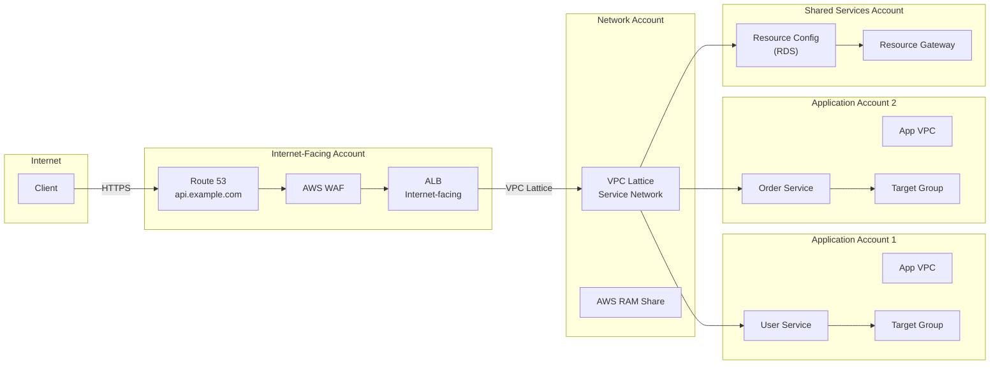
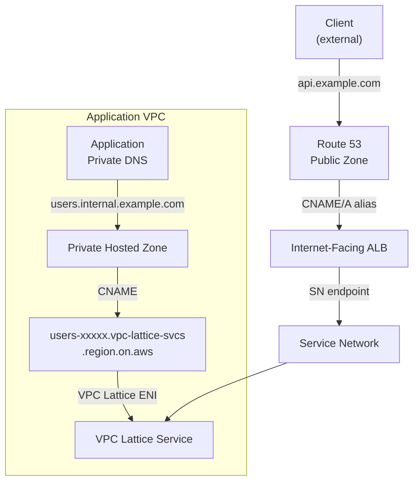
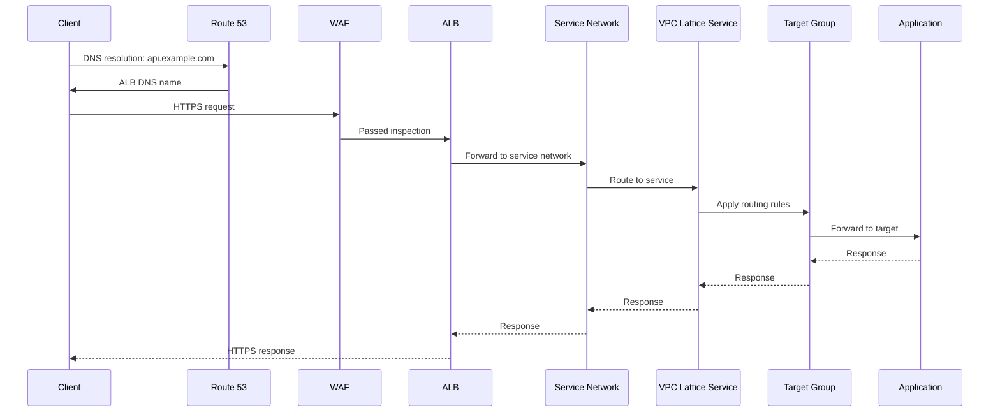

# Deep Dive: Public-Facing VPC Lattice with Cross-Account Centralized Networking

## Table of Contents

| Section | Topic | Description |
| :---: | :--- | :--- |
| **01** | [Architecture Overview](#1-architecture-overview) | High-level components, account structure, and traffic flow patterns. |
| **02** | [Network Account — Central Hub](#2-network-account--central-hub) | Creating the service network, auth policies, and sharing via AWS RAM. |
| **03** | [Internet-Facing Account — Public Edge](#3-internet-facing-account--public-edge) | Public ALB, SSL/TLS termination, and target group configuration. |
| **04** | [Application Account — Service Providers](#4-application-account--service-providers) | Accepting RAM shares, VPC association, creating services and listeners. |
| **05** | [Shared Services Account — Resource Provider](#5-shared-services-account--resource-provider) | Resource gateways and resource configurations for TCP resources. |
| **06** | [DNS & Domain Configuration](#6-dns--domain-configuration) | Route 53 public and private hosted zones, CNAME records for VPC Lattice. |
| **07** | [Security Configuration](#7-security-configuration) | Service-level auth policies, security groups, and WAF integration. |
| **08** | [Traffic Flow & Routing](#8-traffic-flow--routing) | ALB listener rules, VPC Lattice routing rules, and path-based routing. |
| **09** | [Monitoring & Observability](#9-monitoring--observability) | Access logs, CloudWatch metrics, and dashboards. |
| **10** | [Advanced Patterns](#10-advanced-patterns) | Blue/green deployments, multi-region failover, and hybrid connectivity. |
| **11** | [Cost Model & Optimization](#11-cost-model--optimization) | Pricing components, consolidation strategies, and traffic optimization. |
| **12** | [Security Best Practices](#12-security-best-practices) | Network segmentation, encryption, and monitoring recommendations. |

---

## 1. Architecture Overview

VPC Lattice is a fully managed application networking service that connects, monitors, and secures service-to-service communication across instances, containers, and serverless workloads — across accounts and VPCs. This architecture extends VPC Lattice to handle **public-facing traffic** by placing an internet-facing Application Load Balancer in front of a VPC Lattice service network.

### What This Architecture Solves

Without a unified service mesh, multi-account architectures typically rely on:

- VPC peering or Transit Gateway for cross-account connectivity — full network access, not service-level.
- Custom API gateways or service meshes (Istio, Consul) that add operational overhead.
- Manual DNS management and security policy replication across accounts.
- Point-to-point PrivateLink endpoints for every service pair — N squared problem.

VPC Lattice collapses this to a **service network** that acts as a logical boundary, with IAM-based auth policies, automatic DNS resolution, and built-in observability.

### Account Structure

| Account | Role | Key Resources |
| :--- | :--- | :--- |
| **Network Account** | Central hub | VPC Lattice service network, AWS RAM shares, security policies |
| **Internet-Facing Account** | Public edge | Internet-facing ALB, WAF, Route 53, SSL/TLS termination |
| **Application Accounts** | Service providers | VPC Lattice services, target groups, application logic |
| **Shared Services Account** | Resource provider | Databases, caches, resource gateways |

### Traffic Flow

```
Internet → Route 53 → CloudFront/WAF → ALB (Public) → VPC Lattice Service Network → Cross-Account Services
                                                                                             ↓
                                                                                     [Application Accounts]
                                                                                     [Shared Services Account]
```



### Key Design Decisions

| Decision | Choice | Rationale |
| :--- | :--- | :--- |
| Auth type | `AWS_IAM` | Enables fine-grained cross-account auth policies with conditions. |
| Service network scope | One per environment | Separation of production, staging, and development traffic. |
| ALB fronting | Required for public access | VPC Lattice services are private by design. |
| Resource gateways | For TCP/non-HTTP resources | Databases and caches don't speak HTTP; RGW bridges the gap. |

---

## 2. Network Account — Central Hub

The Network Account owns the VPC Lattice service network and controls who can associate VPCs and services.

### 2.1 Create the Service Network

```bash
aws vpc-lattice create-service-network \
    --name "central-service-network" \
    --auth-type "AWS_IAM" \
    --tags Key=Environment,Value=Production Key=Owner,Value=NetworkTeam
```

Console: **VPC Lattice** → **Service Networks** → **Create service network**.

| Field | Value |
| :--- | :--- |
| Name | `central-service-network` |
| Auth type | `AWS_IAM` |
| Tags | `Environment=Production`, `Owner=NetworkTeam` |

### 2.2 Service Network Auth Policy

This policy grants the application accounts and shared services account permission to associate and invoke services through the network.

```json
{
    "Version": "2012-10-17",
    "Statement": [
        {
            "Sid": "AllowCrossAccountAccess",
            "Effect": "Allow",
            "Principal": {
                "AWS": [
                    "arn:aws:iam::APP_ACCOUNT_1:root",
                    "arn:aws:iam::APP_ACCOUNT_2:root",
                    "arn:aws:iam::SHARED_SERVICES_ACCOUNT:root"
                ]
            },
            "Action": "vpc-lattice:*",
            "Resource": "*",
            "Condition": {
                "StringEquals": {
                    "vpc-lattice:ServiceNetworkArn": "arn:aws:vpc-lattice:region:NETWORK_ACCOUNT:servicenetwork/sn-xxxxx"
                }
            }
        }
    ]
}
```

### 2.3 Share via AWS RAM

```bash
aws ram create-resource-share \
    --name "vpc-lattice-service-network-share" \
    --resource-arns "arn:aws:vpc-lattice:region:NETWORK_ACCOUNT:servicenetwork/sn-xxxxx" \
    --principals "APP_ACCOUNT_1,APP_ACCOUNT_2,SHARED_SERVICES_ACCOUNT" \
    --tags Key=Purpose,Value=VPCLatticeSharing
```

Console: **Resource Access Manager** → **Create resource share**.

> [!IMPORTANT]
> The service network must be shared **before** application accounts can associate their VPCs or services. Without the RAM share, cross-account associations will fail with an authorization error.

---

## 3. Internet-Facing Account — Public Edge

The Internet-Facing Account terminates public HTTPS traffic and forwards it into the VPC Lattice service network.

### 3.1 Create Public-Facing ALB

```bash
aws elbv2 create-load-balancer \
    --name "public-api-gateway-alb" \
    --subnets subnet-public-1 subnet-public-2 \
    --security-groups sg-public-alb \
    --scheme internet-facing \
    --type application \
    --ip-address-type ipv4
```

| Parameter | Value |
| :--- | :--- |
| Scheme | `internet-facing` |
| Type | `application` |
| Subnets | Public subnets in at least 2 AZs |

### 3.2 Configure SSL/TLS Certificate

```bash
aws acm request-certificate \
    --domain-name "api.example.com" \
    --validation-method DNS \
    --tags Key=Name,Value=PublicAPIGatewayCert
```

Validate the certificate through Route 50 DNS validation or email.

### 3.3 Create ALB Target Group for VPC Lattice

The target group for VPC Lattice uses `target-type ip` because VPC Lattice presents service endpoints as IP addresses in the VPC CIDR range.

```bash
aws elbv2 create-target-group \
    --name "vpc-lattice-backend-tg" \
    --protocol HTTPS \
    --port 443 \
    --vpc-id vpc-public-123 \
    --target-type ip \
    --health-check-protocol HTTPS \
    --health-check-path "/health"
```

> [!NOTE]
> The ALB forwards to VPC Lattice using HTTPS on port 443. The target IPs are the VPC Lattice service ENIs that get provisioned in the Internet-Facing Account's VPC when the service network VPC association is created.

### 3.4 ALB Listener

```bash
aws elbv2 create-listener \
    --load-balancer-arn arn:aws:elasticloadbalancing:region:INTERNET_ACCOUNT:listener/app/public-api-gateway-alb/xxxxx \
    --protocol HTTPS \
    --port 443 \
    --certificates CertificateArn=arn:aws:acm:region:INTERNET_ACCOUNT:certificate/xxxxx \
    --default-actions Type=forward,TargetGroupArn=arn:aws:elasticloadbalancing:region:INTERNET_ACCOUNT:targetgroup/vpc-lattice-backend-tg/xxxxx
```

---

## 4. Application Account — Service Providers

Application accounts host the actual services and register them with VPC Lattice.

### 4.1 Accept RAM Resource Share

```bash
aws ram accept-resource-share-invitation \
    --resource-share-invitation-arn "arn:aws:ram:region:NETWORK_ACCOUNT:resource-share/xxxxx"
```

Console: **RAM** → **Shared with me** → **Accept**.

### 4.2 Associate VPC with Service Network

```bash
aws vpc-lattice create-service-network-vpc-association \
    --service-network-identifier "sn-xxxxx" \
    --vpc-identifier "vpc-app-123" \
    --security-group-ids "sg-vpc-lattice" \
    --tags Key=Environment,Value=Production
```

This provisions VPC Lattice ENIs in the application VPC's subnets. The VPC must be in an AWS Region that supports VPC Lattice.

| Field | Value |
| :--- | :--- |
| Service network | The ARN from the Network Account |
| VPC | The application account's VPC |
| Security group | Controls traffic to/from VPC Lattice ENIs |

### 4.3 Create VPC Lattice Service

```bash
aws vpc-lattice create-service \
    --name "user-management-service" \
    --custom-domain-name "users.internal.example.com" \
    --certificate-arn "arn:aws:acm:region:APP_ACCOUNT:certificate/xxxxx" \
    --auth-type "AWS_IAM" \
    --tags Key=Service,Value=UserManagement
```

| Field | Value |
| :--- | :--- |
| Custom domain | `users.internal.example.com` — used for private DNS resolution |
| Auth type | `AWS_IAM` — each service can override the network-level policy |
| Certificate | ACM certificate for the custom domain |

### 4.4 Create Target Group

```bash
aws vpc-lattice create-target-group \
    --name "user-service-targets" \
    --type "INSTANCE" \
    --config '{
        "port": 8080,
        "protocol": "HTTP",
        "vpcIdentifier": "vpc-app-123",
        "healthCheck": {
            "enabled": true,
            "path": "/health",
            "protocol": "HTTP",
            "port": 8080,
            "intervalSeconds": 30,
            "timeoutSeconds": 5,
            "healthyThresholdCount": 2,
            "unhealthyThresholdCount": 3
        }
    }'
```

Target group types:

| Type | Use Case |
| :--- | :--- |
| `INSTANCE` | EC2 instances, ECS tasks with `awsvpc` network mode directly |
| `IP` | IP addresses — useful for Kubernetes pods, or when targets are in a different VPC |
| `LAMBDA` | Lambda function as the target |

### 4.5 Create Listener

```bash
aws vpc-lattice create-listener \
    --service-identifier "svc-xxxxx" \
    --name "https-listener" \
    --protocol "HTTPS" \
    --port 443 \
    --default-action '{
        "forward": {
            "targetGroups": [{
                "targetGroupIdentifier": "tg-xxxxx",
                "weight": 100
            }]
        }
    }'
```

### 4.6 Associate Service with Service Network

```bash
aws vpc-lattice create-service-network-service-association \
    --service-network-identifier "sn-xxxxx" \
    --service-identifier "svc-xxxxx" \
    --tags Key=Association,Value=UserService
```

This step registers the service into the central service network so it becomes reachable from the ALB and other associated VPCs.

---

## 5. Shared Services Account — Resource Provider

Shared services (databases, caches, legacy systems) are not HTTP services and cannot be registered as VPC Lattice services directly. Use **resource gateways** and **resource configurations** instead.

### 5.1 Create Resource Gateway

A resource gateway is a VPC Lattice-managed Gateway Load Balancer endpoint that routes TCP traffic to resources in the shared services VPC.

```bash
aws vpc-lattice create-resource-gateway \
    --name "shared-database-gateway" \
    --vpc-identifier "vpc-shared-123" \
    --subnet-ids "subnet-db-1,subnet-db-2" \
    --security-group-ids "sg-database" \
    --ip-address-type "IPV4" \
    --tags Key=Purpose,Value=DatabaseAccess
```

### 5.2 Create Resource Configuration

```bash
aws vpc-lattice create-resource-configuration \
    --name "user-database-config" \
    --type "SINGLE" \
    --resource-gateway-identifier "rgw-xxxxx" \
    --resource-configuration-definition '{
        "dnsResource": {
            "domainName": "user-db.cluster-xxxxx.region.rds.amazonaws.com",
            "ipAddressType": "IPV4"
        }
    }' \
    --port-ranges "FromPort=5432,ToPort=5432" \
    --protocol "TCP" \
    --tags Key=Database,Value=UserDB
```

| Resource Type | Use Case |
| :--- | :--- |
| `SINGLE` | A single DNS name or IP (RDS, ElastiCache, single EC2) |
| `GROUP` | A group of IPs or DNS names (multi-AZ, read replicas) |
| `ARN` | An AWS resource identified by its ARN |

### 5.3 Associate Resource with Service Network

```bash
aws vpc-lattice create-service-network-resource-association \
    --service-network-identifier "sn-xxxxx" \
    --resource-configuration-identifier "rsc-xxxxx" \
    --tags Key=Resource,Value=UserDatabase
```

> [!TIP]
> Use resource configurations for **TCP-based** resources that don't speak HTTP. For HTTP/REST services, use VPC Lattice services instead — they provide richer routing (path/header matching, weighted routing) that resource configurations don't support.

---

## 6. DNS & Domain Configuration

### 6.1 Public Hosted Zone

```bash
aws route53 change-resource-record-sets \
    --hosted-zone-id "Z123456789" \
    --change-batch '{
        "Changes": [{
            "Action": "UPSERT",
            "ResourceRecordSet": {
                "Name": "api.example.com",
                "Type": "A",
                "AliasTarget": {
                    "DNSName": "public-api-gateway-alb-xxxxx.region.elb.amazonaws.com",
                    "EvaluateTargetHealth": true,
                    "HostedZoneId": "Z215JYRZR1TBD5"
                }
            }
        }]
    }'
```

The `HostedZoneId` for ALBs varies by region — use the [ALB dualstack Hosted Zone IDs](https://docs.aws.amazon.com/general/latest/gr/elb.html) reference.

### 6.2 Private Hosted Zone for Internal Services

```bash
ZONE_ID=$(aws route53 create-hosted-zone \
    --name "internal.example.com" \
    --vpc "VPCRegion=region,VPCId=vpc-app-123" \
    --caller-reference "$(date +%s)" \
    --hosted-zone-config "PrivateZone=true,Comment=VPC Lattice Internal Services" \
    --query 'HostedZone.Id' --output text)

aws route53 change-resource-record-sets \
    --hosted-zone-id "$ZONE_ID" \
    --change-batch '{
        "Changes": [{
            "Action": "UPSERT",
            "ResourceRecordSet": {
                "Name": "users.internal.example.com",
                "Type": "CNAME",
                "TTL": 300,
                "ResourceRecords": [{
                    "Value": "users-xxxxx.7d67968.vpc-lattice-svcs.region.on.aws"
                }]
            }
        }]
    }'
```

The VPC Lattice service DNS name follows the pattern: `{service-id}.{env-id}.vpc-lattice-svcs.{region}.on.aws`. This DNS name resolves to the VPC Lattice managed ENI in the calling VPC.

### 6.3 DNS Resolution Flow



---

## 7. Security Configuration

### 7.1 Service-Level Auth Policy

Attach this auth policy to each VPC Lattice service to restrict which principals can invoke it and under what conditions.

```json
{
    "Version": "2012-10-17",
    "Statement": [
        {
            "Sid": "AllowPublicALBAccess",
            "Effect": "Allow",
            "Principal": {
                "AWS": "arn:aws:iam::INTERNET_ACCOUNT:role/ALBServiceRole"
            },
            "Action": "vpc-lattice:Invoke",
            "Resource": "*",
            "Condition": {
                "StringEquals": {
                    "vpc-lattice:SourceVpc": "vpc-public-123"
                }
            }
        },
        {
            "Sid": "AllowCrossAccountServiceAccess",
            "Effect": "Allow",
            "Principal": {
                "AWS": [
                    "arn:aws:iam::APP_ACCOUNT_1:role/ApplicationRole",
                    "arn:aws:iam::APP_ACCOUNT_2:role/ApplicationRole"
                ]
            },
            "Action": "vpc-lattice:Invoke",
            "Resource": "*",
            "Condition": {
                "StringLike": {
                    "vpc-lattice:RequestHeader/user-agent": "MyApplication/*"
                }
            }
        }
    ]
}
```

### 7.2 Security Groups

**Public ALB security group:**

```bash
aws ec2 authorize-security-group-ingress \
    --group-id sg-public-alb \
    --protocol tcp \
    --port 443 \
    --cidr 0.0.0.0/0
```

**VPC Lattice service security group (in application VPC):**

```bash
# Allow traffic from the ALB VPC
aws ec2 authorize-security-group-ingress \
    --group-id sg-vpc-lattice \
    --protocol tcp \
    --port 443 \
    --source-group sg-public-alb

# Allow VPC Lattice link-local traffic
aws ec2 authorize-security-group-ingress \
    --group-id sg-vpc-lattice \
    --protocol tcp \
    --port 443 \
    --cidr 169.254.171.0/24
```

> [!IMPORTANT]
> The `169.254.171.0/24` CIDR is VPC Lattice's link-local address range. VPC Lattice health checks and data plane traffic originate from this range. Without allowing it, health checks will fail and traffic will be dropped.

### 7.3 WAF Integration

Attach AWS WAF to the public ALB for Layer 7 protection:

```bash
aws wafv2 associate-web-acl \
    --web-acl-arn arn:aws:wafv2:region:INTERNET_ACCOUNT:regional/webacl/api-waf/xxxxx \
    --resource-arn arn:aws:elasticloadbalancing:region:INTERNET_ACCOUNT:loadbalancer/app/public-api-gateway-alb/xxxxx
```

---

## 8. Traffic Flow & Routing

### 8.1 ALB Listener Rules

Route different URL paths to different VPC Lattice services by creating listener rules on the ALB.

```bash
aws elbv2 create-rule \
    --listener-arn "arn:aws:elasticloadbalancing:region:INTERNET_ACCOUNT:listener/app/public-api-gateway-alb/xxxxx" \
    --priority 100 \
    --conditions '[{
        "Field": "path-pattern",
        "Values": ["/api/users/*"]
    }]' \
    --actions '[{
        "Type": "forward",
        "TargetGroupArn": "arn:aws:elasticloadbalancing:region:INTERNET_ACCOUNT:targetgroup/vpc-lattice-users-tg/xxxxx"
    }]'
```

### 8.2 VPC Lattice Routing Rules

VPC Lattice services support path-based and header-based routing to different target groups.

```bash
aws vpc-lattice create-rule \
    --listener-identifier "listener-xxxxx" \
    --service-identifier "svc-xxxxx" \
    --name "user-api-routing" \
    --priority 100 \
    --match '{
        "httpMatch": {
            "pathMatch": {
                "match": {
                    "prefix": "/api/v1/"
                }
            },
            "headerMatches": [{
                "name": "x-api-version",
                "match": {
                    "exact": "v1"
                }
            }]
        }
    }' \
    --action '{
        "forward": {
            "targetGroups": [{
                "targetGroupIdentifier": "tg-users-v1",
                "weight": 90
            }, {
                "targetGroupIdentifier": "tg-users-v2",
                "weight": 10
            }]
        }
    }'
```

### 8.3 End-to-End Traffic Path



---

## 9. Monitoring & Observability

### 9.1 Enable Access Logs

```bash
aws vpc-lattice put-access-log-subscription \
    --resource-identifier "sn-xxxxx" \
    --destination-arn "arn:aws:s3:::vpc-lattice-access-logs/service-network/" \
    --tags Key=LogType,Value=ServiceNetwork
```

### 9.2 Key CloudWatch Metrics

| Namespace | Metric | Description |
| :--- | :--- | :--- |
| `AWS/VpcLattice` | `RequestCount` | Total requests routed through the service network |
| `AWS/VpcLattice` | `ResponseTime` | Average latency in milliseconds |
| `AWS/VpcLattice` | `HTTPCode_Target_2XX_Count` | Successful responses |
| `AWS/VpcLattice` | `HTTPCode_Target_4XX_Count` | Client errors |
| `AWS/VpcLattice` | `HTTPCode_Target_5XX_Count` | Server errors |

### 9.3 CloudWatch Dashboard

```bash
aws cloudwatch put-dashboard \
    --dashboard-name "VpcLattice-Monitoring" \
    --dashboard-body '{
        "widgets": [
            {
                "type": "metric",
                "x": 0,
                "y": 0,
                "width": 12,
                "height": 6,
                "properties": {
                    "metrics": [
                        ["AWS/VpcLattice", "RequestCount", "ServiceNetworkId", "sn-xxxxx", {"stat": "Sum"}]
                    ],
                    "period": 300,
                    "stat": "Sum",
                    "region": "region",
                    "title": "Request Count"
                }
            },
            {
                "type": "metric",
                "x": 12,
                "y": 0,
                "width": 12,
                "height": 6,
                "properties": {
                    "metrics": [
                        ["AWS/VpcLattice", "ResponseTime", "ServiceNetworkId", "sn-xxxxx", {"stat": "p99"}]
                    ],
                    "period": 300,
                    "stat": "p99",
                    "region": "region",
                    "title": "p99 Response Time"
                }
            }
        ]
    }'
```

---

## 10. Advanced Patterns

### 10.1 Blue/Green Deployments

VPC Lattice supports weighted routing, enabling gradual traffic shifts.

```bash
aws vpc-lattice modify-rule \
    --rule-identifier "rule-xxxxx" \
    --service-identifier "svc-xxxxx" \
    --action '{
        "forward": {
            "targetGroups": [{
                "targetGroupIdentifier": "tg-blue",
                "weight": 50
            }, {
                "targetGroupIdentifier": "tg-green",
                "weight": 50
            }]
        }
    }'
```

**Deployment stages:**

| Stage | Blue Weight | Green Weight | Validation |
| :--- | :--- | :--- | :--- |
| Canary | 100 | 0 | — |
| 10% rollout | 90 | 10 | Check 4xx/5xx rates |
| 50% rollout | 50 | 50 | Compare latency metrics |
| Full cutover | 0 | 100 | Remove blue target group |
| Cleanup | — | — | Deregister old targets |

### 10.2 Multi-Region Failover

VPC Lattice is regional. For multi-region architectures:

1. Create a service network per region.
2. Register regional services into their respective service networks.
3. Use Route 53 latency-based or failover routing at the public ALB level.
4. Replicate resource configurations in each region.

```bash
aws route53 change-resource-record-sets \
    --hosted-zone-id "Z123456789" \
    --change-batch '{
        "Changes": [{
            "Action": "UPSERT",
            "ResourceRecordSet": {
                "Name": "api.example.com",
                "Type": "A",
                "SetIdentifier": "primary",
                "Failover": "PRIMARY",
                "AliasTarget": {
                    "DNSName": "primary-alb-xxxxx.region.elb.amazonaws.com",
                    "EvaluateTargetHealth": true,
                    "HostedZoneId": "Z215JYRZR1TBD5"
                },
                "HealthCheckId": "xxxxx-primary"
            }
        }, {
            "Action": "UPSERT",
            "ResourceRecordSet": {
                "Name": "api.example.com",
                "Type": "A",
                "SetIdentifier": "secondary",
                "Failover": "SECONDARY",
                "AliasTarget": {
                    "DNSName": "secondary-alb-xxxxx.region.elb.amazonaws.com",
                    "EvaluateTargetHealth": true,
                    "HostedZoneId": "Z215JYRZR1TBD5"
                }
            }
        }]
    }'
```

### 10.3 Hybrid Connectivity — On-Premises Access

Extend the service network to on-premises environments via a VPC with Direct Connect or Site-to-Site VPN.

```bash
aws vpc-lattice create-service-network-vpc-association \
    --service-network-identifier "sn-xxxxx" \
    --vpc-identifier "vpc-hybrid-123" \
    --security-group-ids "sg-hybrid"
```

The on-premises network resolves VPC Lattice service DNS names through the hybrid VPC's Route 53 inbound resolver endpoint.

### 10.4 EKS Integration

VPC Lattice integrates with Kubernetes via the AWS Gateway API Controller, which translates Kubernetes Gateway API resources into VPC Lattice configuration.

```
kubectl apply -f - <<EOF
apiVersion: gateway.networking.k8s.io/v1beta1
kind: HTTPRoute
metadata:
  name: user-service-route
spec:
  parentRefs:
  - name: vpc-lattice-gateway
  rules:
  - matches:
    - path:
        type: PathPrefix
        value: /api/users/
    backendRefs:
    - name: user-service
      port: 8080
EOF
```

---

## 11. Cost Model & Optimization

### 11.1 Pricing Components

| Component | Price | Notes |
| :--- | :--- | :--- |
| Service Network | ~$0.032/hour per VPC association | Charged per associated VPC per hour |
| VPC Lattice Service | ~$0.032/hour | Per service, regardless of target count |
| Data processing | $0.0325/GB | Data processed through the service network |
| ALB (public) | ~$0.0225/hour + $0.008/LCU-hour | Standard ALB pricing |
| Resource Gateway | ~$0.032/hour | Per resource gateway |
| Route 53 PHZ | $0.50/month per zone | Private hosted zones |

### 11.2 Monthly Estimate for This Architecture

| Component | Quantity | Monthly Cost |
| :--- | :---: | :---: |
| Service Network (3 VPC associations) | 3 | ~$70 |
| VPC Lattice Services | 4 | ~$93 |
| Data processing (10 TB) | 1 | ~$333 |
| ALB | 1 | ~$22 |
| ALB LCUs (estimated) | 10 | ~$58 |
| Resource Gateway | 1 | ~$23 |
| Route 53 (public + private) | 2 | ~$1 |
| **Total (estimated)** | | **~$600/month** |

### 11.3 Optimization Strategies

- **Consolidate VPC associations**: Use one service network per environment and share it. Avoid creating multiple service networks for the same set of VPCs.
- **Cache at the ALB level**: Add CloudFront or use ALB caching to reduce data processing through the service network.
- **Optimize health checks**: Reduce health check frequency and configure appropriate thresholds to minimize unnecessary traffic.
- **Use resource configurations for TCP**: For database access, resource configurations are cheaper than wrapping TCP services in a VPC Lattice service with an NLB in front.

---

## 12. Security Best Practices

### Network Segmentation

| Layer | Control |
| :--- | :--- |
| VPC isolation | Each account has its own VPC. No VPC peering — all cross-account traffic goes through VPC Lattice. |
| Security groups | Allow only required ports and protocols. Restrict VPC Lattice ENI security groups to accept traffic only from the ALB security group. |
| Auth policies | Use IAM auth policies at both the service network and individual service level. |

### Encryption

- **In transit**: ALB terminates TLS. VPC Lattice supports HTTPS with ACM certificates. Enable end-to-end encryption from ALB → VPC Lattice → target group.
- **At rest**: Services behind VPC Lattice should encrypt data at rest (EBS encryption, RDS encryption, S3 SSE).
- **Certificate rotation**: Use ACM-managed certificates with automatic renewal. Monitor certificate expiry with CloudWatch Events.

### Monitoring

- **VPC Flow Logs**: Enable on all VPCs in the path. Publish to S3 and query with Athena.
- **CloudTrail**: Enable for all accounts. Monitor `CreateServiceNetwork`, `CreateService`, `PutAuthPolicy` API calls.
- **CloudWatch Alarms**: Set alarms on 5xx rates, latency p99, and health check failures.

### IAM Conditions for VPC Lattice

| Condition Key | Description |
| :--- | :--- |
| `vpc-lattice:SourceVpc` | Restrict invocation to specific source VPCs |
| `vpc-lattice:SourceIp` | Restrict by client IP (available at the ALB level) |
| `vpc-lattice:RequestHeader/*` | Match on HTTP request headers |
| `vpc-lattice:ServiceNetworkArn` | Scope policy to a specific service network |

---

> [!NOTE]
> **When to use this architecture:** This pattern is ideal for multi-tenant SaaS platforms, microservices with public API endpoints, and organizations migrating from monolithic architectures to service mesh patterns with strict security and compliance requirements.
>
> **When to avoid:** Single-VPC deployments, applications with extremely low-latency requirements (sub-millisecond), or teams that prefer a single service mesh technology for both east-west and north-south traffic.

### References

- [Amazon VPC Lattice features](https://aws.amazon.com/vpc/lattice/features/)
- [Share your VPC Lattice entities](https://docs.aws.amazon.com/vpc-lattice/latest/ug/share-your-entities.html)
- [Resource configurations for VPC resources](https://docs.aws.amazon.com/vpc-lattice/latest/ug/resource-configurations.html)
- [Custom domain names for VPC Lattice services](https://docs.aws.amazon.com/vpc-lattice/latest/ug/services-custom-domain.html)
- [Managing DNS resolution with Amazon VPC Lattice](https://docs.aws.amazon.com/vpc-lattice/latest/ug/dns-resolution.html)
- [Application Load Balancers as targets in VPC Lattice](https://docs.aws.amazon.com/vpc-lattice/latest/ug/target-groups-targets-types-alb.html)
- [AWS VPC Lattice reference architectures](https://docs.aws.amazon.com/vpc-lattice/latest/ug/reference-architectures.html)
