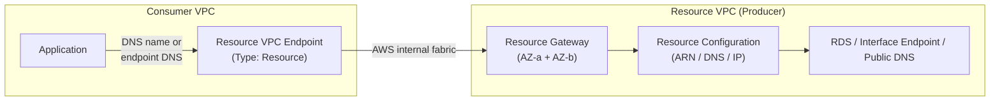
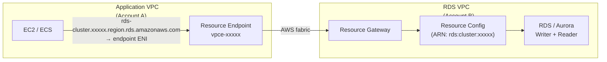
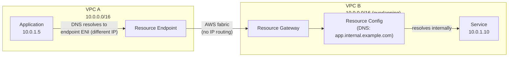
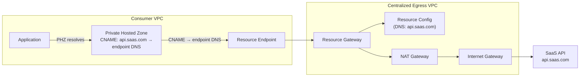
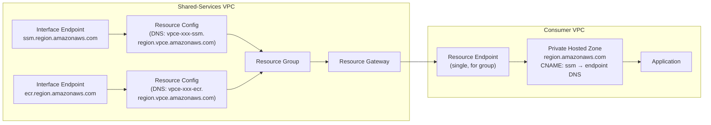

# VPC Resource Gateways — Implementation Patterns & Use Cases

## Table of Contents

| Section | Topic | Description |
| :---: | :--- | :--- |
| **01** | [What Is a VPC Resource Gateway?](#1-what-is-a-vpc-resource-gateway) | The core abstraction, how it differs from PrivateLink endpoint services, and the three resource configuration types. |
| **02** | [Architecture & Traffic Flow](#2-architecture--traffic-flow) | Resource gateway, resource configuration, resource endpoint — how they wire together and how traffic flows. |
| **03** | [Use Case 1: Private RDS Access](#3-use-case-1-private-rds-access) | Connect application VPCs to RDS/Aurora databases in a different VPC or account without VPC peering or TGW. |
| **04** | [Use Case 2: Overlapping CIDR Connectivity](#4-use-case-2-overlapping-cidr-connectivity) | Enable communication between VPCs with conflicting IP address spaces — mergers, acquisitions, partner networks. |
| **05** | [Use Case 3: Proxy to Public Domains](#5-use-case-3-proxy-to-public-domains) | Route traffic to SaaS public endpoints through a centralized VPC with controlled egress and private connectivity. |
| **06** | [Use Case 4: Centralize Interface Endpoints Without TGW](#6-use-case-4-centralize-interface-endpoints-without-tgw) | Replace Transit Gateway with resource endpoints for centralized AWS service access, reducing cost and complexity. |
| **07** | [Terraform Implementation](#7-terraform-implementation) | Complete Terraform module for resource gateway, resource configurations, and resource endpoints with cross-account RAM sharing. |
| **08** | [DNS & Private Hosted Zone Patterns](#8-dns--private-hosted-zone-patterns) | When to enable Private DNS, when to use PHZ with CNAME, and how TLS validation works with each approach. |
| **09** | [Security & Access Controls](#9-security--access-controls) | Security group rules for resource gateways and endpoints, RAM sharing permissions, and IAM conditions. |
| **10** | [Comparison: Resource Gateway vs Alternatives](#10-comparison-resource-gateway-vs-alternatives) | Cost, complexity, and capability comparison against VPC peering, Transit Gateway, PrivateLink endpoint services, and VPC Lattice. |

---

## 1. What Is a VPC Resource Gateway?

A **VPC Resource Gateway** is a AWS-managed gateway that lets you expose resources in one VPC to consumers in other VPCs — without VPC peering, Transit Gateway, or Network Load Balancers. It is the counterpart to the **Resource VPC Endpoint** (consumer side), which connects to the gateway and provides private access to the target resources.

### Why It Exists

Traditional PrivateLink endpoint services require providers to front their services with a Network Load Balancer. This adds cost, operational overhead, and limits what can be exposed — only TCP services behind an NLB qualify. Resource gateways remove the NLB requirement and support three resource types:

| Resource Type | Description | Example |
| :--- | :--- | :--- |
| **ARN** | AWS resource identified by its ARN | RDS cluster, RDS instance |
| **DNS** | Publicly resolvable DNS name | Interface endpoint DNS, SaaS endpoint, any public FQDN |
| **IP** | Static IP address + port | Legacy on-premises service |

### How It Differs from PrivateLink Endpoint Services

| Aspect | VPC Endpoint Service (PrivateLink) | VPC Resource Gateway |
| :--- | :--- | :--- |
| **Target** | NLB-backed services only | ARN, DNS, or IP-based resources |
| **NLB required** | Yes | No |
| **Consumer access** | Interface endpoint in consumer VPC | Resource endpoint in consumer VPC |
| **Overlapping CIDR** | Supported (IP isolation) | Supported |
| **DNS model** | Private DNS hostname (`*.vpce.amazonaws.com`) | Resource endpoint DNS name or Private DNS override |
| **Use case fit** | Custom TCP services behind NLB | RDS, centralized endpoints, public endpoints, overlapping CIDR |

---

## 2. Architecture & Traffic Flow

### Components



1. **Resource Gateway** — provisioned in the resource VPC, deployed across subnets in at least two AZs. Owns the network connectivity and routes traffic to the configured resources.
2. **Resource Configuration** — a definition of what resource to expose. Can be an ARN (RDS), DNS name (interface endpoint, public FQDN), or IP address.
3. **Resource Endpoint** — a VPC endpoint of type `Resource` in the consumer VPC. Attaches to a resource configuration and provides a DNS name that resolves to the resource gateway's managed IPs.

### Traffic Flow

1. Application in consumer VPC resolves the target resource's DNS name (either the native AWS DNS name with Private DNS enabled, or the resource endpoint DNS name).
2. DNS resolves to an IP in the consumer VPC's CIDR range (the resource endpoint ENI).
3. Packet reaches the resource endpoint ENI.
4. AWS internal fabric forwards the packet to the resource gateway in the producer VPC.
5. Resource gateway forwards to the target resource (RDS, interface endpoint, etc.).
6. Return traffic follows the reverse path.

No traffic traverses the internet, Transit Gateway, or VPC peering. The resource gateway handles cross-VPC routing transparently.

---

## 3. Use Case 1: Private RDS Access

### Problem

Application servers in VPC A need to connect to RDS/Aurora databases in VPC B (or a different AWS account). Traditional options — VPC peering, TGW, or PrivateLink endpoint services with an NLB — all add complexity and cost.

### Solution

Use a resource gateway in the RDS VPC with an ARN-type resource configuration pointing to the RDS cluster. Consumer VPCs create a resource endpoint and connect using the RDS DNS name.

### Steps

1. Create a resource gateway in the RDS VPC.
2. Create a resource configuration of type `ARN` for each RDS cluster or instance.
3. (Cross-account) Share the resource configuration via AWS RAM. Accept in the consumer account.
4. Create a resource VPC endpoint in the consumer VPC, associated with the resource configuration. Enable **Private DNS**.
5. Add security group rules allowing traffic from the resource endpoint to the RDS port (5432 for PostgreSQL, 3306 for MySQL).

### Architecture



### DNS Behavior

With Private DNS enabled on the resource endpoint, the RDS DNS name (e.g., `my-cluster.cluster-xxxxx.region.rds.amazonaws.com`) resolves to the resource endpoint ENI IP inside the consumer VPC. Applications connect using the standard RDS endpoint without any code changes.

> [!IMPORTANT]
> ARN-based resource configurations currently support **non-public RDS resources only**. The child resource configurations are automatically managed by AWS — you do not need to create individual configurations for each reader instance.

### TLS Consideration

Private DNS must be enabled for TLS connections to work correctly. The RDS certificate CN matches the RDS DNS name. If Private DNS is disabled and you use the resource endpoint DNS name instead, TLS verification will fail because the endpoint DNS name is not in the RDS certificate's SAN.

---

## 4. Use Case 2: Overlapping CIDR Connectivity

### Problem

Two VPCs have overlapping IP ranges (e.g., both use `10.0.0.0/16`). VPC peering and Transit Gateway reject overlapping CIDRs. This commonly occurs during mergers and acquisitions or when connecting to partner networks.

### Solution

Resource gateways provide **IP isolation** — the consumer VPC and resource VPC can have identical CIDR blocks because traffic is resolved through DNS and forwarded through the resource gateway's internal fabric, not through IP routing between the VPCs.

### Steps

1. Create a resource gateway in the resource VPC.
2. Create a resource configuration (DNS, IP, or ARN type) representing the target.
3. (Cross-account) Share via RAM.
4. Create a resource endpoint in the consumer VPC.
5. Access the resource using the **resource endpoint DNS name** (found under the endpoint's Associations tab). Or optionally create a Private Hosted Zone with CNAME records mapping friendly names to the endpoint DNS.

### How Overlapping CIDR Is Handled



The consumer application never routes directly to the resource VPC's CIDR. It reaches the resource endpoint ENI (which has a non-overlapping IP in the consumer VPC), and AWS's internal fabric handles the forwarding. The overlapping CIDR is invisible to the data path.

### DNS

Without Private DNS (which requires non-overlapping DNS names), you use the resource endpoint DNS name. For a friendly name, create a Private Hosted Zone in the consumer account:

```bash
aws route53 create-hosted-zone \
  --name "internal.example.com" \
  --vpc VPCRegion=region,VPCId=vpc-consumer \
  --caller-reference "$(date +%s)" \
  --hosted-zone-config PrivateZone=true

aws route53 change-resource-record-sets \
  --hosted-zone-id ZXXXXX \
  --change-batch '{
    "Changes": [{
      "Action": "CREATE",
      "ResourceRecordSet": {
        "Name": "db.internal.example.com",
        "Type": "CNAME",
        "TTL": 300,
        "ResourceRecords": [{
          "Value": "vpce-xxxxx-resource.region.vpce.amazonaws.com"
        }]
      }
    }]
  }'
```

---

## 5. Use Case 3: Proxy to Public Domains

### Problem

Security policy requires that outbound traffic to public endpoints (SaaS services, third-party APIs) traverses a centralized VPC with controlled egress — NAT Gateway, firewalls, or private connectivity through Direct Connect. Traditional approaches require NAT Gateways in every VPC or complex TGW routing.

### Solution

Use a resource gateway in a centralized egress VPC with DNS-type resource configurations for each public domain. Consumer VPCs create resource endpoints and route traffic through the centralized VPC via DNS resolution.

### Architecture



### Steps

1. Create a resource VPC with public and private subnets. Route private subnet traffic through a NAT Gateway.
2. Create a resource gateway in the private subnets.
3. Create DNS-type resource configurations for each public domain (e.g., `api.saas.com`, `hooks.slack.com`).
4. (Optional) Group multiple DNS configurations into a resource group — one resource endpoint can then access multiple domains.
5. (Cross-account) Share via RAM.
6. Create a resource endpoint in the consumer VPC.
7. Create a Private Hosted Zone in the consumer VPC with CNAME records mapping the public FQDNs to the resource endpoint DNS name.

### On-Premises Variant

For on-premises clients, route traffic through the same resource gateway over AWS Site-to-Site VPN or Direct Connect:

1. Extend the on-premises network to the resource VPC via VPN/Direct Connect.
2. On-premises clients resolve public FQDNs through the resource endpoint DNS (via Route 53 Resolver inbound endpoint).
3. Traffic flows: on-premises → Direct Connect → resource VPC → resource gateway → NAT → internet.

This limits outbound internet connections to only the trusted public endpoints defined in the resource configurations.

---

## 6. Use Case 4: Centralize Interface Endpoints Without TGW

### Problem

Centralizing interface VPC endpoints (SSM, ECR, Secrets Manager, etc.) in a shared-services VPC traditionally requires Transit Gateway or VPC peering to connect consumer VPCs to the hub. TGW adds per-GB data processing costs and an attachment per VPC.

### Solution

Resource gateways can expose centralized interface endpoints to consumer VPCs through resource endpoints — eliminating the TGW attachment and its associated cost.

### Architecture



### Steps

1. Create the standard interface VPC endpoints in the shared-services VPC.
2. Create a resource gateway in the same VPC.
3. Create **DNS-type resource configurations** for each interface endpoint, using the **regional DNS name** (`vpce-xxxxx.ssm.region.vpce.amazonaws.com`). Note: private DNS names do not work — they must be publicly resolvable.
4. (Optional) Group resource configurations into a **resource group** so a single resource endpoint can access multiple AWS services.
5. (Cross-account) Share via RAM.
6. Create a resource endpoint in the consumer VPC.
7. (Optional) Create a Private Hosted Zone with domain `<region>.amazonaws.com` in the consumer VPC, with CNAME records mapping service DNS names to the resource endpoint DNS name. This enables TLS validation.

### Cost Comparison

| Architecture | Component Cost (per consumer VPC) |
| :--- | :--- |
| **Transit Gateway** | $0.05/hr per attachment + $0.02/GB data processing |
| **Resource Endpoint** | $0.01/hr per endpoint + data processing |

For 10 consumer VPCs, TGW attachments alone cost ~$360/month before data processing. Resource endpoints replace the TGW attachment with a lightweight endpoint that costs ~$7/month per consumer.

> [!NOTE]
> Resource gateway DNS configurations require the DNS name to be **publicly resolvable**. The interface endpoint's regional DNS name (`vpce-xxxxx.ssm.region.vpce.amazonaws.com`) meets this requirement. Private DNS hostnames (like `ssm.region.amazonaws.com` from the auto-created PHZ) will not work.

---

## 7. Terraform Implementation

### Resource Gateway Module

```hcl
# modules/resource-gateway/variables.tf
variable "gateway_name" {
  type = string
}

variable "vpc_id" {
  type = string
}

variable "subnet_ids" {
  type = list(string)
}

variable "security_group_ids" {
  type = list(string)
}

variable "resource_configurations" {
  type = list(object({
    name        = string
    type        = string          # "ARN", "DNS", "IP"
    domain_name = optional(string) # for DNS type
    arn         = optional(string) # for ARN type
    ip_address  = optional(string) # for IP type
    port        = optional(number)
    protocol    = optional(string)
  }))
}

variable "tags" {
  type    = map(string)
  default = {}
}
```

```hcl
# modules/resource-gateway/main.tf
resource "aws_vpclattice_resource_gateway" "this" {
  name               = var.gateway_name
  vpc_identifier     = var.vpc_id
  subnet_ids         = var.subnet_ids
  security_group_ids = var.security_group_ids
  ip_address_type    = "IPV4"
  tags               = var.tags
}

resource "aws_vpclattice_resource_configuration" "resources" {
  for_each = { for r in var.resource_configurations : r.name => r }

  name                 = each.value.name
  type                 = each.value.type
  resource_gateway_identifier = aws_vpclattice_resource_gateway.this.id

  dynamic "resource_configuration_definition" {
    for_each = each.value.type == "DNS" ? [1] : []
    content {
      dns_resource {
        domain_name    = each.value.domain_name
        ip_address_type = "IPV4"
      }
    }
  }

  port_ranges {
    from_port = each.value.port
    to_port   = each.value.port
  }

  protocol = each.value.protocol
  tags     = var.tags
}
```

### Resource Endpoint (Consumer Side)

```hcl
# Consumer account
resource "aws_vpce_resource_endpoint" "this" {
  vpc_id                     = var.consumer_vpc_id
  subnet_ids                 = var.consumer_subnet_ids
  security_group_ids         = [aws_security_group.resource_endpoint.id]
  resource_configuration_arn = var.resource_configuration_arn
  private_dns_enabled        = true

  tags = var.tags
}

# Security group for the resource endpoint
resource "aws_security_group" "resource_endpoint" {
  name        = "resource-endpoint-sg"
  description = "Security group for resource VPC endpoint"
  vpc_id      = var.consumer_vpc_id

  ingress {
    description = "From application subnets"
    protocol    = "tcp"
    from_port   = var.resource_port
    to_port     = var.resource_port
    cidr_blocks = var.consumer_app_cidrs
  }
}
```

### Cross-Account RAM Sharing

```hcl
# Producer account — share resource configuration
resource "aws_ram_resource_share" "rgw" {
  name                      = "resource-gateway-share"
  allow_external_principals = false
  resource_arns = [
    aws_vpclattice_resource_configuration.resources["rds-main"].arn
  ]
}

resource "aws_ram_principal_association" "consumer" {
  resource_share_arn = aws_ram_resource_share.rgw.arn
  principal          = var.consumer_account_id
}
```

```hcl
# Consumer account — accept and use
data "aws_ram_resource_share" "shared" {
  name                  = "resource-gateway-share"
  resource_share_status = "ACTIVE"
}

resource "aws_ram_resource_share_accepter" "this" {
  resource_share_arn = data.aws_ram_resource_share.shared.arn
}
```

---

## 8. DNS & Private Hosted Zone Patterns

| Scenario | DNS Approach | TLS Validation |
| :--- | :--- | :--- |
| **RDS with Private DNS** | Enable Private DNS on resource endpoint. Use native RDS DNS name. | Works — CN matches RDS DNS name. |
| **RDS without Private DNS** | Use resource endpoint DNS name. | Fails — endpoint DNS not in RDS certificate SAN. |
| **Interface endpoints** | Create PHZ with domain `<region>.amazonaws.com` and CNAME records mapping service aliases to endpoint DNS. | Works — CNAME target is the endpoint DNS. |
| **Overlapping CIDR** | Use endpoint DNS name or PHZ with CNAME. | Check target — endpoint DNS may not match TLS CN. |
| **Public domains (SaaS)** | Create PHZ with CNAME from public FQDN to endpoint DNS. | Works — the SaaS certificate matches the public FQDN, and the CNAME is transparent to the application. |

### Private Hosted Zone for Interface Endpoints

To access centralized interface endpoints through a resource endpoint with correct TLS:

```bash
# PHZ with specific domain name format
aws route53 create-hosted-zone \
  --name "region.amazonaws.com" \
  --vpc VPCRegion=region,VPCId=vpc-consumer \
  --caller-reference "$(date +%s)" \
  --hosted-zone-config PrivateZone=true

# CNAME records for each service
aws route53 change-resource-record-sets \
  --hosted-zone-id ZXXXXX \
  --change-batch '{
    "Changes": [{
      "Action": "CREATE",
      "ResourceRecordSet": {
        "Name": "ec2.region.amazonaws.com",
        "Type": "CNAME",
        "TTL": 300,
        "ResourceRecords": [{
          "Value": "vpce-xxxxx-ec2.region.vpce.amazonaws.com"
        }]
      }
    }]
  }'
```

The PHZ domain must match the service DNS suffix (`<region>.amazonaws.com`) for TLS to succeed.

---

## 9. Security & Access Controls

### Security Groups

**Resource gateway security group** (in producer VPC):

```hcl
resource "aws_security_group" "rgw" {
  name        = "resource-gateway-sg"
  description = "Controls traffic from resource gateway to targets"
  vpc_id      = var.vpc_id

  egress {
    description = "To resource targets"
    protocol    = "tcp"
    from_port   = var.resource_port
    to_port     = var.resource_port
    cidr_blocks = var.resource_cidrs
  }
}
```

**Resource endpoint security group** (in consumer VPC):

```hcl
resource "aws_security_group" "endpoint" {
  name        = "resource-endpoint-sg"
  description = "Controls traffic to resource endpoint"
  vpc_id      = var.consumer_vpc_id

  ingress {
    description = "From application workloads"
    protocol    = "tcp"
    from_port   = var.resource_port
    to_port     = var.resource_port
    cidr_blocks = var.app_subnet_cidrs
  }
}
```

### IAM Conditions for Resource Gateway

| Condition Key | Description |
| :--- | :--- |
| `aws:SourceVpce` | Restrict resource configuration sharing to specific resource endpoints. |
| `vpc-lattice:ResourceGatewayArn` | Scope IAM permissions to a specific resource gateway. |
| `ram:RequestedResourceType` | Can be used in SCPs to control which resource types can be shared via RAM. |

### SCP Guardrails

```json
{
  "Version": "2012-10-17",
  "Statement": [
    {
      "Sid": "DenyResourceGatewayCreationOutsideNetworkAccount",
      "Effect": "Deny",
      "Action": [
        "vpc-lattice:CreateResourceGateway"
      ],
      "Resource": "*",
      "Condition": {
        "StringNotEquals": {
          "aws:ResourceAccount": "${aws:PrincipalAccount}"
        }
      }
    }
  ]
}
```

---

## 10. Comparison: Resource Gateway vs Alternatives

| Capability | Resource Gateway | Transit Gateway | VPC Peering | PrivateLink Endpoint Service | VPC Lattice |
| :--- | :--- | :--- | :--- | :--- | :--- |
| **NLB required** | No | No | No | Yes | No |
| **Overlapping CIDR** | Yes | No | No | Yes | Yes |
| **Cross-account** | Yes (RAM) | Yes (RAM) | Yes | Yes (RAM) | Yes (RAM) |
| **Cost per consumer** | ~$7/month per endpoint | ~$36/month per attachment | Free (but N² problem) | ~$22/month per endpoint | ~$22/month per VPC association |
| **Target type** | ARN, DNS, IP | VPC routing | VPC routing | NLB-backed TCP | HTTP/HTTPS services + TCP resources |
| **DNS integration** | PHZ + Private DNS | Route 53 Resolver | Route 53 Resolver | PHZ association | Auto DNS |
| **Traffic inspection** | No | Yes (GWLB) | No | No | No |
| **HTTP routing** | No | No | No | No | Yes (path/header) |
| **Best for** | RDS access, overlapping CIDR, endpoint centralization | Hub-and-spoke routing, network segmentation | Simple 1:1 VPC connections | Exposing custom TCP services | Service mesh, microservices |

### Decision Matrix

| Scenario | Recommended Approach |
| :--- | :--- |
| Connect application VPCs to RDS in another account | Resource Gateway (simplest, no NLB) |
| VPCs with overlapping CIDRs | Resource Gateway (only option besides PrivateLink) |
| Centralize interface endpoints (SSM, ECR, etc.) | Resource Gateway (cheaper than TGW for 10+ consumers) |
| Egress to public SaaS endpoints through central VPC | Resource Gateway with DNS config |
| Full hub-and-spoke routing with transitive connectivity | Transit Gateway |
| Service mesh with HTTP routing, auth, observability | VPC Lattice |
| Expose a custom TCP service behind an NLB | PrivateLink Endpoint Service |

---

> [!NOTE]
> **When to use Resource Gateways:** This pattern is ideal for RDS connectivity across accounts, overlapping CIDR scenarios, replacing TGW for endpoint centralization, and controlled egress to public SaaS endpoints. It reduces complexity by eliminating NLBs, TGW attachments, and VPC peering from the architecture.
>
> **When to avoid:** For HTTP/HTTPS services that need path-based routing or auth policies (use VPC Lattice), for full transitive routing between many VPCs (use TGW), or for exposing custom TCP services where you need traffic inspection (use PrivateLink endpoint services).

### References

- [AWS Blog: VPC resource gateways implementation patterns and use cases](https://aws.amazon.com/blogs/networking-and-content-delivery/vpc-resource-gateways-implementation-patterns-and-use-cases/)
- [VPC Resource Gateways documentation](https://docs.aws.amazon.com/vpc/latest/privatelink/resource-gateway.html)
- [Resource VPC Endpoints](https://docs.aws.amazon.com/vpc/latest/privatelink/use-resource-endpoint.html)
- [AWS RAM shareable resources](https://docs.aws.amazon.com/ram/latest/userguide/shareable.html)
- [Centralized VPC Endpoints design guide](centralized-vpc-endpoints.md)
- [VPC Lattice multi-account architecture](vpc-lattice-multi-account.md)
