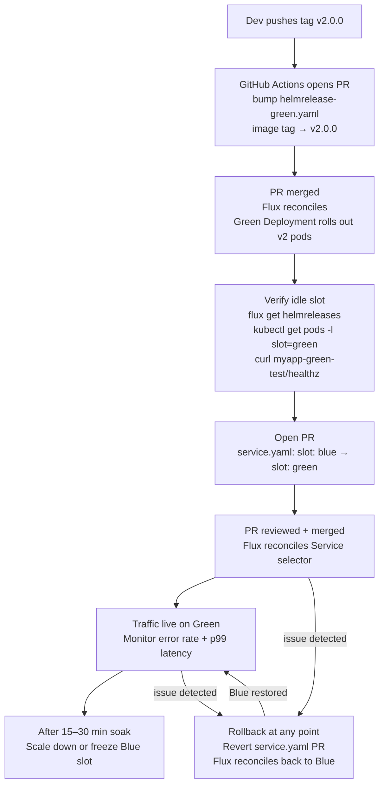

# Blue/Green Deployment

## Table of Contents

| Section | Topic | Description |
| :---: | :--- | :--- |
| **01** | [Core Concept & Mental Model](#1-core-concept-mental-model) | What blue/green actually is, why it works, and where it breaks. |
| **02** | [Kubernetes Implementation (kubectl)](#2-kubernetes-implementation-kubectl) | Service selector cutover, deployment manifests, smoke-test service, PodDisruptionBudget, and GitHub Actions pipeline. |
| **03** | [GitOps Implementation (Flux CD + Helm)](#3-gitops-implementation-flux-cd-helm) | Repo structure, HelmRelease per slot, Flux Kustomization health checks, and automated image-tag PRs. |
| **04** | [GitOps End-to-End Flow](#4-gitops-end-to-end-flow) | Step-by-step from `git tag` to live traffic to rollback. |
| **05** | [Operational Rules & Trade-offs](#5-operational-rules-trade-offs) | The non-negotiables that separate a blue/green deploy from a blue/green incident. |
| **06** | [Common Failure Modes](#6-common-failure-modes) | What goes wrong in practice and how to detect it before it hits users. |

---

## 1. Core Concept & Mental Model

Two identical environments run simultaneously. Only one serves live traffic at any moment. The **cutover switch** — a Service selector field, an ALB rule weight, or a DNS record — is the only operational difference between them.

The mental model is a railway switch: the train (traffic) follows whichever track the lever points at. Flipping the lever (patching the Service selector) redirects traffic instantly, and the old track stays in place until you're confident the new one is safe. Rollback is flipping the lever back — not a redeployment.

### What makes blue/green different from a rolling update

| Property | Rolling Update | Blue/Green |
| :--- | :--- | :--- |
| Rollback mechanism | Re-deploy previous image | Flip Service selector back |
| Rollback speed | Minutes (new rollout) | Seconds (selector patch) |
| Both versions live simultaneously | Briefly, during rollout | Yes, for the full soak period |
| Traffic split during deploy | Yes — mixed versions | No — all-or-nothing cutover |
| Resource cost | 1× cluster capacity | ~2× cluster capacity during staging |
| DB schema compatibility required | Additive-only changes recommended | **Both slots must be schema-compatible simultaneously** |
| Smoke-test new version before traffic | Not natively | Yes — dedicated test Service |

### When blue/green is the right tool

Blue/green is the right pattern when rollback speed matters more than resource cost: high-traffic APIs, payment flows, auth services, or anything where a bad deploy and a five-minute rolling rollback is unacceptable. It is a poor fit for stateful workloads that hold in-memory session state, long-lived connections, or database write locks that can't be transparently handed off.

---

## 2. Kubernetes Implementation (kubectl)

The Service selector is the switch. Everything else — two Deployments, a test Service, a PDB, a CI pipeline — exists to make that switch safe to flip.

### Service (the switch)

```yaml
apiVersion: v1
kind: Service
metadata:
  name: myapp
  namespace: myapp
  labels:
    app.kubernetes.io/name: myapp
    app.kubernetes.io/instance: myapp-production
    app.kubernetes.io/version: v1
    app.kubernetes.io/component: service
    app.kubernetes.io/part-of: myapp
    app.kubernetes.io/managed-by: kubectl
spec:
  selector:
    app: myapp
    slot: blue        # ← the only field you change to cut over
  ports:
    - port: 80
      targetPort: 8080
  type: ClusterIP
```

### Blue Deployment (active slot)

```yaml
apiVersion: apps/v1
kind: Deployment
metadata:
  name: myapp-blue
  namespace: myapp
  labels:
    app.kubernetes.io/name: myapp
    app.kubernetes.io/instance: myapp-blue
    app.kubernetes.io/version: v1
    app.kubernetes.io/component: blue-slot
    app.kubernetes.io/part-of: myapp
    app.kubernetes.io/managed-by: kubectl
spec:
  replicas: 3
  selector:
    matchLabels:
      app: myapp
      slot: blue
  template:
    metadata:
      labels:
        app: myapp
        slot: blue
    spec:
      containers:
        - name: myapp
          image: myrepo/myapp:v1
          ports:
            - containerPort: 8080
          readinessProbe:
            httpGet:
              path: /healthz
              port: 8080
            initialDelaySeconds: 5
            periodSeconds: 5
          resources:
            requests:
              cpu: 100m
              memory: 128Mi
            limits:
              cpu: 500m
              memory: 256Mi
```

### Green Deployment (idle slot — stage new version here)

```yaml
apiVersion: apps/v1
kind: Deployment
metadata:
  name: myapp-green
  namespace: myapp
  labels:
    app.kubernetes.io/name: myapp
    app.kubernetes.io/instance: myapp-green
    app.kubernetes.io/version: v2
    app.kubernetes.io/component: green-slot
    app.kubernetes.io/part-of: myapp
    app.kubernetes.io/managed-by: kubectl
spec:
  replicas: 3
  selector:
    matchLabels:
      app: myapp
      slot: green
  template:
    metadata:
      labels:
        app: myapp
        slot: green
    spec:
      containers:
        - name: myapp
          image: myrepo/myapp:v2     # new image staged here
          ports:
            - containerPort: 8080
          readinessProbe:
            httpGet:
              path: /healthz
              port: 8080
            initialDelaySeconds: 5
            periodSeconds: 5
          resources:
            requests:
              cpu: 100m
              memory: 128Mi
            limits:
              cpu: 500m
              memory: 256Mi
```

### Smoke-Test Service (pre-cutover validation)

Create a second ClusterIP Service pointing directly at the idle slot. This lets you run functional tests against the new version without touching live traffic. Delete or ignore it post-cutover.

```yaml
apiVersion: v1
kind: Service
metadata:
  name: myapp-green-test
  namespace: myapp
  labels:
    app.kubernetes.io/name: myapp
    app.kubernetes.io/instance: myapp-green-test
    app.kubernetes.io/version: v2
    app.kubernetes.io/component: smoke-test-service
    app.kubernetes.io/part-of: myapp
    app.kubernetes.io/managed-by: kubectl
spec:
  selector:
    app: myapp
    slot: green
  ports:
    - port: 80
      targetPort: 8080
  type: ClusterIP
```

### PodDisruptionBudget (production requirement)

Without a PDB, a node drain during a cutover window can evict too many active pods simultaneously. Set one for both slots.

```yaml
apiVersion: policy/v1
kind: PodDisruptionBudget
metadata:
  name: myapp-blue-pdb
  namespace: myapp
  labels:
    app.kubernetes.io/name: myapp
    app.kubernetes.io/instance: myapp-blue-pdb
    app.kubernetes.io/version: v1
    app.kubernetes.io/component: pdb
    app.kubernetes.io/part-of: myapp
    app.kubernetes.io/managed-by: kubectl
spec:
  minAvailable: 2
  selector:
    matchLabels:
      app: myapp
      slot: blue
```

### GitHub Actions — CI Cutover Pipeline

This pipeline automates the full cycle: detect the active slot, build and push the new image, deploy to the idle slot, smoke-test it, cut over, verify, and roll back automatically on failure.

```yaml
name: Blue/Green Deploy
on:
  push:
    branches: [main]

env:
  IMAGE: myrepo/myapp
  NAMESPACE: myapp

jobs:
  deploy:
    runs-on: ubuntu-latest
    steps:
      - uses: actions/checkout@v6

      - name: Set up kubeconfig
        uses: azure/k8s-set-context@v3
        with:
          kubeconfig: ${{ secrets.KUBECONFIG }}

      - name: Determine active slot
        id: slot
        run: |
          ACTIVE=$(kubectl get svc myapp -n $NAMESPACE \
            -o jsonpath='{.spec.selector.slot}')
          echo "active=$ACTIVE" >> $GITHUB_OUTPUT
          if [ "$ACTIVE" = "blue" ]; then
            echo "target=green" >> $GITHUB_OUTPUT
          else
            echo "target=blue" >> $GITHUB_OUTPUT
          fi

      - name: Build and push image
        run: |
          docker build -t $IMAGE:${{ github.sha }} .
          docker push $IMAGE:${{ github.sha }}

      - name: Deploy to idle slot
        run: |
          kubectl set image deployment/myapp-${{ steps.slot.outputs.target }} \
            myapp=$IMAGE:${{ github.sha }} -n $NAMESPACE
          kubectl rollout status deployment/myapp-${{ steps.slot.outputs.target }} \
            -n $NAMESPACE --timeout=120s

      - name: Smoke test idle slot
        run: |
          kubectl run smoke-${{ github.run_id }} \
            --rm -it --image=curlimages/curl --restart=Never -n $NAMESPACE \
            -- curl -sf --retry 5 --retry-delay 3 \
            http://myapp-${{ steps.slot.outputs.target }}-test.$NAMESPACE.svc.cluster.local/healthz

      - name: Cutover traffic
        run: |
          kubectl patch service myapp -n $NAMESPACE \
            --type='json' \
            -p="[{\"op\":\"replace\",\"path\":\"/spec/selector/slot\",\"value\":\"${{ steps.slot.outputs.target }}\"}]"

      - name: Verify live traffic
        run: |
          sleep 10
          kubectl run verify-${{ github.run_id }} \
            --rm -it --image=curlimages/curl --restart=Never -n $NAMESPACE \
            -- curl -sf http://myapp.$NAMESPACE.svc.cluster.local/healthz

      - name: Rollback on failure
        if: failure()
        run: |
          kubectl patch service myapp -n $NAMESPACE \
            --type='json' \
            -p="[{\"op\":\"replace\",\"path\":\"/spec/selector/slot\",\"value\":\"${{ steps.slot.outputs.active }}\"}]"
```

---

## 3. GitOps Implementation (Flux CD + Helm)

In a GitOps model, Git is the source of truth. The cutover is a PR. The audit trail is the commit history. Rollback is a revert.

### Repository Structure

```
infra/
└── apps/
    └── myapp/
        ├── helmrelease-blue.yaml
        ├── helmrelease-green.yaml
        ├── service.yaml
        ├── service-green-test.yaml
        └── kustomization.yaml
```

### HelmRepository Source

```yaml
apiVersion: source.toolkit.fluxcd.io/v1
kind: HelmRepository
metadata:
  name: myapp-charts
  namespace: flux-system
  labels:
    app.kubernetes.io/name: myapp-charts
    app.kubernetes.io/instance: myapp-charts
    app.kubernetes.io/component: helm-repository
    app.kubernetes.io/part-of: myapp
    app.kubernetes.io/managed-by: Helm
spec:
  interval: 5m
  url: https://charts.myrepo.io
```

### helmrelease-blue.yaml

```yaml
apiVersion: helm.toolkit.fluxcd.io/v2
kind: HelmRelease
metadata:
  name: myapp-blue
  namespace: myapp
  labels:
    app.kubernetes.io/name: myapp
    app.kubernetes.io/instance: myapp-blue
    app.kubernetes.io/version: v1.4.2
    app.kubernetes.io/component: blue-slot
    app.kubernetes.io/part-of: myapp
    app.kubernetes.io/managed-by: Helm
spec:
  interval: 5m
  chart:
    spec:
      chart: myapp
      version: "1.x"
      sourceRef:
        kind: HelmRepository
        name: myapp-charts
        namespace: flux-system
  values:
    slot: blue
    image:
      repository: myrepo/myapp
      tag: "v1.4.2"           # bump this in Git to update the Blue slot
    replicaCount: 3
    service:
      enabled: false          # Service is managed separately; do not let Helm create one per slot
    podLabels:
      slot: blue
```

### helmrelease-green.yaml

```yaml
apiVersion: helm.toolkit.fluxcd.io/v2
kind: HelmRelease
metadata:
  name: myapp-green
  namespace: myapp
  labels:
    app.kubernetes.io/name: myapp
    app.kubernetes.io/instance: myapp-green
    app.kubernetes.io/version: v2.0.0
    app.kubernetes.io/component: green-slot
    app.kubernetes.io/part-of: myapp
    app.kubernetes.io/managed-by: Helm
spec:
  interval: 5m
  chart:
    spec:
      chart: myapp
      version: "2.x"
      sourceRef:
        kind: HelmRepository
        name: myapp-charts
        namespace: flux-system
  values:
    slot: green
    image:
      repository: myrepo/myapp
      tag: "v2.0.0"           # new version being staged
    replicaCount: 3
    service:
      enabled: false
    podLabels:
      slot: green
```

### service.yaml — the cutover lives here

```yaml
apiVersion: v1
kind: Service
metadata:
  name: myapp
  namespace: myapp
  labels:
    app.kubernetes.io/name: myapp
    app.kubernetes.io/instance: myapp
    app.kubernetes.io/component: service
    app.kubernetes.io/part-of: myapp
    app.kubernetes.io/managed-by: Helm
spec:
  selector:
    app: myapp
    slot: blue          # ← THE ONLY LINE YOU CHANGE IN GIT TO CUT OVER
  ports:
    - port: 80
      targetPort: 8080
```

### Flux Kustomization (reconciler with health checks)

```yaml
apiVersion: kustomize.toolkit.fluxcd.io/v1
kind: Kustomization
metadata:
  name: myapp
  namespace: flux-system
  labels:
    app.kubernetes.io/name: myapp
    app.kubernetes.io/instance: myapp
    app.kubernetes.io/component: kustomization
    app.kubernetes.io/part-of: myapp
    app.kubernetes.io/managed-by: Helm
spec:
  interval: 5m
  path: ./infra/apps/myapp
  prune: true
  sourceRef:
    kind: GitRepository
    name: flux-system
  healthChecks:
    - apiVersion: apps/v1
      kind: Deployment
      name: myapp-blue
      namespace: myapp
    - apiVersion: apps/v1
      kind: Deployment
      name: myapp-green
      namespace: myapp
  timeout: 3m
```

### GitHub Actions — Image Tag Bump + PR

This action fires on a new Git tag, determines the idle slot, bumps its HelmRelease image tag, and opens a PR for human review before the deploy proceeds.

```yaml
name: Release
on:
  push:
    tags: ['v*']

jobs:
  bump-image:
    runs-on: ubuntu-latest
    steps:
      - uses: actions/checkout@v6
        with:
          token: ${{ secrets.GITHUB_TOKEN }}

      - name: Determine idle slot
        id: slot
        run: |
          LIVE=$(grep 'slot:' infra/apps/myapp/service.yaml \
            | tail -1 | awk '{print $2}')
          if [ "$LIVE" = "blue" ]; then
            echo "idle=green" >> $GITHUB_OUTPUT
          else
            echo "idle=blue" >> $GITHUB_OUTPUT
          fi
          echo "tag=${GITHUB_REF_NAME}" >> $GITHUB_OUTPUT

      - name: Bump image tag in idle HelmRelease
        run: |
          FILE="infra/apps/myapp/helmrelease-${{ steps.slot.outputs.idle }}.yaml"
          sed -i "s/tag: .*/tag: \"${{ steps.slot.outputs.tag }}\"/" $FILE

      - name: Open PR
        uses: peter-evans/create-pull-request@v6
        with:
          token: ${{ secrets.GITHUB_TOKEN }}
          branch: deploy/${{ steps.slot.outputs.tag }}
          title: "deploy: ${{ steps.slot.outputs.tag }} → ${{ steps.slot.outputs.idle }}"
          body: |
            ## Blue/Green deploy
            - **Version:** `${{ steps.slot.outputs.tag }}`
            - **Target slot:** `${{ steps.slot.outputs.idle }}`

            ### Pre-merge checklist
            - Idle slot pods healthy (`kubectl get pods -n myapp -l slot=${{ steps.slot.outputs.idle }}`)
            - Smoke test passed against `myapp-${{ steps.slot.outputs.idle }}-test` service
            - DB migrations applied and backward-compatible with active slot

            ### To cut over
            After merging this PR, open a second PR changing `slot:` in `service.yaml`.
          commit-message: "chore: bump ${{ steps.slot.outputs.idle }} to ${{ steps.slot.outputs.tag }}"
```

---

## 4. GitOps End-to-End Flow



### Force Immediate Reconciliation

```bash
flux reconcile kustomization myapp --with-source
flux get kustomizations myapp --watch
kubectl get svc myapp -n myapp -o jsonpath='{.spec.selector.slot}'
```

---

## 5. Operational Rules & Trade-offs

| Rule | Why it matters |
| :--- | :--- |
| Readiness probes are mandatory | `rollout status` waits on them; without them you cut over to unready pods and the switch is invisible to the pipeline |
| Keep the old slot running post-cutover | Instant rollback window — keep both slots live for 15–30 min minimum before scaling down the idle slot |
| Never break DB schema in the same deploy as the cutover | Both versions run simultaneously; schema changes must be backward-compatible with the version in the active slot |
| In GitOps: cutover = PR to service.yaml | Git is the audit trail, the review gate, and the rollback mechanism — keep the switch in version control |
| PodDisruptionBudget in production | Prevents a node drain from evicting too many pods during the cutover window |
| Set DNS TTL low before a multi-region cutover | Without a low TTL, clients cache the old region for the full TTL and continue hitting the old slot despite the cutover |
| Smoke-test via the test Service, not the live Service | Running tests against the live Service adds noise to production metrics and may trigger alerts |

---

## 6. Common Failure Modes

Understanding what goes wrong is as important as knowing the happy path. Most blue/green incidents trace back to one of these patterns.

| Failure Mode | Symptom | Root Cause | Prevention |
| :--- | :--- | :--- | :--- |
| Cut over before pods are ready | Spike in 503s immediately after cutover | Missing or inadequate readiness probe; `rollout status` not awaited | Enforce `readinessProbe` and `rollout status --timeout` in pipeline |
| Incompatible DB migration | Errors in active slot after idle slot runs migrations | Schema change drops or renames a column the old version still reads | Two-phase migrations: add column → deploy new code → drop old column |
| Idle slot scaled to zero before cutover | Delayed pod startup causes brief error spike at cutover | Idle slot was scaled down between deploys to save resources | Keep idle slot at production replica count before cutover; scale down only after soak |
| Wrong slot detected by pipeline | New version deployed to active slot (live traffic) | Pipeline slot detection logic reads stale cache or wrong field | Always read the live selector from the API server; never cache slot state in CI |
| Old slot torn down before soak completes | No rollback path available | Eagerness to reclaim resources | Enforce a minimum soak period in the pipeline before any scale-down step |
| Long-lived connections not drained | Persistent WebSocket or gRPC connections stay on old slot after cutover | Service selector patch is not connection-aware | Use `preStop` hooks with a sleep to allow connection drain; set `terminationGracePeriodSeconds` appropriately |