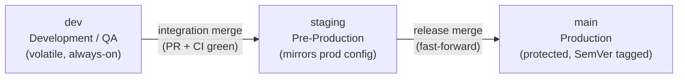
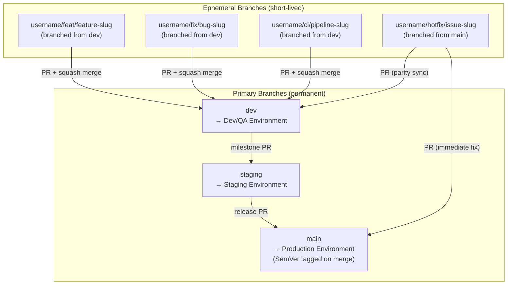
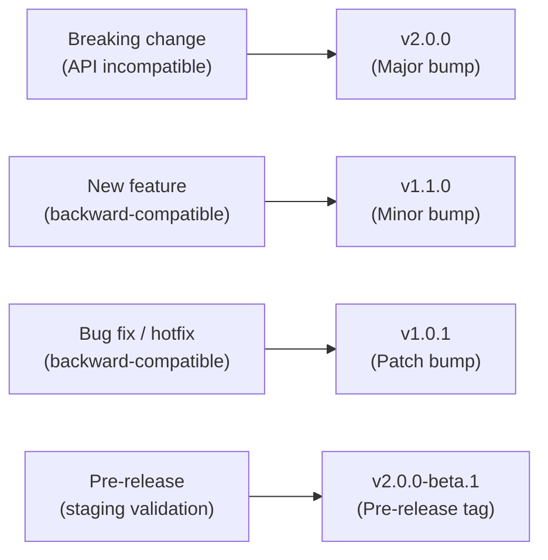

# Git Branching Strategy & Workflow Guide

Establishing a well-organized branching strategy is critical for managing code quality, coordinating team collaboration, and ensuring a predictable, automated deployment pipeline. This document defines the standard branching model, naming conventions, environment mapping, and lifecycle rules across our engineering repositories.

---

## 1. Core Architecture & Primary Branches

The repository structure relies on three permanent primary branches. Each branch represents a distinct state of the codebase and maps directly to an isolated runtime environment.

### 1.1 `main`
* **Purpose:** Represents the official, production-ready source of truth.
* **Stability:** Strict high-availability state; code must be fully tested, signed off, and compliant.
* **Deployment:** Triggers automated deployments directly to the **Production Environment**.
* **Access Policy:** Protected branch. Direct pushes are banned. Merges require explicit Pull Request (PR) approvals and green CI status.

### 1.2 `staging`
* **Purpose:** Acts as a pre-production staging area for final validation, regression testing, and stakeholder reviews.
* **Stability:** Mirrors production configuration, infrastructure, and environmental data as closely as possible.
* **Deployment:** Triggers automated deployments to the **Staging / Pre-Production Environment**.
* **Access Policy:** Protected branch. Code is promoted into `staging` from `dev` once an integration iteration satisfies verification metrics.

### 1.3 `dev`
* **Purpose:** The central integration branch for active development cycle feature aggregation.
* **Stability:** Functional but inherently volatile; reflects the latest completed and peer-reviewed features.
* **Deployment:** Triggers automated, continuous deployments to the **Development / Testing Environment**.
* **Access Policy:** Protected branch. Merges occur via validated PRs from ephemeral development lifecycle branches.

---

## 2. Development Lifecycle Branches (DLC)

Development Lifecycle Branches are short-lived (ephemeral) branches dedicated to specific tasks. They are created from a primary branch, developed locally, and merged back via a formal code review pipeline.

### 2.1 Branch Classification Matrix

| Branch Type | Source Branch | Target Branch | Destination Post-Release | Naming Pattern |
| :--- | :--- | :--- | :--- | :--- |
| **Feature** | `dev` | `dev` | Formally Deleted | `<username>/feat/<feature-slug>` |
| **Fix** | `dev` | `dev` | Formally Deleted | `<username>/fix/<bug-slug>` |
| **Hotfix** | `main` | `main` & `dev` | Formally Deleted | `<username>/hotfix/<issue-slug>` |
| **CI/CD / Infra** | `dev` | `dev` | Formally Deleted | `<username>/ci/<pipeline-slug>` |

### 2.2 Specifications & Nomenclature

All ephemeral branches must adhere to a lowercase, slug-case naming syntax separated by forward slashes (`/`) to optimize indexing and group-filtering across Git interfaces.

#### Feature Branches (`/feat/`)
Used for developing new capabilities, user stories, or functional improvements.
* **Syntax:** `<username>/feat/<feature-description>`
* **Example:** `johndoe/feat/user-login`
* **Example:** `johndoe/feat/add-payment-gateway`

#### Fix Branches (`/fix/`)
Used for standard, non-blocking bug remediation identified in the development or staging lifecycle.
* **Syntax:** `<username>/fix/<bug-description>`
* **Example:** `johndoe/fix/navbar-alignment`
* **Example:** `johndoe/fix/update-profile-photo`

#### Hotfix Branches (`/hotfix/`)
Reserved exclusively for resolving critical, blocking production issues that require immediate patching without waiting for the regular release cycle.
* **Syntax:** `<username>/hotfix/<issue-description>`
* **Example:** `johndoe/hotfix/critical-security-patch`
* **Example:** `johndoe/hotfix/urgent-bug-fix`

#### CI/CD & Infrastructure Branches (`/ci/`)
Used to modify build steps, delivery pipelines, GitHub Actions workflows, Terraform templates, or repository administration tasks.
* **Syntax:** `<username>/ci/<pipeline-description>`
* **Example:** `johndoe/ci/gh-actions-update`
* **Example:** `johndoe/ci/terraform-provider-upgrade`

---

## 3. Git Workflow Lifecycle & Execution Rules

### 3.1 Merging Mechanics

1. **Standard Feature/Fix Pipeline:**
   * Branch out from `dev`.
   * Implement changes, ensuring local linting, unit testing, and validations pass.
   * Open a Pull Request targeting `dev`.
   * Code review completion and CI pipeline confirmation triggers a squash-and-merge into `dev`.
2. **Promotion to Staging:**
   * Periodically, or at milestone completions, a PR is opened to merge `dev` into `staging`.
   * Regression tests run against the staging environment.
3. **Production Release Pipeline:**
   * Upon successful staging verification, `staging` is merged into `main` via a fast-forward or merge commit strategy.
4. **Hotfix Pipeline Exception:**
   * Branch out directly from the affected production commit on `main`.
   * Fix and test the critical issue locally or in an isolated testing environment.
   * Open two matching Pull Requests: one targeting `main` (for immediate deployment) and one targeting `dev` (to maintain parity and prevent code regression).

### 3.2 Automated Tagging & Semantic Versioning

Every merge execution into the `main` branch constitutes a formal release candidate and must be tagged sequentially utilizing **Semantic Versioning (SemVer)** patterns (`vM.m.p`):

* **Major (`v1.0.0`):** Significant, structural modifications containing breaking API shifts.
* **Minor (`v1.1.0`):** Backward-compatible functional introductions or features.
* **Patch (`v1.1.1`):** Backward-compatible production hotfixes or bug remediations.
* **Prerelease (`v1.0.0-beta.1`):** Pre-release checks executed inside the staging boundaries.

### 3.3 Branch Sanitization & Housekeeping
To prevent repository clutter, reduce visual overhead, and simplify maintenance:
* **Local Merges:** Local development branches should be regularly updated with `git fetch --prune`.
* **Remote Deletion:** Configure GitHub/GitLab repository settings to **automatically delete head branches** immediately after a Pull Request is successfully merged.
* **Stale Cleanup:** Any unmerged feature branch without explicit commit activity for more than 30 days is classified as stale and subject to automated deprecation routines.

---

## 4. Protected Branch Policy Checklist

To guarantee infrastructure reliability, the following branch protection settings must be enforced on `main`, `staging`, and `dev`:

- [ ] **Require Pull Request reviews before merging:** Minimum of 1 approvals required.
- [ ] **Require status checks to pass before merging:** All linting, unit testing, and security scanning pipelines must return a success code.
- [ ] **Require conversation resolution:** All review discussions and inline feedback threads must be resolved before merging.
- [ ] **Restrict deletions & force pushes:** Block administrative operations that rewrite git history (`git push --force` or `git push --delete`).