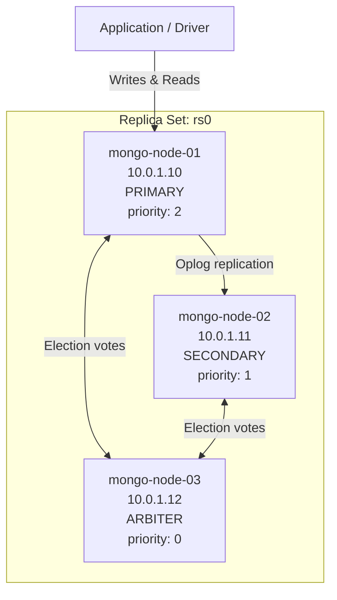
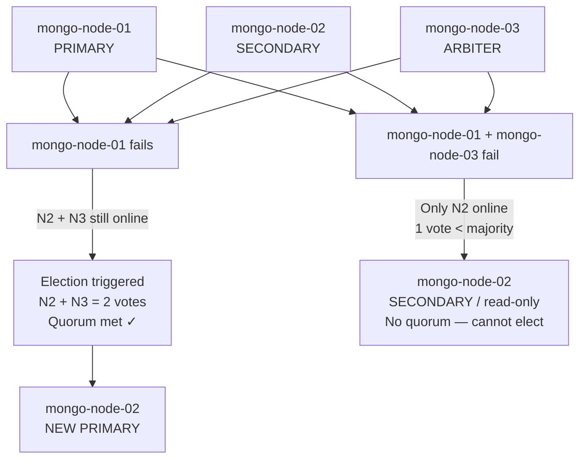

# Setting Up a MongoDB Replica Set

A MongoDB replica set is a cluster of connected `mongod` instances that maintain the same data set. This architecture provides high availability, redundancy, and fault tolerance, making it an essential requirement for production database deployments. In a typical replica set, one node is elected as the **Primary** (handling all write operations), while the remaining nodes act as **Secondaries** (replicating the primary's operations log to maintain data parity) or **Arbiters** (participating purely in elections).

This guide walks through configuring a secure, production-grade 3-node MongoDB replica set from scratch on Linux hosts.

---

## 1. Architectural Strategy & Topology

Our target deployment establishes a resilient 3-node topology utilizing internal network hostname resolution and cryptographically signed internal authentication.

### 1.1 Node Component Matrix

* **Primary Node (`mongo-node-01`):** Serves all application write operations and handles default read traffic.
* **Secondary Node (`mongo-node-02`):** Asynchronously replicates database modifications from the primary node. Can be automatically elected to primary during a failover event.
* **Arbiter Node (`mongo-node-03`):** Does not replicate data or service client requests. It exists purely to break ties during primary elections by providing a voting quorum, minimizing infrastructure compute costs.



---

## 2. Infrastructure Layer: Network & Hostname Setup

MongoDB replica set members must be able to resolve each other's network addresses reliably. Relying on dynamic public IPs is a major anti-pattern; utilize static private cloud IPs coupled with local system hostname records instead.

### Step 1: Assign System Hostnames

Execute the corresponding command on each distinct server instance to permanently register its hostname:

```bash
# Execute on Node 1
sudo hostnamectl set-hostname mongo-node-01

# Execute on Node 2
sudo hostnamectl set-hostname mongo-node-02

# Execute on Node 3
sudo hostnamectl set-hostname mongo-node-03

```

### Step 2: Map the Local Resolution Tables (`/etc/hosts`)

Open the hosts mapping file on **all three nodes** and append your network infrastructure private IP allocation array:

```bash
sudo nano /etc/hosts

```

```text
# MongoDB Replica Set Local Networking Map
10.0.1.10    mongo-node-01
10.0.1.11    mongo-node-02
10.0.1.12    mongo-node-03

```

*Verify connectivity across nodes before proceeding by executing standard `ping -c 3 mongo-node-02` lookups from each host.*

---

## 3. Database Layer Configuration

To enforce internal transit cluster security, nodes must validate each other's identity before joining the replica network space. This is achieved using a shared, cryptographically secure keyfile acting as a baseline internal password.

### Step 1: Generate the Shared Security Keyfile

Execute this sequence on **Node 1** to create a base64 random character block file:

```bash
# Create a secure repository directory path if missing
sudo mkdir -p /etc/mongodb/

# Generate 756 bytes of pseudo-random security data
openssl rand -base64 756 | sudo tee /etc/mongodb/keyfile.txt > /dev/null

# Enforce strict Linux file access permissions (Owner read-only)
sudo chown mongodb:mongodb /etc/mongodb/keyfile.txt
sudo chmod 600 /etc/mongodb/keyfile.txt

```

### Step 2: Distribute the Keyfile Asset

Securely copy the generated `keyfile.txt` binary file from **Node 1** to **Node 2** and **Node 3** using `scp` or an alternate secure orchestration platform.

*⚠️ CRITICAL: Ensure you run `chown 600` permissions updates on Nodes 2 and 3 after transferring the keyfile to prevent the MongoDB daemon process from crashing on startup due to loose file permissions.*

### Step 3: Configure the MongoDB Daemon (`/etc/mongod.conf`)

Apply this production configuration mapping block across **all three hosts**. Ensure you bind network socket interfaces globally (`0.0.0.0`) or explicitly lock down access to the node's local internal private network interfaces.

```yaml
# /etc/mongod.conf

storage:
  dbPath: /var/lib/mongodb
  journal:
    enabled: true

systemLog:
  destination: file
  logAppend: true
  path: /var/log/mongodb/mongod.log

net:
  port: 27017
  bindIp: 0.0.0.0 # Bind to all local interfaces; manage firewalls via security groups

processManagement:
  timeZoneInfo: /usr/share/zoneinfo

security:
  authorization: enabled
  keyFile: /etc/mongodb/keyfile.txt # Enforces internal cluster validation routing

replication:
  replSetName: "rs0" # Defines the uniform replica set namespace string

```

### Step 4: Recycle the System Daemons

Restart the native systemd execution processes on all hosts to initialize the new replication options:

```bash
sudo systemctl restart mongod
sudo systemctl status mongod

```

---

## 4. Replica Set Initialization & Cluster Orchestration

With all database service endpoints actively listening, you can initiate the replica set. Connect to the MongoDB shell instance (`mongosh`) on **Node 1** (`mongo-node-01`) to map the initial topology configuration.

```bash
mongosh --port 27017

```

### Step 1: Execute the Tailored Initialization Array

Run the structured configuration mapping block within the database prompt shell interface. This pattern defines node roles, weights, and voting metrics cleanly from inception:

```javascript
rs.initiate({
  _id: "rs0",
  members: [
    {
      _id: 0,
      host: "mongo-node-01:27017",
      priority: 2, // Highest priority weight forces this node to remain the primary leader
      votes: 1
    },
    {
      _id: 1,
      host: "mongo-node-02:27017",
      priority: 1,
      votes: 1
    },
    {
      _id: 2,
      host: "mongo-node-03:27017",
      arbiterOnly: true, // Configures this node to hold no operational database storage records
      priority: 0,       // Arbiters must always be locked to 0 priority to prevent election attempts
      votes: 1
    }
  ]
})

```

---

## 5. Verification & Post-Deployment Controls

### 5.1 Inspect Cluster Replication Status

To trace structural validation, nodes syncing status, and voting weight metrics, execute this status parser:

```javascript
rs.status()

```

Look for these critical response properties inside the returning payload to confirm health validation:

* `"set" : "rs0"` matches your configuration file values.
* One node is explicitly marked as `"stateStr" : "PRIMARY"`.
* One node is explicitly marked as `"stateStr" : "SECONDARY"`.
* The arbiter host is explicitly matched to `"stateStr" : "ARBITER"`.

### 5.2 Dynamic Reconfiguration Framework

If you need to scale your infrastructure or alter individual priority levels at a later stage, use the `rs.reconfig()` method on the active primary node:

```javascript
// Extract current active cluster configuration mapping into a variable object
let clusterConfig = rs.conf();

// Adjust specific target array parameter parameters safely
clusterConfig.members[1].priority = 1.5;

// Apply re-allocation settings safely
rs.reconfig(clusterConfig);

```

---

## 6. Strategic Engineering Operational Guidelines

1. **Enforce the Election Quorum Law:** A replica set needs a strict majority of voting members online to elect a primary node. If a 3-node set loses two members simultaneously, the remaining node drops down to `SECONDARY` read-only mode automatically to safeguard against data split-brain corruption vectors.


2. **Handle Keyfile Rotations Securely:** When updating or replacing an aging internal keyfile, implement a rolling update strategy across nodes. Since MongoDB accepts older, active keys during transit phases, update your secondary nodes first before bouncing your primary leader instance.
3. **Isolate Your Arbiter Hardware Tier:** While an arbiter node has lightweight resource demands because it doesn't store active database indexes or data, ensure it is deployed on an **entirely separate host compute rack or availability zone** from your primary nodes. This separation guarantees it can accurately report a quorum if a structural network partition cuts your data centers in half.