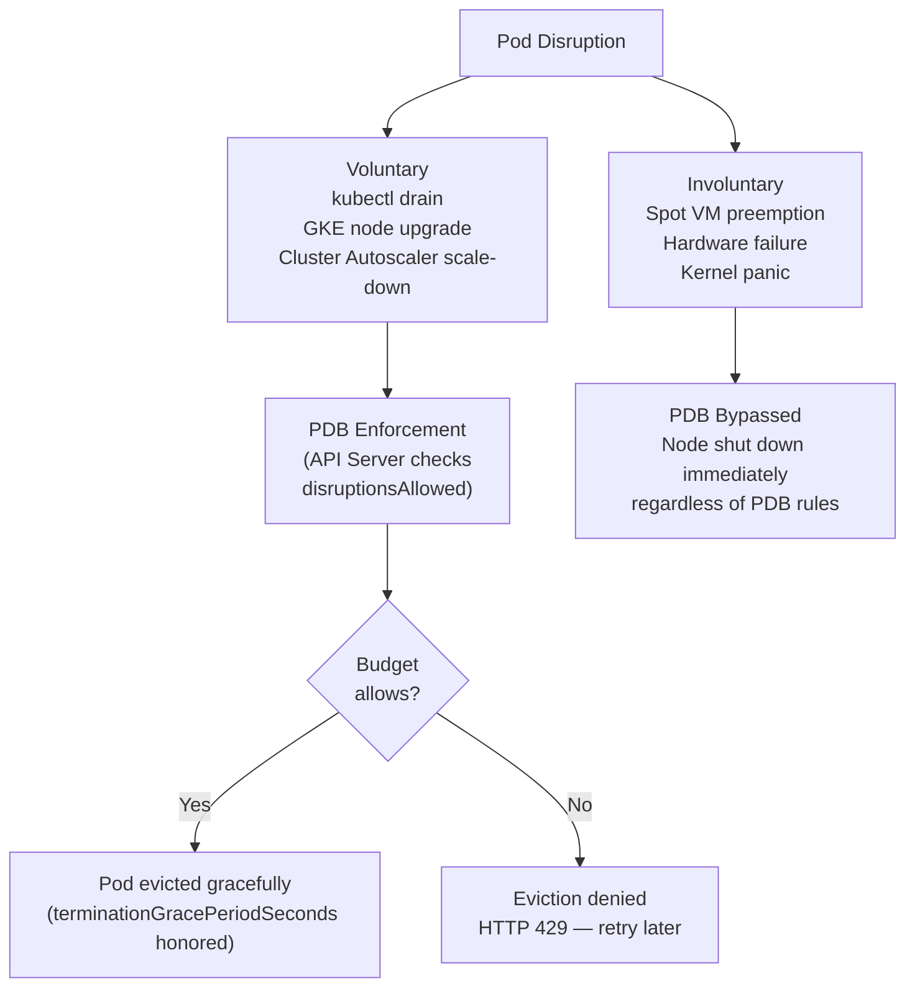
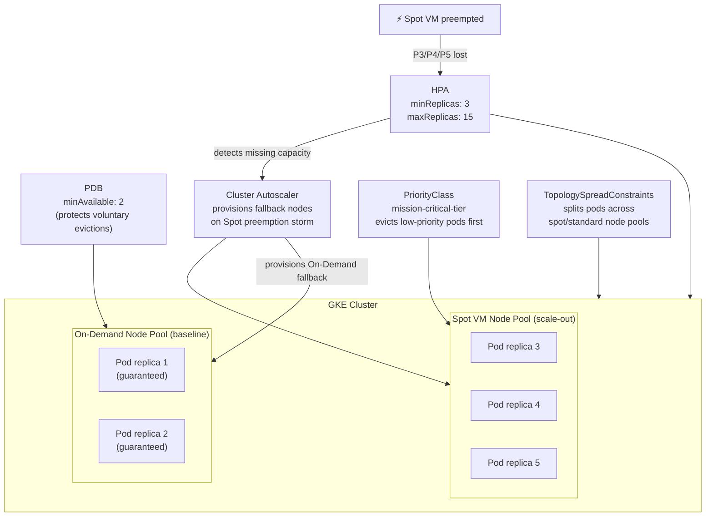

# Best Practices for Using Pod Disruption Budgets in GKE with Spot VMs

Running cloud-native workloads on **Spot VMs** inside Google Kubernetes Engine (GKE) is an exceptionally cost-effective strategy, offering discounts up to 60–91% compared to standard on-demand compute prices. However, Spot VMs introduce a fundamental architectural challenge: **involuntary preemption**. Google can reclaim these compute nodes at any time with a short, 30-second termination notice.

While a **Pod Disruption Budget (PDB)** is a critical tool for maintaining high availability, relying on it blindly within an all-Spot infrastructure is a significant anti-pattern. This guide details the structural limitations of PDBs regarding involuntary evictions and outlines a multi-tiered resilience blueprint for engineering production-grade, highly available GKE clusters using Spot compute layers.

---

## 1. Architectural Strategy: The Disruption Dichotomy

To architect resilient systems, platform engineers must clearly differentiate between the two classes of pod disruptions defined within the Kubernetes control plane.

### 1.1 Voluntary vs. Involuntary Disruptions

| Disruptive Vector | Classification | Examples | Pod Disruption Budget (PDB) Enforcement |
| --- | --- | --- | --- |
| **Voluntary** | Automated or User-Initiated | `kubectl drain`, automated GKE node pool upgrades, cluster autoscaler downscaling, manual pod evictions. | **Strictly Enforced.** The API server blocks eviction requests if they violate the active PDB boundary rules. |
| **Involuntary** | Hardware or Provider-Driven | Google Cloud Spot VM preemption, physical node hardware failure, kernel panics, data center network partitions. | **Bypassed / Not Enforced.** Involuntary terminations override all scheduling logic. The node shuts down regardless of PDB compliance. |



### 1.2 Is PDB Enough?

**No.** A PDB functions purely as an advisory lock for the Kubernetes API control plane during scheduled maintenance window events. When a GKE Spot VM receives a preemption signal from the Google Compute Engine infrastructure layer, the underlying node is forcefully torn down. If 100% of an application's replicas are scheduled on a single Spot node pool that faces mass reclamation, the service will suffer immediate downtime despite any strict `minAvailable` or `maxUnavailable` PDB properties attached to it.

---

## 2. Setting Up a Base Pod Disruption Budget

Even with Spot VMs, a PDB remains necessary to handle *voluntary* actions, such as GKE triggering automated node upgrades or the Cluster Autoscaler optimizing bin-packing nodes.

### 2.1 PDB Schema Declaration (`pod-disruption-budget.yaml`)

```yaml
apiVersion: policy/v1
kind: PodDisruptionBudget
metadata:
  name: order-processing-api-pdb
  namespace: production
  labels:
    app.kubernetes.io/name: order-processing-api
    app.kubernetes.io/instance: order-processing-api-pdb
    app.kubernetes.io/component: availability-policy
    app.kubernetes.io/part-of: e-commerce-platform
    app.kubernetes.io/managed-by: kubectl
spec:
  # Enforces that at least two pods must always remain healthy and accessible
  minAvailable: 2 
  selector:
    matchLabels:
      app: order-processing-api

```

---

## 3. High-Availability Resilience Framework for Spot VMs

To build true zero-downtime tolerance around Spot node infrastructures, implement the following four platform engineering strategies.

### 3.1 Strategy 1: Mixed Node Pool Topology (On-Demand Baselines)

Never let critical production workloads run entirely on Spot instances. Establish a hybrid computing landscape where a steady-state baseline of pods resides on predictable **On-Demand (Standard) VM node pools**, while the dynamic scaling headroom stretches out across cost-optimized **Spot VM node pools**.

Use **Pod Anti-Affinity** and **Topology Spread Constraints** to split your deployment cleanly across these distinct computational environments.

```yaml
apiVersion: apps/v1
kind: Deployment
metadata:
  name: order-processing-api
  namespace: production
spec:
  replicas: 5
  selector:
    matchLabels:
      app: order-processing-api
  template:
    metadata:
      labels:
        app: order-processing-api
    spec:
      # Allow scheduling on Spot nodes by declaring matching tolerations
      tolerations:
        - key: "cloud.google.com/gke-spot"
          operator: "Exists"
          effect: "NoSchedule"
      
      # Topology Spread Constraints ensure pods split across On-Demand and Spot instances
      topologySpreadConstraints:
        - maxSkew: 1
          topologyKey: "cloud.google.com/gke-provisioning" # GKE labels nodes as 'spot' or 'standard'
          whenUnsatisfiable: ScheduleAnyway
          labelSelector:
            matchLabels:
              app: order-processing-api

```

---

### 3.2 Strategy 2: Multi-Dimensional Elasticity (HPA + Cluster Autoscaler)

Pair an aggressive **Horizontal Pod Autoscaler (HPA)** with a well-tuned **GKE Cluster Autoscaler**. If a Spot preemption storm drops nodes offline, the HPA detects the missing traffic processing capacity and immediately triggers new pod allocation scheduling requests, forcing the Cluster Autoscaler to provision fallback compute nodes.

#### Scaler Configurations (`hpa-and-autoscaler.yaml`)

```yaml
apiVersion: autoscaling/v2
kind: HorizontalPodAutoscaler
metadata:
  name: order-processing-api-hpa
  namespace: production
spec:
  scaleTargetRef:
    apiVersion: apps/v1
    kind: Deployment
    name: order-processing-api
  minReplicas: 3
  maxReplicas: 15
  metrics:
    - type: Resource
      resource:
        name: cpu
        target:
          type: Utilization
          averageUtilization: 60

```

* **Best Practice Tip:** When configuring the GKE Cluster Autoscaler on Spot node pools, utilize the `--optimize-utilization` profile or configure **Node Auto-Provisioning (NAP)** to favor diverse machine sizes. Spreading Spot nodes across multiple machine types (e.g., `e2-standard-4` vs. `n2-standard-4`) minimizes the chance of Google reclaiming all your compute resources at once.

---

### 3.3 Strategy 3: Node-Level Failure Isolation (Pod Anti-Affinity)

To protect workloads from single points of failure at the infrastructure layer, prevent multiple replicas of the same application microservice from nesting on the exact same underlying VM host.

```yaml
spec:
  template:
    spec:
      affinity:
        podAntiAffinity:
          # Strongly preferred over 'required' to prevent scheduling lockouts if node capacity tightens
          preferredDuringSchedulingIgnoredDuringExecution:
            - weight: 100
              podAffinityTerm:
                labelSelector:
                  matchExpressions:
                    - key: app
                      operator: In
                      values:
                        - order-processing-api
                topologyKey: "kubernetes.io/hostname" # Restricts co-location on the same machine host

```

---

### 3.4 Strategy 4: Workload Priority Class Tiering

Establish architectural class hierarchies across your container footprint. If Spot VM nodes are suddenly reclaimed and the remaining cluster compute capacity gets tight, low-priority internal tooling pods should be instantly kicked out to make room for critical business-facing checkout systems.

```yaml
apiVersion: scheduling.k8s.io/v1
kind: PriorityClass
metadata:
  name: mission-critical-tier
value: 1000000 # High integer rank ensures scheduling dominance
preemptionPolicy: PreemptLowerPriority
globalDefault: false
description: "Reserved for primary transactional APIs requiring immediate node priority."

```

In your critical deployment manifest, bind the priority ranking directly to the pod execution parameters:

```yaml
spec:
  template:
    spec:
      priorityClassName: mission-critical-tier

```



---

## 4. Post-Deployment Verification & Chaos Testing

To confirm that your hybrid scheduling policies and automated fallback configurations are working as expected under real-world pressure, run a controlled infrastructure simulation.

### 4.1 Simulating Spot Preemption manually via Google Cloud CLI

GKE routes Compute Engine preemption alerts directly to the internal node daemon handlers. You can mimic an unannounced Spot termination event by executing a forced metadata deletion command against a running node instance using the `gcloud` CLI:

```bash
# Force simulate a GKE Spot termination eviction routine
gcloud compute instances simulate-maintenance-event NODE_INSTANCE_NAME \
    --zone=asia-southeast1-a \
    --project=your-gcp-project-id

```

### 4.2 Automated Ingestion Log Auditing

Watch your cluster's central event stream logs to verify that the GKE control plane intercepts the preemption notice cleanly and runs standard termination procedures without dropping incoming user traffic:

```bash
kubectl get events -n production --watch

```

A healthy, resilient response sequence follows this exact trace pattern:

1. `Normal  SpotPreemptionNotice` $\rightarrow$ Node receives the 30-second termination notice from GCP infrastructure.
2. `Normal  Killing`             $\rightarrow$ Pod eviction begins. The pod changes to `Terminating` and is safely unmapped from active load balancer endpoints.
3. `Normal  SuccessfulCreate`    $\rightarrow$ The HPA and scheduler catch the capacity dip and spin up a new replica on a safe, available On-Demand node.

---

## 5. Strategic Operational Guidelines

1. **Graceful Termination Handshakes (`terminationGracePeriodSeconds`):** Spot VMs guarantee a **30-second window** between the preemption notice and the physical machine shutdown. Ensure your application containers handle this elegantly. Set `terminationGracePeriodSeconds: 30` and implement a `preStop` lifecycle hook to drain active network sockets smoothly:
```yaml
lifecycle:
  preStop:
    exec:
      command: ["/bin/sh", "-c", "sleep 15 && nginx -s quit"]

```


2. **Utilize Local SSDs with Caution:** Spot VMs drop ephemeral scratch data instantly upon node reclamation. Never write critical persistence files or long-running processing queues to local host volumes without proper multi-node cluster synchronization rules.
3. **Continuous Compliance Reviews:** Use native GKE metrics or community tools like `kube-score` to run regular automated audits against your production deployments. Confirm that every running microservice maintains a valid PDB, explicitly limits CPU/memory parameters, and uses pod anti-affinity parameters to safeguard against infrastructure-level downtime vectors.