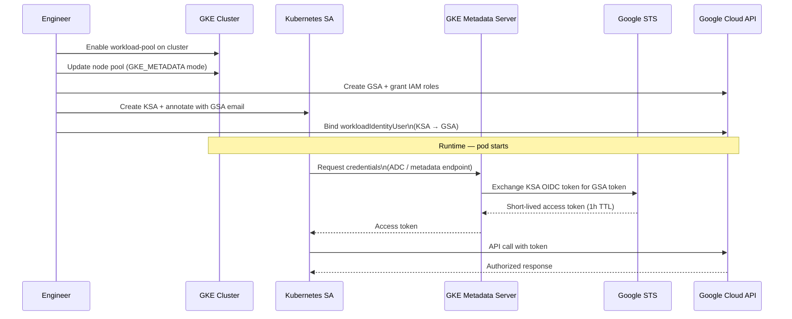
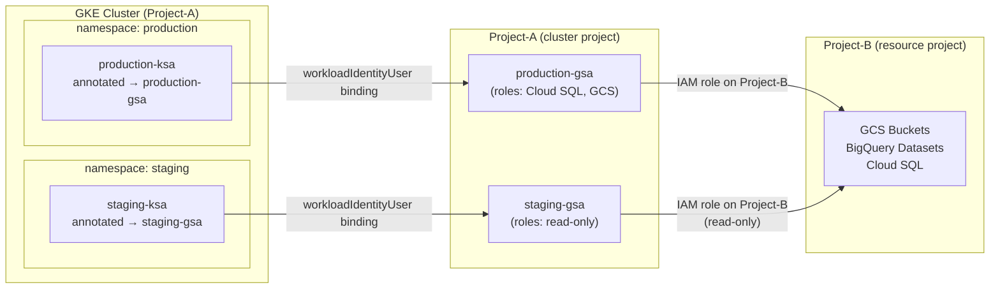

# Migrating from Old Model Service Account to GKE Workload Identity

Workload Identity is the highly secure, native mechanism for applications running on Google Kubernetes Engine (GKE) to interface with Google Cloud services. By enabling Kubernetes Service Accounts (KSAs) to assume the identity of Google Cloud Service Accounts (GSAs), this strategy completely eliminates the operational risk of managing, provisioning, and rotating static JSON private service account keys.

---

## 1. Architectural Strategy Matrix

### 1.1 The Security Evolution
Traditional methods rely on long-lived, highly sensitive JSON key credentials mounted inside containers via Kubernetes Secrets. Workload Identity shifts this lifecycle over to short-lived, dynamically managed OpenID Connect (OIDC) tokens.

| Security Layer | Traditional JSON Key Model | Native Workload Identity Model |
| :--- | :--- | :--- |
| **Credential Storage** | Stored as base64 strings in `v1/Secret` objects | Dynamically issued, non-exportable short-lived tokens |
| **Rotation Operational Overhead** | Manual tracking or custom automated cron script pipelines | Entirely hands-off; automatically rotated by Google |
| **Exfiltration Surface** | Severe risk if keys are leaked via logs, source code, or backups | Zero risk; tokens are tightly bound to the running GKE Pod identity |
| **Audit Traceability** | Difficult to isolate discrete actors sharing a single key | Fully native Cloud Audit Logs with deep resource contextual mapping |
| **Token Validity Window** | Long-lived (valid until explicit deletion or expiration) | Short-lived tokens (automatically regenerated every 1 hour) |

```mermaid
flowchart TD
    subgraph Old["Traditional JSON Key Model"]
        SEC["Kubernetes Secret\n(base64 JSON key)"]
        VOL["Volume mount\n/var/secrets/key.json"]
        APP1["Application"]
        SEC --> VOL --> APP1
        APP1 -->|"static long-lived key"| GCP1["Google Cloud API"]
    end

    subgraph New["Workload Identity Model"]
        KSA["Kubernetes Service Account\n(annotated with GSA)"]
        META["GKE Metadata Server\n(intercepts credentials requests)"]
        OIDC["OIDC Token\n(short-lived, 1h TTL)"]
        APP2["Application\n(uses ADC)"]
        KSA --> META --> OIDC --> APP2
        APP2 -->|"short-lived token"| GCP2["Google Cloud API"]
    end
```



---

## 2. Prerequisites & Operational Requirements

### 2.1 Essential IAM Roles
Your deployment actor identity must possess administrative rights across both GKE and Cloud IAM boundaries:
* `roles/container.admin` (Full administrative cluster control)
* `roles/iam.serviceAccountAdmin` (To create GSAs and structure identity mapping bindings)
* `roles/iam.serviceAccountUser` (To couple identities cleanly)

### 2.2 Core Environment Baseline
* **GKE Configuration:** GKE Version `1.12+` (Version `1.20+` strongly recommended).
* **VPC Footprint:** Cluster must be **VPC-native** with Alias IP allocation explicitly active.
* **Local Binaries:** Validated working installations of `gcloud` and `kubectl`.

---

## 3. Implementation Workflow Pipeline

Execute the following sequential operations to migrate your cluster, namespaces, and workloads to Workload Identity.



### Step 1: Establish Local Shell Workspace Boundaries
Isolate your terminal runtime environment variables before generating infrastructure changes:

```bash
export PROJECT_ID="your-project-id"
export CLUSTER_NAME="your-cluster-name"
export CLUSTER_ZONE="asia-southeast1-a"  # Swap with your primary regional/zonal flag
export NAMESPACE="monitoring"
export KSA_NAME="my-app-ksa"
export GSA_NAME="my-app-gsa"
```

### Step 2: Activate Core API Access Control Points
```bash
gcloud services enable \
    container.googleapis.com \
    iam.googleapis.com \
    iamcredentials.googleapis.com \
    --project=$PROJECT_ID
```

### Step 3: Configure Workload Identity Pool on the Cluster
Enabling this structure links your cluster infrastructure directly to its designated Workload Identity pool (`PROJECT_ID.svc.id.goog`).

#### Option A: Running Updates on Existing GKE Topologies
```bash
gcloud container clusters update $CLUSTER_NAME \
    --zone=$CLUSTER_ZONE \
    --workload-pool=$PROJECT_ID.svc.id.goog \
    --project=$PROJECT_ID
```
*Note: Modifying an operational control plane with this setting will not impact active, currently processing pods until they undergo a lifecycle restart.*

#### Option B: Deploying a Clean Greenfield Cluster
```bash
gcloud container clusters create $CLUSTER_NAME \
    --zone=$CLUSTER_ZONE \
    --workload-pool=$PROJECT_ID.svc.id.goog \
    --project=$PROJECT_ID
```

### Step 4: Provision the Node Pools with Metadata Anchors
For GKE Standard structures, compute nodes must communicate explicitly with the GKE Metadata Server via internal networking paths (`GKE_METADATA`).

```bash
# Update an active node pool structure
gcloud container node-pools update NODE_POOL_NAME \
    --cluster=$CLUSTER_NAME \
    --zone=$CLUSTER_ZONE \
    --workload-metadata=GKE_METADATA \
    --project=$PROJECT_ID
```
*⚠️ WARNING: Updating node pools causes nodes to undergo a rolling recreation cycle. Ensure appropriate pod disruption budgets (PDBs) are applied to mitigate service impacts.*

### Step 5: Provision the Cloud IAM Service Account (GSA)
```bash
gcloud iam service-accounts create $GSA_NAME \
    --display-name="$GSA_NAME for Workload Identity Integration" \
    --project=$PROJECT_ID
```

### Step 6: Map Cloud IAM Permissions to the GSA
Apply granular Cloud IAM roles to the GSA corresponding to your application's required storage, database, or streaming workloads:

```bash
# Pattern Example: Cloud Storage Read Permissions
gcloud projects add-iam-policy-binding $PROJECT_ID \
    --member="serviceAccount:$GSA_NAME@$PROJECT_ID.iam.gserviceaccount.com" \
    --role="roles/storage.objectViewer"

# Pattern Example: Secret Manager Secret Resolution Permissions
gcloud projects add-iam-policy-binding $PROJECT_ID \
    --member="serviceAccount:$GSA_NAME@$PROJECT_ID.iam.gserviceaccount.com" \
    --role="roles/secretmanager.secretAccessor"

# Pattern Example: Cloud SQL Proxy Connectivity Authorization
gcloud projects add-iam-policy-binding $PROJECT_ID \
    --member="serviceAccount:$GSA_NAME@$PROJECT_ID.iam.gserviceaccount.com" \
    --role="roles/cloudsql.client"
```

### Step 7: Define the Native Kubernetes Service Account (KSA)
Ensure the matching target workspace is present inside your cluster context, then provision the native KSA token target.

```bash
kubectl create namespace $NAMESPACE --dry-run=client -o yaml | kubectl apply -f -
kubectl create serviceaccount $KSA_NAME --namespace $NAMESPACE
```

### Step 8: Bind the OIDC Relationship (`workloadIdentityUser`)
This critical operational binding authorises your explicit cluster namespace KSA to assume the administrative context of your Google Cloud GSA.

```bash
gcloud iam service-accounts add-iam-policy-binding \
    $GSA_NAME@$PROJECT_ID.iam.gserviceaccount.com \
    --role="roles/iam.workloadIdentityUser" \
    --member="serviceAccount:$PROJECT_ID.svc.id.goog[$NAMESPACE/$KSA_NAME]" \
    --project=$PROJECT_ID
```

### Step 9: Annotate the Cluster Service Account Asset
Inject the metadata annotation pattern directly into your KSA configuration structure. The GKE control plane monitors this exact pattern string to route token requests.

```bash
kubectl annotate serviceaccount $KSA_NAME \
    --namespace $NAMESPACE \
    iam.gke.io/gcp-service-account=$GSA_NAME@$PROJECT_ID.iam.gserviceaccount.com \
    --overwrite
```

#### Declaration Schema (`service-account.yaml`)
```yaml
apiVersion: v1
kind: ServiceAccount
metadata:
  name: my-app-ksa
  namespace: monitoring
  labels:
    app.kubernetes.io/name: my-app
    app.kubernetes.io/instance: my-app-gke
    app.kubernetes.io/version: "1.0.0"
    app.kubernetes.io/component: identity
    app.kubernetes.io/part-of: my-app
    app.kubernetes.io/managed-by: kubectl
  annotations:
    iam.gke.io/gcp-service-account: my-app-gsa@your-project-id.iam.gserviceaccount.com
```

### Step 10: Ship the Secure Workload Target
Bind the targeted `serviceAccountName` pattern into your deployment container schema definition blocks.

```yaml
apiVersion: apps/v1
kind: Deployment
metadata:
  name: my-app
  namespace: monitoring
  labels:
    app.kubernetes.io/name: my-app
    app.kubernetes.io/instance: my-app-gke
    app.kubernetes.io/version: latest
    app.kubernetes.io/component: application
    app.kubernetes.io/part-of: my-app
    app.kubernetes.io/managed-by: kubectl
spec:
  replicas: 3
  selector:
    matchLabels:
      app.kubernetes.io/name: my-app
      app.kubernetes.io/instance: my-app-gke
  template:
    metadata:
      labels:
        app.kubernetes.io/name: my-app
        app.kubernetes.io/instance: my-app-gke
        app.kubernetes.io/version: latest
        app.kubernetes.io/component: application
        app.kubernetes.io/part-of: my-app
        app.kubernetes.io/managed-by: kubectl
    spec:
      serviceAccountName: my-app-ksa # Direct linkage to the annotated KSA
      containers:
      - name: main-application
        image: gcr.io/your-project-id/my-app:latest
        ports:
        - containerPort: 8080
        resources:
          requests:
            memory: "256Mi"
            cpu: "250m"
          limits:
            memory: "512Mi"
            cpu: "500m"
```

---

## 4. Verification and Validation Controls

### 4.1 Internal Metadata Resolution Verification
Deploy an episodic validation runtime image context directly into your target namespace structure to inspect internal token behavior.

```bash
kubectl run workload-identity-test \
    --namespace=$NAMESPACE \
    --serviceaccount=$KSA_NAME \
    --image=google/cloud-sdk:slim \
    --restart=Never \
    -- sleep infinity

# Wait cleanly for initial scheduling to process
kubectl wait --for=condition=Ready pod/workload-identity-test --namespace=$NAMESPACE --timeout=60s

# Instruct the runtime container to fetch its default resolved metadata profile
kubectl exec -it workload-identity-test --namespace=$NAMESPACE -- \
    curl -H "Metadata-Flavor: Google" http://metadata.google.internal/computeMetadata/v1/instance/service-accounts/default/email
```
* **Expected Output Match:** `$GSA_NAME@$PROJECT_ID.iam.gserviceaccount.com`
* *Clean down testing assets post-run:* `kubectl delete pod workload-identity-test --namespace=$NAMESPACE`

### 4.2 Application Integration Pattern (Python Baseline Client)
When using updated standard Google Cloud SDK Client Libraries, standard Application Default Credentials (ADC) will automatically discover the underlying metadata channel.

```python
from google.cloud import storage
import sys

def verify_runtime_gke_identity():
    try:
        storage_client = storage.Client()
        buckets = list(storage_client.list_buckets())
        print(f"SUCCESS: Identity resolved. Accessible Bucket Count: {len(buckets)}")
        sys.exit(0)
    except Exception as error:
        print(f"FAILURE: Authentication path blocked: {error}", file=sys.stderr)
        sys.exit(1)

if __name__ == "__main__":
    verify_runtime_gke_identity()
```

---

## 5. Architectural Blueprints & Cross-Project Workloads

### 5.1 Multi-Tenant Separation Model

```
[ namespace: production ] ──► production-ksa ──► production-gsa@prod-project
[ namespace: staging    ] ──► staging-ksa    ──► staging-gsa@prod-project
```

Isolate environmental bounds completely at the API layer by pairing specific namespaces with unique, target-bound GSAs to avoid broad permission pollution.



### 5.2 Isolated Cross-Project Resource Mapping Topology
If your core GKE cluster resides within `Project-A` but must access analytical storage boundaries residing inside `Project-B`:
1. Provision the GSA directly inside `Project-A` (The cluster parent anchor).
2. Apply the necessary resource access roles targeting the GSA identifier *from within the management IAM space of `Project-B`*.
3. Execute standard internal linkage operations directly on `Project-A` GKE configurations.

```bash
# Execute within Project-B context to authorize resource utilization
gcloud projects add-iam-policy-binding Project-B-Resources \
    --member="serviceAccount:$GSA_NAME@Project-A-Cluster.iam.gserviceaccount.com" \
    --role="roles/storage.objectViewer"
```

---

## 6. Real-World Troubleshooting & Remediation

### 6.1 Pod Resolves via Node Compute Engine Identity Instead of Workload Bound
* **Symptom:** Run requests against the metadata path return strings like `123456789-compute@developer.gserviceaccount.com`.
* **Root Cause Matrix:** The node pool context was not properly configured with `workload-metadata=GKE_METADATA`, or network security objects are actively block-routing internal local links.
* **Remediation Action:** Verify metadata mode structures using `gcloud container node-pools describe`. Ensure that after toggling values on active pools, target pods are explicitly recycled to update their context.

### 6.2 Recurrent 403 Forbidden Access Failures
* **Symptom:** Log dumps capture explicit authorization blocks from GCP endpoints.
* **Root Cause Matrix:** Typographical mismatch existing between the cluster identifier, namespacing context, and the structure bound on your GSA IAM configuration properties.
* **Remediation Action:** Extract exact data structures via `gcloud iam service-accounts get-iam-policy $GSA_EMAIL`. Ensure the resource identifier exactly follows this exact string mapping format: `serviceAccount:$PROJECT_ID.svc.id.goog[$NAMESPACE/$KSA_NAME]`.

---

## 7. Strategic Engineering Best Practices

1. **Enforce Micro-Identity Isolation:** Adhere to a strict 1-to-1 matching rule between a single microservice deployment, a unique internal KSA, and an explicit exterior GSA boundary.
2. **Implement Structural Fail-safes:** For non-cloud integrated containers, explicitly drop local tokens entirely by modifying your templates with `automountServiceAccountToken: false`.
3. **Automate Repository Cleanups:** Once Workload Identity migration achieves 100% operational footprint across all operational scopes, systematically revoke and delete outstanding static JSON files from Cloud Storage and Kubernetes secret scopes to permanently close old attack vectors.
gke_workload_identity_migration.md
Displaying gke_workload_identity_migration.md.
