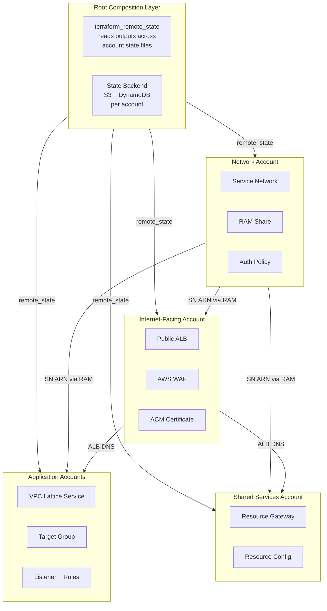
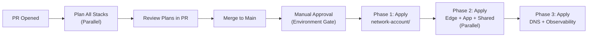

# Terraform Multi-Account Architecture: VPC Lattice Implementation

## Table of Contents

| Section | Topic | Description |
| :---: | :--- | :--- |
| **01** | [Architecture & Terraform Approach](#1-architecture--terraform-approach) | How Terraform maps to the VPC Lattice multi-account pattern — provider model, state isolation, and repo layout. |
| **02** | [Repository Structure](#2-repository-structure) | Native Terraform monorepo layout with best-practice multi-account, multi-region IaC structure. |
| **03** | [Provider Configuration — Multi-Account Pattern](#3-provider-configuration--multi-account-pattern) | Assume role per account root module, OIDC federation for CI/CD, and default_tags strategy. |
| **04** | [Network Account — Service Network Module](#4-network-account--service-network-module) | Service network, auth policy, and RAM share — complete module with variables and outputs. |
| **05** | [Internet-Facing Account — Public Edge Module](#5-internet-facing-account--public-edge-module) | ALB, ACM certificate, target group, and VPC association in a single module. |
| **06** | [Application Account — Services Module](#6-application-account--services-module) | VPC association, VPC Lattice service, target group, listener, and routing rules. |
| **07** | [Shared Services Account — Resource Gateway Module](#7-shared-services-account--resource-gateway-module) | Resource gateway, resource configuration, and service network association. |
| **08** | [DNS Module](#8-dns-module) | Public and private hosted zones, alias and CNAME records for the full DNS path. |
| **09** | [Security — Auth Policies & WAF](#9-security--auth-policies--waf) | IAM auth policies as JSON documents, WAF ACL, and security group rules. |
| **10** | [Observability Module](#10-observability-module) | Access log subscriptions, CloudWatch dashboard, and metric alarms. |
| **11** | [Root Composition — Putting It Together](#11-root-composition--putting-it-together) | Root modules per account with `terraform_remote_state` data sources, backend config, and provider assume-role patterns. |
| **12** | [CI/CD Pipeline Integration](#12-cicd-pipeline-integration) | GitHub Actions workflow with phased apply — Phase 1 network, Phase 2 accounts in parallel, Phase 3 DNS and observability. |

---

## 1. Architecture & Terraform Approach

The VPC Lattice architecture spans four AWS accounts. Each account owns distinct resources that must be provisioned in a specific order due to cross-account dependencies.

### Terraform Deployment Model



### Dependency Order

| Step | Account | Resources | Depends On |
| :---: | :--- | :--- | :--- |
| 1 | **Network** | Service network, auth policy, RAM share | — |
| 2 | **Shared Services** | Resource gateway, resource config | Network SN ARN (RAM) |
| 3 | **Internet-Facing** | ALB, ACM, target group, VPC association | Network SN ARN (RAM) |
| 4 | **Application** | VPC assoc, service, target group, listener | Network SN ARN (RAM) |
| 5 | **Application** | DNS records, WAF attachment, observability | ALB DNS name, service ARNs |

> [!IMPORTANT]
> Steps 2-4 can run in parallel after Step 1 because they depend only on the RAM share being accepted, not on each other. Step 5 requires outputs from both the Edge and Application accounts.

### State Isolation Strategy

| Account | State File | Backend Key Pattern |
| :--- | :--- | :--- |
| Network | S3 + DynamoDB | `network/vpc-lattice/terraform.tfstate` |
| Internet-Facing | S3 + DynamoDB | `internet-facing/vpc-lattice/terraform.tfstate` |
| Application (each) | S3 + DynamoDB | `app-{name}/vpc-lattice/terraform.tfstate` |
| Shared Services | S3 + DynamoDB | `shared-services/vpc-lattice/terraform.tfstate` |

Each account state is completely isolated. Cross-stack outputs (e.g., Network Account produces a service network ARN consumed by Application Accounts) are passed via:

1. **`terraform_remote_state`** — data sources read outputs from other accounts' state files.
2. **SSM Parameter Store / Vault** — outputs published as a side effect of the apply step.

---

## 2. Repository Structure

The repository follows a **monorepo with separate root modules per account**. Each account directory is a standalone Terraform root module with its own backend, provider, and state. Shared modules live under `modules/` and are referenced by account root modules via local `source` paths.

```text
infrastructure/
├── modules/                                # Reusable Terraform modules
│   ├── vpc-lattice-service-network/        # Module 4 — service network + RAM
│   ├── vpc-lattice-public-edge/            # Module 5 — ALB + VPC association
│   ├── vpc-lattice-service/                # Module 6 — per-account services
│   ├── vpc-lattice-resource-gateway/       # Module 7 — TCP resource access
│   ├── vpc-lattice-dns/                    # Module 8 — Route 53 records
│   ├── vpc-lattice-observability/          # Module 9 — logs + dashboards
│   └── waf-alb/                            # Module 10 — WAF ACL
├── network-account/                        # Root module — must apply first
│   ├── main.tf
│   ├── backend.tf
│   ├── providers.tf
│   ├── variables.tf
│   ├── outputs.tf
│   ├── terraform.tfvars
│   └── versions.tf
├── internet-facing/                        # Root module — Phase 2
│   ├── main.tf
│   ├── backend.tf
│   ├── providers.tf
│   ├── variables.tf
│   ├── outputs.tf
│   ├── terraform.tfvars
│   └── versions.tf
├── app-user-service/                       # Root module — Phase 2
│   ├── main.tf
│   ├── backend.tf
│   ├── providers.tf
│   ├── variables.tf
│   ├── outputs.tf
│   ├── terraform.tfvars
│   └── versions.tf
├── app-order-service/                      # Root module — Phase 2
│   └── ... (same structure)
├── shared-services/                        # Root module — Phase 2
│   └── ... (same structure)
├── post-deployment/                        # Root modules — Phase 3
│   ├── dns/
│   └── observability/
├── .github/
│   └── workflows/
│       └── terraform-pipeline.yml
└── Makefile                                # Plan/apply shortcuts per directory
```

Each root module is independently deployable. The apply order is enforced by the CI/CD pipeline:
- **Phase 1**: `network-account/`
- **Phase 2**: `internet-facing/`, `app-user-service/`, `app-order-service/`, `shared-services/` (parallel)
- **Phase 3**: `post-deployment/dns/`, `post-deployment/observability/`

### Cross-Account Output Resolution

When a root module needs outputs from another account's root module, it uses `terraform_remote_state`:

```hcl
# app-user-service/main.tf
data "terraform_remote_state" "network" {
  backend = "s3"
  config = {
    bucket = "terraform-state-${var.organization}"
    key    = "network/vpc-lattice/terraform.tfstate"
    region = var.region
    dynamodb_table = "terraform-state-lock"
  }
}

module "service" {
  source = "../modules/vpc-lattice-service"

  service_network_id = data.terraform_remote_state.network.outputs.service_network_id
  # ... other inputs
}
```

This approach avoids Terragrunt while keeping the same architectural pattern — each account owns its state, outputs flow through remote state data sources, and the pipeline controls apply ordering.

---

## 3. Provider Configuration — Multi-Account Pattern

### OIDC Federation (Recommended)

Each CI job assumes a role in the target account. The provider configuration uses `assume_role` with a session name that identifies the pipeline run.

```hcl
# versions.tf
terraform {
  required_version = "~> 1.9"
  required_providers {
    aws = {
      source  = "hashicorp/aws"
      version = "~> 5.80"
    }
    awscc = {
      source  = "hashicorp/awscc"
      version = "~> 1.20"
    }
  }
}
```

```hcl
# providers.tf — dynamic per account
variable "target_account_id" {
  description = "AWS account ID to provision into"
  type        = string
}

variable "target_region" {
  description = "AWS region to provision into"
  type        = string
  default     = "ap-southeast-1"
}

variable "assume_role_name" {
  description = "IAM role name to assume in target account"
  type        = string
  default     = "TerraformExecutionRole"
}

provider "aws" {
  region = var.target_region
  assume_role {
    role_arn     = "arn:aws:iam::${var.target_account_id}:role/${var.assume_role_name}"
    session_name = "terraform-vpc-lattice-${var.target_region}"
  }
  default_tags {
    tags = {
      Environment = var.environment
      ManagedBy   = "Terraform"
      Project     = "vpc-lattice-multi-account"
    }
  }
}

provider "awscc" {
  region = var.target_region
  assume_role {
    role_arn     = "arn:aws:iam::${var.target_account_id}:role/${var.assume_role_name}"
    session_name = "terraform-vpc-lattice-${var.target_region}"
  }
}
```


---

## 4. Network Account — Service Network Module

This module owns the VPC Lattice service network, its auth policy, and the RAM share that grants access to other accounts.

### Module Interface

```hcl
# modules/vpc-lattice-service-network/variables.tf
variable "service_network_name" {
  description = "Name of the VPC Lattice service network"
  type        = string
}

variable "auth_type" {
  description = "Auth type for the service network (AWS_IAM or NONE)"
  type        = string
  default     = "AWS_IAM"
}

variable "allowed_principals" {
  description = "List of AWS account IDs or IAM principals allowed to access the service network"
  type        = list(string)
}

variable "app_account_ids" {
  description = "Application account IDs for RAM sharing"
  type        = list(string)
}

variable "shared_services_account_id" {
  description = "Shared services account ID for RAM sharing"
  type        = string
}

variable "tags" {
  description = "Tags to apply to all resources"
  type        = map(string)
  default     = {}
}
```

### Module Implementation

```hcl
# modules/vpc-lattice-service-network/main.tf
resource "awscc_vpclattice_service_network" "this" {
  name      = var.service_network_name
  auth_type = var.auth_type
  tags = merge(var.tags, {
    Name = var.service_network_name
  })
}

locals {
  service_network_arn = awscc_vpclattice_service_network.this.arn
}

resource "aws_vpclattice_service_network" "auth_policy" {
  # Attach the auth policy as a separate step to allow updates without
  # recreating the service network
  service_network_identifier = awscc_vpclattice_service_network.this.id
  # The policy is applied via aws_vpclattice_auth_policy resource below
}

resource "aws_vpclattice_auth_policy" "this" {
  resource_identifier = awscc_vpclattice_service_network.this.id
  policy = jsonencode({
    Version = "2012-10-17"
    Statement = [
      {
        Sid    = "AllowCrossAccountAccess"
        Effect = "Allow"
        Principal = {
          AWS = var.allowed_principals
        }
        Action   = "vpc-lattice:*"
        Resource = "*"
        Condition = {
          StringEquals = {
            "vpc-lattice:ServiceNetworkArn" = local.service_network_arn
          }
        }
      }
    ]
  })
}

# AWS RAM Share
resource "awscc_ram_permission" "vpc_lattice" {
  name        = "VpcLatticeServiceNetworkAccess"
  resource_type = "vpc-lattice:ServiceNetwork"
  policy_template = jsonencode({
    "Effect" : "Allow",
    "Action" : ["vpc-lattice:*"],
    "Resource" : "*"
  })
}

resource "aws_ram_resource_share" "this" {
  name                      = "vpc-lattice-service-network-share"
  allow_external_principals = false

  resource_arns = [local.service_network_arn]
}

resource "aws_ram_principal_association" "app_accounts" {
  for_each = toset(var.app_account_ids)

  resource_share_arn = aws_ram_resource_share.this.arn
  principal          = each.value
}

resource "aws_ram_principal_association" "shared_services" {
  resource_share_arn = aws_ram_resource_share.this.arn
  principal          = var.shared_services_account_id
}
```

### Module Outputs

```hcl
# modules/vpc-lattice-service-network/outputs.tf
output "service_network_id" {
  description = "ID of the VPC Lattice service network"
  value       = awscc_vpclattice_service_network.this.id
}

output "service_network_arn" {
  description = "ARN of the VPC Lattice service network"
  value       = local.service_network_arn
}

output "service_network_name" {
  description = "Name of the VPC Lattice service network"
  value       = awscc_vpclattice_service_network.this.name
}
```

---

## 5. Internet-Facing Account — Public Edge Module

This module provisions the public ALB, ACM certificate, and VPC association that connects the Edge VPC to the service network.

### Variables

```hcl
# modules/vpc-lattice-public-edge/variables.tf
variable "service_network_id" {
  description = "ID of the shared VPC Lattice service network"
  type        = string
}

variable "vpc_id" {
  description = "VPC ID in the internet-facing account"
  type        = string
}

variable "public_subnet_ids" {
  description = "Public subnet IDs for the ALB"
  type        = list(string)
}

variable "alb_security_group_id" {
  description = "Security group ID for the ALB"
  type        = string
}

variable "domain_name" {
  description = "Public domain name for the API (e.g., api.example.com)"
  type        = string
}

variable "certificate_arn" {
  description = "ACM certificate ARN for the public domain"
  type        = string
  default     = null # Created by the module if not provided
}

variable "tags" {
  description = "Tags to apply to all resources"
  type        = map(string)
  default     = {}
}
```

### ALB and VPC Association

```hcl
# modules/vpc-lattice-public-edge/main.tf
locals {
  edge_vpc_cidr = data.aws_vpc.this.cidr_block
}

data "aws_vpc" "this" {
  id = var.vpc_id
}

# ACM Certificate (optional — created if not provided)
resource "aws_acm_certificate" "this" {
  count = var.certificate_arn == null ? 1 : 0

  domain_name       = var.domain_name
  validation_method = "DNS"
  tags              = var.tags
}

# Security group for the ALB
resource "aws_security_group" "alb" {
  name        = "${var.domain_name}-alb-sg"
  description = "Security group for public-facing ALB"
  vpc_id      = var.vpc_id

  ingress {
    description = "HTTPS from internet"
    protocol    = "tcp"
    from_port   = 443
    to_port     = 443
    cidr_blocks = ["0.0.0.0/0"]
  }

  ingress {
    description = "HTTP redirect from internet"
    protocol    = "tcp"
    from_port   = 80
    to_port     = 80
    cidr_blocks = ["0.0.0.0/0"]
  }

  egress {
    description = "All outbound traffic"
    protocol    = "-1"
    from_port   = 0
    to_port     = 0
    cidr_blocks = ["0.0.0.0/0"]
  }

  tags = merge(var.tags, { Name = "${var.domain_name}-alb-sg" })
}

# ALB
resource "aws_lb" "this" {
  name               = "${replace(var.domain_name, ".", "-")}-alb"
  internal           = false
  load_balancer_type = "application"
  security_groups    = [aws_security_group.alb.id]
  subnets            = var.public_subnet_ids

  enable_deletion_protection = true
  idle_timeout               = 60

  tags = merge(var.tags, { Name = "${var.domain_name}-alb" })
}

# ALB target group for VPC Lattice
resource "aws_lb_target_group" "vpc_lattice" {
  name        = "${replace(var.domain_name, ".", "-")}-tg"
  port        = 443
  protocol    = "HTTPS"
  target_type = "ip"
  vpc_id      = var.vpc_id

  health_check {
    enabled             = true
    path                = "/health"
    protocol            = "HTTPS"
    port                = "443"
    healthy_threshold   = 2
    unhealthy_threshold = 3
    timeout             = 5
    interval            = 30
  }

  tags = merge(var.tags, { Name = "${var.domain_name}-tg" })
}

# ALB Listener
resource "aws_lb_listener" "https" {
  load_balancer_arn = aws_lb.this.arn
  port              = 443
  protocol          = "HTTPS"
  ssl_policy        = "ELBSecurityPolicy-TLS13-1-2-2021-06"
  certificate_arn   = var.certificate_arn != null ? var.certificate_arn : aws_acm_certificate.this[0].arn

  default_action {
    type             = "forward"
    target_group_arn = aws_lb_target_group.vpc_lattice.arn
  }
}

# HTTP → HTTPS redirect
resource "aws_lb_listener" "http" {
  load_balancer_arn = aws_lb.this.arn
  port              = 80
  protocol          = "HTTP"

  default_action {
    type = "redirect"
    redirect {
      port        = "443"
      protocol    = "HTTPS"
      status_code = "HTTP_301"
    }
  }
}

# VPC Lattice VPC association
resource "aws_vpclattice_service_network_vpc_association" "this" {
  service_network_identifier = var.service_network_id
  vpc_identifier             = var.vpc_id
  security_group_ids         = [aws_security_group.alb.id]

  tags = merge(var.tags, { Name = "${var.domain_name}-sn-assoc" })
}
```

### Security Group for VPC Lattice ENIs

```hcl
# In the Edge account VPC, allow VPC Lattice traffic
resource "aws_security_group_rule" "vpc_lattice_ingress" {
  security_group_id = var.alb_security_group_id
  type              = "ingress"
  description       = "VPC Lattice link-local traffic"
  from_port         = 443
  to_port           = 443
  protocol          = "tcp"
  cidr_blocks       = ["169.254.171.0/24"]
}
```

### Outputs

```hcl
# modules/vpc-lattice-public-edge/outputs.tf
output "alb_arn" {
  description = "ARN of the public ALB"
  value       = aws_lb.this.arn
}

output "alb_dns_name" {
  description = "DNS name of the public ALB"
  value       = aws_lb.this.dns_name
}

output "alb_hosted_zone_id" {
  description = "Route 53 Hosted Zone ID for the ALB"
  value       = aws_lb.this.zone_id
}

output "target_group_arn" {
  description = "ARN of the VPC Lattice target group"
  value       = aws_lb_target_group.vpc_lattice.arn
}

output "vpc_association_id" {
  description = "ID of the VPC Lattice service network VPC association"
  value       = aws_vpclattice_service_network_vpc_association.this.id
}
```

---

## 6. Application Account — Services Module

This module is instantiated per application account. It creates the VPC association, the VPC Lattice service, target groups, listeners, and routing rules.

### Variables

```hcl
# modules/vpc-lattice-service/variables.tf
variable "service_name" {
  description = "Name of the VPC Lattice service"
  type        = string
}

variable "service_network_id" {
  description = "ID of the shared VPC Lattice service network"
  type        = string
}

variable "vpc_id" {
  description = "VPC ID in the application account"
  type        = string
}

variable "subnet_ids" {
  description = "Subnet IDs for VPC Lattice ENIs"
  type        = list(string)
}

variable "vpc_lattice_security_group_id" {
  description = "Security group ID for VPC Lattice ENIs in the app VPC"
  type        = string
}

variable "custom_domain" {
  description = "Custom domain name for the service (e.g., users.internal.example.com)"
  type        = string
  default     = null
}

variable "certificate_arn" {
  description = "ACM certificate ARN for the custom domain"
  type        = string
  default     = null
}

variable "target_type" {
  description = "Target group type (INSTANCE, IP, LAMBDA)"
  type        = string
  default     = "INSTANCE"
}

variable "target_port" {
  description = "Port the targets listen on"
  type        = number
  default     = 8080
}

variable "target_protocol" {
  description = "Protocol for target traffic (HTTP or HTTPS)"
  type        = string
  default     = "HTTP"
}

variable "health_check_path" {
  description = "Health check path"
  type        = string
  default     = "/health"
}

variable "listener_port" {
  description = "Listener port"
  type        = number
  default     = 443
}

variable "listener_protocol" {
  description = "Listener protocol (HTTP, HTTPS, or TLS)"
  type        = string
  default     = "HTTPS"
}

variable "routing_rules" {
  description = "Advanced routing rules for the listener"
  type = list(object({
    name     = string
    priority = number
    match = object({
      path_prefix    = optional(string)
      header_name   = optional(string)
      header_value  = optional(string)
    })
    target_group_id = string
    weight          = optional(number, 100)
  }))
  default = []
}

variable "tags" {
  description = "Tags to apply to all resources"
  type        = map(string)
  default     = {}
}
```

### Service and Target Group

```hcl
# modules/vpc-lattice-service/main.tf
# VPC Association
resource "aws_vpclattice_service_network_vpc_association" "this" {
  service_network_identifier = var.service_network_id
  vpc_identifier             = var.vpc_id
  security_group_ids         = [var.vpc_lattice_security_group_id]

  tags = merge(var.tags, {
    Name = "${var.service_name}-vpc-assoc"
  })
}

# VPC Lattice Service
resource "awscc_vpclattice_service" "this" {
  name = var.service_name

  dynamic "dns_entry" {
    for_each = var.custom_domain != null ? [1] : []
    content {
      domain_name   = var.custom_domain
      certificate_arn = var.certificate_arn
    }
  }

  auth_type = "AWS_IAM"
  tags = merge(var.tags, {
    Name = var.service_name
  })
}

# Target Group
resource "aws_vpclattice_target_group" "this" {
  name = "${var.service_name}-tg"
  type = var.target_type

  config {
    port     = var.target_port
    protocol = var.target_protocol
    vpc_identifier = var.vpc_id

    health_check {
      enabled             = true
      path               = var.health_check_path
      protocol           = var.target_protocol
      port               = var.target_port
      healthy_threshold  = 2
      unhealthy_threshold = 3
      health_check_interval_seconds = 30
      health_check_timeout_seconds  = 5
    }
  }

  tags = merge(var.tags, { Name = "${var.service_name}-tg" })
}

# Default Listener
resource "aws_vpclattice_listener" "default" {
  name     = "${var.service_name}-listener"
  protocol = var.listener_protocol
  port     = var.listener_port
  service_identifier = awscc_vpclattice_service.this.id

  default_action {
    forward {
      target_groups {
        target_group_identifier = aws_vpclattice_target_group.this.id
        weight                  = 100
      }
    }
  }

  tags = merge(var.tags, { Name = "${var.service_name}-listener" })
}

# Advanced Routing Rules
resource "aws_vpclattice_rule" "routing" {
  for_each = { for r in var.routing_rules : r.name => r }

  name                 = each.value.name
  priority             = each.value.priority
  listener_identifier  = aws_vpclattice_listener.default.id
  service_identifier   = awscc_vpclattice_service.this.id

  match {
    http_match {
      dynamic "path_match" {
        for_each = each.value.match.path_prefix != null ? [1] : []
        content {
          match {
            prefix = each.value.match.path_prefix
          }
        }
      }

      dynamic "header_match" {
        for_each = each.value.match.header_name != null ? [1] : []
        content {
          name = each.value.match.header_name
          match {
            exact = each.value.match.header_value
          }
        }
      }
    }
  }

  action {
    forward {
      target_groups {
        target_group_identifier = each.value.target_group_id
        weight                  = each.value.weight
      }
    }
  }
}

# Service Network Association
resource "aws_vpclattice_service_network_service_association" "this" {
  service_network_identifier = var.service_network_id
  service_identifier         = awscc_vpclattice_service.this.id

  tags = merge(var.tags, {
    Name = "${var.service_name}-sn-assoc"
  })
}
```

### Auth Policy for the Service

```hcl
resource "aws_vpclattice_auth_policy" "service" {
  resource_identifier = awscc_vpclattice_service.this.id
  policy = jsonencode({
    Version = "2012-10-17"
    Statement = [
      {
        Sid    = "AllowPublicALBAccess"
        Effect = "Allow"
        Principal = {
          AWS = "arn:aws:iam::${var.edge_account_id}:role/ALBServiceRole"
        }
        Action = "vpc-lattice:Invoke"
        Resource = "*"
        Condition = {
          StringEquals = {
            "vpc-lattice:SourceVpc" = var.edge_vpc_id
          }
        }
      }
    ]
  })
}
```

### Outputs

```hcl
output "service_id" {
  value = awscc_vpclattice_service.this.id
}

output "service_arn" {
  value = awscc_vpclattice_service.this.arn
}

output "service_dns_entry" {
  value = try(awscc_vpclattice_service.this.dns_entry[0].domain_name, null)
}

output "target_group_id" {
  value = aws_vpclattice_target_group.this.id
}

output "listener_id" {
  value = aws_vpclattice_listener.default.id
}
```

---

## 7. Shared Services Account — Resource Gateway Module

This module provisions resource gateways and resource configurations for TCP-based resources like RDS databases.

### Variables

```hcl
# modules/vpc-lattice-resource-gateway/variables.tf
variable "gateway_name" {
  description = "Name of the resource gateway"
  type        = string
}

variable "service_network_id" {
  description = "ID of the shared VPC Lattice service network"
  type        = string
}

variable "vpc_id" {
  description = "VPC ID in the shared services account"
  type        = string
}

variable "subnet_ids" {
  description = "Subnet IDs for the resource gateway"
  type        = list(string)
}

variable "security_group_ids" {
  description = "Security group IDs for the resource gateway"
  type        = list(string)
}

variable "resource_configurations" {
  description = "List of resource configurations to create"
  type = list(object({
    name         = string
    type         = string               # SINGLE, GROUP, ARN
    domain_name  = string               # DNS name of the resource
    port_from    = number
    port_to      = number
    protocol     = string               # TCP
  }))
  default = []
}

variable "tags" {
  type    = map(string)
  default = {}
}
```

### Resource Gateway Implementation

```hcl
# modules/vpc-lattice-resource-gateway/main.tf
resource "aws_vpclattice_resource_gateway" "this" {
  name        = var.gateway_name
  vpc_identifier = var.vpc_id
  subnet_ids  = var.subnet_ids
  security_group_ids = var.security_group_ids
  ip_address_type = "IPV4"

  tags = merge(var.tags, {
    Name = var.gateway_name
  })
}

resource "aws_vpclattice_resource_configuration" "resources" {
  for_each = { for r in var.resource_configurations : r.name => r }

  name                 = each.value.name
  type                 = each.value.type
  resource_gateway_identifier = aws_vpclattice_resource_gateway.this.id

  resource_configuration_definition {
    dns_resource {
      domain_name    = each.value.domain_name
      ip_address_type = "IPV4"
    }
  }

  port_ranges {
    from_port = each.value.port_from
    to_port   = each.value.port_to
  }

  protocol = each.value.protocol

  tags = merge(var.tags, {
    Name = each.value.name
  })
}

resource "aws_vpclattice_service_network_resource_association" "this" {
  for_each = { for r in var.resource_configurations : r.name => r }

  service_network_identifier = var.service_network_id
  resource_configuration_identifier = aws_vpclattice_resource_configuration.resources[each.key].id

  tags = merge(var.tags, {
    Name = "${each.value.name}-sn-assoc"
  })
}
```

---

## 8. DNS Module

### Variables

```hcl
# modules/vpc-lattice-dns/variables.tf
variable "public_domain" {
  description = "Public domain name (e.g., example.com)"
  type        = string
}

variable "api_subdomain" {
  description = "API subdomain (e.g., api)"
  type        = string
  default     = "api"
}

variable "alb_dns_name" {
  description = "DNS name of the public ALB"
  type        = string
}

variable "alb_hosted_zone_id" {
  description = "Route 53 hosted zone ID for the ALB"
  type        = string
}

variable "internal_domain" {
  description = "Internal domain name (e.g., internal.example.com)"
  type        = string
}

variable "app_vpc_ids" {
  description = "VPC IDs that need private DNS resolution"
  type        = list(string)
}

variable "service_dns_records" {
  description = "Map of service name to VPC Lattice DNS name"
  type = map(object({
    service_dns = string
    region      = string
  }))
  default = {}
}

variable "tags" {
  type    = map(string)
  default = {}
}
```

### Implementation

```hcl
# modules/vpc-lattice-dns/main.tf
# Public zone — data source (assumes it already exists)
data "aws_route53_zone" "public" {
  name         = var.public_domain
  private_zone = false
}

resource "aws_route53_record" "api" {
  zone_id = data.aws_route53_zone.public.zone_id
  name    = "${var.api_subdomain}.${var.public_domain}"
  type    = "A"

  alias {
    name                   = var.alb_dns_name
    zone_id                = var.alb_hosted_zone_id
    evaluate_target_health = true
  }
}

# Private hosted zone for internal services
resource "aws_route53_zone" "internal" {
  name          = var.internal_domain
  private_zone  = true

  dynamic "vpc" {
    for_each = var.app_vpc_ids
    content {
      vpc_id     = vpc.value
      vpc_region = data.aws_region.current.name
    }
  }
}

data "aws_region" "current" {}

# CNAME records for each VPC Lattice service
resource "aws_route53_record" "services" {
  for_each = var.service_dns_records

  zone_id = aws_route53_zone.internal.zone_id
  name    = "${each.key}.${var.internal_domain}"
  type    = "CNAME"
  ttl     = 300
  records = [each.value.service_dns]
}
```

---

## 9. Security — Auth Policies & WAF

### WAF Module (associated with the ALB)

```hcl
# modules/waf-alb/main.tf
variable "alb_arn" {
  description = "ARN of the public ALB to associate WAF with"
  type        = string
}

variable "name_prefix" {
  description = "Name prefix for WAF resources"
  type        = string
  default     = "api-waf"
}

resource "aws_wafv2_web_acl" "this" {
  name        = "${var.name_prefix}-acl"
  description = "WAF ACL for public API"
  scope       = "REGIONAL"

  default_action {
    allow {}
  }

  # Rate limiting
  rule {
    name     = "rate-limit"
    priority = 1

    action {
      block {}
    }

    statement {
      rate_based_statement {
        limit              = 5000
        aggregate_key_type = "IP"
      }
    }

    visibility_config {
      cloudwatch_metrics_enabled = true
      metric_name               = "RateLimitRule"
      sampled_requests_enabled  = true
    }
  }

  # AWS managed rules
  rule {
    name     = "aws-managed-common"
    priority = 2

    override_action {
      none {}
    }

    statement {
      managed_rule_group_statement {
        name        = "AWSManagedRulesCommonRuleSet"
        vendor_name = "AWS"
      }
    }

    visibility_config {
      cloudwatch_metrics_enabled = true
      metric_name               = "AWSManagedRulesCommon"
      sampled_requests_enabled  = true
    }
  }

  rule {
    name     = "aws-managed-sqli"
    priority = 3

    override_action {
      none {}
    }

    statement {
      managed_rule_group_statement {
        name        = "AWSManagedRulesSQLiRuleSet"
        vendor_name = "AWS"
      }
    }

    visibility_config {
      cloudwatch_metrics_enabled = true
      metric_name               = "AWSManagedRulesSQLi"
      sampled_requests_enabled  = true
    }
  }

  visibility_config {
    cloudwatch_metrics_enabled = true
    metric_name               = "${var.name_prefix}-waf"
    sampled_requests_enabled  = true
  }

  tags = var.tags
}

resource "aws_wafv2_web_acl_association" "this" {
  resource_arn = var.alb_arn
  web_acl_arn  = aws_wafv2_web_acl.this.arn
}
```

### Security Group Rules Module

```hcl
# modules/vpc-lattice-security-groups/main.tf
variable "alb_security_group_id" {
  description = "Security group ID for the public ALB"
  type        = string
}

variable "vpc_lattice_eni_security_group_id" {
  description = "Security group ID for VPC Lattice ENIs"
  type        = string
}

variable "alb_vpc_cidr" {
  description = "CIDR block of the ALB VPC"
  type        = string
}

# Allow ALB SG to reach VPC Lattice ENIs
resource "aws_security_group_rule" "alb_to_vpc_lattice" {
  security_group_id        = var.vpc_lattice_eni_security_group_id
  type                     = "ingress"
  description              = "Traffic from public ALB"
  from_port                = 443
  to_port                  = 443
  protocol                 = "tcp"
  source_security_group_id = var.alb_security_group_id
}

# Allow VPC Lattice link-local health checks
resource "aws_security_group_rule" "vpc_lattice_link_local" {
  security_group_id = var.vpc_lattice_eni_security_group_id
  type              = "ingress"
  description       = "VPC Lattice link-local health checks"
  from_port         = 443
  to_port           = 443
  protocol          = "tcp"
  cidr_blocks       = ["169.254.171.0/24"]
}
```

---

## 10. Observability Module

```hcl
# modules/vpc-lattice-observability/main.tf
variable "service_network_id" {
  description = "VPC Lattice service network ID"
  type        = string
}

variable "access_logs_bucket" {
  description = "S3 bucket name for access logs"
  type        = string
}

variable "dashboard_name" {
  description = "CloudWatch dashboard name"
  type        = string
  default     = "VpcLattice-Monitoring"
}

variable "alarm_email" {
  description = "Email SNS topic ARN for alarms"
  type        = string
  default     = null
}

# Access log subscription
resource "aws_vpclattice_access_log_subscription" "this" {
  resource_identifier = var.service_network_id
  destination_arn     = "arn:aws:s3:::${var.access_logs_bucket}/service-network/"

  tags = var.tags
}

# SNS topic for alarms
resource "aws_sns_topic" "alarms" {
  count = var.alarm_email != null ? 1 : 0
  name  = "vpc-lattice-alarms"
}

resource "aws_sns_topic_subscription" "email" {
  count     = var.alarm_email != null ? 1 : 0
  topic_arn = aws_sns_topic.alarms[0].arn
  protocol  = "email"
  endpoint  = var.alarm_email
}

# CloudWatch alarms
resource "aws_cloudwatch_metric_alarm" "high_5xx" {
  alarm_name          = "vpc-lattice-high-5xx"
  comparison_operator = "GreaterThanThreshold"
  evaluation_periods  = 2
  metric_name         = "HTTPCode_Target_5XX_Count"
  namespace           = "AWS/VpcLattice"
  period              = 300
  statistic           = "Sum"
  threshold           = 10
  alarm_description   = "High 5XX error rate from VPC Lattice"

  dimensions = {
    ServiceNetworkId = var.service_network_id
  }

  alarm_actions = var.alarm_email != null ? [aws_sns_topic.alarms[0].arn] : []
}

resource "aws_cloudwatch_metric_alarm" "high_latency" {
  alarm_name          = "vpc-lattice-high-latency"
  comparison_operator = "GreaterThanThreshold"
  evaluation_periods  = 2
  metric_name         = "ResponseTime"
  namespace           = "AWS/VpcLattice"
  period              = 300
  statistic           = "p99"
  threshold           = 2000
  alarm_description   = "p99 latency exceeds 2 seconds"

  dimensions = {
    ServiceNetworkId = var.service_network_id
  }

  alarm_actions = var.alarm_email != null ? [aws_sns_topic.alarms[0].arn] : []
}

# CloudWatch dashboard
resource "aws_cloudwatch_dashboard" "this" {
  dashboard_name = var.dashboard_name

  dashboard_body = jsonencode({
    widgets = [
      {
        type = "metric"
        x    = 0
        y    = 0
        width  = 12
        height = 6
        properties = {
          metrics = [
            ["AWS/VpcLattice", "RequestCount", "ServiceNetworkId", var.service_network_id, { stat = "Sum" }]
          ]
          period = 300
          stat   = "Sum"
          region = var.region
          title  = "Request Count"
        }
      },
      {
        type = "metric"
        x    = 12
        y    = 0
        width  = 12
        height = 6
        properties = {
          metrics = [
            ["AWS/VpcLattice", "ResponseTime", "ServiceNetworkId", var.service_network_id, { stat = "p99" }]
          ]
          period = 300
          stat   = "p99"
          region = var.region
          title  = "p99 Response Time"
        }
      }
    ]
  })
}
```

---

## 11. Root Composition — Putting It Together

Each account directory is a standalone Terraform root module. The wiring between accounts happens through `terraform_remote_state` data sources. Apply order is enforced by the CI/CD pipeline (Section 12).

### Network Account Root Module

```hcl
# network-account/main.tf
module "service_network" {
  source = "../modules/vpc-lattice-service-network"

  service_network_name     = "central-service-network"
  auth_type                = "AWS_IAM"
  allowed_principals = [
    "arn:aws:iam::${var.edge_account_id}:root",
    "arn:aws:iam::${var.app_account_1_id}:root",
    "arn:aws:iam::${var.app_account_2_id}:root",
    "arn:aws:iam::${var.shared_services_account_id}:root",
  ]
  app_account_ids           = [var.app_account_1_id, var.app_account_2_id]
  shared_services_account_id = var.shared_services_account_id
  tags                      = var.tags
}
```

```hcl
# network-account/providers.tf
provider "aws" {
  region = var.region
  assume_role {
    role_arn     = "arn:aws:iam::${var.network_account_id}:role/TerraformExecutionRole"
    session_name = "terraform-vpc-lattice-network"
  }
  default_tags {
    tags = {
      Environment = var.environment
      ManagedBy   = "Terraform"
      Project     = "vpc-lattice-multi-account"
    }
  }
}
```

```hcl
# network-account/backend.tf
terraform {
  backend "s3" {
    bucket         = "terraform-state-org"
    key            = "network/vpc-lattice/terraform.tfstate"
    region         = "ap-southeast-1"
    dynamodb_table = "terraform-state-lock"
    encrypt        = true
  }
}
```

```hcl
# network-account/outputs.tf
output "service_network_id" {
  value = module.service_network.service_network_id
}

output "service_network_arn" {
  value = module.service_network.service_network_arn
}
```

### Application Account Root Module

Uses `terraform_remote_state` to read the Network Account's outputs after Phase 1 is complete.

```hcl
# app-user-service/main.tf
data "terraform_remote_state" "network" {
  backend = "s3"
  config = {
    bucket = "terraform-state-org"
    key    = "network/vpc-lattice/terraform.tfstate"
    region = var.region
    dynamodb_table = "terraform-state-lock"
  }
}

module "service" {
  source = "../modules/vpc-lattice-service"

  service_name       = "user-management-service"
  service_network_id = data.terraform_remote_state.network.outputs.service_network_id
  vpc_id             = var.vpc_id
  vpc_lattice_security_group_id = var.vpc_lattice_security_group_id
  custom_domain     = "users.internal.example.com"
  certificate_arn   = var.certificate_arn
  target_type       = "INSTANCE"
  target_port       = 8080
  listener_protocol = "HTTPS"
  tags              = { Service = "UserManagement" }

  routing_rules = [
    {
      name     = "user-api-routing"
      priority = 100
      match = {
        path_prefix = "/api/v1/"
      }
      target_group_id = module.service.target_group_id
      weight          = 100
    }
  ]
}
```

```hcl
# app-user-service/providers.tf
provider "aws" {
  region = var.region
  assume_role {
    role_arn     = "arn:aws:iam::${var.app_account_id}:role/TerraformExecutionRole"
    session_name = "terraform-vpc-lattice-app"
  }
  default_tags {
    tags = {
      Environment = var.environment
      ManagedBy   = "Terraform"
      Project     = "vpc-lattice-multi-account"
    }
  }
}
```

```hcl
# app-user-service/outputs.tf
output "service_id" {
  value = module.service.service_id
}

output "service_dns_entry" {
  value = module.service.service_dns_entry
}

output "target_group_id" {
  value = module.service.target_group_id
}
```

### Internet-Facing Account Root

```hcl
# internet-facing/main.tf
data "terraform_remote_state" "network" {
  backend = "s3"
  config = {
    bucket = "terraform-state-org"
    key    = "network/vpc-lattice/terraform.tfstate"
    region = var.region
    dynamodb_table = "terraform-state-lock"
  }
}

module "edge" {
  source = "../modules/vpc-lattice-public-edge"

  service_network_id = data.terraform_remote_state.network.outputs.service_network_id
  vpc_id             = var.vpc_id
  public_subnet_ids  = var.public_subnet_ids
  domain_name        = "api.example.com"
  certificate_arn    = var.certificate_arn
  tags               = { Tier = "Edge" }
}
```

```hcl
# internet-facing/providers.tf
provider "aws" {
  region = var.region
  assume_role {
    role_arn     = "arn:aws:iam::${var.edge_account_id}:role/TerraformExecutionRole"
    session_name = "terraform-vpc-lattice-edge"
  }
  default_tags {
    tags = {
      Environment = var.environment
      ManagedBy   = "Terraform"
      Project     = "vpc-lattice-multi-account"
    }
  }
}
```

```hcl
# internet-facing/outputs.tf
output "alb_dns_name" {
  value = module.edge.alb_dns_name
}

output "alb_hosted_zone_id" {
  value = module.edge.alb_hosted_zone_id
}
```

### DNS Composition (Phase 3)

The DNS root module reads outputs from both the Edge and Application accounts:

```hcl
# post-deployment/dns/main.tf
data "terraform_remote_state" "edge" {
  backend = "s3"
  config = {
    bucket = "terraform-state-org"
    key    = "internet-facing/vpc-lattice/terraform.tfstate"
    region = var.region
    dynamodb_table = "terraform-state-lock"
  }
}

data "terraform_remote_state" "app_user" {
  backend = "s3"
  config = {
    bucket = "terraform-state-org"
    key    = "app-user-service/vpc-lattice/terraform.tfstate"
    region = var.region
    dynamodb_table = "terraform-state-lock"
  }
}

module "dns" {
  source = "../../modules/vpc-lattice-dns"

  public_domain      = "example.com"
  alb_dns_name       = data.terraform_remote_state.edge.outputs.alb_dns_name
  alb_hosted_zone_id = data.terraform_remote_state.edge.outputs.alb_hosted_zone_id
  internal_domain    = "internal.example.com"
  app_vpc_ids        = var.app_vpc_ids
  service_dns_records = {
    "users" = {
      service_dns = data.terraform_remote_state.app_user.outputs.service_dns_entry
      region      = var.region
    }
  }
  tags = { Layer = "DNS" }
}
```

---

## 12. CI/CD Pipeline Integration

The pipeline operates in three phases. Phase 1 must complete before Phase 2 begins. Phase 2 stacks run in parallel. Phase 3 runs after all Phase 2 stacks complete.

### Workflow Design



### GitHub Actions Workflow

```yaml
# .github/workflows/terraform-pipeline.yml
name: Terraform VPC Lattice Pipeline

on:
  pull_request:
    paths:
      - 'modules/**'
      - 'network-account/**'
      - 'internet-facing/**'
      - 'app-*/**'
      - 'shared-services/**'
      - 'post-deployment/**'
  push:
    branches: [main]
    paths:
      - 'modules/**'
      - 'network-account/**'
      - 'internet-facing/**'
      - 'app-*/**'
      - 'shared-services/**'
      - 'post-deployment/**'

permissions:
  id-token: write
  contents: read
  pull-requests: write

env:
  TF_VERSION: "1.9.5"

jobs:
  plan:
    strategy:
      matrix:
        dir:
          - network-account
          - internet-facing
          - app-user-service
          - app-order-service
          - shared-services
          - post-deployment/dns
          - post-deployment/observability
      fail-fast: false

    runs-on: ubuntu-latest
    steps:
      - uses: actions/checkout@v4

      - name: Setup Terraform
        uses: hashicorp/setup-terraform@v3
        with:
          terraform_version: ${{ env.TF_VERSION }}

      - name: Configure AWS credentials
        uses: aws-actions/configure-aws-credentials@v4
        with:
          role-to-assume: arn:aws:iam::${{ secrets.TERRAFORM_BACKEND_ACCOUNT }}:role/GithubActionsPlanRole
          aws-region: ap-southeast-1

      - name: Terraform Init
        working-directory: ${{ matrix.dir }}
        run: terraform init -no-color

      - name: Terraform Plan
        id: plan
        working-directory: ${{ matrix.dir }}
        run: |
          terraform plan -no-color -out=tfplan.binary 2>&1 | tee plan.txt

      - name: Post Plan to PR
        if: github.event_name == 'pull_request'
        uses: actions/github-script@v7
        with:
          script: |
            const fs = require('fs');
            const plan = fs.readFileSync('${{ matrix.dir }}/plan.txt', 'utf8');
            github.rest.issues.createComment({
              issue_number: context.issue.number,
              owner: context.repo.owner,
              repo: context.repo.repo,
              body: `## Terraform Plan: \`${{ matrix.dir }}\`\n\`\`\`\n${plan.slice(0, 60000)}\n\`\`\``
            });

  apply-phase-1:
    needs: [plan]
    if: github.ref == 'refs/heads/main'
    environment: production
    runs-on: ubuntu-latest
    steps:
      - uses: actions/checkout@v4

      - name: Setup Terraform
        uses: hashicorp/setup-terraform@v3
        with:
          terraform_version: ${{ env.TF_VERSION }}

      - name: Configure AWS credentials
        uses: aws-actions/configure-aws-credentials@v4
        with:
          role-to-assume: arn:aws:iam::${{ secrets.TERRAFORM_BACKEND_ACCOUNT }}:role/GithubActionsApplyRole
          aws-region: ap-southeast-1

      - name: Terraform Init
        working-directory: network-account
        run: terraform init -no-color

      - name: Terraform Apply
        working-directory: network-account
        run: terraform apply -auto-approve tfplan.binary

  apply-phase-2:
    needs: [apply-phase-1]
    if: github.ref == 'refs/heads/main'
    environment: production
    strategy:
      matrix:
        dir:
          - internet-facing
          - app-user-service
          - app-order-service
          - shared-services
      max-parallel: 4
    runs-on: ubuntu-latest
    steps:
      - uses: actions/checkout@v4

      - name: Setup Terraform
        uses: hashicorp/setup-terraform@v3
        with:
          terraform_version: ${{ env.TF_VERSION }}

      - name: Configure AWS credentials
        uses: aws-actions/configure-aws-credentials@v4
        with:
          role-to-assume: arn:aws:iam::${{ secrets.TERRAFORM_BACKEND_ACCOUNT }}:role/GithubActionsApplyRole
          aws-region: ap-southeast-1

      - name: Terraform Init
        working-directory: ${{ matrix.dir }}
        run: terraform init -no-color

      - name: Terraform Apply
        working-directory: ${{ matrix.dir }}
        run: terraform apply -auto-approve tfplan.binary

  apply-phase-3:
    needs: [apply-phase-2]
    if: github.ref == 'refs/heads/main'
    environment: production
    strategy:
      matrix:
        dir:
          - post-deployment/dns
          - post-deployment/observability
      max-parallel: 2
    runs-on: ubuntu-latest
    steps:
      - uses: actions/checkout@v4

      - name: Setup Terraform
        uses: hashicorp/setup-terraform@v3
        with:
          terraform_version: ${{ env.TF_VERSION }}

      - name: Configure AWS credentials
        uses: aws-actions/configure-aws-credentials@v4
        with:
          role-to-assume: arn:aws:iam::${{ secrets.TERRAFORM_BACKEND_ACCOUNT }}:role/GithubActionsApplyRole
          aws-region: ap-southeast-1

      - name: Terraform Init
        working-directory: ${{ matrix.dir }}
        run: terraform init -no-color

      - name: Terraform Apply
        working-directory: ${{ matrix.dir }}
        run: terraform apply -auto-approve tfplan.binary
```

> [!IMPORTANT]
> **Plan-all vs apply-sequential:** Plan all stacks in parallel to give reviewers the full picture. Apply in phases because Network Account (Phase 1) must complete before other accounts (Phase 2) can associate with the service network. DNS and observability (Phase 3) run last since they depend on service DNS entries.

---

### References

- [AWS VPC Lattice Terraform resources](https://registry.terraform.io/providers/hashicorp/aws/latest/docs/resources/vpclattice_service_network)
- [AWSCC VPC Lattice provider](https://registry.terraform.io/providers/hashicorp/awscc/latest/docs/resources/vpclattice_service_network)
- [Terraform OIDC federation with AWS](https://docs.github.com/en/actions/security-for-github-actions/security-hardening-your-deployments/configuring-openid-connect-in-amazon-web-services)
- [AWS RAM Terraform resources](https://registry.terraform.io/providers/hashicorp/aws/latest/docs/resources/ram_resource_share)
- [Terraform remote state data source](https://developer.hashicorp.com/terraform/language/state/remote-state-data)

---

> [!NOTE]
> This guide is the Terraform implementation companion to the [VPC Lattice Multi-Account Architecture Guide](../aws/vpc-lattice-multi-account.md). Read that first for the architecture overview, traffic flows, and design decisions. This guide focuses on the IaC implementation using native Terraform with `terraform_remote_state` for cross-account output resolution.
