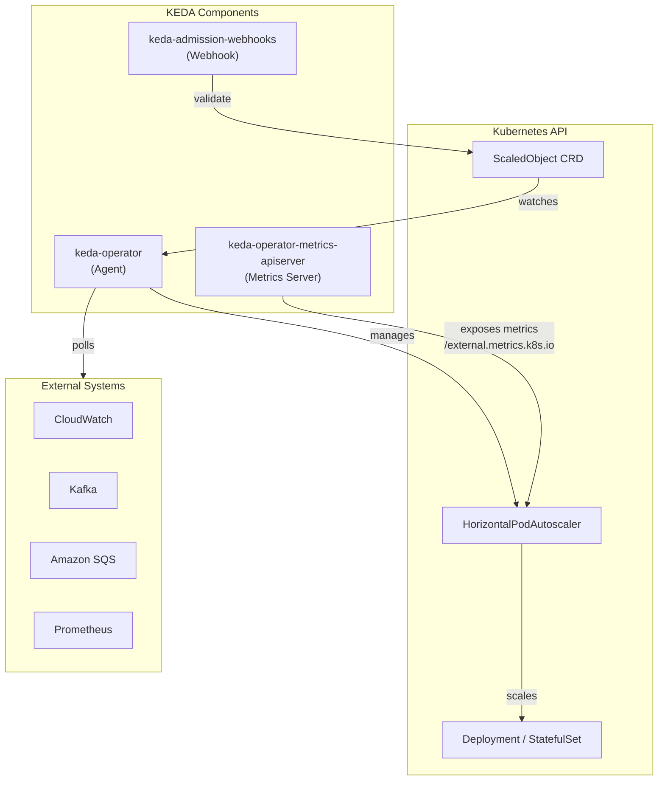

# KEDA — Kubernetes Event-Driven Autoscaling

## Table of Contents

| Section | Topic | Description |
| :---: | :--- | :--- |
| **01** | [Why KEDA Exists](#1-why-keda-exists) | HPA limitations, the gap KEDA fills, and where it fits in the Kubernetes autoscaling landscape. |
| **02** | [Architecture & Components](#2-architecture--components) | Operator, metrics server, admission webhooks — what each does and how they wire together. |
| **03** | [ScaledObject & ScaledJob CRDs](#3-scaledobject--scaledjob-crds) | The primary resource types, their spec structure, and how they map to HPA under the hood. |
| **04** | [TriggerAuthentication & ClusterTriggerAuthentication](#4-triggerauthentication--clustertriggerauthentication) | Auth patterns — IRSA, secret-based, and cross-namespace authentication for scalers. |
| **05** | [Installation on EKS with IRSA](#5-installation-on-eks-with-irsa) | Helm install with IAM roles for service accounts, pod identity configuration, and post-install validation. |
| **06** | [Hands-On: CloudWatch Scaler](#6-hands-on-cloudwatch-scaler) | ScaledObject targeting an ALB-backed deployment using `RequestCountPerTarget` — full YAML, CloudWatch Metrics Insights expression, and dry-run. |
| **07** | [Load Testing & Scaling Behavior](#7-load-testing--scaling-behavior) | Generating traffic with `hey`, watching HPA targets, interpreting scale-up/scale-down patterns, and cooldown periods. |
| **08** | [Scalers Reference](#8-scalers-reference) | Overview of the 60+ built-in scalers — AWS, Prometheus, Kafka, RabbitMQ, CPU/memory fallback, and custom gRPC scalers. |
| **09** | [Production Considerations](#9-production-considerations) | Admission webhook validation, resource requests/limits for KEDA components, monitoring with Prometheus, and multi-tenant isolation. |
| **10** | [Failure Modes & Runbook](#10-failure-modes--runbook) | Scaler authentication failures, missing metrics, HPA conflict, and recovery procedures. |

---

## 1. Why KEDA Exists

The Horizontal Pod Autoscaler (HPA) scales pods based on CPU, memory, or custom metrics exposed through the Kubernetes metrics API. This works well for resource-bound workloads, but a growing class of applications needs to scale based on external events — queue depth, stream lag, request rate, cron schedules, or business-level metrics that live outside Kubernetes entirely.

Kubernetes Event-Driven Autoscaler (KEDA) bridges this gap. It extends the HPA with a vast library of **scalers** — adapters that connect to external systems (AWS CloudWatch, Kafka, RabbitMQ, Prometheus, SQS, etc.) and expose their metrics through the Kubernetes metrics API. The HPA then consumes these metrics to drive scaling decisions.

| Feature | HPA (built-in) | KEDA |
| :--- | :--- | :--- |
| **Metrics source** | CPU, memory, custom metrics API | 60+ external scalers + CPU/memory |
| **Event-driven** | No — requires metrics to be pre-pushed | Yes — polls external sources directly |
| **Scale to zero** | Not supported (min replicas must be >= 1) | Supported via ScaledObject |
| **CRD-based config** | No — HorizontalPodAutoscaler resource | Yes — ScaledObject, ScaledJob |
| **Auth integration** | No native auth for external sources | TriggerAuthentication + IRSA |
| **Scaling speed** | Default 15s — 5m window | Configurable polling interval (default 30s) |

KEDA does **not** replace HPA. It works alongside it — KEDA creates an HPA object and keeps it fed with metrics. The HPA remains the actual scaling engine; KEDA is the data pipeline that fills it with relevant numbers.

---

## 2. Architecture & Components



### keda-operator (Agent)

The operator watches `ScaledObject` and `ScaledJob` resources. When one is created, the operator:

1. Validates the spec and trigger configuration.
2. Creates or updates a corresponding `HorizontalPodAutoscaler` resource.
3. Starts polling the configured external source (e.g., CloudWatch every 30 seconds).
4. Updates the HPA with the current metric value.

### keda-operator-metrics-apiserver (Metrics Server)

This component implements the Kubernetes `external.metrics.k8s.io` API. It serves the metric values that the operator collects from external sources. The HPA queries this endpoint at its configured interval to get the current metric value and compares it against the target value to decide scaling.

This is the component that makes KEDA transparent to the rest of Kubernetes — the HPA does not know (or care) whether the metric came from CloudWatch or a CPU request. It just sees a number.

### keda-admission-webhooks

Validating and mutating webhooks that catch misconfigurations before they create a broken ScaledObject. Common validations:

- Two ScaledObjects targeting the same Deployment (invalid — would create conflicting HPAs).
- Missing `TriggerAuthentication` reference.
- Invalid scaler parameters.

---

## 3. ScaledObject & ScaledJob CRDs

### ScaledObject

`ScaledObject` is the primary resource. It maps an external event source to a Deployment or StatefulSet.

```yaml
apiVersion: keda.sh/v1alpha1
kind: ScaledObject
metadata:
  name: ui-hpa
  namespace: ui
  labels:
    app.kubernetes.io/name: keda-scaledobject
    app.kubernetes.io/instance: ui-hpa-v1
    app.kubernetes.io/version: "1.0.0"
    app.kubernetes.io/component: autoscaler
    app.kubernetes.io/part-of: cloud-storage-pipeline
    app.kubernetes.io/managed-by: kubectl
spec:
  scaleTargetRef:
    apiVersion: apps/v1
    kind: Deployment
    name: ui
  pollingInterval: 30
  cooldownPeriod: 300
  minReplicaCount: 1
  maxReplicaCount: 10
  triggers:
    - type: aws-cloudwatch
      metadata:
        namespace: AWS/ApplicationELB
        expression: |
          SELECT COUNT(RequestCountPerTarget)
          FROM SCHEMA("AWS/ApplicationELB", LoadBalancer, TargetGroup)
          WHERE TargetGroup = '${TARGETGROUP_ID}'
            AND LoadBalancer = '${ALB_ID}'
        metricStat: Sum
        metricStatPeriod: "60"
        targetMetricValue: "100"
        awsRegion: "${AWS_REGION}"
        identityOwner: operator
```

| Field | Description |
| :--- | :--- |
| `scaleTargetRef` | The Deployment/StatefulSet to scale. Must be in the same namespace. |
| `pollingInterval` | How often KEDA polls the external source (seconds, default 30). |
| `cooldownPeriod` | How long after the last metric is received before scaling down (seconds, default 300). |
| `minReplicaCount` | Minimum replicas. Set to `0` for scale-to-zero (must be enabled globally). |
| `maxReplicaCount` | Maximum replicas. |
| `triggers[]` | One or more scaler definitions. Multiple triggers use the max value. |
| `fallback` | Optional. What to do if the scaler cannot reach the external source. |

### ScaledJob

`ScaledJob` is the equivalent for batch workloads — it creates Kubernetes Jobs based on events instead of scaling a long-running Deployment. Each event triggers a new Job.

```yaml
apiVersion: keda.sh/v1alpha1
kind: ScaledJob
metadata:
  name: sqs-job-processor
  namespace: workers
  labels:
    app.kubernetes.io/name: keda-scaledjob
    app.kubernetes.io/instance: sqs-job-processor-v1
    app.kubernetes.io/version: "1.0.0"
    app.kubernetes.io/component: batch-worker
    app.kubernetes.io/part-of: cloud-storage-pipeline
    app.kubernetes.io/managed-by: kubectl
spec:
  jobTargetRef:
    template:
      metadata:
        labels:
          app.kubernetes.io/name: sqs-processor
          app.kubernetes.io/instance: sqs-job-processor-v1
          app.kubernetes.io/version: "1.0.0"
          app.kubernetes.io/component: batch-worker
          app.kubernetes.io/part-of: cloud-storage-pipeline
          app.kubernetes.io/managed-by: kubectl
      spec:
        containers:
          - name: processor
            image: myapp/processor:latest
            command: ["./process-message"]
        restartPolicy: Never
  pollingInterval: 10
  maxScalingJobs: 10
  triggers:
    - type: aws-sqs-queue
      metadata:
        queueUrl: https://sqs.us-east-1.amazonaws.com/12345/my-queue
        queueLength: "5"
        awsRegion: "us-east-1"
      authenticationRef:
        name: keda-trigger-auth-aws
```

### HPA Mapping

When KEDA creates a `ScaledObject`, it generates an HPA that looks like this:

```yaml
apiVersion: autoscaling/v2
kind: HorizontalPodAutoscaler
metadata:
  name: keda-hpa-ui-hpa
  namespace: ui
  labels:
    app.kubernetes.io/name: keda-hpa
    app.kubernetes.io/instance: keda-hpa-ui-hpa-v1
    app.kubernetes.io/version: "1.0.0"
    app.kubernetes.io/component: autoscaler
    app.kubernetes.io/part-of: cloud-storage-pipeline
    app.kubernetes.io/managed-by: kubectl
spec:
  scaleTargetRef:
    apiVersion: apps/v1
    kind: Deployment
    name: ui
  minReplicas: 1
  maxReplicas: 10
  metrics:
    - external:
        metric:
          name: keda-metrics-aws-cloudwatch-ui-hpa
        target:
          averageValue: "100"
          type: AverageValue
      type: External
```

The HPA queries `external.metrics.k8s.io` for `keda-metrics-aws-cloudwatch-ui-hpa`, compares the current value to the target, and scales accordingly. This is standard HPA behavior — the only "KEDA magic" is that the metric value is populated by KEDA's metrics server instead of a custom adapter you would have to build yourself.

---

## 4. TriggerAuthentication & ClusterTriggerAuthentication

External systems require credentials. KEDA supports two auth CRDs:

### TriggerAuthentication (namespace-scoped)

```yaml
apiVersion: keda.sh/v1alpha1
kind: TriggerAuthentication
metadata:
  name: keda-trigger-auth-aws
  namespace: ui
  labels:
    app.kubernetes.io/name: keda-trigger-auth
    app.kubernetes.io/instance: keda-trigger-auth-aws-v1
    app.kubernetes.io/version: "1.0.0"
    app.kubernetes.io/component: auth-config
    app.kubernetes.io/part-of: cloud-storage-pipeline
    app.kubernetes.io/managed-by: kubectl
spec:
  podIdentity:
    provider: aws-eks
```

### ClusterTriggerAuthentication (cluster-wide)

```yaml
apiVersion: keda.sh/v1alpha1
kind: ClusterTriggerAuthentication
metadata:
  name: keda-cluster-auth-aws
  labels:
    app.kubernetes.io/name: keda-cluster-trigger-auth
    app.kubernetes.io/instance: keda-cluster-auth-aws-v1
    app.kubernetes.io/version: "1.0.0"
    app.kubernetes.io/component: auth-config
    app.kubernetes.io/part-of: cloud-storage-pipeline
    app.kubernetes.io/managed-by: kubectl
spec:
  podIdentity:
    provider: aws-eks
```

### Auth Providers

| Provider | Description |
| :--- | :--- |
| `aws-eks` | IRSA — KEDA operator assumes an IAM role via OIDC. |
| `aws` | Long-lived AWS credentials (access key + secret key). |
| `azure` | Azure AD pod identity or workload identity. |
| `gcp` | GCP service account key. |
| `hashi-vault` | HashiCorp Vault integration. |
| `secret` | Generic Kubernetes Secret. |
| `env` | Environment variables on the KEDA operator pod. |

### IRSA Pattern for AWS

The recommended approach on EKS:

```hcl
# Terraform: IAM role for KEDA
resource "aws_iam_role" "keda" {
  name               = "keda-operator-${var.cluster_name}"
  assume_role_policy = data.aws_iam_policy_document.keda_assume.json
}

data "aws_iam_policy_document" "keda_assume" {
  statement {
    actions = ["sts:AssumeRoleWithWebIdentity"]
    condition {
      test     = "StringEquals"
      variable = "${replace(var.oidc_provider_url, "https://", "")}:sub"
      values   = ["system:serviceaccount:keda:keda-operator"]
    }
    principals {
      identifiers = [var.oidc_provider_arn]
      type        = "Federated"
    }
  }
}

# Attach CloudWatch read permissions
resource "aws_iam_role_policy_attachment" "keda_cloudwatch" {
  role       = aws_iam_role.keda.name
  policy_arn = "arn:aws:iam::aws:policy/CloudWatchReadOnlyAccess"
}
```

Then reference the role during Helm install via `podIdentity.aws.irsa.roleArn`.

---

## 5. Installation on EKS with IRSA

### Prerequisites

- EKS cluster with OIDC provider configured.
- Helm 3 installed.
- IAM role created (as shown in Section 4) with `CloudWatchReadOnlyAccess` and any additional permissions needed by your scalers.

### Helm Install

```bash
helm repo add kedacore https://kedacore.github.io/charts
helm repo update

helm upgrade --install keda kedacore/keda \
  --version "${KEDA_CHART_VERSION}" \
  --namespace keda \
  --create-namespace \
  --set "podIdentity.aws.irsa.enabled=true" \
  --set "podIdentity.aws.irsa.roleArn=${KEDA_ROLE_ARN}" \
  --wait
```

### Verify Installation

```bash
kubectl get deployment -n keda

NAME                              READY   UP-TO-DATE   AVAILABLE   AGE
keda-admission-webhooks           1/1     1            1           105s
keda-operator                     1/1     1            1           105s
keda-operator-metrics-apiserver   1/1     1            1           105s
```

```bash
kubectl get crd | grep keda

clustertriggerauthentications.keda.sh  2026-03-16
scaledjobs.keda.sh                     2026-03-16
scaledobjects.keda.sh                  2026-03-16
triggerauthentications.keda.sh         2026-03-16
```

> [!NOTE]
> The `keda-admission-webhooks` deployment is optional but highly recommended for production. Without it, misconfigured ScaledObjects (e.g., duplicate targets) are silently accepted and create conflicting HPAs.

---

## 6. Hands-On: CloudWatch Scaler

This lab walks through scaling a web application based on ALB `RequestCountPerTarget` — a common pattern for event-driven web workloads on EKS.

### 6.1 Gather ALB Information

```bash
export ALB_ARN=$(aws elbv2 describe-load-balancers \
  --query 'LoadBalancers[?contains(LoadBalancerName, `k8s-ui-ui`) == `true`]' \
  | jq -r '.[0].LoadBalancerArn')

export ALB_ID=$(echo $ALB_ARN | awk -F "loadbalancer/" '{print $2}')

export TARGETGROUP_ID=$(aws elbv2 describe-target-groups \
  --load-balancer-arn $ALB_ARN \
  | jq -r '.TargetGroups[0].TargetGroupArn' \
  | awk -F ":" '{print $6}')

export AWS_REGION=$(aws configure get region)
```

### 6.2 Create ScaledObject

```yaml
# scaledobject.yaml
apiVersion: keda.sh/v1alpha1
kind: ScaledObject
metadata:
  name: ui-hpa
  namespace: ui
  labels:
    app.kubernetes.io/name: keda-scaledobject
    app.kubernetes.io/instance: ui-hpa-v1
    app.kubernetes.io/version: "1.0.0"
    app.kubernetes.io/component: autoscaler
    app.kubernetes.io/part-of: cloud-storage-pipeline
    app.kubernetes.io/managed-by: kubectl
spec:
  scaleTargetRef:
    apiVersion: apps/v1
    kind: Deployment
    name: ui
  pollingInterval: 30
  cooldownPeriod: 300
  minReplicaCount: 1
  maxReplicaCount: 10
  triggers:
    - type: aws-cloudwatch
      metadata:
        namespace: AWS/ApplicationELB
        expression: |
          SELECT COUNT(RequestCountPerTarget)
          FROM SCHEMA("AWS/ApplicationELB", LoadBalancer, TargetGroup)
          WHERE TargetGroup = '${TARGETGROUP_ID}'
            AND LoadBalancer = '${ALB_ID}'
        metricStat: Sum
        metricStatPeriod: "60"
        targetMetricValue: "100"
        awsRegion: "${AWS_REGION}"
        identityOwner: operator
```

### 6.3 The CloudWatch Metrics Insights Query

The `expression` field uses CloudWatch Metrics Insights syntax:

```
SELECT COUNT(RequestCountPerTarget)
FROM SCHEMA("AWS/ApplicationELB", LoadBalancer, TargetGroup)
WHERE TargetGroup = '${TARGETGROUP_ID}'
  AND LoadBalancer = '${ALB_ID}'
```

This returns the number of `RequestCountPerTarget` data points in the current period. When this value exceeds `targetMetricValue: 100`, KEDA triggers a scale-out event.

### 6.4 Apply and Validate

```bash
kubectl kustomize scaledobject/ | envsubst | kubectl apply -f -

kubectl get scaledobject -n ui
NAME      SCALETARGETKIND      SCALETARGETNAME   MIN   MAX   READY   ACTIVE   AGE
ui-hpa    apps/v1.Deployment   ui                1     10    True    False    10s

kubectl get hpa -n ui
NAME              REFERENCE       TARGETS       MINPODS   MAXPODS   REPLICAS   AGE
keda-hpa-ui-hpa   Deployment/ui   7/100 (avg)   1         10        1          15s
```

The HPA is created and shows idle traffic (7/100). Scaling will not happen until the metric exceeds the target.

---

## 7. Load Testing & Scaling Behavior

### 7.1 Generate Traffic

Use `hey` to simulate load:

```bash
export ALB_HOSTNAME=$(kubectl get ingress ui -n ui \
  -o jsonpath='{.status.loadBalancer.ingress[0].hostname}')

kubectl run load-generator \
  --image=williamyeh/hey:latest \
  --restart=Never \
  -- -c 3 -q 5 -z 10m http://$ALB_HOSTNAME/home
```

Parameters:

| Flag | Meaning |
| :--- | :--- |
| `-c 3` | 3 concurrent workers |
| `-q 5` | 5 queries/sec per worker |
| `-z 10m` | Run for 10 minutes |

### 7.2 Watch Scaling

```bash
kubectl get hpa keda-hpa-ui-hpa -n ui --watch
```

Output progression:

```
NAME              REFERENCE       TARGETS           MINPODS   MAXPODS   REPLICAS   AGE
keda-hpa-ui-hpa   Deployment/ui   7/100 (avg)       1         10        1          7m58s
keda-hpa-ui-hpa   Deployment/ui   778/100 (avg)      1         10        1          8m33s
keda-hpa-ui-hpa   Deployment/ui   194500m/100 (avg)  1         10        4          8m48s
keda-hpa-ui-hpa   Deployment/ui   97250m/100 (avg)   1         10        8          9m3s
keda-hpa-ui-hpa   Deployment/ui   91500m/100 (avg)   1         10        8          9m33s
keda-hpa-ui-hpa   Deployment/ui   102625m/100 (avg)  1         10        8          10m
keda-hpa-ui-hpa   Deployment/ui   113625m/100 (avg)  1         10        8          11m
keda-hpa-ui-hpa   Deployment/ui   90900m/100 (avg)   1         10        10         11m
```

Key observations:

- **Scale-up is fast.** The first scale event occurs within 30 seconds of the metric crossing the threshold (one polling interval).
- **Scale-up is aggressive.** The HPA scales exponentially — 1 → 4 → 8 → 10 pods within ~3 minutes.
- **Scale-down is slow.** The 300-second cooldown period prevents flapping. Pods stay higher than needed for 5 minutes after load drops.

### 7.3 Clean Up

```bash
kubectl delete pod load-generator
```

The HPA begins scaling down after the cooldown period. Watch with `--watch` to observe the slow descent back to `minReplicaCount: 1`.

### 7.4 Tuning Guidance

| Parameter | Recommendation | Rationale |
| :--- | :--- | :--- |
| `pollingInterval` | 15-30s | Lower for latency-sensitive, higher to reduce API costs. |
| `cooldownPeriod` | 180-300s | Long enough to avoid flapping, short enough to not waste resources. |
| `metricStatPeriod` | Match the HPA `--horizontal-pod-autoscaler-downscale-stabilization` flag. | Aligns the KEDA polling window with the HPA stabilization window. |
| `minReplicaCount` | 1 for web services, higher for latency-critical. | Scale-to-zero only for batch/job workloads. |
| `maxReplicaCount` | Based on cluster capacity + application concurrency limits. | Set a hard upper bound to prevent runaway scaling. |

---

## 8. Scalers Reference

KEDA ships with **60+ built-in scalers**. The most commonly used on AWS:

| Scaler | Source | Key Parameters |
| :--- | :--- | :--- |
| `aws-cloudwatch` | CloudWatch Metrics Insights | `namespace`, `expression`, `targetMetricValue` |
| `aws-sqs-queue` | Amazon SQS | `queueUrl`, `queueLength`, `awsRegion` |
| `aws-kinesis-stream` | Amazon Kinesis | `streamName`, `shardCount`, `activationLatency` |
| `aws-dynamodb-streams` | DynamoDB Streams | `tableName`, `shardCount` |
| `aws-s3` | S3 event notifications (via SQS) | Use SQS scaler with S3 event queue |
| `prometheus` | Any Prometheus endpoint | `serverAddress`, `query`, `threshold` |
| `kafka` | Apache Kafka / MSK | `bootstrapServers`, `topic`, `lagThreshold` |
| `rabbitmq` | RabbitMQ queues | `host`, `queueName`, `queueLength` |
| `cron` | Time-based | `timezone`, `start`, `end`, `desiredReplicas` |
| `cpu` / `memory` | Kubernetes metrics server | Same as standard HPA — useful as fallback |

### Fallback Configuration

If a scaler cannot reach its external source, KEDA can fall back to a predefined value:

```yaml
spec:
  triggers:
    - type: aws-cloudwatch
      # ...
  fallback:
    failureThreshold: 3
    replicas: 5
```

After 3 consecutive polling failures, KEDA sets the replica count to 5 as a safety net until the scaler recovers.

---

## 9. Production Considerations

### Admission Webhooks

Enable webhooks in production to catch:

- **Duplicate ScaledObject targets** — two ScaledObjects cannot target the same Deployment. The webhook rejects the second one.
- **Missing authenticationRef** — if a trigger references a `TriggerAuthentication` that does not exist, the webhook rejects the resource.
- **Invalid scaler parameters** — type names, required fields, and type constraints are validated.

### Resource Requests & Limits

KEDA components should have resource bounds:

```yaml
# keda-operator
resources:
  requests:
    cpu: 200m
    memory: 256Mi
  limits:
    cpu: 500m
    memory: 512Mi

# keda-operator-metrics-apiserver
resources:
  requests:
    cpu: 100m
    memory: 128Mi
  limits:
    cpu: 300m
    memory: 256Mi
```

For clusters with many ScaledObjects (>100), increase the operator memory proportionally.

### Monitoring with Prometheus

KEDA exposes Prometheus metrics at `:8080/metrics` on the operator pod:

| Metric | Description |
| :--- | :--- |
| `keda_scaler_errors_total` | Total scaler polling errors, by scaler type. |
| `keda_scaler_active` | Whether the scaler is currently active (1) or idle (0). |
| `keda_scaler_metrics_value` | The current metric value returned by the scaler. |
| `keda_scaler_polling_duration_seconds` | Histogram of scaler polling latency. |

Import these into a Prometheus/Grafana stack for alerting:

```yaml
# Alert: scaler consistently failing
- alert: KedaScalerFailing
  expr: rate(keda_scaler_errors_total[5m]) > 0
  for: 5m
  labels:
    severity: warning
```

### Multi-Tenant Isolation

In clusters shared by multiple teams:

- Use `TriggerAuthentication` (namespace-scoped) instead of `ClusterTriggerAuthentication` to limit credential scope.
- Set `--scaled-object-max-replicas` on the KEDA operator to cap the maximum replicas any single ScaledObject can request.
- Use `kubectl-kedward` or OPA/Gatekeeper policies to enforce `minReplicaCount >= 1` for production namespaces.

### Scale-to-Zero Considerations

Scale-to-zero (`minReplicaCount: 0`) is useful for event-driven batch workloads but has caveats:

- Cold start latency on the first event (KEDA must create the Deployment from 0 replicas).
- Not supported for all scalers — the scaler must support zero-trigger detection (e.g., SQS queue length > 0).
- Requires setting `--enable-scale-to-zero` on the KEDA operator (disabled by default).

---

## 10. Failure Modes & Runbook

### Scaler Authentication Failure

**Symptom:** ScaledObject shows `Active: False`, HPA shows `unknown` for the external metric.

```
Events:
  Warning  KEDAScalerFailed  ...  error getting metric: AccessDeniedException
```

**Check:** Operator logs for auth errors.

```bash
kubectl logs -n keda deployment/keda-operator | grep -i error
```

**Remedy:**
- Verify IRSA role has the correct trust policy and permissions.
- Confirm `TriggerAuthentication` references the correct `podIdentity.provider`.
- Check the operator's service account annotation: `kubectl get sa -n keda keda-operator -o yaml`.

### Missing Metric

**Symptom:** HPA shows `<unknown>` for the target metric.

```
NAME              REFERENCE       TARGETS              MINPODS   MAXPODS   REPLICAS   AGE
keda-hpa-ui-hpa   Deployment/ui   <unknown>/100 (avg)  1         10        1          5m
```

**Check:** The CloudWatch query returns no data. Verify the ALB ID and target group ID are correct.

```bash
env | grep ALB_ID
env | grep TARGETGROUP_ID
```

**Remedy:** Re-create the ScaledObject with corrected environment variable substitution. Test the CloudWatch query directly:

```bash
aws cloudwatch get-metric-data \
  --metric-data-queries file://query.json
```

### HPA Conflict

**Symptom:** HPA shows erratic behavior, or a second HPA targeting the same Deployment exists.

```
Error: ScaledObject "ui-hpa" is invalid: spec.scaleTargetRef.name:
  Invalid value: "ui": this ScaledObject targets the same Deployment
  as "other-scaled-object"
```

**Cause:** Two ScaledObjects cannot target the same Deployment. The admission webhook should catch this. If it did not (webhooks disabled), delete the duplicate.

**Remedy:**
```bash
kubectl delete scaledobject -n ui other-scaled-object
kubectl delete hpa -n ui keda-hpa-other-scaled-object
```

### HPA Stuck After KEDA Uninstall

**Symptom:** After uninstalling KEDA, the HPA objects remain and show `<unknown>` metrics.

**Remedy:** Delete the orphaned HPAs:

```bash
kubectl delete hpa -n ui --all
```

For production, use `helm uninstall` with a pre-delete hook that cleans up HPA resources, or use `ownerReference` propagation (KEDA 2.14+).

---

> [!NOTE]
> **When to use KEDA:** This pattern excels for event-driven microservices, queue consumers (SQS, Kafka), stream processors (Kinesis), API services with variable traffic patterns, and batch job runners. For steady-state web services with predictable CPU/memory usage, standard HPA is simpler and sufficient.
>
> **When to avoid:** Extremely latency-sensitive workloads (sub-second cold start), environments where adding a CRD-based autoscaler is not permitted, or clusters running at capacity where HPA alone is sufficient.

### References

- [KEDA documentation](https://keda.sh/docs/)
- [KEDA AWS CloudWatch scaler](https://keda.sh/docs/scalers/aws-cloudwatch/)
- [KEDA Helm chart](https://github.com/kedacore/charts)
- [EKS Workshop — KEDA lab](https://eksworkshop.com/docs/fundamentals/workloads/keda/)
- [Kubernetes Horizontal Pod Autoscaler](https://kubernetes.io/docs/tasks/run-application/horizontal-pod-autoscale/)
