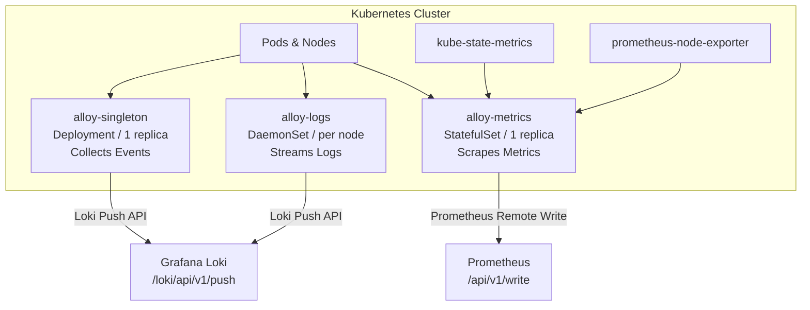
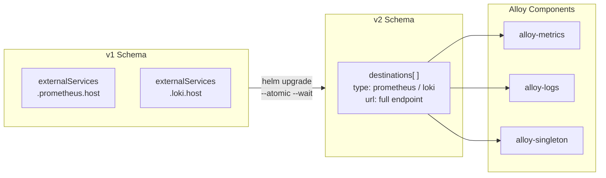

# Implementing and Migrating Grafana Alloy via Helm in Kubernetes

Grafana Alloy is a unified, programmable telemetry collector designed to streamline cloud-native observability by consolidating disparate data collection tools into a single, high-performance solution. It establishes an integrated processing pipeline for metrics, logs, traces, and continuous profiling, supporting native protocols for Prometheus, OpenTelemetry (OTLP), Grafana Loki, and Grafana Pyroscope.

This architectural blueprint covers the complete deployment of the Grafana Kubernetes Monitoring stack using Grafana Alloy, including the structural migration path from legacy version `1.x` definitions to the modernized pipeline specifications.

---

## 1. Architectural Strategy & Components

Deploying the `k8s-monitoring` Helm chart orchestrates a multi-tier agent topology within your cluster to optimize telemetry ingestion while keeping computing overhead low.



### 1.1 Injected Component Matrix
Upon execution, the unified Helm deployment provisions three tailored operational archetypes:
* **`alloy-metrics` (StatefulSet / 1 Replica):** Orchestrates cluster-wide polling mechanisms, scraping targets like `kube-state-metrics` and the Kubernetes API server, before shipping data via Prometheus remote-write endpoints.
* **`alloy-logs` (DaemonSet):** Mounts native node log structures (`/var/log/pods`) across every active cluster node to tail container stdout/stderr streams, pushing telemetry straight to Loki.
* **`alloy-singleton` (Deployment / 1 Replica):** Acts as a centralized listener to capture specialized cluster-wide operational events and routing hooks.

---

## 2. Prerequisites & Pre-Flight Checks

Before provisioning the workloads, ensure your cluster runtime environment complies with the following prerequisites:
* **Cluster Version:** A running Kubernetes cluster (v1.26+ recommended).
* **Package Management:** Helm v3 binary configured and authenticated.
* **Data Sinks:** Accessible endpoints for **Prometheus** (supporting `remote-write`) and **Grafana Loki** (supporting the push API).
* **Namespace Isolation:** A dedicated workspace created for observability components:
  ```bash
  kubectl create namespace monitoring --dry-run=client -o yaml | kubectl apply -f -
  ```

---

## 3. Legacy Deployment: Grafana Alloy v1 Architecture

The early iteration of the Kubernetes monitoring suite focused heavily on mapping explicit service abstractions down into the telemetry collector configuration blocks.

### 3.1 Legacy Configuration (`values-v1.yaml`)
```yaml
cluster:
  name: "production-core-cluster"
  namespace: "monitoring"

externalServices:
  prometheus:
    host: "http://prometheus-server.monitoring.svc.cluster.local:9090"
  loki:
    host: "http://loki-gateway.monitoring.svc.cluster.local:3100"
  
metrics:
  enabled: true
  cost:
    enabled: false
  node-exporter:
    enabled: true

logs:
  enabled: true
  pod_logs:
    enabled: true
  cluster_events:
    enabled: true
  node_events:
    enabled: true

traces:
  enabled: false

opencost:
  enabled: false

# Deploy embedded telemetry exporters
kube-state-metrics:
  enabled: true

prometheus-node-exporter:
  enabled: true

prometheus-operator-crds:
  enabled: true

# Legacy sub-chart references toggled off in favor of Alloy native execution
grafana-agent: {}
grafana-agent-logs: {}
```

### 3.2 Executing the v1 Initialization
```bash
# Register the official Helm charts channel
helm repo add grafana https://grafana.github.io/helm-charts
helm repo update

# Install the v1 constraint release matching your values mapping
helm install grafana-k8s-monitoring grafana/k8s-monitoring \
  --namespace monitoring \
  --version "^1.0.0" \
  --values values-v1.yaml \
  --atomic \
  --debug
```

---

## 4. Migration Guide: Modernized Ingestion Pipelines

The latest major revision of the `k8s-monitoring` chart completely decouples telemetry sources from storage destinations. Destinations are now declared as a collection of reusable pools, matching Grafana Alloy's native pipeline architecture.



### 4.1 Step 1: Analyze the Architecture Changes
* **Unified Destination Array:** `externalServices.prometheus.host` and `externalServices.loki.host` are deprecated. They have been replaced by a clean, array-driven list format under `destinations` where you explicitly provide full API request endpoints (e.g., `/api/v1/write` or `/loki/api/v1/push`).
* **Component-Level Customization:** Rather than abstract booleans, you directly scale the exact Grafana Alloy instances (`alloy-metrics`, `alloy-logs`, and `alloy-singleton`) to match your throughput requirements.

### 4.2 Step 2: Formulate the Modernized Value Map (`values-v2.yaml`)
```yaml
cluster:
  name: "production-core-cluster"

# Modernized Unified Telemetry Endpoints
destinations:
  - name: Prometheus
    type: prometheus
    url: http://prometheus-server.monitoring.svc.cluster.local:9090/api/v1/write
  - name: Loki
    type: loki
    url: http://loki-gateway.monitoring.svc.cluster.local:3100/loki/api/v1/push

# Global Metric & Event Scraping Selectors
clusterMetrics:
  enabled: true

clusterEvents:
  enabled: true
  collector: alloy-logs
  namespaces:
    - "monitoring"
    - "default"
    - "kube-system"

# Container & Node Log Pipeline Definitions
nodeLogs:
  enabled: true

podLogs:
  enabled: true

# Scale Core Component Micro-Architectures Natively
alloy-singleton:
  enabled: true
alloy-metrics:
  enabled: true
alloy-logs:
  enabled: true
alloy-profiles:
  enabled: false
alloy-receiver:
  enabled: false
```

### 4.3 Step 3: Run the Live Production Migration Upgrade
Execute a non-destructive Helm upgrade. Utilizing the `--atomic` flag safeguards your active nodes by automatically rolling back the engine state if the underlying config maps contain un-parseable component paths.

```bash
helm repo update

helm upgrade grafana-k8s-monitoring grafana/k8s-monitoring \
  --namespace monitoring \
  --values values-v2.yaml \
  --atomic \
  --wait \
  --debug
```
---

## 5. Post-Deployment Verification Controls

To confirm that the migrated Grafana Alloy processing components have successfully reconciled, run through the following health and logging validation steps:

### 5.1 Inspect Workload Status Matrix
Verify that your workloads have scaled successfully and initialized their operational footprints across all nodes:
```bash
kubectl get deployments,statefulsets,daemonsets -n monitoring -l app.kubernetes.io/instance=grafana-k8s-monitoring
```

```
NAME                                       READY   UP-TO-DATE   AVAILABLE   AGE
deployment.apps/kube-state-metrics        1/1     1            1           12m
deployment.apps/alloy-singleton           1/1     1            1           2m

NAME                                       READY   AGE
statefulset.apps/alloy-metrics             1/1     2m

NAME                                       DESIRED   CURRENT   READY   AVAILABLE   AGE
daemonset.apps/prometheus-node-exporter   3         3         3       3           12m
daemonset.apps/alloy-logs                  3         3         3       3           2m
```

### 5.2 Validate Runtime Engine Streams
Inspect the active processing streams of the Grafana Alloy components to ensure there are no remote network write authentication failures or downstream API drops:
```bash
# Check metrics engine stream lookups
kubectl logs -n monitoring -l app.kubernetes.io/name=alloy --tail=100
```

A healthy pipeline connection returns clear component validation confirmations without any unresolved stack errors:
```
ts=2025-03-18T12:08:10.142512Z level=info msg="component manager scheduled components" count=14
ts=2025-03-18T12:08:11.025141Z level=info msg="loading configuration complete" duration=842ms
ts=2025-03-18T12:08:12.410214Z level=info msg="remote write client started" component=prometheus.remote_write.targets
```

---

## 6. Strategic Engineering Operational Guidelines

1. **Leverage the `--atomic` Fail-Safe:** When upgrading logging daemons in production cluster spaces, always attach the `--atomic` flag. This enforces an explicit timeout boundary where Helm preserves the old working agent pods if a bad config block crashes the new containers.
2. **Handle Namespace Scrape Whitelisting:** When defining `clusterEvents.namespaces`, ensure you target specific app workspaces. Leaving this parameter unbounded across deep, multi-tenant clusters can flood your Loki backends with noisy, repetitive scheduler updates.
3. **Optimize Cache Bounds on Node Exporters:** For heavy-compute nodes running memory-intensive database engines, ensure that `prometheus-node-exporter` resource requests are explicitly set to survive local out-of-memory (OOM) situations. This ensures your monitoring stack stays online to capture the crash logs if a node runs out of memory.