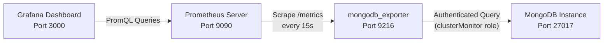
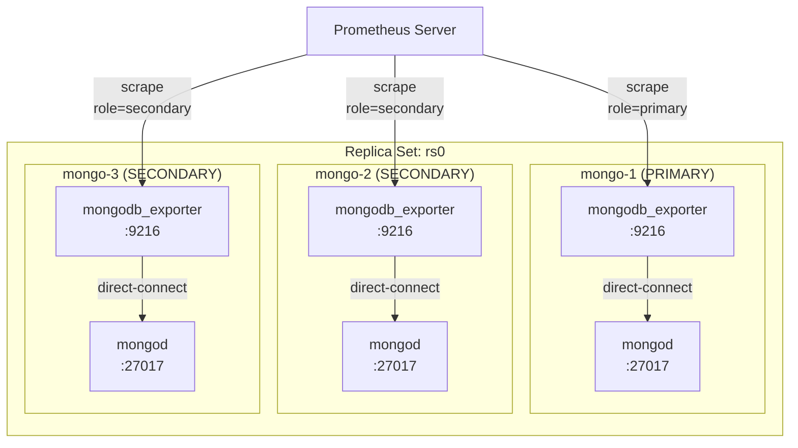

# Monitoring MongoDB with Prometheus and Grafana using mongodb_exporter

Monitoring MongoDB performance is critical for maintaining high availability, detecting replication lag, and keeping resource utilization within safe bounds. The standard approach uses the [Percona mongodb_exporter](https://github.com/percona/mongodb_exporter), which queries MongoDB's diagnostic interfaces and exposes the results as Prometheus-compatible time-series metrics.

This guide covers the complete setup: creating a least-privilege database user, deploying the exporter (Docker or systemd), wiring Prometheus, and importing a Grafana dashboard.

---

## 1. Architecture Overview

The exporter runs as a separate process alongside MongoDB. It authenticates with a read-only monitoring user, polls MongoDB's diagnostic endpoints, and exposes them at `http://<host>:9216/metrics` for Prometheus to scrape.



### 1.1 What Gets Collected

| Category | Metrics |
| :--- | :--- |
| Storage | `dbStats`, `collStats` — document counts, index sizes, data sizes |
| Replication | Replica set state, oplog lag, heartbeat delays, member role changes |
| Connections | Active vs. available connections, connection pool utilization |
| Memory | Resident and virtual memory usage |
| Operations | Lock wait times, operation counters by type |

---

## 2. MongoDB: Least-Privilege Monitoring User

Never run the exporter with a root or `dbOwner` credential. Create a dedicated user with the minimum roles required:

| Role | Database | Purpose |
| :--- | :--- | :--- |
| `clusterMonitor` | `admin` | Read cluster-wide metrics, replica set status, server diagnostics |
| `read` | `local` | Read oplog data for replication lag calculation |

Connect to `mongosh` (or `mongo`) on the primary node and run:

```js
use admin

db.createUser({
  user: "mongodb_exporter",
  pwd: "<strong-password>",
  roles: [
    { role: "clusterMonitor", db: "admin" },
    { role: "read",           db: "local"  }
  ]
})
```

Store the password in a secret manager (Vault, AWS Secrets Manager, Kubernetes Secret) — never hardcode it in a systemd unit file or Docker command.

---

## 3. Deploying the Exporter

### Option A: Docker

Suitable for hosts where Docker is already the runtime.

```bash
docker run -d \
  --name mongodb-exporter \
  --restart unless-stopped \
  -p 9216:9216 \
  percona/mongodb_exporter:0.42.0 \
  --mongodb.uri="mongodb://mongodb_exporter:<password>@127.0.0.1:27017/admin?authSource=admin" \
  --mongodb.direct-connect \
  --collect-all \
  --collector.replicasetstatus \
  --collector.dbstats \
  --collector.topmetrics
```

**Notes:**
- Pin the image tag (`0.42.0`). Avoid `latest` — exporter flag names and metric names change between minor versions.
- `--mongodb.direct-connect` ensures metrics reflect this specific node's state, not the primary's, which is important when deploying an exporter beside each replica set member.

### Option B: Systemd (Bare-Metal / VM)

#### Step 1 — Download and install the binary

```bash
VERSION="0.42.0"
ARCH="linux-amd64"

wget "https://github.com/percona/mongodb_exporter/releases/download/v${VERSION}/mongodb_exporter-${VERSION}.${ARCH}.tar.gz"
tar -xzf "mongodb_exporter-${VERSION}.${ARCH}.tar.gz"
sudo cp "mongodb_exporter-${VERSION}.${ARCH}/mongodb_exporter" /usr/local/bin/
sudo chmod +x /usr/local/bin/mongodb_exporter
```

#### Step 2 — Store credentials securely

Write the connection string to a file owned by the service user so the password is not visible in `ps` output or the systemd unit:

```bash
sudo mkdir -p /etc/mongodb-exporter
echo 'MONGODB_URI="mongodb://mongodb_exporter:<password>@127.0.0.1:27017/admin?authSource=admin"' \
  | sudo tee /etc/mongodb-exporter/env > /dev/null
sudo chmod 600 /etc/mongodb-exporter/env
sudo chown prometheus:prometheus /etc/mongodb-exporter/env
```

#### Step 3 — Create the systemd unit

```ini
# /etc/systemd/system/mongodb_exporter.service
[Unit]
Description=MongoDB Exporter for Prometheus
Documentation=https://github.com/percona/mongodb_exporter
Wants=network-online.target
After=network-online.target

[Service]
User=prometheus
Group=prometheus
Type=simple
EnvironmentFile=/etc/mongodb-exporter/env
ExecStart=/usr/local/bin/mongodb_exporter \
    --mongodb.uri="${MONGODB_URI}" \
    --web.listen-address=":9216" \
    --mongodb.direct-connect \
    --collect-all \
    --collector.replicasetstatus \
    --collector.dbstats \
    --collector.topmetrics \
    --mongodb.connect-timeout-ms=5000
Restart=on-failure
RestartSec=10

# Security hardening
ProtectSystem=strict
PrivateTmp=true
NoNewPrivileges=true
ProtectHome=true

[Install]
WantedBy=multi-user.target
```

Key changes from a naive unit:
- `EnvironmentFile` keeps the password out of the unit file and `ps` output.
- `ProtectSystem=strict`, `PrivateTmp=true`, `NoNewPrivileges=true`, `ProtectHome=true` harden the service against privilege escalation.
- `connect-timeout-ms=5000` is more forgiving for replicas over higher-latency links (the original 200ms will cause spurious failures).

#### Step 4 — Enable and start

```bash
sudo systemctl daemon-reload
sudo systemctl enable --now mongodb_exporter
sudo systemctl status mongodb_exporter

# Verify metrics are being served
curl -s http://localhost:9216/metrics | grep mongodb_up
```

A healthy response returns `mongodb_up 1`.

---

## 4. Prometheus Configuration

Add a scrape job to `prometheus.yml`. Using labels at the target level makes it easy to filter dashboards by environment and tier:

```yaml
scrape_configs:
  - job_name: 'mongodb'
    scrape_interval: 15s
    scrape_timeout: 10s
    static_configs:
      - targets: ['<mongodb-host>:9216']
        labels:
          environment: 'production'
          role: 'primary'          # or 'secondary', 'arbiter'
          cluster: 'rs0'
```

For replica sets, deploy one exporter per member and add one target per member. This is the recommended topology — a single exporter pointed at the replica set URI will only ever collect from whichever member the driver selects:



```yaml
static_configs:
  - targets: ['mongo-1:9216']
    labels:
      environment: 'production'
      role: 'primary'
      cluster: 'rs0'
  - targets: ['mongo-2:9216']
    labels:
      environment: 'production'
      role: 'secondary'
      cluster: 'rs0'
  - targets: ['mongo-3:9216']
    labels:
      environment: 'production'
      role: 'secondary'
      cluster: 'rs0'
```

Reload Prometheus without a full restart:

```bash
curl -X POST http://localhost:9090/-/reload
# or via systemd if hot-reload is not configured
sudo systemctl restart prometheus
```

---

## 5. Grafana Dashboard

1. Open Grafana and go to **Connections → Data Sources**. Confirm the Prometheus data source is reachable.
2. Go to **Dashboards → New → Import**.
3. Enter dashboard ID **16477** (Percona MongoDB Overview, maintained for mongodb_exporter 0.40+) or **2583** (an older community dashboard). Click **Load**.
4. Select your Prometheus data source and click **Import**.

If you need replication lag panels or per-collection stats, dashboard **12079** (MongoDB Exporter — Replication) supplements the overview well.

---

## 6. Alerting Rules

Add these to your Prometheus rules file. They cover the most common MongoDB failure modes:

```yaml
groups:
  - name: mongodb.rules
    rules:
      # MongoDB instance unreachable
      - alert: MongoDBDown
        expr: mongodb_up == 0
        for: 1m
        labels:
          severity: critical
        annotations:
          summary: "MongoDB exporter cannot reach MongoDB on {{ $labels.instance }}"
          description: "mongodb_up == 0 for {{ $labels.instance }}. Check the MongoDB process and exporter connectivity."

      # Replica set member not in PRIMARY or SECONDARY state
      - alert: MongoDBReplicaMemberUnhealthy
        expr: mongodb_rs_members_health == 0
        for: 2m
        labels:
          severity: critical
        annotations:
          summary: "Replica set member unhealthy: {{ $labels.instance }}"
          description: "Member {{ $labels.member_id }} is not in a healthy state. Current state: {{ $labels.state }}."

      # Replication lag exceeding 30 seconds
      - alert: MongoDBReplicationLagHigh
        expr: mongodb_rs_members_optimeDate{member_state="SECONDARY"} - on() mongodb_rs_members_optimeDate{member_state="PRIMARY"} < -30
        for: 5m
        labels:
          severity: warning
        annotations:
          summary: "High replication lag on {{ $labels.instance }}"
          description: "Secondary is {{ $value | abs }}s behind the primary. Investigate network throughput and secondary load."

      # Connection utilization above 80%
      - alert: MongoDBConnectionsHigh
        expr: |
          mongodb_ss_connections{conn_type="current"}
          / mongodb_ss_connections{conn_type="available"}
          * 100 > 80
        for: 5m
        labels:
          severity: warning
        annotations:
          summary: "MongoDB connection utilization above 80% on {{ $labels.instance }}"
          description: "Current connections are at {{ $value | humanize }}% of available capacity."
```

---

## 7. Operational Guidelines

**Deploy one exporter per replica set member**
Do not point a single exporter at the replica set URI with a load balancer or `replicaSet=rs0` in the connection string. The exporter will only ever collect from whichever member the driver selects (usually the primary). Use `--mongodb.direct-connect` and deploy one exporter per node to get per-member metrics for lag, state, and health.

**Pin the image and binary version**
Metric names and available flags change between minor releases of mongodb_exporter. Pin to a specific version in both Docker and systemd deployments and update deliberately with a changelog review.

**Limit `--collect-all` on large deployments**
`--collect-all` enables `collStats` collection across every collection on every database. On deployments with thousands of collections, this increases scrape duration significantly and adds CPU load on the MongoDB node. Start with `--collector.dbstats` and `--collector.replicasetstatus`, then add `--collector.topmetrics` and `--collect-all` only after measuring scrape duration in a staging environment.

**Tune `--mongodb.connect-timeout-ms` for your network**
The default (200ms) is appropriate for localhost connections. For replicas over a WAN link or cloud VPC with higher latency, increase to 3000–5000ms to avoid spurious scrape failures that produce gaps in Grafana panels.

**Rotate the monitoring password regularly**
The `mongodb_exporter` user has `clusterMonitor` — read-only but still access to operational metadata. Rotate the password on a schedule (quarterly at minimum), update the `EnvironmentFile` or Docker secret, and restart the exporter. Use a secrets manager to automate this rather than updating files manually.
