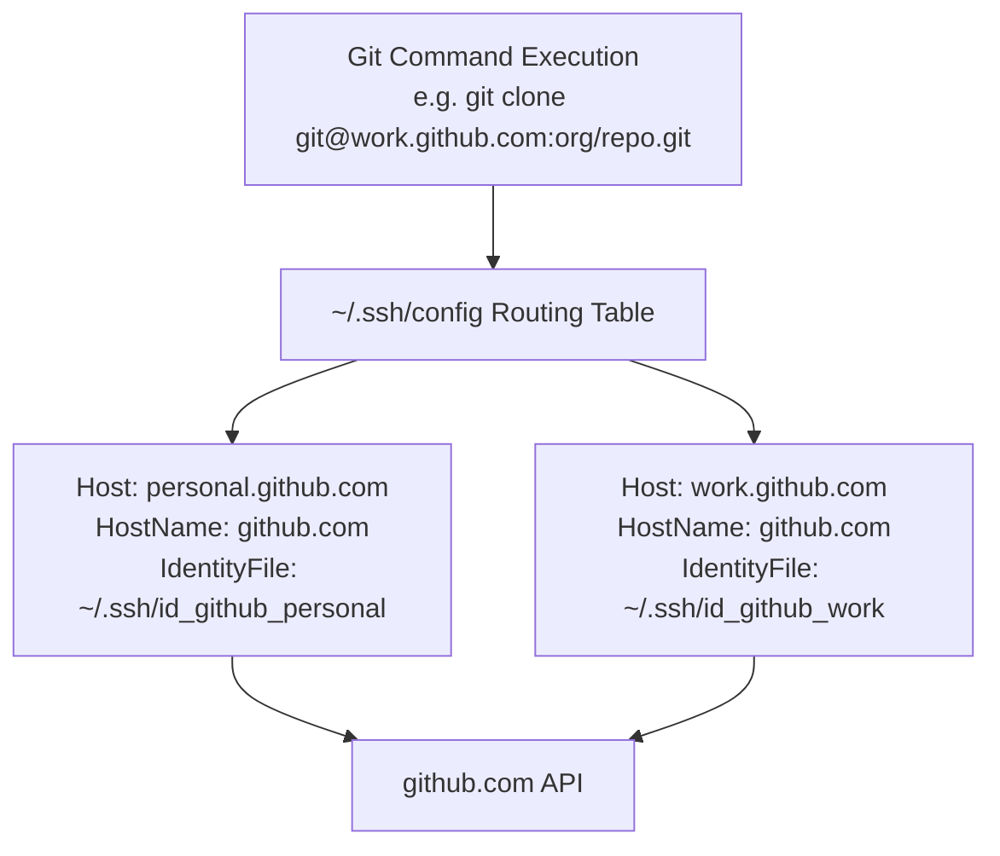

# Setting Up Custom SSH Configurations for Multi-Account GitHub Projects

When managing multiple GitHub identities—such as segregating professional corporate repositories from personal open-source contributions—handling authentication via a single SSH key becomes unviable. GitHub restricts binding a single public SSH key across multiple distinct accounts due to unique identity mapping constraints.

Implementing custom SSH host configurations solves this limitation. By building a local client-side configuration map, you can instruct your terminal to contextually select the correct cryptographic key based on a customized alias hostname, establishing a secure, automated multi-identity developer workflow.

---

## 1. Architectural Strategy & Workflow

Instead of manually swapping active identity files within your ssh-agent context, you can create custom SSH aliases (`personal.github.com` and `work.github.com`). The local SSH configuration engine catches these aliases, maps them back to the standard `github.com` endpoint, and attaches the specified identity asset implicitly during the connection handshake.



### 1.1 Structural Comparison

| Operational Feature | Single SSH Key Approach | Multi-Account Custom Config Model |
| --- | --- | --- |
| **Security Isolation** | Broad; single compromised key compromises all namespaces | High; breach impact is strictly isolated to a single identity boundary |
| **Identity Collision** | Frequent permissions errors (`403 Denied`) on overlapping remotes | Zero collision; explicit routing paths guarantee deterministic access |
| **Commit Log Audit** | Prone to pushing corporate emails to public trees by mistake | Clean; can be tied to conditional local folder Git configs |

---

## 2. Step-by-Step Implementation Framework

### Step 1: Generate Cryptographically Secure SSH Key Pairs

Avoid legacy, weak RSA structures where possible. Utilize modern **Ed25519** signing algorithms, which offer superior performance, smaller file sizing footprints, and robust resistance against cryptographic vulnerability windows.

Execute these commands in your terminal shell to generate isolated keys for your accounts:

```bash
# Generate the personal account identity asset
ssh-keygen -t ed25519 -C "personal_email@example.com" -f ~/.ssh/id_github_personal

# Generate the professional/work account identity asset
ssh-keygen -t ed25519 -C "work_email@company.com" -f ~/.ssh/id_github_work

```

*Note: When prompted, it is strongly recommended to supply a secure passphrase to encrypt the local private key asset at rest.*

---

### Step 2: Establish Background SSH Agent Tracking

Ensure your native background authentication daemon is running, then register your newly generated keys into its active evaluation memory:

```bash
# Launch the SSH agent daemon engine in the background
eval "$(ssh-agent -s)"

# Register the private identities to the agent session context
ssh-add ~/.ssh/id_github_personal
ssh-add ~/.ssh/id_github_work

```

---

### Step 3: Map the Public Keys into the GitHub Accounts

Extract the raw public cryptographic string formatting blocks to your system clipboard:

```bash
# Print personal key string
cat ~/.ssh/id_github_personal.pub

# Print work key string
cat ~/.ssh/id_github_work.pub

```

1. Authenticate into your target GitHub account instance.
2. Navigate parameters through **Settings > SSH and GPG keys > New SSH Key**.
3. Supply a clear, context-specific identifier title (e.g., `MacBook-Pro-Personal-Ed25519`).
4. Paste the terminal output content string directly into the **Key** section field, and click **Add SSH Key**.

---

### Step 4: Construct the Client-Side Routing File (`~/.ssh/config`)

Create or modify your local hidden SSH user configuration schema file using a standard command-line text editor:

```bash
nano ~/.ssh/config

```

Inject the following structured configuration blocks. Ensure you apply real path mappings corresponding to your operating system's platform environment structure:

```text
# --- Personal GitHub Account Configuration ---
Host personal.github.com
  HostName github.com
  User git
  IdentityFile ~/.ssh/id_github_personal
  IdentitiesOnly yes

# --- Professional Work GitHub Account Configuration ---
Host work.github.com
  HostName github.com
  User git
  IdentityFile ~/.ssh/id_github_work
  IdentitiesOnly yes

```

*The critical flag `IdentitiesOnly yes` forces the execution engine to drop generic discovery attempts and exclusively use the precise key matched via the matching pattern.*

Ensure your local file access permissions are strictly clamped down to comply with standard SSH daemon requirements:

```bash
chmod 600 ~/.ssh/config

```

---

## 3. Integrating with Git Repositories

### 3.1 Clones on Greenfield Projects

When cloning down fresh codebases, substitute standard GitHub destination strings with your custom internal configuration host routing aliases:

```bash
# Standard URL: git@github.com:username/personal-repo.git
git clone git@personal.github.com:username/personal-repo.git

# Corporate URL: git@github.com:company-org/enterprise-api.git
git clone git@work.github.com:company-org/enterprise-api.git

```

### 3.2 Adjusting Existing Operational Projects

If you have a repository already tracking on the old default configuration host string, execute a non-destructive runtime reset pointer update against your remote origin array:

```bash
# Navigate to repository directory root
cd /path/to/your/corporate/project

# Re-route the upstream remote origin socket pointer
git remote set-url origin git@work.github.com:company-org/enterprise-api.git

# Verify tracking adjustments match expectations
git remote -v

```

---

## 4. Verification and Pre-Flight Testing

Before shipping commits, validate your client-to-cloud handshakes against the upstream server nodes to ensure proper identity resolution:

```bash
# Test the personal profile endpoint authentication route
ssh -T git@personal.github.com

# Test the professional corporate endpoint authentication route
ssh -T git@work.github.com

```

### Expected Output Match

A successful identity validation check returns a welcoming trace pattern confirming your explicit account namespace handles without providing shell execution terminal blocks:

```text
Hi personal-username! You've successfully authenticated, but GitHub does not provide shell access.
Hi work-org-employee-name! You've successfully authenticated, but GitHub does not provide shell access.

```

---

## 5. Strategic Engineering Operational Guidelines

1. **Automate User Profiles via Git Includes:** To ensure you don't commit code into corporate trees under your personal email address (or vice-versa), update your global `~/.gitconfig` schema using a directional `includeIf` layout pattern:
```ini
# Global configuration fallback parameters
[user]
  name = John Doe
  email = personal_email@example.com

# Conditional inclusion block based on file directory locations
[includeIf "gitdir:~/development/corporate/"]
  path = ~/.gitconfig-work

```


Inside `~/development/corporate/.gitconfig-work`, place your secondary institutional settings block:
```ini
[user]
  email = work_email@company.com

```


2. **Audit SSH Keys Regularly:** Implement a periodic rotation policy for your local keys. In corporate environments, prioritize storing private files inside managed security modules or physical hardware tokens (e.g., FIDO2 security keys) to lock down critical platform workspaces.
3. **Handle Permissions Mismatch Errors:** If your terminal triggers an error stating `Permissions 0644 for ~/.ssh/id_github_personal are too open`, verify that you drop broad read hooks across your localized folder layouts by tracking strict owner-locked rules (`chmod 600 ~/.ssh/id_github_*`).