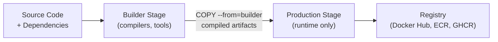

# Docker Multi-stage Builds for 6 Languages

Multi-stage builds separate the build environment from the final runtime image, dramatically reducing image size and attack surface. Instead of shipping a 1GB+ image with compilers, build tools, and source code, you build in a heavy "builder" stage and copy only the compiled artifacts into a minimal "production" stage.

---

## 1. Why Multi-stage Builds

| Without Multi-stage | With Multi-stage |
|---------------------|------------------|
| Build tools shipped in production image | Only runtime binaries in production |
| Large image size (500MB–2GB+) | Minimal image size (10–150MB) |
| Larger attack surface | Reduced attack surface |
| Source code potentially exposed | Only compiled artifacts |
| Slow CI/CD pulls | Fast image pulls |



---

## 2. General Pattern

Every multi-stage Dockerfile follows the same structure:

```dockerfile
# Stage 1: Build
FROM <build_image> AS builder
WORKDIR /app
COPY dependency_files .
RUN install_dependencies
COPY . .
RUN build_command

# Stage 2: Production
FROM <runtime_image> AS production
WORKDIR /app
COPY --from=builder /app/build_output .
EXPOSE <port>
CMD ["run_command"]
```

---

## 3. Go

Go compiles to a static binary — the ideal multi-stage candidate.

### Builder Stage
```dockerfile
FROM golang:1.22-alpine AS builder
WORKDIR /home

# Cache dependencies
COPY go.mod go.sum ./
RUN go mod download

# Build static binary
COPY . .
RUN CGO_ENABLED=0 GOOS=linux go build \
    -a -installsuffix cgo \
    -ldflags '-extldflags "-static"' \
    -o build-app main.go
```

### Production Stage
```dockerfile
FROM alpine:3.19
RUN apk --no-cache add ca-certificates
COPY --from=builder /home/build-app /usr/local/bin/build-app
EXPOSE 5050
ENTRYPOINT ["build-app"]
```

### Result
| Metric | Without Multi-stage | With Multi-stage |
|--------|--------------------|--------------------|
| Image Size | ~800MB | ~15MB |
| Build Tools in Prod | Yes | No |

---

## 4. Python

Python requires copying installed packages from the build stage to the runtime stage.

### Builder Stage
```dockerfile
FROM python:3.12-slim AS builder
WORKDIR /app

RUN apt-get update && apt-get install -y --no-install-recommends \
    build-essential

COPY requirements.txt .
RUN pip install --no-cache-dir --upgrade pip && \
    pip install --no-cache-dir --prefix=/install -r requirements.txt
```

### Production Stage
```dockerfile
FROM python:3.12-slim
WORKDIR /app

# Copy installed packages from builder
COPY --from=builder /install /usr/local
COPY . .

EXPOSE 8000
CMD ["python", "app.py"]
```

### Result
| Metric | Without Multi-stage | With Multi-stage |
|--------|--------------------|--------------------|
| Image Size | ~900MB | ~120MB |
| build-essential in Prod | Yes | No |

---

## 5. Java (Maven)

Maven pulls the entire JDK and build toolchain. Multi-stage separates build from JRE runtime.

### Builder Stage
```dockerfile
FROM maven:3.9.6-eclipse-temurin-21 AS builder
WORKDIR /app

COPY pom.xml .
RUN mvn dependency:go-offline -B

COPY src ./src
RUN mvn clean package -DskipTests -B
```

### Production Stage
```dockerfile
FROM eclipse-temurin:21-jre-alpine
WORKDIR /app

COPY --from=builder /app/target/*.jar app.jar
EXPOSE 8080
ENTRYPOINT ["java", "-jar", "app.jar"]
```

### Result
| Metric | Without Multi-stage | With Multi-stage |
|--------|--------------------|--------------------|
| Image Size | ~700MB | ~200MB |
| Maven in Prod | Yes | No |

---

## 6. Laravel (PHP)

Laravel requires PHP-FPM + Nginx. Multi-stage builds Composer dependencies once and copies them to the final image.

### Builder Stage
```dockerfile
FROM php:8.2-fpm AS builder
WORKDIR /var/www

RUN apt-get update && apt-get install -y \
    unzip git curl libpng-dev libonig-dev libxml2-dev zip libzip-dev \
    && docker-php-ext-install pdo_mysql mbstring exif pcntl bcmath gd zip

COPY --from=composer:2 /usr/bin/composer /usr/bin/composer
COPY composer.json composer.lock ./
RUN composer install --no-dev --optimize-autoloader

COPY . .
RUN chown -R www-data:www-data /var/www \
    && chmod -R 775 /var/www/storage /var/www/bootstrap/cache
```

### Production Stage
```dockerfile
FROM nginx:stable-alpine
RUN rm /etc/nginx/conf.d/default.conf

COPY nginx.conf /etc/nginx/conf.d/default.conf
COPY --from=builder /var/www /var/www

WORKDIR /var/www
EXPOSE 80
CMD ["nginx", "-g", "daemon off;"]
```

---

## 7. Ruby on Rails

Rails requires Node.js for asset compilation. Multi-stage compiles assets once and copies gems + code to the runtime.

### Builder Stage
```dockerfile
FROM ruby:3.2-slim AS builder
WORKDIR /app

RUN apt-get update && apt-get install -y --no-install-recommends \
    build-essential libpq-dev nodejs yarn \
    && rm -rf /var/lib/apt/lists/*

COPY Gemfile Gemfile.lock ./
RUN bundle install --jobs=4 --retry=3

COPY . .
RUN RAILS_ENV=production bundle exec rake assets:precompile
```

### Production Stage
```dockerfile
FROM ruby:3.2-slim
WORKDIR /app

COPY --from=builder /usr/local/bundle /usr/local/bundle
COPY --from=builder /app /app

EXPOSE 3000
CMD ["bundle", "exec", "rails", "server", "-b", "0.0.0.0"]
```

---

## 8. Vue.js (Frontend)

Frontend builds compile to static HTML/CSS/JS. The production image is just Nginx serving static files.

### Builder Stage
```dockerfile
FROM node:20-alpine AS builder
WORKDIR /app

COPY package*.json ./
RUN npm ci

COPY . .

ARG VITE_API_URL
ENV VITE_API_URL=${VITE_API_URL}

RUN npm run build
```

### Production Stage
```dockerfile
FROM nginx:stable-alpine
RUN rm /etc/nginx/conf.d/default.conf

COPY nginx.conf /etc/nginx/conf.d/default.conf
COPY --from=builder /app/dist /usr/share/nginx/html

EXPOSE 80
CMD ["nginx", "-g", "daemon off;"]
```

### Result
| Metric | Without Multi-stage | With Multi-stage |
|--------|--------------------|--------------------|
| Image Size | ~1.2GB | ~25MB |
| node_modules in Prod | Yes | No |

---

## 9. Comparison Matrix

| Language | Builder Image | Runtime Image | Final Size | Key Technique |
|----------|--------------|---------------|------------|---------------|
| Go | `golang:1.22-alpine` | `alpine:3.19` | ~15MB | Static binary |
| Python | `python:3.12-slim` | `python:3.12-slim` | ~120MB | `--prefix=/install` |
| Java | `maven:3.9.6-temurin-21` | `temurin:21-jre-alpine` | ~200MB | JAR extraction |
| PHP/Laravel | `php:8.2-fpm` | `nginx:stable-alpine` | ~80MB | Composer layers |
| Ruby | `ruby:3.2-slim` | `ruby:3.2-slim` | ~150MB | Asset precompile |
| Vue.js | `node:20-alpine` | `nginx:stable-alpine` | ~25MB | Static dist |

---

## 10. Best Practices

| Practice | Description |
|----------|-------------|
| Order COPY correctly | Copy dependency files first (`package.json`, `go.mod`, `pom.xml`) to leverage Docker layer caching |
| Use `.dockerignore` | Exclude `.git`, `node_modules`, `__pycache__`, `.env` from build context |
| Pin base image versions | Use `python:3.12-slim` not `python:latest` for reproducibility |
| Minimize layers | Combine `RUN` commands with `&&` |
| Use `--no-cache` flags | `pip install --no-cache-dir`, `apt-get clean`, `rm -rf /var/lib/apt/lists/*` |
| Set `WORKDIR` early | Avoid path resolution issues |
| Don't run as root | Add `USER nonroot:nonroot` in production stage |
| Use `COPY --link` | Docker 23+ for faster rebuilds |
