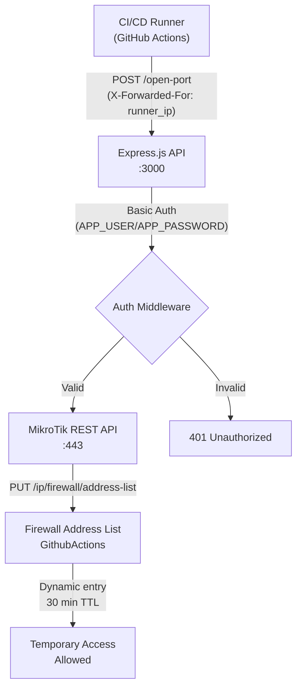

# MikroTik Firewall Automation with Express.js

MikroTik routers support a REST API that allows programmatic management of firewall rules, address lists, and system resources. This guide covers building an Express.js microservice that automates firewall operations — specifically dynamic IP whitelisting for CI/CD runners (GitHub Actions, GitLab CI) that need temporary access to protected infrastructure.

---

## 1. Architecture Overview



### 1.1 Use Cases

| Scenario | Problem | Solution |
|----------|---------|----------|
| GitHub Actions self-hosted runners | Runners have dynamic IPs, can't whitelist statically | API auto-adds runner IP to address list with TTL |
| Temporary vendor access | Vendor needs SSH/VPN for limited time | API adds IP, auto-expires after timeout |
| Emergency access | Dev needs immediate firewall opening | Simple curl command triggers whitelist |
| Batch job automation | Multiple IPs need access | Script loops through IPs, adds each |

---

## 2. MikroTik REST API Setup

### 2.1 Enable REST API on MikroTik

```bash
# SSH into MikroTik
ssh admin@<mikrotik-ip>

# Enable HTTPS API
/ip service set api-ssl port=443 disabled=no

# Create a dedicated API user
/user add name=apiuser password=<strong_password> group=full

# Verify
/ip service print
```

### 2.2 Create Address List for Dynamic Entries

```bash
# Create the address list (used by firewall rules)
/ip firewall address-list add list=GithubActions address=0.0.0.0/32 comment="placeholder"

# Create firewall rule to allow traffic from this list
/ip firewall filter add chain=forward src-address-list=GithubActions action=accept place-before=0 comment="Allow CI/CD runners"
```

### 2.3 REST API Endpoints Reference

| Method | Endpoint | Description |
|--------|----------|-------------|
| GET | `/rest/system/resource` | System info (CPU, memory, uptime) |
| GET | `/rest/ip/firewall/address-list` | List all address list entries |
| PUT | `/rest/ip/firewall/address-list` | Add entry to address list |
| DELETE | `/rest/ip/firewall/address-list/:id` | Remove specific entry |
| PATCH | `/rest/ip/firewall/address-list/:id` | Modify existing entry |

---

## 3. Express.js Implementation

### 3.1 Project Structure

```
mikrotik-firewall-api/
├── index.js
├── package.json
├── Dockerfile
├── .env.example
└── README.md
```

### 3.2 Environment Variables

```bash
# .env
MT_ADDRESS=192.168.1.1
MT_PORT=443
MT_USER=apiuser
MT_PASSWORD=<mikrotik_api_password>
APP_USER=<api_basic_auth_user>
APP_PASSWORD=<api_basic_auth_password>
```

### 3.3 Application Code

```javascript
require("dotenv").config();
const express = require("express");
const axios = require("axios");
const https = require("https");

const app = express();
const port = 3000;

const instance = axios.create({
  httpsAgent: new https.Agent({ rejectUnauthorized: false }),
});

const MT_ADDRESS = process.env.MT_ADDRESS;
const MT_PORT = process.env.MT_PORT;
const MT_USER = process.env.MT_USER;
const MT_PASSWORD = process.env.MT_PASSWORD;
const APP_USER = process.env.APP_USER;
const APP_PASSWORD = process.env.APP_PASSWORD;

const SYSTEM_RESOURCE = `https://${MT_ADDRESS}:${MT_PORT}/rest/system/resource`;
const ADDRESS_LIST = `https://${MT_ADDRESS}:${MT_PORT}/rest/ip/firewall/address-list`;

// --- Auth Middleware ---
function basicAuthMiddleware(req, res, next) {
  const authHeader = req.headers.authorization;
  if (!authHeader || !authHeader.startsWith("Basic ")) {
    return res.status(401).json({ message: "Unauthorized: Missing Basic auth header" });
  }

  const [username, password] = Buffer.from(authHeader.split(" ")[1], "base64")
    .toString()
    .split(":");

  if (username === APP_USER && password === APP_PASSWORD) {
    next();
  } else {
    return res.status(401).json({ message: "Unauthorized: Invalid credentials" });
  }
}

// --- Routes ---

// GET / — System resource info
app.get("/", basicAuthMiddleware, (req, res) => {
  instance
    .get(SYSTEM_RESOURCE, { auth: { username: MT_USER, password: MT_PASSWORD } })
    .then((response) => res.json(response.data))
    .catch((error) => {
      console.error(error);
      res.status(500).json({ message: "Failed to fetch system resource" });
    });
});

// GET /open-port — Add caller IP to firewall address list
app.get("/open-port", basicAuthMiddleware, (req, res) => {
  const ip = req.headers["x-forwarded-for"] || req.socket.remoteAddress;

  instance
    .put(
      ADDRESS_LIST,
      {
        list: "GithubActions",
        address: ip,
        comment: "GithubActions",
        timeout: "00:30:00",
      },
      { auth: { username: MT_USER, password: MT_PASSWORD } }
    )
    .then((response) => res.json(response.data))
    .catch((error) => {
      console.error(error);
      res.status(500).json({ message: "Failed to add IP to address list" });
    });
});

app.listen(port, "0.0.0.0", () => {
  console.log(`Server running at http://0.0.0.0:${port}`);
});

module.exports = app;
```

### 3.4 Dependencies

```json
{
  "name": "mikrotik-firewall-api",
  "version": "1.0.0",
  "scripts": {
    "start": "node index.js"
  },
  "dependencies": {
    "express": "^4.18.2",
    "axios": "^1.6.0",
    "dotenv": "^16.3.1"
  }
}
```

---

## 4. API Usage

### 4.1 Check System Resource

```bash
curl -k -u <APP_USER>:<APP_PASSWORD> https://localhost:3000/
```

**Response:**
```json
{
  "architecture-name": "x86_64",
  "board-name": "CHR",
  "cpu": "Intel",
  "cpu-count": "1",
  "cpu-frequency": "2399",
  "cpu-load": "10",
  "free-hdd-space": "26626113536",
  "free-memory": "591990784",
  "platform": "MikroTik",
  "total-memory": "1006632960",
  "uptime": "41w6d18h4m22s",
  "version": "7.9.2 (stable)"
}
```

### 4.2 Add IP to Firewall

```bash
curl -k -u <APP_USER>:<APP_PASSWORD> https://localhost:3000/open-port
```

**Response:**
```json
{
  ".id": "*C69D",
  "address": "203.0.113.45",
  "comment": "GithubActions",
  "creation-time": "jun/19/2024 18:13:17",
  "disabled": "false",
  "dynamic": "true",
  "list": "GithubActions",
  "timeout": "30m"
}
```

### 4.3 GitHub Actions Integration

```yaml
# .github/workflows/deploy.yml
jobs:
  deploy:
    runs-on: self-hosted
    steps:
      - name: Whitelist runner IP
        run: |
          curl -k -u ${{ secrets.API_USER }}:${{ secrets.API_PASSWORD }} \
            https://api.example.com/open-port
      - name: Deploy
        run: ./deploy.sh
```

---

## 5. Docker Deployment

### 5.1 Dockerfile

```dockerfile
FROM node:18-alpine
WORKDIR /app
COPY package*.json ./
RUN npm install --production
COPY . .
EXPOSE 3000
CMD ["node", "index.js"]
```

### 5.2 Docker Compose

```yaml
version: "3.8"
services:
  mikrotik-api:
    build: .
    ports:
      - "3000:3000"
    env_file:
      - .env
    restart: unless-stopped
    networks:
      - internal

networks:
  internal:
    driver: bridge
```

---

## 6. Security Best Practice

| Practice | Implementation |
|----------|---------------|
| HTTPS only | MikroTik REST API uses port 443 with self-signed cert |
| Basic Auth | API protected with HTTP Basic Auth |
| TLS skip verify | Axios configured with `rejectUnauthorized: false` for self-signed certs |
| IP TTL | Address list entries have 30-min timeout (auto-expire) |
| .env for secrets | Never commit `.env` to version control |
| Non-root container | Add `USER node` to Dockerfile |
| Network isolation | Deploy on internal network, expose only to CI/CD |

---

## 7. Extending the API

### 7.1 Add More Endpoints

```javascript
// List all address list entries
app.get("/list", basicAuthMiddleware, (req, res) => {
  instance
    .get(ADDRESS_LIST, { auth: { username: MT_USER, password: MT_PASSWORD } })
    .then((response) => res.json(response.data))
    .catch((error) => res.status(500).json({ message: error.message }));
});

// Remove specific entry
app.delete("/list/:id", basicAuthMiddleware, (req, res) => {
  instance
    .delete(`${ADDRESS_LIST}/${req.params.id}`, {
      auth: { username: MT_USER, password: MT_PASSWORD },
    })
    .then(() => res.json({ message: "Entry removed" }))
    .catch((error) => res.status(500).json({ message: error.message }));
});

// Add to custom address list
app.put("/list/:listName", basicAuthMiddleware, (req, res) => {
  const ip = req.headers["x-forwarded-for"] || req.socket.remoteAddress;
  const { listName } = req.params;
  const { timeout, comment } = req.body;

  instance
    .put(
      ADDRESS_LIST,
      {
        list: listName,
        address: ip,
        comment: comment || "API-added",
        timeout: timeout || "01:00:00",
      },
      { auth: { username: MT_USER, password: MT_PASSWORD } }
    )
    .then((response) => res.json(response.data))
    .catch((error) => res.status(500).json({ message: error.message }));
});
```

### 7.2 CLI Wrapper

```bash
#!/bin/bash
# whitelist.sh — Quick IP whitelist helper

API_URL="https://api.example.com/open-port"
API_USER="admin"
API_PASS="secret"

curl -k -u "${API_USER}:${API_PASS}" "${API_URL}" | jq .
echo "IP whitelisted for 30 minutes"
```
