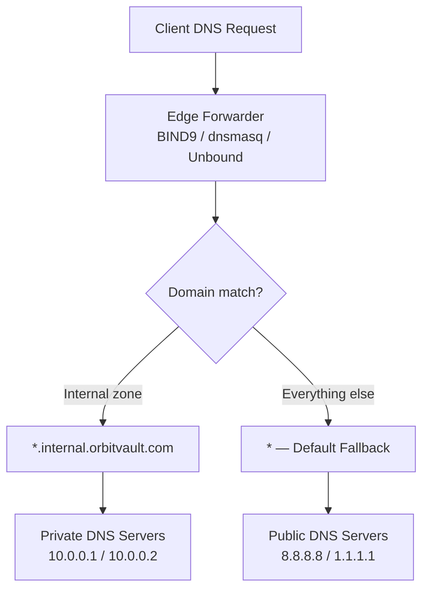

# Split-Horizon DNS Forwarding Guide (BIND9, dnsmasq, and Unbound)

Split-horizon DNS (also known as split-view or split-brain DNS) is an architectural pattern where a DNS resolver provides structurally distinct resolution answers depending on the originating request network, sub-domain pattern, or target zone boundaries. 

This guide implements a **purely conditional forward-only** Split-Horizon design. Instead of acting as an authoritative source hosting local zone files, the server serves as an intelligent edge forwarder, parsing inbound namespaces and proxying traffic to isolated upstream resolvers.

---

## 1. Architectural Strategy & Scenario

### 1.2 Namespace Routing Parameters
The design targets a centralized, resilient split routing model using the domain blueprint `orbitvault.com`:

* **Internal Routing Layer:** Any query targeting `*.internal.orbitvault.com` must bypass public lookups and route entirely to the private corporate network namespaces at `10.0.0.1` and `10.0.0.2`.
* **Public Routing Layer:** Any standard corporate query targeting `*.orbitvault.com` (omitting the `.internal` boundary) or any general internet zone lookup must route out to public DNS resolvers (`8.8.8.8` and `1.1.1.1`).



---

## 2. Engine Implementations

### 2.1 Option A: Enterprise Topology with BIND9
BIND9 is the industry standard for robust, highly granular corporate access structures. This forward-only implementation configures the baseline global options pool and decouples local zoning overrides.

#### Global Operational Options (`/etc/bind/named.conf.options`)
```named
options {
    directory "/var/cache/bind";

    // Enable processing of recursive lookup queries
    recursion yes;
    allow-recursion { any; };
    allow-query { any; };

    // Set forward-only behavior to avoid root hint iteration
    forward only;
    forwarders {
        8.8.8.8;
        1.1.1.1;
    };

    // Disabled for internal staging environments without DNSSEC signoffs
    dnssec-validation no;

    listen-on port 53 { any; };
    listen-on-v6 { none; };
};

// Structural Logging Pipeline for Observability
logging {
    channel default_log {
        file "/var/log/named/bind.log" versions 3 size 5m;
        severity info;
        print-time yes;
        print-severity yes;
        print-category yes;
    };

    category default { default_log; };
    category queries { default_log; };       // Track inbound access logs
    category config { default_log; };        // Trace parsing/reload parameters
    category resolver { default_log; };      // Debug upstream resolution flows
};
```

#### Split Local Forward Boundaries (`/etc/bind/named.conf.local`)
```named
// Intercept the internal subdomain string and target the micro-segmentation path
zone "internal.orbitvault.com" {
    type forward;
    forward only;
    forwarders { 
        10.0.0.1;
        10.0.0.2;
    };
};
```

#### Lifecycle Activation
```bash
# Verify configuration grammar rules are compliant before initializing
named-checkconf /etc/bind/named.conf.options
named-checkconf /etc/bind/named.conf.local

# Restart service container
sudo systemctl restart bind9
```

---

### 2.2 Option B: Lightweight Footprint with `dnsmasq`
`dnsmasq` is optimized for resource-constrained edge systems, bare-metal nodes, container sidecars, and local virtualization layers.

#### Tailored Schema (`/etc/dnsmasq.conf`)
```ini
# Core Runtime Parameters
port=53
domain-needed       # Do not forward plain names without dots to upstream servers
bogus-priv          # Intercept and block reverse-lookup private IP ranges from escaping
no-resolv           # Do not read structural settings from host operating system /etc/resolv.conf

# Explicit Conditional Split Rules (Private Domain Resolution)
server=/internal.orbitvault.com/10.0.0.1
server=/internal.orbitvault.com/10.0.0.2

# Default External Internet Routing Fallbacks
server=8.8.8.8
server=1.1.1.1

# Performance & In-Memory Optimization Storage
cache-size=1000
min-cache-ttl=300

# Logging & Diagnostic Pipeline Hook
log-queries
log-facility=/var/log/dnsmasq.log

# System Socket Interface Interception
listen-address=127.0.0.1,0.0.0.0
bind-interfaces
```

#### Lifecycle Activation
```bash
# Check syntax integrity
dnsmasq --test

# Restart application daemon
sudo systemctl restart dnsmasq
```

---

### 2.3 Option C: High-Throughput & Hardened with Unbound
Unbound is an incredibly secure, performant, validating resolver designed to absorb high traffic patterns while enforcing aggressive optimization parameters.

#### Configuration Anchor (`/etc/unbound/unbound.conf.d/forward-split-horizon.conf`)
```yaml
server:
  verbosity: 1
  interface: 0.0.0.0
  port: 53
  access-control: 0.0.0.0/0 allow
  
  # Transport Infrastructure Hooks
  do-ip4: yes
  do-udp: yes
  do-tcp: yes
  
  # Security Hardening Framework
  hide-identity: yes
  hide-version: yes
  use-caps-for-id: no # Prevent mixing character cases for older upstream segments
  
  # Cache Pipeline Adjustments
  cache-min-ttl: 300
  cache-max-ttl: 300
  prefetch: yes       # Background refresh expiring active keys to boost throughput
  prefetch-key: yes

  # Observability System Outlets
  logfile: "/var/log/unbound.log"

# Conditional Interception (Specific Internal Domain Mapping)
forward-zone:
  name: "internal.orbitvault.com."
  forward-tls-upstream: no
  forward-addr: 10.0.0.1
  forward-addr: 10.0.0.2

# Catch-All Global Routing Configuration (Public Internet Namespace Outlets)
forward-zone:
  name: "."
  forward-addr: 8.8.8.8
  forward-addr: 1.1.1.1
```

#### Lifecycle Activation
```bash
# Validate yaml/grammar alignment parameters
unbound-checkconf /etc/unbound/unbound.conf.d/forward-split-horizon.conf

# Restart daemon container
sudo systemctl restart unbound
```

---

## 3. Post-Deployment Verification Controls

Utilize `dig` (Domain Information Groper) to run live lookups against your newly listening local interface IP socket (`127.0.0.1`) and confirm path routing policies:

```bash
# 1. Target the internal routing boundary zone
dig internal.orbitvault.com @127.0.0.1

# 2. Target the broader external public space domain mapping
dig www.orbitvault.com @127.0.0.1
```

### Validation Inspection Matrix
* Check your generated log files (`/var/log/named/bind.log`, `/var/log/dnsmasq.log`, or `/var/log/unbound.log`) to guarantee metrics tracking.
* Lookups against `internal.orbitvault.com` must reflect the network route origin traced back to the `10.0.0.1` upstream stack.
* Lookups against generic zones like `www.orbitvault.com` or `google.com` must capture outbound traffic metrics mapping directly through Google's public `8.8.8.8` anchor.

---

## 4. Architectural Selection Matrix

| Metric Parameter | BIND9 Engine | `dnsmasq` Engine | Unbound Engine |
| :--- | :--- | :--- | :--- |
| **Primary Use-Case Profile** | Large Complex Corporate Datacenters | Edge Proxies, Home Labs, Local Nodes | Hardened APIs & Cloud-Native Gateways |
| **Memory/Compute Overhead** | Moderate to Heavy | Minimal / Negligible | Highly Optimized Efficiency |
| **Zone Type Support** | Comprehensive Authoritative + Forwarding | Strict Basic Forwarding / Hosts Overrides | High Performance Validation & Forwarding |
| **Advanced Caching Architecture**| Advanced Configuration Controls | Flat In-Memory Array | High Throughput Prefetch Pools |