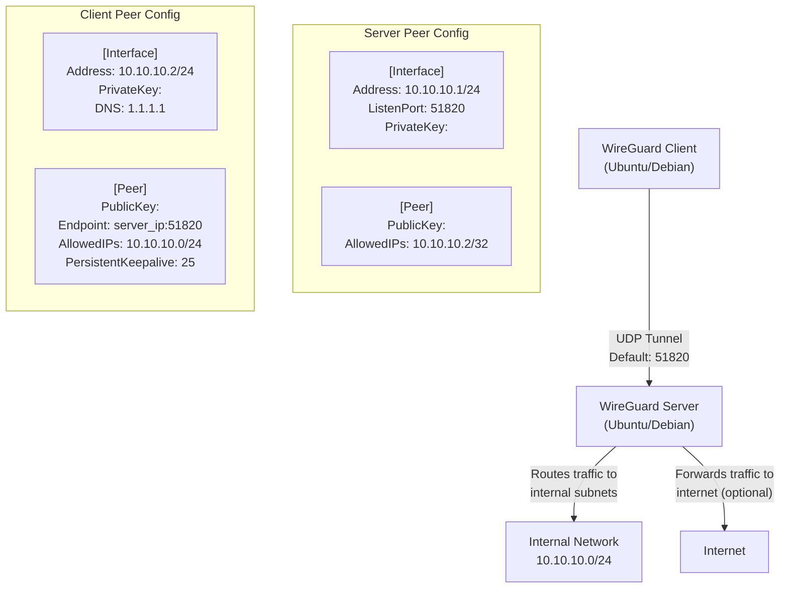

# WireGuard Setup: Server + Client

WireGuard is a modern, high-performance VPN protocol that uses state-of-the-art cryptography. Unlike legacy VPN solutions (OpenVPN, IPsec), WireGuard is implemented in just ~4,000 lines of code, making it auditable, fast, and lightweight. This guide covers deploying a WireGuard server and connecting a client on Ubuntu/Debian.

---

## 1. Architecture Overview

WireGuard operates at Layer 3, creating a tunnel between peers using UDP. Each peer holds a cryptographic key pair (private + public). The server maintains a list of allowed peers and their public keys, while clients connect to the server's public endpoint.



### 1.1 Protocol Comparison

| Feature | WireGuard | OpenVPN | IPsec |
|---------|-----------|---------|-------|
| Codebase | ~4,000 lines | ~100,000 lines | ~400,000 lines |
| Speed | Excellent (kernel-space) | Good (user-space) | Good |
| Setup Complexity | Low | Medium | High |
| Encryption | ChaCha20, Curve25519 | Configurable | Configurable |
| UDP Support | Native | Requires config | Yes |
| Mobile Support | Excellent | Good | Good |

---

## 2. Prerequisites

- Two Ubuntu/Debian servers (or one server + one client machine)
- Root or sudo access on both
- UDP port 51820 open (firewall rules)
- Static IP on the server (or a DNS hostname)

### 2.1 Firewall Rules (Server)

```bash
sudo ufw allow 51820/udp
sudo ufw allow 22/tcp
sudo ufw enable
```

---

## 3. Server Installation & Configuration

### 3.1 Install WireGuard

```bash
sudo apt-get update
sudo apt-get install -y wireguard
```

### 3.2 Generate Server Keys

```bash
# Generate private key
wg genkey | tee server_private.key | wg pubkey > server_public.key

# Secure the private key
chmod 600 server_private.key

# View keys
cat server_private.key
cat server_public.key
```

### 3.3 Create Server Configuration

```bash
sudo nano /etc/wireguard/wg0.conf
```

```ini
[Interface]
# Server internal VPN address
Address = 10.10.10.1/24
ListenPort = 51820
PrivateKey = <server_private_key>

# IP forwarding and NAT rules (run on startup)
PostUp = iptables -A FORWARD -i wg0 -j ACCEPT; iptables -t nat -A POSTROUTING -o eth0 -j MASQUERADE
PostDown = iptables -D FORWARD -i wg0 -j ACCEPT; iptables -t nat -D POSTROUTING -o eth0 -j MASQUERADE

# Optional: save config for dynamic peers
# SaveConfig = true

[Peer]
# Client 1
PublicKey = <client_public_key>
AllowedIPs = 10.10.10.2/32
```

> **Note:** Replace `<server_private_key>` and `<client_public_key>` with actual keys. Replace `eth0` with your server's outbound network interface.

### 3.4 Enable IP Forwarding

```bash
# Temporary
sudo sysctl -w net.ipv4.ip_forward=1

# Persistent
echo "net.ipv4.ip_forward = 1" | sudo tee -a /etc/sysctl.conf
sudo sysctl -p
```

### 3.5 Start WireGuard Server

```bash
# Enable on boot
sudo systemctl enable wg-quick@wg0.service

# Start now
sudo systemctl start wg-quick@wg0.service

# Check status
sudo systemctl status wg-quick@wg0.service
```

### 3.6 Verify Server Status

```bash
sudo wg show

# Expected output:
# interface: wg0
#   public key: <server_public_key>
#   private key: (hidden)
#   listening port: 51820
```

---

## 4. Client Installation & Configuration

### 4.1 Install WireGuard

```bash
sudo apt update
sudo apt install -y wireguard openresolv
```

### 4.2 Generate Client Keys

```bash
wg genkey | tee client_private.key | wg pubkey > client_public.key

chmod 600 client_private.key

cat client_private.key
cat client_public.key
```

### 4.3 Create Client Configuration

```bash
sudo nano /etc/wireguard/wg0.conf
```

```ini
[Interface]
# Client VPN address (must match server's AllowedIPs for this peer)
Address = 10.10.10.2/24
PrivateKey = <client_private_key>
DNS = 1.1.1.1, 1.0.0.1

[Peer]
# Server
PublicKey = <server_public_key>
Endpoint = <server_public_ip>:51820
# Route only VPN subnet through tunnel (split tunnel)
AllowedIPs = 10.10.10.0/24
# Keep connection alive through NAT
PersistentKeepalive = 25
```

> **AllowedIPs variations:**
> - `10.10.10.0/24` — Split tunnel: only VPN subnet routes through WireGuard
> - `0.0.0.0/0` — Full tunnel: all traffic routes through WireGuard

### 4.4 Start WireGuard Client

```bash
sudo systemctl enable wg-quick@wg0.service
sudo systemctl start wg-quick@wg0.service
sudo systemctl status wg-quick@wg0.service
```

### 4.5 Add Client Peer to Server

On the **server**, register the client's public key:

```bash
sudo wg set wg0 peer <client_public_key> allowed-ips 10.10.10.2/32

# Persist the change
sudo wg showconf wg0 | sudo tee /etc/wireguard/wg0.conf
```

---

## 5. Generating Multiple Clients

### 5.1 Script: Generate Client Keys

```bash
#!/bin/bash
# generate-client.sh — Generate WireGuard client key pair

CLIENT_NAME=${1:-client1}

wg genkey | tee "${CLIENT_NAME}_private.key" | wg pubkey > "${CLIENT_NAME}_public.key"
chmod 600 "${CLIENT_NAME}_private.key"

echo "Generated key pair for: ${CLIENT_NAME}"
echo "Private key: $(cat ${CLIENT_NAME}_private.key)"
echo "Public key:  $(cat ${CLIENT_NAME}_public.key)"
```

```bash
chmod +x generate-client.sh
./generate-client.sh client2
```

### 5.2 Assign Unique IPs

| Client | VPN IP | AllowedIPs (Server) |
|--------|--------|---------------------|
| client1 | 10.10.10.2/24 | 10.10.10.2/32 |
| client2 | 10.10.10.3/24 | 10.10.10.3/32 |
| client3 | 10.10.10.4/24 | 10.10.10.4/32 |

---

## 6. Network Configuration

### 6.1 Server as Gateway (Full Tunnel)

For clients that route all traffic through the VPN:

```ini
# Client config — full tunnel
[Interface]
Address = 10.10.10.2/24
PrivateKey = <client_private_key>
DNS = 1.1.1.1

[Peer]
PublicKey = <server_public_key>
Endpoint = <server_ip>:51820
AllowedIPs = 0.0.0.0/0
PersistentKeepalive = 25
```

### 6.2 Split Tunnel (VPN Subnet Only)

For clients that only route internal traffic through the VPN:

```ini
# Client config — split tunnel
[Interface]
Address = 10.10.10.2/24
PrivateKey = <client_private_key>
DNS = 1.1.1.1

[Peer]
PublicKey = <server_public_key>
Endpoint = <server_ip>:51820
AllowedIPs = 10.10.10.0/24, 192.168.1.0/24
PersistentKeepalive = 25
```

### 6.3 Routing Internal Subnets

If the server sits behind a corporate network (e.g., `192.168.1.0/24`), add that subnet to `AllowedIPs` and ensure server-side routing is configured:

```bash
# On server: route VPN clients to internal network
sudo iptables -A FORWARD -i wg0 -o eth1 -j ACCEPT
sudo iptables -A FORWARD -i eth1 -o wg0 -m state --state RELATED,ESTABLISHED -j ACCEPT
```

---

## 7. Troubleshooting

### 7.1 Common Commands

```bash
# Show WireGuard interface status
sudo wg show

# Show detailed interface info
sudo wg show wg0

# Check if listening
sudo ss -ulnp | grep 51820

# Check iptables NAT rules
sudo iptables -t nat -L -v

# Restart WireGuard
sudo systemctl restart wg-quick@wg0
```

### 7.2 Connection Issues

| Symptom | Possible Cause | Fix |
|---------|---------------|-----|
| Handshake fails | Wrong key | Verify public/private key pair |
| Handshake fails | Firewall blocking UDP 51820 | `sudo ufw allow 51820/udp` |
| Connected but no traffic | IP forwarding disabled | `sysctl -w net.ipv4.ip_forward=1` |
| Connected but no traffic | Missing NAT rule | Check `PostUp` iptables rules |
| DNS not resolving | Wrong DNS config | Set `DNS = 1.1.1.1` in client |
| Slow performance | MTU issues | Set `MTU = 1420` in both configs |

### 7.3 Debug with tcpdump

```bash
# Capture WireGuard traffic on server
sudo tcpdump -i eth0 udp port 51820 -n

# Capture on WireGuard interface
sudo tcpdump -i wg0 -n
```

---

## 8. Security Considerations

| Practice | Description |
|----------|-------------|
| Key rotation | Regenerate keys periodically; update both server and client configs |
| Restrict AllowedIPs | Never use `0.0.0.0/0` on server `AllowedIPs` — only assign specific peer IPs |
| Firewall rules | Only expose UDP 51820; block all other ports |
| DNS leak prevention | Set `DNS = 1.1.1.1` on client to prevent DNS leaks |
| Private key permissions | `chmod 600` on all `.key` files |
| Disable SaveConfig | Avoid `SaveConfig = true` in production to prevent key persistence issues |

---

## 9. Quick Reference

### Server Checklist

```bash
# 1. Install
sudo apt-get install -y wireguard

# 2. Generate keys
wg genkey | tee server_private.key | wg pubkey > server_public.key

# 3. Configure
sudo nano /etc/wireguard/wg0.conf

# 4. Enable IP forwarding
sudo sysctl -w net.ipv4.ip_forward=1

# 5. Start
sudo systemctl enable --now wg-quick@wg0

# 6. Add client peer
sudo wg set wg0 peer <client_public_key> allowed-ips 10.10.10.2/32
```

### Client Checklist

```bash
# 1. Install
sudo apt install -y wireguard openresolv

# 2. Generate keys
wg genkey | tee client_private.key | wg pubkey > client_public.key

# 3. Configure
sudo nano /etc/wireguard/wg0.conf

# 4. Start
sudo systemctl enable --now wg-quick@wg0

# 5. Verify
sudo wg show
```
