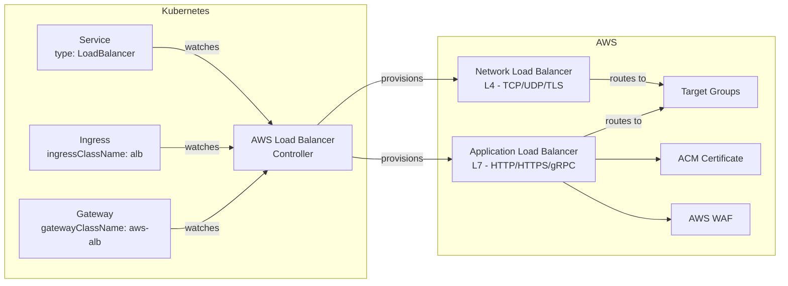
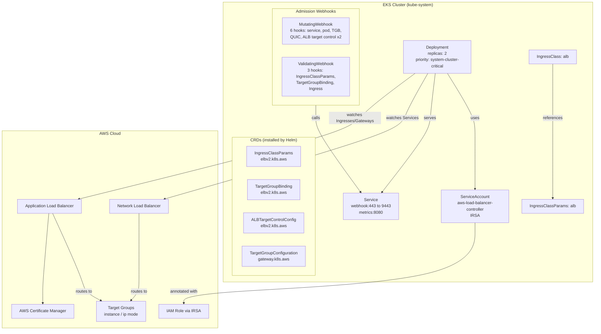
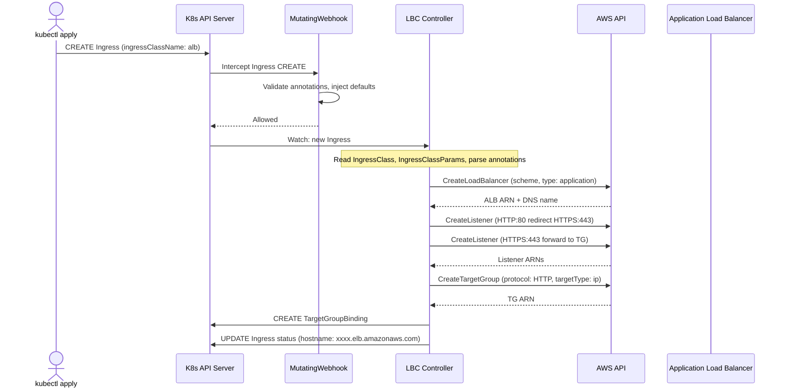

# Master AWS Load Balancer Controller — ALB, NLB & Gateway API on EKS

A production-grade guide for installing, configuring, and managing the AWS Load Balancer Controller (LBC) on EKS, including ALB Ingress integration, NLB Services, and Kubernetes Gateway API.

## Table of Contents

| Section | Topic | Description |
| :---: | :--- | :--- |
| **01** | [What is AWS LBC?](#1-what-is-aws-lbc) | Why it exists, in-tree vs LBC comparison. |
| **02** | [Architecture](#2-architecture) | Controller components, webhook flow, resource tree. |
| **03** | [CRDs Deep Dive](#3-crds-deep-dive) | IngressClassParams, TargetGroupBinding, and Gateway API CRDs. |
| **04** | [Installation](#4-installation) | Prerequisites, IAM policy, IRSA, Helm chart, verification. |
| **05** | [ALB Ingress Integration](#5-alb-ingress-integration) | IngressClass, IngressGroup, annotations, production examples. |
| **06** | [NLB Service Integration](#6-nlb-service-integration) | Service type LoadBalancer, NLB annotations, when to use. |
| **07** | [Gateway API Integration](#7-gateway-api-integration) | GatewayClass, Gateway, HTTPRoute, multi-team, canary. |
| **08** | [AWS CRDs for Gateway API](#8-aws-crds-for-gateway-api) | LoadBalancerConfiguration, TargetGroupConfiguration. |
| **09** | [Best Practices](#9-best-practices) | Security, performance, cost, tagging. |
| **10** | [Operational Runbooks](#10-operational-runbooks) | Health checks, upgrades, cleanup, recovery. |
| **11** | [Troubleshooting](#11-troubleshooting) | Common issues, diagnostic commands. |
| **12** | [Reference](#12-reference) | Official docs, annotations, Helm values. |

---

## 1. What is AWS LBC?

The **AWS Load Balancer Controller (LBC)** is the official AWS-maintained Kubernetes controller that manages AWS Elastic Load Balancers (ALB and NLB) on behalf of your cluster. It watches Kubernetes resources (`Service`, `Ingress`, `Gateway`) and provisions corresponding AWS infrastructure automatically.



### Why LBC?

| Feature | In-Tree Cloud Provider (Legacy) | AWS LBC (Modern) |
|---|---|---|
| **Status** | Removed from upstream K8s (since v1.29+) | Actively maintained by AWS |
| **ALB support** | None | Full L7 routing, host/path-based |
| **NLB support** | Basic (instance mode) | Instance + IP mode, dual-stack |
| **Gateway API** | Not supported | GA since v3.0+ |
| **WAF integration** | Not supported | Native annotation support |
| **Target group sharing** | Not supported | `group.name` annotation |
| **Pod readiness gates** | Not supported | Graceful pod rollout |
| **Per-service security groups** | Not supported | Automatic SG management |

### What Problem Does It Solve?

Before LBC, Kubernetes on AWS relied on the **in-tree cloud controller manager (CCM)** — code baked directly into Kubernetes itself. This had severe limitations: no ALB support, no IP target type, no pod readiness gates, and code frozen in upstream K8s. The LBC solves all of this by running as a standard Kubernetes controller outside the core K8s codebase, allowing AWS to iterate independently.

---

## 2. Architecture



### Key Components

| Component | What It Does | Namespace |
|---|---|---|
| **Deployment** | Runs the controller binary (2 replicas for HA) | `kube-system` |
| **ServiceAccount (IRSA)** | IAM role for AWS API calls (least privilege) | `kube-system` |
| **Webhook Service** | ClusterIP endpoint for admission webhooks | `kube-system` |
| **MutatingWebhooks** | Inject `loadBalancerClass`, readiness gates, defaults | Cluster-scoped |
| **ValidatingWebhooks** | Validate Ingress, TargetGroupBinding, IngressClassParams | Cluster-scoped |
| **CRDs** | Extend Kubernetes API with AWS-specific resources | Cluster-scoped |
| **IngressClass** | Maps `ingressClassName: alb` to LBC controller | Cluster-scoped |

---

## 3. CRDs Deep Dive

The Helm chart installs **4 CRDs** — these extend the Kubernetes API to model AWS-specific concepts.

### IngressClassParams — `ingressclassparams.elbv2.k8s.aws`

Defines cluster-wide or class-wide defaults for ALB Ingresses. Connected to an `IngressClass` via `spec.parameters`.

| Field | Type | Description |
|---|---|---|
| `scheme` | `internal` / `internet-facing` | Load balancer scheme for all Ingresses |
| `ipAddressType` | `ipv4` / `dualstack` / `dualstack-without-public-ipv4` | IP addressing mode |
| `group.name` | `string` | IngressGroup name — share a single ALB |
| `subnets.ids` | `[subnet-xxx]` | Explicit subnet IDs |
| `subnets.tags` | `map[string][]string` | Subnet selection by tags |
| `certificateArn` | `[string]` | Default ACM certificate ARNs |
| `inboundCIDRs` | `[string]` | IP allowlist |
| `sslPolicy` | `string` | ELB Security Policy |
| `tags` | `[{key, value}]` | Tags on all provisioned AWS resources |
| `loadBalancerAttributes` | `[{key, value}]` | Custom LB attributes |
| `namespaceSelector` | Label selector | Restrict which namespaces can use this class |

### TargetGroupBinding — `targetgroupbindings.elbv2.k8s.aws`

Links a Kubernetes Service to an AWS Target Group. Auto-created by LBC when it reconciles a Service or Ingress.

| Field | Description |
|---|---|
| `serviceRef.name` | Name of the Kubernetes Service |
| `serviceRef.port` | Port name or number |
| `targetGroupARN` | ARN of the AWS Target Group |
| `targetType` | `instance` (NodePort) or `ip` (pod IP directly) |
| `vpcID` | VPC ID (auto-inferred if not set) |
| `networking.ingress[].from[].securityGroup.groupID` | SG to allow traffic from |

### ALBTargetControlConfig — `albtargetcontrolconfigs.elbv2.k8s.aws`

Controls advanced ALB target group settings for Gateway API routes: health check, stickiness, deregistration delay, slow start.

### TargetGroupConfiguration — `targetgroupconfigurations.gateway.k8s.aws`

Gateway API resource that configures target group behavior for HTTPRoutes and GRPCRoutes: health check, stickiness, connection termination, load balancing algorithm.

---

## 4. Installation

### Prerequisites

- [x] EKS cluster with **OIDC provider** enabled
- [x] `eksctl` >= 0.180.0
- [x] `helm` v3+
- [x] `kubectl` context pointing to target cluster
- [x] Subnets tagged:
  - `kubernetes.io/role/internal-elb: 1` (for internal LBs)
  - `kubernetes.io/role/elb: 1` (for internet-facing LBs)

### Step 1 — Create IAM Policy

```bash
curl -o iam_policy.json \
  https://raw.githubusercontent.com/kubernetes-sigs/aws-load-balancer-controller/main/docs/install/iam_policy.json

aws iam create-policy \
  --policy-name AWSLoadBalancerControllerIAMPolicy \
  --policy-document file://iam_policy.json
```

Do this **once per AWS account** — the policy is reusable across all clusters.

### Step 2 — Create IRSA (IAM Role for Service Account)

```bash
eksctl create iamserviceaccount \
  --cluster=<cluster-name> \
  --namespace=kube-system \
  --name=aws-load-balancer-controller \
  --attach-policy-arn=arn:aws:iam::<account-id>:policy/AWSLoadBalancerControllerIAMPolicy \
  --region <region> \
  --approve
```

This creates an IAM role with OIDC trust, a ServiceAccount in `kube-system`, and attaches the policy.

### Step 3 — Install Helm Chart

```bash
helm repo add eks https://aws.github.io/eks-charts --force-update
helm repo update

helm upgrade --install aws-load-balancer-controller eks/aws-load-balancer-controller \
  --namespace kube-system \
  --version 3.4.0 \
  --set clusterName=<cluster-name> \
  --set serviceAccount.create=false \
  --set serviceAccount.name=aws-load-balancer-controller \
  --set region=<region> \
  --set vpcId=<vpc-id> \
  --set ingressClass=alb \
  --set replicaCount=2
```

### Helm Values Explained

| `--set` | Why it's set |
|---|---|
| `clusterName` | Must match the EKS cluster name for AWS resource tagging |
| `serviceAccount.create=false` | IRSA created separately by `eksctl` — Helm should NOT recreate it |
| `serviceAccount.name` | Must match the SA name used in the IRSA trust policy |
| `region` | Explicit region — prevents auto-detection failures |
| `vpcId` | Explicit VPC — speeds up provisioning, avoids cross-VPC issues |
| `ingressClass` | Sets the default IngressClass name |
| `replicaCount=2` | High availability across AZs |

### Recommended Production Values

```yaml
# values.yaml
clusterName: <cluster-name>
serviceAccount:
  create: false
  name: aws-load-balancer-controller
region: <region>
vpcId: <vpc-id>
ingressClass: alb
replicaCount: 2

resources:
  requests:
    cpu: 100m
    memory: 200Mi
  limits:
    cpu: 500m
    memory: 500Mi

enableMetrics: true
webhookTimeoutSeconds: 10
```

### Step 4 — Verify

```bash
# Check pods
kubectl get pods -n kube-system -l app.kubernetes.io/name=aws-load-balancer-controller

# Check version
kubectl get deploy -n kube-system aws-load-balancer-controller \
  -o jsonpath='{.spec.template.spec.containers[0].image}'

# Check IRSA
kubectl get sa -n kube-system aws-load-balancer-controller \
  -o jsonpath='{.metadata.annotations.eks\.amazonaws\.com/role-arn}'

# Check IngressClass
kubectl get ingressclass alb

# Check webhooks
kubectl get mutatingwebhookconfigurations aws-load-balancer-webhook
kubectl get validatingwebhookconfigurations aws-load-balancer-webhook

# Check CRDs
kubectl get crd | grep -E "elbv2|gateway.k8s.aws"
```

### Step 5 — Confirm Webhook is Working

```bash
# Deploy a test Service and verify loadBalancerClass is injected
kubectl run test-nlb --image=nginx --expose --port=80 --type=LoadBalancer
sleep 10
kubectl get svc test-nlb -o jsonpath='{.spec.loadBalancerClass}'
# Should output: service.k8s.aws/nlb
kubectl delete svc test-nlb
```

---

## 5. ALB Ingress Integration

### How Ingress Becomes an ALB



### ALB Ingress Example

```yaml
apiVersion: networking.k8s.io/v1
kind: Ingress
metadata:
  name: my-app
  annotations:
    alb.ingress.kubernetes.io/scheme: internet-facing
    alb.ingress.kubernetes.io/target-type: ip
    alb.ingress.kubernetes.io/certificate-arn: arn:aws:acm:REGION:ACCOUNT:certificate/xxxx
    alb.ingress.kubernetes.io/listen-ports: '[{"HTTPS":443}]'
    alb.ingress.kubernetes.io/ssl-redirect: "443"
    alb.ingress.kubernetes.io/group.name: my-apps
    alb.ingress.kubernetes.io/healthcheck-path: /health
    alb.ingress.kubernetes.io/wafv2-acl-arn: arn:aws:wafv2:REGION:ACCOUNT:webacl/xxx
spec:
  ingressClassName: alb
  rules:
  - host: app.example.com
    http:
      paths:
      - path: /
        pathType: Prefix
        backend:
          service:
            name: my-service
            port:
              number: 80
```

### IngressGroup — Sharing ALBs to Reduce Cost

Without IngressGroup, **every Ingress creates a separate ALB**. IngressGroup merges multiple Ingresses into **one shared ALB**.

| Number of Ingresses | Without Group | With Group | Savings |
|---|---|---|---|
| 1 | 1 ALB ($22/mo) | 1 ALB ($22/mo) | — |
| 5 | 5 ALBs ($110/mo) | 1 ALB ($22/mo) | **$88/mo** |
| 10 | 10 ALBs ($220/mo) | 1 ALB ($22/mo) | **$198/mo** |
| 50 | 50 ALBs ($1,100/mo) | 1 ALB ($22/mo) | **$1,078/mo** |

**Set `group.name` on every Ingress. Always.**

```yaml
apiVersion: networking.k8s.io/v1
kind: Ingress
metadata:
  name: app1
  annotations:
    alb.ingress.kubernetes.io/group.name: my-apps
    alb.ingress.kubernetes.io/group.order: "10"
spec:
  ingressClassName: alb
  rules:
  - host: app1.example.com
    http:
      paths:
      - path: /
        pathType: Prefix
        backend:
          service:
            name: app1-svc
            port: 80
```

### Key ALB Annotations

| Annotation | Purpose | Example |
|---|---|---|
| `scheme` | Public or internal | `internet-facing` / `internal` |
| `target-type` | `ip` (pod IP) or `instance` (NodePort) | `ip` |
| `certificate-arn` | ACM certificate ARN(s) | `arn:aws:acm:...` |
| `listen-ports` | Ports and protocols | `[{"HTTPS":443}]` |
| `ssl-redirect` | Auto redirect HTTP to HTTPS | `"443"` |
| `group.name` | Share ALB across Ingresses | `my-apps` |
| `group.order` | Rule evaluation order within group | `"10"` |
| `healthcheck-path` | Health check endpoint | `/health` |
| `wafv2-acl-arn` | AWS WAF web ACL ARN | `arn:aws:wafv2:...` |
| `inbound-cidrs` | IP allowlist | `"10.0.0.0/8"` |
| `load-balancer-attributes` | Custom LB attributes | `idle_timeout.timeout_seconds=300` |
| `tags` | AWS resource tags | `Environment=prd,Team=platform` |

### Production-Grade Ingress Example

```yaml
apiVersion: networking.k8s.io/v1
kind: Ingress
metadata:
  name: my-production-app
  namespace: production
  annotations:
    alb.ingress.kubernetes.io/group.name: production-apps
    alb.ingress.kubernetes.io/group.order: "10"
    alb.ingress.kubernetes.io/scheme: internal
    alb.ingress.kubernetes.io/target-type: ip
    alb.ingress.kubernetes.io/listen-ports: '[{"HTTPS":443}]'
    alb.ingress.kubernetes.io/certificate-arn: arn:aws:acm:REGION:ACCOUNT:certificate/xxxx
    alb.ingress.kubernetes.io/ssl-redirect: "443"
    alb.ingress.kubernetes.io/ssl-policy: ELBSecurityPolicy-TLS13-1-2-2021-06
    alb.ingress.kubernetes.io/healthcheck-path: /health
    alb.ingress.kubernetes.io/healthcheck-protocol: HTTP
    alb.ingress.kubernetes.io/success-codes: "200-399"
    alb.ingress.kubernetes.io/healthy-threshold-count: "2"
    alb.ingress.kubernetes.io/unhealthy-threshold-count: "2"
    alb.ingress.kubernetes.io/target-group-attributes: |
      deregistration_delay.timeout_seconds=60,
      stickiness.enabled=false
    alb.ingress.kubernetes.io/wafv2-acl-arn: arn:aws:wafv2:REGION:ACCOUNT:webacl/xxx
    alb.ingress.kubernetes.io/inbound-cidrs: 10.0.0.0/8,172.16.0.0/12
    alb.ingress.kubernetes.io/load-balancer-attributes: |
      idle_timeout.timeout_seconds=300,
      access_logs.s3.enabled=true,
      access_logs.s3.bucket=my-alb-logs,
      access_logs.s3.prefix=production-apps,
      deletion_protection.enabled=true
    alb.ingress.kubernetes.io/tags: |
      Environment=prd,
      Owner=platform,
      ResourceGroup=network
spec:
  ingressClassName: alb
  rules:
  - host: app.example.com
    http:
      paths:
      - path: /
        pathType: Prefix
        backend:
          service:
            name: app-service
            port:
              number: 80
```

---

## 6. NLB Service Integration

For non-HTTP workloads (TCP, UDP, TLS), the LBC manages NLB via `Service type: LoadBalancer`.

### NLB Service Example

```yaml
apiVersion: v1
kind: Service
metadata:
  name: my-tcp-service
  annotations:
    service.beta.kubernetes.io/aws-load-balancer-type: external
    service.beta.kubernetes.io/aws-load-balancer-nlb-target-type: instance
    service.beta.kubernetes.io/aws-load-balancer-scheme: internal
    service.beta.kubernetes.io/aws-load-balancer-ssl-cert: arn:aws:acm:...
    service.beta.kubernetes.io/aws-load-balancer-ssl-ports: https
    service.beta.kubernetes.io/aws-load-balancer-backend-protocol: tcp
    service.beta.kubernetes.io/aws-load-balancer-cross-zone-load-balancing-enabled: "true"
    service.beta.kubernetes.io/aws-load-balancer-additional-resource-tags: |
      Environment=prd,Owner=platform
spec:
  type: LoadBalancer
  loadBalancerClass: service.k8s.aws/nlb
  externalTrafficPolicy: Local
  ports:
  - name: http
    port: 80
    targetPort: http
  - name: https
    port: 443
    targetPort: https
  selector:
    app: my-app
```

### NLB vs ALB: When to Use Each

| Criterion | Use NLB | Use ALB |
|---|---|---|
| Protocol | TCP, UDP, TLS | HTTP, HTTPS, gRPC |
| TLS termination | At NLB (via ACM) or passthrough | At ALB (via ACM) |
| Path-based routing | Not supported | Supported |
| Host-based routing | Not supported | Supported |
| WebSocket | TCP passthrough | Native |
| gRPC | TCP | HTTP/2 |
| WAF | Not supported | Supported |
| Use case | Databases, custom protocols, ingress-nginx | Web apps, APIs, microservices |

---

## 7. Gateway API Integration

The AWS LBC supports **Kubernetes Gateway API** (GA since v3.0+) as the successor to Ingress — a more expressive, role-oriented API.

### GatewayClass Support

```yaml
apiVersion: gateway.networking.k8s.io/v1
kind: GatewayClass
metadata:
  name: aws-alb
spec:
  controllerName: gateway.k8s.aws/alb
```

### Gateway + HTTPRoute Example

```yaml
---
# Platform team: define Gateway
apiVersion: gateway.networking.k8s.io/v1
kind: Gateway
metadata:
  name: production-gateway
  namespace: gateway-system
  annotations:
    gateway.k8s.aws/alb-scheme: internal
    gateway.k8s.aws/alb-target-type: ip
    gateway.k8s.aws/alb-healthcheck-path: /health
    gateway.k8s.aws/alb-ssl-policy: ELBSecurityPolicy-TLS13-1-2-2021-06
    gateway.k8s.aws/alb-load-balancer-attributes: |
      idle_timeout.timeout_seconds=300,
      access_logs.s3.enabled=true,
      deletion_protection.enabled=true
spec:
  gatewayClassName: aws-alb
  listeners:
  - name: http-redirect
    protocol: HTTP
    port: 80
    allowedRoutes:
      namespaces:
        from: All
  - name: https-apps
    protocol: HTTPS
    port: 443
    tls:
      mode: Terminate
      certificateRefs:
      - kind: Secret
        name: wildcard-cert
    allowedRoutes:
      namespaces:
        from: Selector
        selector:
          matchLabels:
            gateway-access: "true"
---
# App team: route to their services
apiVersion: gateway.networking.k8s.io/v1
kind: HTTPRoute
metadata:
  name: my-app-route
  namespace: production
  labels:
    gateway-access: "true"
spec:
  parentRefs:
  - name: production-gateway
    namespace: gateway-system
    sectionName: https-apps
  hostnames:
  - "app.example.com"
  rules:
  - matches:
    - path:
        type: PathPrefix
        value: /
    backendRefs:
    - name: app-service
      port: 80
```

### Gateway API vs Ingress: When to Use Which

| Aspect | Ingress | Gateway API |
|---|---|---|
| **Maturity** | GA since K8s 1.19 | GA since K8s 1.31 |
| **AWS LBC support** | Since v1.0+ | Since v3.0+ (GA) |
| **Role separation** | Single resource | Gateway (infra) + Route (app) |
| **Cross-namespace** | Requires annotation | Native via `allowedRoutes` |
| **TCP/UDP routing** | Not supported | Supported via TLSRoute/TCPRoute |
| **Complex routing** | Limited | Rich match/filter/backend weighting |
| **When to choose** | Simple HTTP(S) apps | Multi-team, multi-protocol, complex routing |

### Multi-Team Cross-Namespace

```yaml
# Platform: Gateway with per-team selectors
apiVersion: gateway.networking.k8s.io/v1
kind: Gateway
metadata:
  name: team-gateway
  namespace: gateway-system
  annotations:
    gateway.k8s.aws/alb-scheme: internal
    gateway.k8s.aws/alb-target-type: ip
spec:
  gatewayClassName: aws-alb
  listeners:
  - name: https-team-a
    protocol: HTTPS
    port: 443
    tls:
      mode: Terminate
      certificateRefs:
      - name: team-a-cert
    allowedRoutes:
      namespaces:
        from: Selector
        selector:
          matchLabels:
            team: team-a
  - name: https-team-b
    protocol: HTTPS
    port: 8443
    tls:
      mode: Terminate
      certificateRefs:
      - name: team-b-cert
    allowedRoutes:
      namespaces:
        from: Selector
        selector:
          matchLabels:
            team: team-b
```

### Canary / Traffic Splitting

```yaml
# Weighted canary — native to Gateway API
apiVersion: gateway.networking.k8s.io/v1
kind: HTTPRoute
metadata:
  name: canary-route
  namespace: production
spec:
  parentRefs:
  - name: production-gateway
    namespace: gateway-system
    sectionName: https-apps
  hostnames:
  - "app.example.com"
  rules:
  - backendRefs:
    - name: app-stable
      port: 80
      weight: 90
    - name: app-canary
      port: 80
      weight: 10
```

### Installing Gateway API CRDs

Gateway API CRDs are **not included** in the LBC Helm chart. Install them separately:

```bash
# Experimental channel (recommended for AWS LBC — includes TCPRoute, TLSRoute, GRPCRoute)
kubectl apply --server-side -f \
  https://github.com/kubernetes-sigs/gateway-api/releases/download/v1.6.0/experimental-install.yaml

# Verify
kubectl get crd | grep gateway.networking.k8s.io
# Expected: 8 CRDs (experimental) or 5 CRDs (standard)
```

After installing the CRDs, the LBC auto-detects them within minutes — no restart needed.

---

## 8. AWS CRDs for Gateway API

The AWS LBC adds CRDs for Gateway API customization beyond annotations.

### LoadBalancerConfiguration — LB-Level Settings

```yaml
apiVersion: elbv2.k8s.aws/v1beta1
kind: LoadBalancerConfiguration
metadata:
  name: production-lb-config
  namespace: gateway-system
spec:
  targetGroup:
    targetType: ip
    healthCheck:
      path: /healthz
      protocol: HTTP
      intervalSeconds: 15
      timeoutSeconds: 5
      healthyThresholdCount: 2
      unhealthyThresholdCount: 2
    stickiness:
      enabled: false
    deregistrationDelay:
      timeoutSeconds: 60
    slowStart:
      durationSeconds: 30
  inboundCIDRs:
  - 10.0.0.0/8
  tags:
  - key: Environment
    value: prd
  loadBalancerAttributes:
  - key: idle_timeout.timeout_seconds
    value: "300"
  - key: deletion_protection.enabled
    value: "true"
```

Reference from a Gateway:

```yaml
apiVersion: gateway.networking.k8s.io/v1
kind: Gateway
metadata:
  name: production-gateway
  namespace: gateway-system
  annotations:
    gateway.k8s.aws/load-balancer-configuration: production-lb-config
```

### TargetGroupConfiguration — Per-Route Settings

```yaml
apiVersion: elbv2.k8s.aws/v1beta1
kind: TargetGroupConfiguration
metadata:
  name: api-tg-config
  namespace: production
spec:
  healthCheck:
    path: /api/healthz
    protocol: HTTP
    port: 8080
    intervalSeconds: 10
    timeoutSeconds: 5
    healthyThresholdCount: 2
    unhealthyThresholdCount: 2
  stickiness:
    enabled: true
    durationSeconds: 86400
  deregistrationDelay:
    timeoutSeconds: 60
```

Reference from an HTTPRoute:

```yaml
apiVersion: gateway.networking.k8s.io/v1
kind: HTTPRoute
metadata:
  name: my-api-route
  namespace: production
  annotations:
    gateway.k8s.aws/target-group-configuration: api-tg-config
```

---

## 9. Best Practices

### Security

| Practice | Implementation |
|---|---|
| **Use IRSA, not node instance role** | ServiceAccount annotated with `eks.amazonaws.com/role-arn` |
| **Internal LBs by default** | `scheme: internal` unless public access is explicitly required |
| **IP allowlisting** | `alb.ingress.kubernetes.io/inbound-cidrs` for ALB; SG rules for NLB |
| **WAF on ALBs** | `alb.ingress.kubernetes.io/wafv2-acl-arn` for OWASP Top 10 protection |
| **TLS everywhere** | ACM certs on NLB/ALB; `ssl-redirect: "443"` to force HTTPS |
| **Modern TLS policy** | `ssl-policy: ELBSecurityPolicy-TLS13-1-2-2021-06` |
| **Access logging** | `load-balancer-attributes: access_logs.s3.enabled=true` |
| **Deletion protection** | `deletion_protection.enabled=true` in LB attributes |
| **Namespace isolation (Gateway API)** | `allowedRoutes.namespaces.from: Selector` with label selectors |

### Performance & Reliability

| Practice | Implementation |
|---|---|
| **IP target type** | Always `target-type: ip` — fewer hops, no NodePort exhaustion |
| **Cross-zone LB** | Enabled by default on ALB; enable on NLB via annotation |
| **2 replicas** | Spread across AZs for HA |
| **`system-cluster-critical`** | Ensures LBC isn't evicted under memory pressure |
| **Resource limits** | Set CPU/memory requests and limits |
| **`--aws-vpc-id`** | Explicit VPC ID speeds up provisioning by 10-15s |
| **Health checks** | Set `healthcheck-path` to a meaningful endpoint |
| **Connection draining** | `deregistration_delay.timeout_seconds: 60` |
| **Slow start** | `slow_start.duration_seconds: 30` for new targets |

### Cost Optimization

| Practice | Savings |
|---|---|
| **IngressGroup (`group.name`)** | 10 Ingresses to 1 ALB instead of 10: **~$200+/month saved** |
| **Gateway API sharing** | Multiple HTTPRoutes attach to same Gateway: single ALB |
| **Internal LBs** | Slightly cheaper than internet-facing |
| **Cleanup** | Delete Ingresses/Services/Gateways when apps are decommissioned |

### Tagging

```yaml
# ALB Ingress tags
alb.ingress.kubernetes.io/tags: |
  Environment=prd,
  Owner=platform,
  ResourceGroup=network

# NLB Service tags
service.beta.kubernetes.io/aws-load-balancer-additional-resource-tags: |
  Environment=prd,
  Owner=platform,
  ResourceGroup=network

# Gateway API tags
gateway.k8s.aws/alb-tags: |
  Environment=prd,
  Owner=platform,
  ResourceGroup=network
```

---

## 10. Operational Runbooks

### Health Check

```bash
# 1. Are pods running?
kubectl get pods -n kube-system -l app.kubernetes.io/name=aws-load-balancer-controller
# Expected: 2/2 Running

# 2. Are webhooks responding?
kubectl get mutatingwebhookconfigurations aws-load-balancer-webhook -o yaml \
  | grep -E "name:|failurePolicy:" | head -12

# 3. Is the cert valid?
kubectl get certificate -n kube-system aws-load-balancer-serving-cert \
  -o jsonpath='{.status.notAfter}'

# 4. Are CRDs installed?
kubectl get crd | grep -cE "elbv2|gateway"
# Expected: 4

# 5. Is IRSA working?
kubectl exec -n kube-system deploy/aws-load-balancer-controller -- \
  env | grep AWS_ROLE_ARN
```

### Upgrade LBC

```bash
helm repo update
helm upgrade aws-load-balancer-controller eks/aws-load-balancer-controller \
  --namespace kube-system \
  --reuse-values \
  --version <new-version>
```

### Add Resource Limits (if missing)

```bash
helm upgrade aws-load-balancer-controller eks/aws-load-balancer-controller \
  --namespace kube-system --reuse-values \
  --set resources.requests.cpu=100m \
  --set resources.requests.memory=200Mi \
  --set resources.limits.cpu=500m \
  --set resources.limits.memory=500Mi
```

### Clean Up (Delete LBC)

```bash
# 1. Delete all Ingresses with ingressClassName: alb
kubectl delete ingress --all -A

# 2. Delete all LoadBalancer Services (wait for AWS cleanup)
kubectl delete svc --field-selector spec.type=LoadBalancer -A

# 3. Verify no orphaned resources
kubectl get targetgroupbindings -A
kubectl get svc -A | grep LoadBalancer

# 4. Uninstall Helm chart
helm uninstall aws-load-balancer-controller -n kube-system

# 5. Delete IAM policy + role
aws iam delete-policy --policy-arn <policy-arn>
eksctl delete iamserviceaccount --cluster <cluster> --name aws-load-balancer-controller

# 6. Delete ServiceAccount
kubectl delete sa -n kube-system aws-load-balancer-controller
```

### Finalizer Recovery (Orphaned Resources)

If a Service is stuck in `Terminating` due to finalizer:

```bash
# 1. Check finalizer
kubectl get svc <name> -n <ns> -o jsonpath='{.metadata.finalizers}'

# 2. If LBC is deleted, remove finalizer manually
kubectl patch svc <name> -n <ns> -p \
  '{"metadata":{"finalizers":null}}' --type=merge
```

---

## 11. Troubleshooting

### Common Issues

| Symptom | Cause | Fix |
|---|---|---|
| **Service stuck Pending** | Missing subnet tags | Tag subnets: `kubernetes.io/role/internal-elb: 1` |
| **AccessDenied in logs** | IAM policy missing/outdated | Re-download official policy |
| **WebhookTimeout** | Webhook cert expired | Check: `kubectl get certificate -n kube-system aws-load-balancer-serving-cert` |
| **LB created but targets unhealthy** | SG rules misconfigured | Check `TargetGroupBinding.spec.networking` |
| **Orphaned LB after Service delete** | Finalizer removed incorrectly | Manually delete in AWS console |
| **Mutating webhook not injecting** | LBC pod not running | Check pod logs |
| **Ingress stuck on pending** | No `IngressClass` or wrong name | Verify: `kubectl get ingressclass alb` |
| **Gateway status: NotAccepted** | GatewayClass not found | `kubectl get gatewayclass aws-alb` |
| **HTTPRoute status: NotAccepted** | Namespace not in allowedRoutes selector | Check namespace labels match Gateway selector |
| **ReferenceGrant not found** | Cross-namespace route without ReferenceGrant | Create ReferenceGrant in service namespace |

### Diagnostic Commands

```bash
# LBC logs (real-time)
kubectl logs -n kube-system deploy/aws-load-balancer-controller --tail=50 -f

# Check TargetGroupBindings
kubectl get targetgroupbindings -A
kubectl describe targetgroupbinding -n <namespace> <name>

# List all LBC-managed resources
kubectl get targetgroupbindings -A
kubectl get ingressclassparams
kubectl get albtargetcontrolconfigs -A
kubectl get targetgroupconfigurations -A

# Check webhook cert expiry
kubectl get certificate -n kube-system aws-load-balancer-serving-cert

# Gateway API resources
kubectl get gateway,gatewayclass,httproute,tcproute -A
kubectl describe gateway -n gateway-system <name>

# ALB DNS
kubectl get ingress <name> -o jsonpath='{.status.loadBalancer.ingress[0].hostname}'
kubectl get gateway -n gateway-system <name> -o jsonpath='{.status.addresses[0].value}'
```

---

## 12. Reference

- [AWS Load Balancer Controller — Official Documentation](https://kubernetes-sigs.github.io/aws-load-balancer-controller/latest/)
- [IAM Policy for LBC (latest)](https://raw.githubusercontent.com/kubernetes-sigs/aws-load-balancer-controller/main/docs/install/iam_policy.json)
- [EKS Helm Charts](https://github.com/aws/eks-charts)
- [Service Annotations Reference](https://kubernetes-sigs.github.io/aws-load-balancer-controller/latest/guide/service/annotations/)
- [Ingress Annotations Reference](https://kubernetes-sigs.github.io/aws-load-balancer-controller/latest/guide/ingress/annotations/)
- [Gateway API Support](https://kubernetes-sigs.github.io/aws-load-balancer-controller/latest/guide/gateway/)
- [Subnet Tagging Requirements](https://kubernetes-sigs.github.io/aws-load-balancer-controller/latest/deploy/subnet-discovery/)
- [Helm Values Reference](https://github.com/aws/eks-charts/blob/master/stable/aws-load-balancer-controller/values.yaml)
- [EKS IRSA Documentation](https://docs.aws.amazon.com/eks/latest/userguide/iam-roles-for-service-accounts.html)
- [Kubernetes Gateway API](https://gateway-api.sigs.k8s.io/)
- [AWS: ingress-nginx Retirement Guide](https://aws.amazon.com/blogs/networking-and-content-delivery/navigating-the-nginx-ingress-retirement-a-practical-guide-to-migration-on-aws/)
