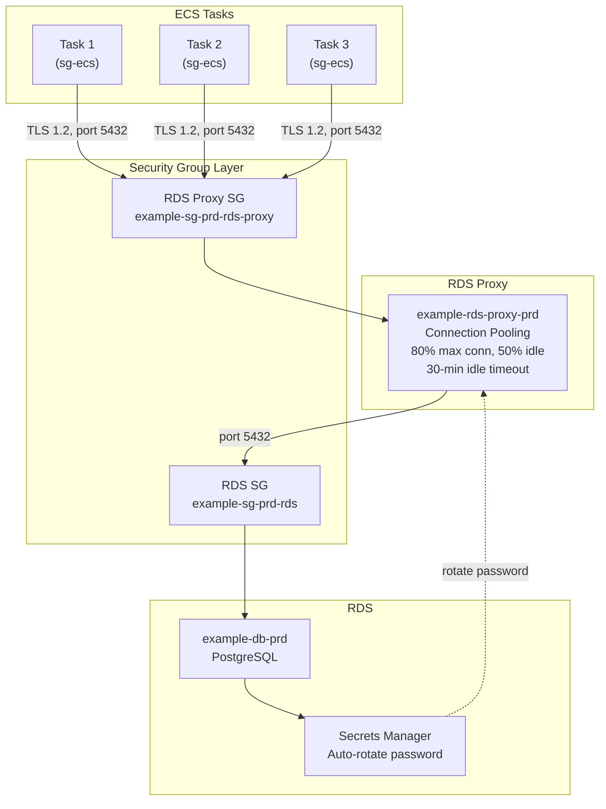
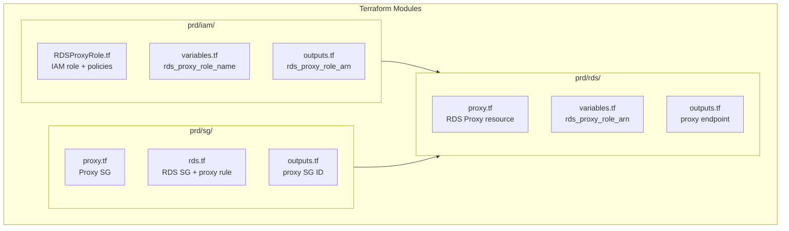
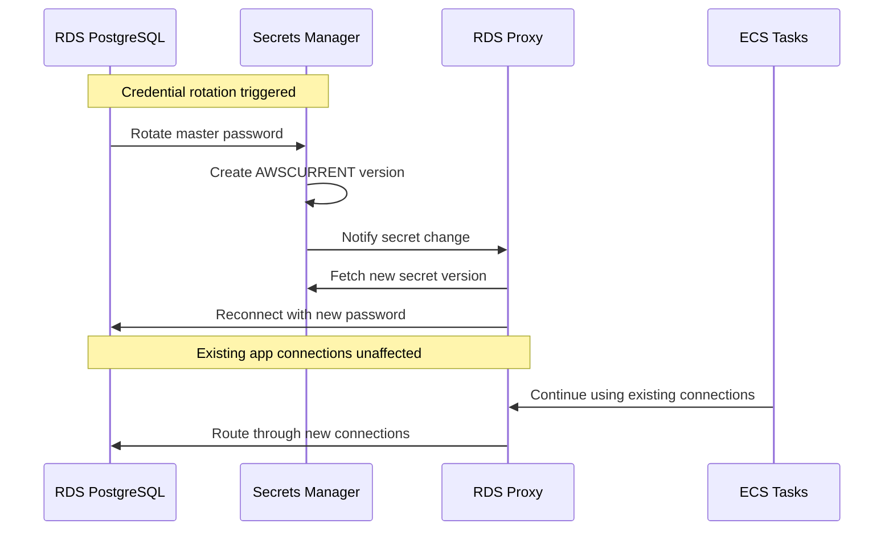
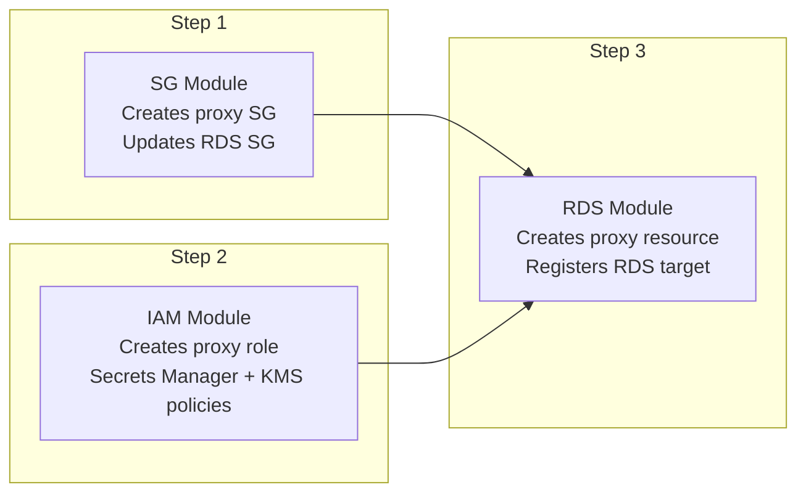

# RDS Proxy on AWS — Connection Pooling for ECS with Terraform

## Table of Contents

| Section | Topic | Description |
| :---: | :--- | :--- |
| **01** | [Why RDS Proxy](#1-why-rds-proxy) | The connection problem with serverless and containers. |
| **02** | [Architecture](#2-architecture) | ECS tasks → RDS Proxy → RDS PostgreSQL. |
| **03** | [Terraform Module Structure](#3-terraform-module-structure) | Separated IAM, SG, and RDS modules. |
| **04** | [IAM Role](#4-iam-role) | Secrets Manager read + KMS decrypt permissions. |
| **05** | [Security Group](#5-security-group) | Ingress from ECS, egress to RDS. |
| **06** | [RDS Proxy Resource](#6-rds-proxy-resource) | Proxy config, auth, target group, registration. |
| **07** | [Credential Rotation](#7-credential-rotation) | Zero-downtime password rotation flow. |
| **08** | [Application Changes](#8-application-changes) | DATABASE_URL update and connection tuning. |
| **09** | [Apply Order](#9-apply-order) | Module dependency chain. |

---

## 1. Why RDS Proxy

ECS tasks and Lambda functions create many short-lived database connections. Without a proxy, each task opens its own connection to RDS — exhausting the database's connection limit.

| Problem | Without Proxy | With Proxy |
| :--- | :--- | :--- |
| **Connection exhaustion** | 50 tasks × 10 conn = 500 connections | 50 tasks × 3 conn → proxy pools → 500 (but proxy manages) |
| **Credential rotation** | App restart required | Zero downtime |
| **Failover** | DNS TTL delay (60-120s) | Automatic, faster |
| **Connection overhead** | TCP + TLS handshake per query | Persistent connections to RDS |

### When to Use RDS Proxy

| Scenario | Use Proxy? |
| :--- | :--- |
| ECS with many tasks | Yes |
| Lambda with RDS | Yes |
| Credential auto-rotation | Yes |
| Aurora serverless | Yes |
| Single long-lived connection | Not needed |
| On-premises app | No (AWS only) |

---

## 2. Architecture



### Connection Flow

| Step | From | To | Port | Protocol |
| :--- | :--- | :--- | :--- | :--- |
| 1 | ECS Task | RDS Proxy | 5432 | TCP + TLS 1.2 |
| 2 | RDS Proxy | RDS | 5432 | TCP + TLS |
| 3 | Secrets Manager | RDS Proxy | - | API (detect rotation) |

### Security Group Rules

| Security Group | Direction | Port | Source/Destination | Purpose |
| :--- | :--- | :--- | :--- | :--- |
| **Proxy SG** | Ingress | 5432 | ECS SG | Accept connections from tasks |
| **Proxy SG** | Egress | 5432 | VPC CIDR | Connect to RDS |
| **RDS SG** | Ingress | 5432 | VPC CIDR | Accept connections from proxy |
| **RDS SG** | Egress | - | - | RDS does not initiate outbound |

---

## 3. Terraform Module Structure



### Why Separate Modules

| Reason | Detail |
| :--- | :--- |
| **Least privilege** | IAM module only manages roles |
| **Network isolation** | SG module only manages security groups |
| **Reusability** | IAM and SG can be used by other services |
| **Apply order** | SG and IAM are independent, can apply in parallel |
| **Audit** | Clear separation of concerns for compliance |

---

## 4. IAM Role

### RDSProxyRole.tf

```hcl
# RDS Proxy Role
# Used by RDS Proxy to read the RDS master secret from Secrets Manager
# and decrypt it via KMS when connecting to RDS on behalf of applications.
#
# The proxy authenticates to RDS using the auto-rotated master secret.
# When RDS rotates the password, the proxy detects the new secret version
# automatically — no application restart or deployment required.

# Custom policy: Secrets Manager read for RDS-managed master secret
resource "aws_iam_policy" "rds_proxy_secrets_read" {
  name        = "${var.project}-rds-proxy-secrets-read-${var.environment}"
  description = "Allow RDS Proxy to read the RDS master secret from Secrets Manager"

  policy = jsonencode({
    Version = "2012-10-17"
    Statement = [
      {
        Sid    = "ReadRDSMasterSecret"
        Effect = "Allow"
        Action = [
          "secretsmanager:GetSecretValue",
          "secretsmanager:DescribeSecret"
        ]
        Resource = [
          "arn:aws:secretsmanager:${var.aws_region}:${var.aws_account_id}:secret:rds!db-${var.db_instance_identifier}-*"
        ]
      }
    ]
  })

  tags = var.tags
}

# Custom policy: KMS decrypt for Secrets Manager key
resource "aws_iam_policy" "rds_proxy_kms_decrypt" {
  name        = "${var.project}-rds-proxy-kms-decrypt-${var.environment}"
  description = "Allow RDS Proxy to decrypt Secrets Manager key via KMS"

  policy = jsonencode({
    Version = "2012-10-17"
    Statement = [
      {
        Sid    = "KMSDecryptSecretsManagerKey"
        Effect = "Allow"
        Action = [
          "kms:Decrypt",
          "kms:DescribeKey"
        ]
        Resource = [
          "arn:aws:kms:${var.aws_region}:${var.aws_account_id}:key/alias/aws/secretsmanager"
        ]
      }
    ]
  })

  tags = var.tags
}

# IAM role for RDS Proxy
module "rds_proxy_role" {
  source  = "terraform-aws-modules/iam/aws//modules/iam-assumable-role"
  version = "~> 5.0"

  role_name = var.rds_proxy_role_name

  trust_role_services = ["rds.amazonaws.com"]

  custom_role_policy_arns = [
    aws_iam_policy.rds_proxy_secrets_read.arn,
    aws_iam_policy.rds_proxy_kms_decrypt.arn
  ]

  tags = var.rds_proxy_role_tags
}
```

### IAM Permissions Breakdown

| Policy | Action | Resource | Purpose |
| :--- | :--- | :--- | :--- |
| `rds_proxy_secrets_read` | `secretsmanager:GetSecretValue`, `DescribeSecret` | `rds!db-{instance}-*` | Read RDS master secret |
| `rds_proxy_kms_decrypt` | `kms:Decrypt`, `kms:DescribeKey` | `alias/aws/secretsmanager` | Decrypt secret value |

### Trust Relationship

```json
{
  "Version": "2012-10-17",
  "Statement": [
    {
      "Sid": "RDSProxyAssumeRole",
      "Effect": "Allow",
      "Principal": {
        "Service": "rds.amazonaws.com"
      },
      "Action": "sts:AssumeRole"
    }
  ]
}
```

---

## 5. Security Group

### Proxy Security Group

```hcl
module "rds_proxy_security_group" {
  source  = "terraform-aws-modules/security-group/aws"
  version = "~> 6.0"

  name            = "example-sg-prd-rds-proxy"
  use_name_prefix = false
  description     = "Security group for RDS Proxy — example-project prd"
  vpc_id          = local.vpc_id

  ingress_rules = {
    postgres_from_ecs = {
      description                  = "PostgreSQL from ECS tasks"
      from_port                    = 5432
      to_port                      = 5432
      ip_protocol                  = "tcp"
      referenced_security_group_id = module.ecs_security_group.id
    }
  }

  egress_rules = {
    postgres_to_rds = {
      description = "PostgreSQL to RDS instance"
      from_port   = 5432
      to_port     = 5432
      ip_protocol = "tcp"
      cidr_blocks = [local.vpc_cidr]
    }
  }

  tags = var.tags
}
```

### RDS Security Group — Add Proxy Rule

```hcl
# In sg/rds.tf
ingress_rules = {
  # ... existing rules ...

  postgres_from_proxy = {
    description                  = "PostgreSQL from RDS Proxy"
    from_port                    = 5432
    to_port                      = 5432
    ip_protocol                  = "tcp"
    referenced_security_group_id = module.rds_proxy_security_group.id
  }
}
```

---

## 6. RDS Proxy Resource

### proxy.tf

```hcl
# ─── Data Source: Proxy Security Group ────────────────────────────────────
# The SG is created by prd/sg module — must be applied before this module.

data "aws_security_group" "rds_proxy" {
  filter {
    name   = "group-name"
    values = ["example-sg-prd-rds-proxy"]
  }
}

# ─── RDS Proxy ──────────────────────────────────────────────────────────────

resource "aws_db_proxy" "this" {
  name                   = "example-rds-proxy-${var.environment}"
  debug_logging          = var.rds_proxy_debug_logging
  engine_family          = "POSTGRESQL"
  idle_client_timeout    = var.rds_proxy_idle_client_timeout
  require_tls            = var.rds_proxy_require_tls
  role_arn               = var.rds_proxy_role_arn
  vpc_security_group_ids = [data.aws_security_group.rds_proxy.id]
  vpc_subnet_ids         = var.subnet_ids

  auth {
    auth_scheme = "SECRETS"
    iam_auth    = "DISABLED"
    secret_arn  = module.db.db_instance_master_user_secret_arn
  }

  tags = merge(var.rds_tags, {
    Name = "example-rds-proxy-${var.environment}"
  })
}

# ─── Target Group ───────────────────────────────────────────────────────────

resource "aws_db_proxy_default_target_group" "this" {
  db_proxy_name = aws_db_proxy.this.name

  connection_pool_config {
    connection_borrow_timeout    = var.rds_proxy_connection_borrow_timeout
    init_query                   = ""
    max_connections_percent      = var.rds_proxy_max_connections_percent
    max_idle_connections_percent = var.rds_proxy_max_idle_connections_percent
    session_pinning_filters      = []
  }
}

# ─── Target Registration ───────────────────────────────────────────────────

resource "aws_db_proxy_target" "this" {
  db_proxy_name          = aws_db_proxy.this.name
  target_group_name      = aws_db_proxy_default_target_group.this.db_proxy_name
  db_instance_identifier = module.db.db_instance_identifier
}
```

### Configuration Breakdown

| Parameter | Value | Purpose |
| :--- | :--- | :--- |
| `engine_family` | `POSTGRESQL` | PostgreSQL protocol support |
| `idle_client_timeout` | 1800 (30 min) | Close idle client connections |
| `require_tls` | `true` | Enforce TLS 1.2+ |
| `auth_scheme` | `SECRETS` | Use Secrets Manager for auth |
| `iam_auth` | `DISABLED` | Use password, not IAM auth |
| `max_connections_percent` | 80 | Leave headroom for admin |
| `max_idle_connections_percent` | 50 | Keep some connections warm |
| `connection_borrow_timeout` | 120 (sec) | Timeout waiting for pooled conn |

---

## 7. Credential Rotation

### How It Works



### Rotation Timeline

| Step | What Happens | Downtime |
| :--- | :--- | :--- |
| 1 | RDS rotates master password | None |
| 2 | Secrets Manager stores new version | None |
| 3 | Proxy detects AWSCURRENT change | None |
| 4 | Proxy reconnects to RDS with new password | None (new connections) |
| 5 | Existing client connections continue | None |

### What Stays the Same

| Component | Affected? | Detail |
| :--- | :--- | :--- |
| ECS tasks | No | Continue using proxy endpoint |
| DATABASE_URL | No | Proxy endpoint doesn't change |
| Connection pool | No | Existing connections kept alive |
| Application | No | No restart, no redeploy |

---

## 8. Application Changes

### DATABASE_URL Update

```bash
# Before (direct to RDS):
DATABASE_URL=postgresql://appuser:<pass>@example-rds-prd-db.xxxx.ap-southeast-3.rds.amazonaws.com:5432/appdb

# After (through proxy):
DATABASE_URL=postgresql://appuser:<pass>@example-rds-proxy-prd.proxy-xxxx.ap-southeast-3.rds.amazonaws.com:5432/appdb?connection_limit=3
```

### Connection Tuning

| Setting | Before (Direct) | After (Proxy) | Why |
| :--- | :--- | :--- | :--- |
| `connection_limit` | 10 (default) | 3 | Proxy handles pooling |
| `pool_timeout` | 10 | 30 | Proxy borrows from pool |
| `pool_recycle` | 1800 | 3600 | Proxy manages lifecycle |

### Prisma Example

```typescript
// prisma/schema.prisma
datasource db {
  provider = "postgresql"
  url      = env("DATABASE_URL")
  // connection_limit is set in DATABASE_URL query string
  // ?connection_limit=3
}
```

### Connection Pool Math

| Component | Value | Calculation |
| :--- | :--- | :--- |
| ECS tasks | 50 | - |
| Connections per task | 3 | `connection_limit=3` |
| Total app connections | 150 | 50 × 3 |
| Proxy max connections | 400 | 80% of RDS max (500) |
| Proxy idle connections | 200 | 50% of max |
| Headroom | 250 | 400 - 150 |

---

## 9. Apply Order

### Module Dependency Chain



### Apply Commands

```bash
# Step 1: Apply SG module first (creates proxy SG)
terraform -chdir=terraform/modules/sg apply -auto-approve

# Step 2: Apply IAM module (creates proxy role)
terraform -chdir=terraform/modules/iam apply -auto-approve

# Step 3: Apply RDS module (creates proxy + target registration)
terraform -chdir=terraform/modules/rds apply -auto-approve
```

### Apply Order Summary

| Order | Module | Resources Created | Depends On |
| :--- | :--- | :--- | :--- |
| 1 | SG | Proxy SG, RDS SG rule | None |
| 2 | IAM | Proxy role, Secrets Manager policy, KMS policy | None |
| 3 | RDS | Proxy, target group, target registration | SG + IAM |

### Outputs

| Module | Output | Value |
| :--- | :--- | :--- |
| SG | `rds_proxy_security_group_id` | `sg-xxxx` |
| SG | `rds_proxy_security_group_arn` | `arn:aws:ec2:...` |
| IAM | `rds_proxy_role_arn` | `arn:aws:iam::xxxx:role/...` |
| IAM | `rds_proxy_role_name` | `example-rds-proxy-role-prd` |
| RDS | `db_proxy_endpoint` | `proxy-xxxx.rds.amazonaws.com` |
| RDS | `db_proxy_security_group_id` | `sg-xxxx` |

---

## References

- [RDS Proxy Documentation](https://docs.aws.amazon.com/AmazonRDS/latest/UserGuide/rds-proxy.html)
- [RDS Proxy Authentication](https://docs.aws.amazon.com/AmazonRDS/latest/UserGuide/rds-proxy-auth.html)
- [Credential Rotation](https://docs.aws.amazon.com/secretsmanager/latest/userguide/rotate-secrets.html)
- [Terraform AWS RDS Proxy](https://registry.terraform.io/providers/hashicorp/aws/latest/docs/resources/db_proxy)
