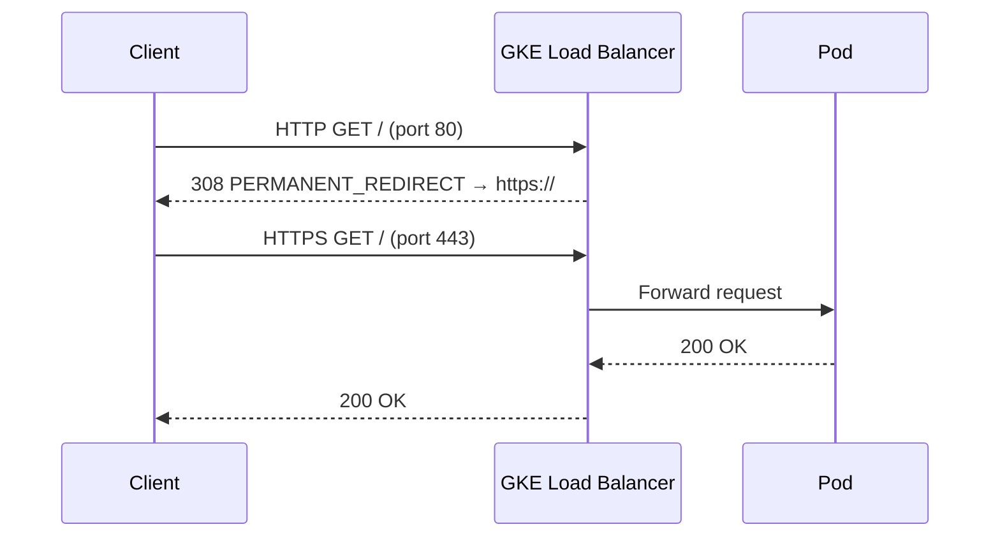

# GKE FrontendConfig — Auto Redirect HTTP to HTTPS

## Table of Contents

| Section | Topic | Description |
| :---: | :--- | :--- |
| **01** | [Why FrontendConfig](#1-why-frontendconfig) | The problem with manual HTTP→HTTPS redirect on GKE. |
| **02** | [FrontendConfig Resource](#2-frontendconfig-resource) | Spec breakdown and response codes. |
| **03** | [Ingress Integration](#3-ingress-integration) | Binding FrontendConfig to an Ingress. |
| **04** | [Gateway API Equivalent](#4-gateway-api-equivalent) | How HTTP→HTTPS redirect works with Gateway API. |
| **05** | [Testing & Validation](#5-testing--validation) | Verifying the redirect behavior. |
| **06** | [Common Pitfalls](#6-common-pitfalls) | Things that break the redirect. |

---

## 1. Why FrontendConfig

On GKE, the load balancer handles TLS termination. Without explicit configuration, HTTP traffic on port 80 reaches your backend directly — no redirect happens.

| Approach | How | Drawback |
| :--- | :--- | :--- |
| App-level redirect | Spring Boot / Express middleware | Extra latency, app must handle TLS context |
| Nginx Ingress annotation | `nginx.ingress.kubernetes.io/ssl-redirect` | Vendor-specific, not portable |
| **FrontendConfig** | GKE-native, LB-level | GKE-specific, not part of upstream K8s |

FrontendConfig is the **recommended GKE approach** — the redirect happens at the load balancer, before traffic ever reaches your pods.

---

## 2. FrontendConfig Resource

```yaml
apiVersion: networking.gke.io/v1beta1
kind: FrontendConfig
metadata:
  name: [environment]-[app_name]-frontendconfig
  namespace: [namespace]
  labels:
    app: [app_name]
    env: [environment]
    team: [team_name]
    app.kubernetes.io/name: [app_name]
    app.kubernetes.io/instance: [environment]-[app_name]
    app.kubernetes.io/component: [component_name]
    app.kubernetes.io/part-of: [Company/Project]
    app.kubernetes.io/managed-by: DevOpsTeam
spec:
  redirectToHttps:
    enabled: true
    responseCodeName: PERMANENT_REDIRECT
```

### Response Code Options

| Code Name | HTTP Code | Purpose |
| :--- | :--- | :--- |
| `MOVED_PERMANENTLY_DEFAULT` | 301 | Default, cacheable by browsers |
| `PERMANENT_REDIRECT` | 308 | Preserves HTTP method (POST stays POST) |
| `TEMPORARY_REDIRECT` | 307 | Temporary, never cacheable |

### Which Code to Use

| Scenario | Code | Why |
| :--- | :--- | :--- |
| Standard website | `MOVED_PERMANENTLY_DEFAULT` | Browsers cache the redirect |
| API with POST/PUT | `PERMANENT_REDIRECT` | 308 preserves request method |
| Maintenance mode | `TEMPORARY_REDIRECT` | Clients retry the original URL |

**Recommendation:** Use `PERMANENT_REDIRECT` (308) for most cases — it's the safest default that preserves HTTP methods.

---

## 3. Ingress Integration

FrontendConfig is attached to an Ingress via the `networking.gke.io/frontend-config` annotation.

### Full Example

```yaml
apiVersion: networking.k8s.io/v1
kind: Ingress
metadata:
  name: [environment]-[app_name]-ingress
  namespace: [namespace]
  annotations:
    kubernetes.io/ingress.class: gce
    networking.gke.io/managed-certificates: [certificate_name]
    networking.gke.io/frontend-config: [environment]-[app_name]-frontendconfig
  labels:
    app: [app_name]
    env: [environment]
    team: [team_name]
    app.kubernetes.io/name: [app_name]
    app.kubernetes.io/instance: [environment]-[app_name]
    app.kubernetes.io/component: [component_name]
    app.kubernetes.io/part-of: [Company/Project]
    app.kubernetes.io/managed-by: DevOpsTeam
spec:
  rules:
  - host: [app_name].example.id
    http:
      paths:
      - path: /
        pathType: Prefix
        backend:
          service:
            name: [environment]-[app_name]-svc
            port:
              number: 80
```

### Annotation Reference

| Annotation | Value | Purpose |
| :--- | :--- | :--- |
| `kubernetes.io/ingress.class` | `gce` | Use GKE L7 load balancer |
| `networking.gke.io/managed-certificates` | cert name | TLS certificate binding |
| `networking.gke.io/frontend-config` | FrontendConfig name | HTTP→HTTPS redirect |

### What Happens at the LB



---

## 4. Gateway API Equivalent

If you're using Gateway API instead of Ingress, HTTP→HTTPS redirect is handled at the **Gateway listener level** — no FrontendConfig needed.

### Gateway with Both Listeners

```yaml
apiVersion: gateway.networking.k8s.io/v1
kind: Gateway
metadata:
  name: example-gateway
  namespace: gateway-api
spec:
  gatewayClassName: gke-l7-global-external-managed
  listeners:
  - name: http
    protocol: HTTP
    port: 80
    hostname: "*.example.id"
    allowedRoutes:
      namespaces:
        from: All
  - name: https
    protocol: HTTPS
    port: 443
    hostname: "*.example.id"
    tls:
      mode: Terminate
      options:
        networking.gke.io/pre-shared-certs: [certificate_name]
    allowedRoutes:
      namespaces:
        from: All
```

### HTTPRoute with Redirect

```yaml
apiVersion: gateway.networking.k8s.io/v1
kind: HTTPRoute
metadata:
  name: redirect-http-to-https
  namespace: gateway-api
spec:
  parentRefs:
  - name: example-gateway
    sectionName: http
  hostnames:
  - "*.example.id"
  rules:
  - filters:
    - type: RequestRedirect
      requestRedirect:
        scheme: https
        statusCode: 301
```

### Comparison

| Feature | Ingress + FrontendConfig | Gateway API + HTTPRoute |
| :--- | :--- | :--- |
| Redirect mechanism | LB-level via FrontendConfig | HTTPRoute filter |
| Configuration | Annotation + CRD | HTTPRoute `filters` |
| Port handling | LB handles both ports | Separate listeners |
| Granularity | Per-Ingress | Per-HTTPRoute |
| TLS termination | Ingress spec | Gateway listener |

---

## 5. Testing & Validation

### Verify Redirect

```bash
# Should return 308 redirect to https
curl -I http://[app_name].example.id/

# Expected output
HTTP/1.1 308 Permanent Redirect
Location: https://[app_name].example.id/
```

### Follow Redirect

```bash
# Should follow redirect and return 200
curl -L http://[app_name].example.id/

# Direct HTTPS should work
curl https://[app_name].example.id/
```

### Check FrontendConfig Status

```bash
kubectl get frontendconfig -n [namespace]
kubectl describe frontendconfig [name] -n [namespace]
```

### Check Ingress Annotations

```bash
kubectl get ingress -n [namespace] -o yaml | grep frontend-config
```

---

## 6. Common Pitfalls

| Pitfall | Symptom | Fix |
| :--- | :--- | :--- |
| Missing `networking.gke.io/frontend-config` annotation | No redirect, HTTP serves directly | Add annotation to Ingress |
| Wrong FrontendConfig name in annotation | No redirect, no error | Verify name matches `metadata.name` |
| FrontendConfig in wrong namespace | Annotation found but not applied | FrontendConfig must be in same namespace as Ingress |
| Using `gce` class with FrontendConfig | Works | FrontendConfig only works with `gce` class |
| FrontendConfig with Gateway API | Ignored | Use HTTPRoute filter instead |
| Health check fails after redirect | Pods marked unhealthy | Ensure health check path works over HTTP too |
| Mixed content warnings | Browser blocks resources | Ensure all assets use HTTPS URLs |

---

## References

- [GKE FrontendConfig Documentation](https://cloud.google.com/kubernetes-engine/docs/how-to/ingress-features#https_redirect)
- [GKE Ingress Configuration](https://cloud.google.com/kubernetes-engine/docs/how-to/ingress-configuration)
- [Gateway API HTTPRoute Filter](https://gateway-api.sigs.k8s.io/reference/spec/#gateway.networking.k8s.io/v1.HTTPRouteFilter)
- [HTTP Redirect Status Codes](https://developer.mozilla.org/en-US/docs/Web/HTTP/Status/308)
