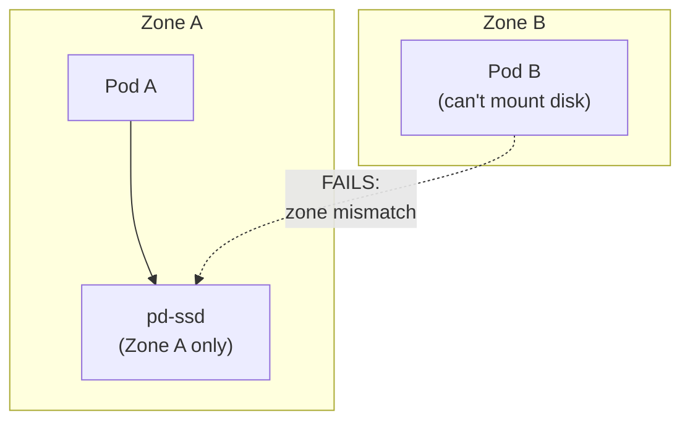
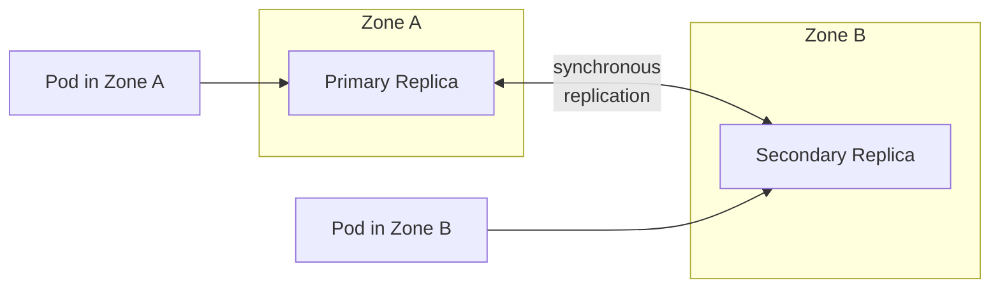
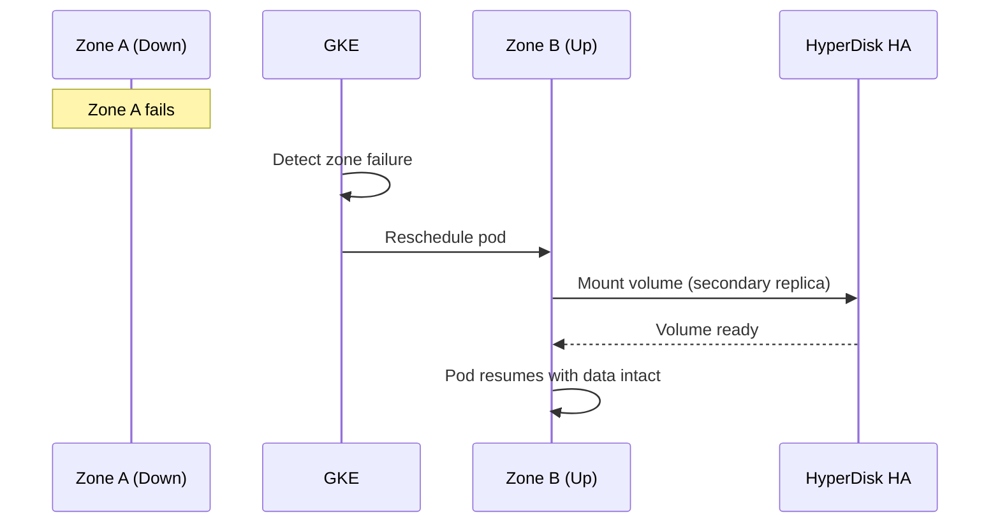

# HyperDisk Balanced High Availability for Multi-AZ GKE

## Table of Contents

| Section | Topic | Description |
| :---: | :--- | :--- |
| **01** | [Why HyperDisk HA](#1-why-hyperdisk-ha) | The problem with single-zone persistent disks. |
| **02** | [Architecture](#2-architecture) | How HyperDisk HA replicates across zones. |
| **03** | [StorageClass Configuration](#3-storageclass-configuration) | Provisioner, parameters, and allowed topologies. |
| **04** | [StatefulSet Integration](#4-statefulset-integration) | Using HyperDisk HA with stateful workloads. |
| **05** | [Performance Tuning](#5-performance-tuning) | IOPS and throughput provisioning. |
| **06** | [Disk Type Comparison](#6-disk-type-comparison) | HyperDisk HA vs Balanced vs Extreme vs pd-ssd. |

---

## 1. Why HyperDisk HA

Standard GKE persistent volumes are zone-scoped. If a zone goes down, pods in that zone lose access to their disks — even if the pod is rescheduled to another zone.

| Disk Type | Zone Scope | Cross-Zone | Failure Impact |
| :--- | :--- | :--- | :--- |
| `pd-standard` | Single zone | No | Full data loss if zone fails |
| `pd-ssd` | Single zone | No | Full data loss if zone fails |
| `pd-balanced` | Single zone | No | Full data loss if zone fails |
| **`hyperdisk-balanced-high-availability`** | **Multi-zone** | **Yes** | **Survives zone failure** |

### The Multi-AZ Problem



HyperDisk HA solves this by replicating data across two zones — the volume is available in both, and a pod in either zone can mount it.

---

## 2. Architecture

HyperDisk Balanced High Availability replicates data synchronously across two zones within a region.



### How It Works

| Aspect | Detail |
| :--- | :--- |
| **Replication** | Synchronous, cross-zone |
| **Consistency** | Strong — writes acknowledged after both replicas confirm |
| **Failover** | Automatic — GKE remounts in surviving zone |
| **RPO** | 0 (no data loss on zone failure) |
| **RTO** | Seconds (automatic remount) |

### Zone Affinity

The StorageClass uses `allowedTopologies` to restrict provisioning to two specific zones:

```yaml
allowedTopologies:
- matchLabelExpressions:
  - key: topology.gke.io/zone
    values:
    - [zone-1]
    - [zone-2]
```

This ensures the volume is only created where it can replicate — the CSI driver handles zone selection within the allowed list.

---

## 3. StorageClass Configuration

### Full StorageClass

```yaml
apiVersion: storage.k8s.io/v1
kind: StorageClass
metadata:
  name: [storage-class-name]-ha-storage
provisioner: pd.csi.storage.gke.io
volumeBindingMode: WaitForFirstConsumer
allowVolumeExpansion: true
parameters:
  type: hyperdisk-balanced-high-availability
  provisioned-throughput-on-create: "250Mi"
  provisioned-iops-on-create: "7000"
allowedTopologies:
- matchLabelExpressions:
  - key: topology.gke.io/zone
    values:
    - [zone-1]
    - [zone-2]
```

### Field Breakdown

| Field | Value | Purpose |
| :--- | :--- | :--- |
| `provisioner` | `pd.csi.storage.gke.io` | GKE CSI driver for PersistentDisk |
| `volumeBindingMode` | `WaitForFirstConsumer` | Delay binding until pod is scheduled |
| `allowVolumeExpansion` | `true` | Allow `kubectl patch` to resize |
| `type` | `hyperdisk-balanced-high-availability` | Multi-zone HyperDisk |
| `provisioned-throughput-on-create` | `250Mi` | Read/write throughput cap |
| `provisioned-iops-on-create` | `7000` | IOPS cap |

### Why `WaitForFirstConsumer`

| Mode | Behavior | Risk |
| :--- | :--- | :--- |
| `Immediate` | Volume created in first available zone | May not match pod's zone |
| **`WaitForFirstConsumer`** | **Volume created in pod's zone** | **None — zone-aware binding** |

With HyperDisk HA, `WaitForFirstConsumer` ensures the volume is provisioned in the zone where the pod actually runs — and replicates to the paired zone.

---

## 4. StatefulSet Integration

HyperDisk HA is designed for stateful workloads that must survive zone failures.

### StatefulSet with HyperDisk HA

```yaml
apiVersion: apps/v1
kind: StatefulSet
metadata:
  name: [environment]-[app_name]
  namespace: [namespace]
  labels:
    app: [app_name]
    env: [environment]
    team: [team_name]
    app.kubernetes.io/name: [app_name]
    app.kubernetes.io/instance: [environment]-[app_name]
    app.kubernetes.io/component: [component_name]
    app.kubernetes.io/part-of: [Company/Project]
    app.kubernetes.io/managed-by: DevOpsTeam
spec:
  serviceName: [app_name]
  replicas: 2
  selector:
    matchLabels:
      app: [app_name]
  template:
    metadata:
      labels:
        app: [app_name]
    spec:
      affinity:
        podAntiAffinity:
          requiredDuringSchedulingIgnoredDuringExecution:
            - labelSelector:
                matchLabels:
                  app: [app_name]
              topologyKey: "kubernetes.io/hostname"
      containers:
      - name: [app_name]
        image: [image]
        ports:
        - containerPort: [port]
        volumeMounts:
        - name: data
          mountPath: /data
  volumeClaimTemplates:
  - metadata:
      name: data
    spec:
      accessModes: ["ReadWriteOnce"]
      storageClassName: [storage-class-name]-ha-storage
      resources:
        requests:
          storage: 50Gi
```

### Pod Anti-Affinity

| Policy | Config | Effect |
| :--- | :--- | :--- |
| `requiredDuringSchedulingIgnoredDuringExecution` | `topologyKey: hostname` | Each pod on a different node |

This ensures the two replicas run on different nodes — combined with HyperDisk HA, you get **node-level + zone-level redundancy**.

### What Happens on Zone Failure



---

## 5. Performance Tuning

HyperDisk HA allows you to provision IOPS and throughput independently.

### Provisioned Parameters

| Parameter | Value | Range | Purpose |
| :--- | :--- | :--- | :--- |
| `provisioned-iops-on-create` | `7000` | 1200–120,000 | Read/write operations per second |
| `provisioned-throughput-on-create` | `250Mi` | 100–2,400 MiB/s | Read/write throughput |

### Workload Profiles

| Workload | IOPS | Throughput | Rationale |
| :--- | :--- | :--- | :--- |
| **Database (OLTP)** | 10,000–50,000 | 250–500 MiB/s | High random I/O, moderate sequential |
| **Analytics (OLAP)** | 5,000–10,000 | 500–1,000 MiB/s | Sequential scans, large reads |
| **Cache (Redis)** | 12,000–70,000 | 250 MiB/s | High IOPS, low throughput |
| **Media processing** | 5,000 | 1,000–2,000 MiB/s | Large sequential I/O |

### Resizing After Creation

```bash
# Resize the PVC
kubectl patch pvc data-[app_name]-0 -n [namespace] \
  --type merge \
  -p '{"spec":{"resources":{"requests":{"storage":"100Gi"}}}}'

# Verify resize
kubectl get pvc -n [namespace]
```

> **Note:** You can increase size but not decrease. IOPS and throughput are set at creation and cannot be changed later.

---

## 6. Disk Type Comparison

| Feature | pd-standard | pd-ssd | pd-balanced | HyperDisk Balanced | **HyperDisk Balanced HA** |
| :--- | :--- | :--- | :--- | :--- | :--- |
| **Media** | HDD | SSD | SSD | SSD | SSD |
| **Zone scope** | Single | Single | Single | Single | **Multi-zone** |
| **Max IOPS** | 15,000 | 100,000 | 80,000 | 120,000 | 120,000 |
| **Max throughput** | 300 MiB/s | 1,200 MiB/s | 1,200 MiB/s | 2,400 MiB/s | 2,400 MiB/s |
| **Volume size** | 10 GiB–64 TiB | 10 GiB–64 TiB | 10 GiB–64 TiB | 10 GiB–64 TiB | 10 GiB–64 TiB |
| **Cross-zone** | No | No | No | No | **Yes** |
| **Best for** | Bulk storage, logs | General workloads | Most workloads | High-perf databases | **Stateful HA workloads** |

### Cost Estimation

| Disk Type | $/GB/month (approx) | HA Premium |
| :--- | :--- | :--- |
| pd-standard | $0.04 | N/A |
| pd-ssd | $0.17 | N/A |
| pd-balanced | $0.10 | N/A |
| HyperDisk Balanced | $0.12 | N/A |
| **HyperDisk Balanced HA** | $0.12 | **+replication cost** |

> HyperDisk HA costs include replication across two zones — check current pricing for exact rates.

### When to Use HyperDisk HA

| Use Case | Recommended Disk | Why |
| :--- | :--- | :--- |
| Log aggregation | pd-standard | Cheap, durable, not latency-sensitive |
| CI/CD artifacts | pd-balanced | Good balance of cost and performance |
| General workloads | pd-ssd | Low latency, high IOPS |
| Mission-critical databases | HyperDisk Balanced | Provisioned IOPS/throughput |
| **Stateful workloads requiring HA** | **HyperDisk Balanced HA** | **Survives zone failure** |

---

## References

- [HyperDisk Overview](https://cloud.google.com/kubernetes-engine/docs/concepts/storage-overview#hyperdisk)
- [HyperDisk Balanced HA](https://cloud.google.com/kubernetes-engine/docs/how-to/persistent-volumes/hyperdisk-balanced-high-availability)
- [StorageClass Parameters](https://cloud.google.com/kubernetes-engine/docs/how-to/persistent-volumes/hyperdisk-balanced-high-availability#storageclass-parameters)
- [Zone-redundant Persistent Volumes](https://cloud.google.com/kubernetes-engine/docs/how-to/persistent-volumes/zone-redundant-pvs)
- [GKE CSI Driver](https://cloud.google.com/kubernetes-engine/docs/how-to/persistent-volumes/gce-pd-csi-driver)
