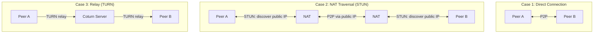
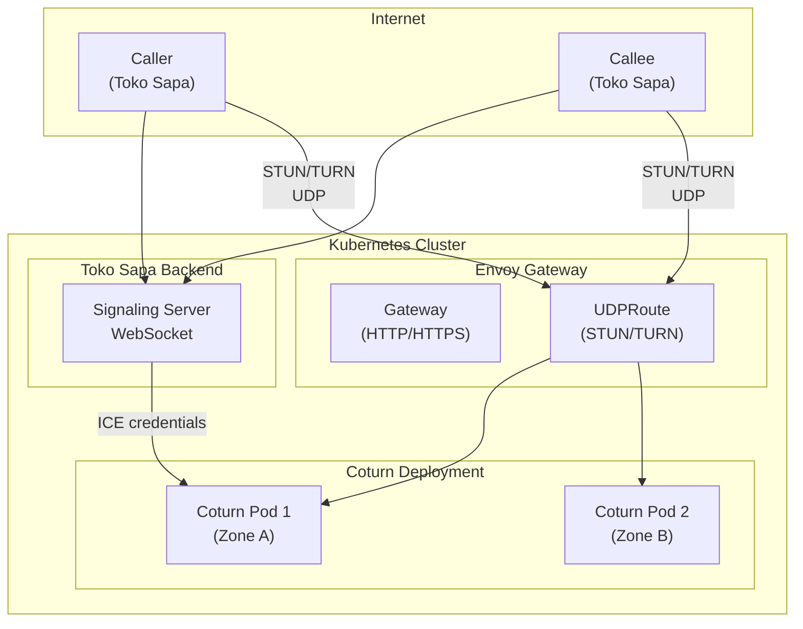
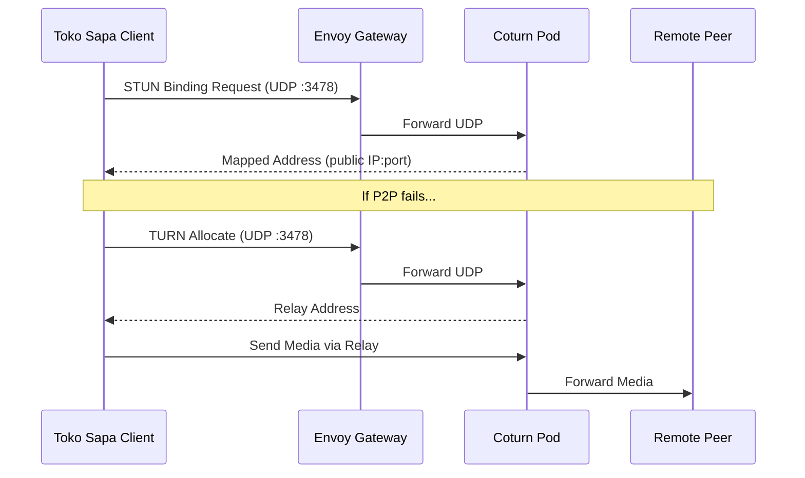

# WebRTC TURN/STUN with Coturn on Kubernetes — Toko Customer Calls

## Table of Contents

| Section | Topic | Description |
| :---: | :--- | :--- |
| **01** | [Why STUN/TURN](#1-why-stunturn) | NAT traversal challenges for WebRTC video calls. |
| **02** | [Architecture](#2-architecture) | Coturn + STUNner + Envoy Gateway topology. |
| **03** | [Coturn Deployment](#3-coturn-deployment) | Deploying Coturn on Kubernetes. |
| **04** | [Envoy Gateway Integration](#4-envoy-gateway-integration) | UDPRoute for TURN/STUN traffic routing. |
| **05** | [Application Integration](#5-application-integration) | WebRTC configuration for Toko Sapa. |
| **06** | [Security & Hardening](#6-security--hardening) | Credentials, rate limiting, and monitoring. |

---

## 1. Why STUN/TURN

WebRTC peer-to-peer calls fail when participants are behind symmetric NATs, firewalls, or corporate proxies. STUN and TURN solve this.



### Protocol Roles

| Protocol | Purpose | When Used |
| :--- | :--- | :--- |
| **STUN** | Discover public IP:port | NAT traversal, ICE candidate gathering |
| **TURN** | Relay media through server | P2P fails (symmetric NAT, firewall) |
| **ICE** | Negotiate best path | Combines STUN + TURN candidates |

### Toko Sapa Call Scenarios

| Scenario | Connection | STUN/TURN Needed |
| :--- | :--- | :--- |
| Same WiFi | Direct P2P | STUN only (candidate gathering) |
| Mobile → WiFi | NAT traversal | STUN (likely succeeds) |
| Mobile → Corporate | Firewall blocked | TURN relay |
| Carrier → Carrier | Symmetric NAT | TURN relay |

**Rule of thumb:** ~15-20% of WebRTC calls need TURN relay. Without it, those calls fail entirely.

---

## 2. Architecture



### Component Responsibilities

| Component | Role | Protocol |
| :--- | :--- | :--- |
| **Signaling Server** | Exchange SDP offers/answers, ICE candidates | WebSocket (HTTPS) |
| **Coturn** | STUN/TURN relay server | UDP/TCP |
| **Envoy Gateway** | Route UDP traffic to Coturn | UDPRoute (Gateway API) |
| **STUNner** | (Optional) Kubernetes-native STUN/TURN | UDPRoute |

### Why Envoy Gateway for TURN

| Reason | Detail |
| :--- | :--- |
| **UDPRoute support** | Gateway API experimental channel includes UDPRoute |
| **L4 routing** | Route UDP traffic to specific backends |
| **TLS termination** | Handle TLS for signaling, UDP for media |
| **Single entrypoint** | One Gateway handles HTTP + UDP traffic |

---

## 3. Coturn Deployment

### Configuration

```yaml
apiVersion: v1
kind: ConfigMap
metadata:
  name: coturn-config
  namespace: coturn
data:
  turnserver.conf: |
    # Listener
    listening-port=3478
    tls-listening-port=5349
    
    # Relay IP range (external)
    relay-ip=EXTERNAL_IP
    external-ip=EXTERNAL_IP/INTERNAL_IP
    
    # Authentication
    use-auth-secret
    static-auth-secret=SECRET_KEY
    
    # Security
    realm=toko-sapa.example.id
    lt-cred-mech
    user=turnuser:turnpassword
    
    # Performance
    proc-quota=20
    total-quota=1200
    bps-capacity=0
    
    # Logging
    log-file=stdout
    simple-log
    
    # Deny private IPs from relay
    denied-peer-ip=10.0.0.0-10.255.255.255
    denied-peer-ip=172.16.0.0-172.31.255.255
    denied-peer-ip=192.168.0.0-192.168.255.255
```

### Deployment

```yaml
apiVersion: apps/v1
kind: Deployment
metadata:
  name: coturn
  namespace: coturn
  labels:
    app: coturn
    app.kubernetes.io/name: coturn
    app.kubernetes.io/component: webrtc
    app.kubernetes.io/part-of: toko-sapa
spec:
  replicas: 2
  selector:
    matchLabels:
      app: coturn
  template:
    metadata:
      labels:
        app: coturn
    spec:
      affinity:
        podAntiAffinity:
          preferredDuringSchedulingIgnoredDuringExecution:
            - weight: 100
              podAffinityTerm:
                labelSelector:
                  matchLabels:
                    app: coturn
                topologyKey: kubernetes.io/hostname
      topologySpreadConstraints:
        - maxSkew: 1
          topologyKey: topology.kubernetes.io/zone
          whenUnsatisfiable: DoNotSchedule
          labelSelector:
            matchLabels:
              app: coturn
      containers:
      - name: coturn
        image: coturn/coturn:4.6.3
        ports:
        - containerPort: 3478
          name: stun-tcp
          protocol: TCP
        - containerPort: 3478
          name: stun-udp
          protocol: UDP
        - containerPort: 5349
          name: turn-tls
          protocol: TCP
        - containerPort: 49152-49200
          name: relay
          protocol: UDP
        env:
        - name: DETECT_EXTERNAL_IP
          value: "true"
        - name: DETECT_RELAY_IP
          value: "true"
        resources:
          requests:
            cpu: 100m
            memory: 128Mi
          limits:
            cpu: 500m
            memory: 256Mi
        volumeMounts:
        - name: config
          mountPath: /etc/turnserver.conf
          subPath: turnserver.conf
        livenessProbe:
          exec:
            command:
            - /bin/sh
            - -c
            - turnutils_uclient -T -t $(TURN_SECRET) 127.0.0.1 || exit 1
          initialDelaySeconds: 10
          periodSeconds: 30
        readinessProbe:
          tcpSocket:
            port: 3478
          initialDelaySeconds: 5
          periodSeconds: 10
      volumes:
      - name: config
        configMap:
          name: coturn-config
```

### Service

```yaml
apiVersion: v1
kind: Service
metadata:
  name: coturn
  namespace: coturn
  labels:
    app: coturn
spec:
  type: ClusterIP
  selector:
    app: coturn
  ports:
  - name: stun-tcp
    port: 3478
    targetPort: 3478
    protocol: TCP
  - name: stun-udp
    port: 3478
    targetPort: 3478
    protocol: UDP
  - name: turn-tls
    port: 5349
    targetPort: 5349
    protocol: TCP
```

### Coturn Configuration Reference

| Parameter | Value | Purpose |
| :--- | :--- | :--- |
| `listening-port` | 3478 | STUN/TURN port |
| `tls-listening-port` | 5349 | TLS-encrypted TURN |
| `relay-ip` | External IP | Public IP for relay |
| `external-ip` | External/Internal | NAT mapping |
| `use-auth-secret` | true | Time-based credential generation |
| `total-quota` | 1200 | Max concurrent relay sessions |
| `denied-peer-ip` | Private ranges | Prevent private IP relay |

---

## 4. Envoy Gateway Integration

### Gateway with UDPRoute

```yaml
apiVersion: gateway.networking.k8s.io/v1
kind: Gateway
metadata:
  name: toko-sapa-gateway
  namespace: envoy-gateway-system
spec:
  gatewayClassName: envoygateway
  listeners:
  - name: https
    protocol: HTTPS
    port: 443
    hostname: "toko-sapa.example.id"
    tls:
      mode: Terminate
      certificateRefs:
      - kind: Secret
        name: toko-sapa-tls
    allowedRoutes:
      namespaces:
        from: All
  - name: stun-turn-tcp
    protocol: TCP
    port: 3478
    allowedRoutes:
      namespaces:
        from: Selector
        selector:
          matchLabels:
            gateway: toko-sapa
  - name: stun-turn-udp
    protocol: UDP
    port: 3478
    allowedRoutes:
      namespaces:
        from: Selector
        selector:
          matchLabels:
            gateway: toko-sapa
  - name: turn-tls
    protocol: TLS
    port: 5349
    tls:
      mode: Passthrough
    allowedRoutes:
      namespaces:
        from: Selector
        selector:
          matchLabels:
            gateway: toko-sapa
```

### UDPRoute for Coturn

```yaml
apiVersion: gateway.networking.k8s.io/v1alpha2
kind: UDPRoute
metadata:
  name: coturn-udp-route
  namespace: coturn
  labels:
    gateway: toko-sapa
spec:
  parentRefs:
  - name: toko-sapa-gateway
    namespace: envoy-gateway-system
    sectionName: stun-turn-udp
  rules:
  - backendRefs:
    - name: coturn
      port: 3478
      weight: 100
```

### TCPRoute for Coturn (TLS)

```yaml
apiVersion: gateway.networking.k8s.io/v1alpha2
kind: TCPRoute
metadata:
  name: coturn-tcp-route
  namespace: coturn
  labels:
    gateway: toko-sapa
spec:
  parentRefs:
  - name: toko-sapa-gateway
    namespace: envoy-gateway-system
    sectionName: stun-turn-tcp
  rules:
  - backendRefs:
    - name: coturn
      port: 3478
      weight: 100
```

### Traffic Flow



---

## 5. Application Integration

### Toko Sapa WebRTC Configuration

```javascript
// Backend: Generate TURN credentials
const turnCredentials = {
  iceServers: [
    {
      urls: [
        'stun:toko-sapa.example.id:3478',
        'stuns:toko-sapa.example.id:5349'
      ]
    },
    {
      urls: [
        'turn:toko-sapa.example.id:3478?transport=udp',
        'turn:toko-sapa.example.id:3478?transport=tcp',
        'turns:toko-sapa.example.id:5349?transport=tcp'
      ],
      username: generateTurnUsername(),  // timestamp-based
      credential: generateTurnCredential() // HMAC of timestamp
    }
  ],
  iceCandidatePoolSize: 10,
  iceTransportPolicy: 'all'  // 'relay' to force TURN
};
```

### ICE Candidate Gathering

| Candidate Type | Priority | When Used |
| :--- | :--- | :--- |
| Host (local IP) | Highest | Same network |
| Server reflexive (STUN) | Medium | Behind NAT |
| Relay (TURN) | Lowest | P2P failed |

### Force TURN for Testing

```javascript
// Force all traffic through TURN (testing only)
const pc = new RTCPeerConnection({
  iceServers: turnCredentials.iceServers,
  iceTransportPolicy: 'relay'  // Forces TURN relay
});
```

### Monitoring Candidate Types

```javascript
pc.onicecandidate = (event) => {
  if (event.candidate) {
    const type = event.candidate.type;     // host | srflx | relay
    const proto = event.candidate.protocol; // udp | tcp
    const ip = event.candidate.ip;
    
    // Send to analytics
    sendMetrics({
      candidateType: type,
      protocol: proto,
      ip: ip
    });
  }
};
```

---

## 6. Security & Hardening

### Time-Based Credentials

| Field | Value | Purpose |
| :--- | :--- | :--- |
| `username` | `timestamp:turnuser` | Expiration enforcement |
| `credential` | HMAC-SHA1 of timestamp | Prevents replay attacks |

```python
import hmac
import hashlib
import time

def generate_turn_credentials(secret, ttl=86400):
    timestamp = int(time.time()) + ttl
    username = f"{timestamp}:toko-sapa"
    credential = hmac.new(
        secret.encode(),
        username.encode(),
        hashlib.sha1
    ).digest()
    import base64
    return username, base64.b64encode(credential).decode()
```

### Rate Limiting

```yaml
apiVersion: gateway.envoyproxy.io/v1alpha1
kind: ClientTrafficPolicy
metadata:
  name: turn-rate-limit
  namespace: coturn
spec:
  targetRef:
    group: gateway.networking.k8s.io
    kind: Gateway
    name: toko-sapa-gateway
  rateLimit:
    rules:
    - clientSelectors:
      - headers:
        - name: ":path"
          type: Distinct
      limit:
        requests: 100
        unit: Second
```

### Firewall Rules

| Rule | Port | Protocol | Source | Purpose |
| :--- | :--- | :--- | :--- | :--- |
| STUN | 3478 | UDP/TCP | Public | NAT traversal |
| TURN TLS | 5349 | TCP | Public | Secure relay |
| Relay | 49152-49200 | UDP | Coturn pods only | Media relay |

### Monitoring

| Metric | Alert Threshold | Purpose |
| :--- | :--- | :--- |
| `turn_sessions_active` | > 500 | Capacity planning |
| `turn_sessions_failed` | > 10/min | Relay failures |
| `turn_bytes_relayed` | > 100 Mbps | Bandwidth usage |
| `coturn_auth_failures` | > 5/min | Credential attacks |

---

## References

- [Coturn Documentation](https://github.com/coturn/coturn)
- [STUNner Kubernetes Gateway](https://github.com/l7mp/stunner)
- [Envoy Gateway UDPRoute](https://gateway.envoyproxy.io/docs/tasks/traffic/udp-route/)
- [WebRTC ICE](https://webrtc.org/getting-started/ice)
- [TURN REST API](https://datatracker.ietf.org/doc/html/draft-uberti-behave-turn-rest)
