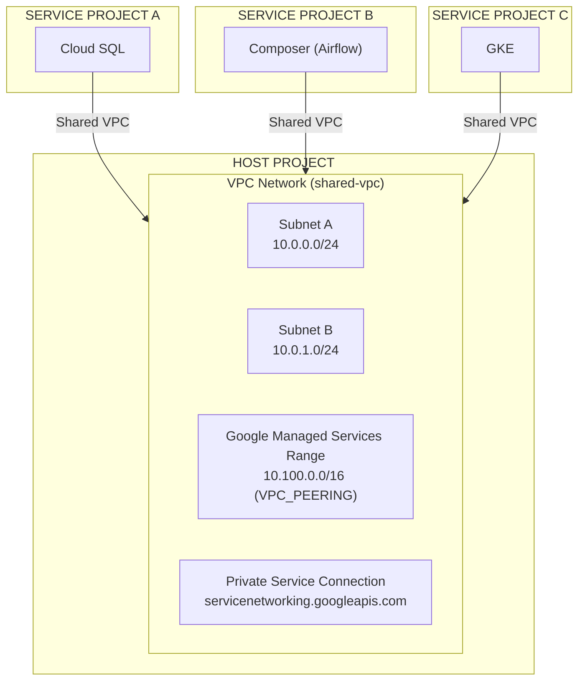

# GCP Shared VPC — Private Service Access for Google Managed Services

## Table of Contents

| Section | Topic | Description |
| :---: | :--- | :--- |
| **01** | [Architecture Overview](#1-architecture-overview) | Shared VPC model, host vs service projects, and Private Service Access fundamentals. |
| **02** | [Prerequisites & API Enablement](#2-prerequisites--api-enablement) | Required APIs, service agents, and project-level preparation. |
| **03** | [Private Service Access Configuration](#3-private-service-access-configuration) | IP range reservation, VPC peering, and service connection setup. |
| **04** | [IAM Bindings for Managed Services](#4-iam-bindings-for-managed-services) | Granting `networkUser` to each managed service agent on the host project. |
| **05** | [Cloud Composer Shared VPC](#5-cloud-composer-shared-vpc) | Managed Airflow (Gen 3) in Shared VPC environments. |
| **06** | [Verification & Troubleshooting](#6-verification--troubleshooting) | Validating peering, IP ranges, and common failure modes. |
| **07** | [Best Practices](#7-best-practices) | Production-grade patterns, security hardening, and operational guidance. |

---

## 1. Architecture Overview

Shared VPC lets you centralize network administration in a **host project** while allowing multiple **service projects** to attach and use those networks. This separation enforces budgeting and access control boundaries at the project level while enabling secure cross-project communication over private IPs.

### Why Shared VPC for Managed Services?

Google managed services (Cloud SQL, Memorystore, AlloyDB, Vertex AI, etc.) need private connectivity to your VPC. Without Shared VPC, each service project would need its own VPC peering — creating network fragmentation. Shared VPC solves this by:

- Centralizing IP range management in one host project
- Eliminating per-project VPC peering for each managed service
- Enabling private-only access (no public internet exposure)
- Simplifying firewall rule and DNS management

### Host vs Service Project

| Role | Responsibility |
| :--- | :--- |
| **Host Project** | Owns the VPC network, subnets, IP ranges, and VPC peering connections. Administered by the networking team. |
| **Service Project** | Hosts the managed services (Cloud SQL, Composer, GKE). Attached to the host project via Shared VPC. |



---

## 2. Prerequisites & API Enablement

### 2.1 Required APIs

Enable the following APIs in both host and service projects:

**Host Project:**

```bash
gcloud services enable \
  compute.googleapis.com \
  servicenetworking.googleapis.com \
  cloudresourcemanager.googleapis.com \
  --project=[HOST_PROJECT_ID]
```

**Service Project:**

```bash
gcloud services enable \
  compute.googleapis.com \
  servicenetworking.googleapis.com \
  sqladmin.googleapis.com \
  redis.googleapis.com \
  memcache.googleapis.com \
  file.googleapis.com \
  alloydb.googleapis.com \
  aiplatform.googleapis.com \
  cloudbuild.googleapis.com \
  --project=[SERVICE_PROJECT_ID]
```

### 2.2 Create Service Agents

Service agents must exist before you can grant them IAM roles. Create them for each managed service your service project will use:

```bash
services=(
  "sqladmin.googleapis.com"
  "redis.googleapis.com"
  "memcache.googleapis.com"
  "file.googleapis.com"
  "alloydb.googleapis.com"
  "aiplatform.googleapis.com"
  "cloudbuild.googleapis.com"
)

for service in "${services[@]}"; do
  gcloud beta services identity create \
    --service="$service" \
    --project=[SERVICE_PROJECT_ID]
done
```

> **Important:** Run these commands in the service project. The service agents are created in the service project but will be granted roles on the host project.

---

## 3. Private Service Access Configuration

Private Service Access (PSA) creates a VPC peering connection between your VPC and Google's managed services network. This is how managed services like Cloud SQL, Memorystore, and AlloyDB communicate with your applications privately.

### 3.1 Reserve an IP Range

Reserve a `/16` CIDR block for Google managed services in the **host project**:

```bash
gcloud compute addresses create google-managed-services \
  --global \
  --purpose=VPC_PEERING \
  --prefix-length=16 \
  --addresses=10.100.0.0 \
  --network=[NETWORK_NAME] \
  --project=[HOST_PROJECT_ID] \
  --description="Reserved range for Google managed services"
```

> **Choosing the right range:** Use RFC 1918 ranges that don't overlap with your existing subnets, VPN tunnels, or Cloud Interconnect ranges. A `/16` gives you 65,536 addresses — sufficient for most multi-service deployments.

### 3.2 Create the Private Service Connection

Establish the VPC peering with Google's service networking API:

```bash
gcloud services vpc-peerings connect \
  --service=servicenetworking.googleapis.com \
  --ranges=google-managed-services \
  --network=[NETWORK_NAME] \
  --project=[HOST_PROJECT_ID]
```

### 3.3 Verify Peering Status

```bash
gcloud services vpc-peerings list \
  --network=[NETWORK_NAME] \
  --project=[HOST_PROJECT_ID]
```

The peering should show `ACTIVE` state. If it shows `CREATING`, wait a few minutes and recheck.

---

## 4. IAM Bindings for Managed Services

Each managed service has a dedicated service agent that needs `roles/compute.networkUser` on the host project to access the VPC. **Always add roles — never replace existing roles.**

### Cloud SQL

```bash
gcloud projects add-iam-policy-binding [HOST_PROJECT_ID] \
  --member="serviceAccount:service-[SERVICE_PROJECT_NUMBER]@gcp-sa-cloud-sql.iam.gserviceaccount.com" \
  --role="roles/compute.networkUser"
```

### Memorystore Redis

```bash
gcloud projects add-iam-policy-binding [HOST_PROJECT_ID] \
  --member="serviceAccount:service-[SERVICE_PROJECT_NUMBER]@cloud-redis.iam.gserviceaccount.com" \
  --role="roles/compute.networkUser"
```

### Memorystore Memcached

```bash
gcloud projects add-iam-policy-binding [HOST_PROJECT_ID] \
  --member="serviceAccount:service-[SERVICE_PROJECT_NUMBER]@cloud-memcache.iam.gserviceaccount.com" \
  --role="roles/compute.networkUser"
```

### Filestore

```bash
gcloud projects add-iam-policy-binding [HOST_PROJECT_ID] \
  --member="serviceAccount:service-[SERVICE_PROJECT_NUMBER]@cloud-filer.iam.gserviceaccount.com" \
  --role="roles/compute.networkUser"
```

### AlloyDB

```bash
gcloud projects add-iam-policy-binding [HOST_PROJECT_ID] \
  --member="serviceAccount:service-[SERVICE_PROJECT_NUMBER]@gcp-sa-alloydb.iam.gserviceaccount.com" \
  --role="roles/compute.networkUser"
```

### Vertex AI

```bash
gcloud projects add-iam-policy-binding [HOST_PROJECT_ID] \
  --member="serviceAccount:service-[SERVICE_PROJECT_NUMBER]@gcp-sa-aiplatform.iam.gserviceaccount.com" \
  --role="roles/compute.networkUser"
```

### Cloud Build

```bash
gcloud projects add-iam-policy-binding [HOST_PROJECT_ID] \
  --member="serviceAccount:service-[SERVICE_PROJECT_NUMBER]@gcp-sa-cloudbuild.iam.gserviceaccount.com" \
  --role="roles/compute.networkUser"
```

### GKE (if using private clusters)

```bash
gcloud projects add-iam-policy-binding [HOST_PROJECT_ID] \
  --member="serviceAccount:service-[SERVICE_PROJECT_NUMBER]@container-engine-robot.iam.gserviceaccount.com" \
  --role="roles/compute.networkUser"
```

---

## 5. Cloud Composer Shared VPC

Managed Airflow (Composer Gen 3) uses Shared VPC differently than other managed services. Instead of Private Service Access, it uses **network attachments** to connect to the host project's VPC.

### 5.1 Host Project Setup

Enable Shared VPC and attach the service project:

```bash
# Enable Shared VPC on the host project
gcloud compute shared-vpc enable [HOST_PROJECT_ID]

# Attach the service project
gcloud compute shared-vpc associated-projects add \
  [SERVICE_PROJECT_ID] \
  --host-project=[HOST_PROJECT_ID]
```

### 5.2 Required APIs

**Host Project:**

```bash
gcloud services enable \
  container.googleapis.com \
  compute.googleapis.com \
  --project=[HOST_PROJECT_ID]
```

**Service Project:**

```bash
gcloud services enable \
  container.googleapis.com \
  compute.googleapis.com \
  iam.googleapis.com \
  iamcredentials.googleapis.com \
  --project=[SERVICE_PROJECT_ID]
```

### 5.3 Grant Composer Service Agent Permissions

```bash
# Grant the Composer Service Agent the sharedVpcAgent role
gcloud projects add-iam-policy-binding [HOST_PROJECT_ID] \
  --member="serviceAccount:service-[SERVICE_PROJECT_NUMBER]@cloudcomposer-accounts.iam.gserviceaccount.com" \
  --role="roles/composer.sharedVpcAgent"
```

### 5.4 DNS Limitations

- Managed Airflow (Gen 3) has a **limitation of one transitive DNS hop**. Ensure your DNS configuration respects this.
- Managed Airflow (Gen 3) **does not support** user-defined `.internal` DNS zones. If you create a `.internal` zone, Managed Airflow cannot resolve it.

---

## 6. Verification & Troubleshooting

### Validate VPC Peering

```bash
gcloud services vpc-peerings list \
  --network=[NETWORK_NAME] \
  --project=[HOST_PROJECT_ID]
```

### Validate Reserved IP Ranges

```bash
gcloud compute addresses list \
  --global \
  --filter="purpose=VPC_PEERING" \
  --project=[HOST_PROJECT_ID]
```

### Validate IAM Bindings

```bash
gcloud projects get-iam-policy [HOST_PROJECT_ID] \
  --flatten="bindings[].members" \
  --format="table(bindings.role, bindings.members)" \
  --filter="bindings.members:service-[SERVICE_PROJECT_NUMBER]"
```

### Common Issues

| Symptom | Cause | Fix |
| :--- | :--- | :--- |
| `FAILED_PRECONDITION` when creating Cloud SQL | Missing `networkUser` role on host project | Grant `roles/compute.networkUser` to the Cloud SQL service agent |
| VPC peering stuck in `CREATING` | IP range conflict or quota exceeded | Check for overlapping CIDRs; verify peering quota |
| DNS resolution fails across projects | Too many transitive DNS hops | Flatten DNS architecture; use Cloud DNS private zones |
| Composer environment creation fails | Missing `composer.sharedVpcAgent` role | Grant the role to the Composer service agent in the host project |

---

## 7. Best Practices

### IP Range Planning

- Reserve a dedicated `/16` for managed services (e.g., `10.100.0.0/16`)
- Keep managed service ranges separate from GKE pod/service ranges
- Document all reserved ranges in a central IPAM or wiki
- Use non-overlapping ranges if you have multiple Shared VPC hosts

### Security

- **Never expose managed services to the public internet.** Use Private IP only.
- Apply VPC Service Controls around sensitive projects (Cloud SQL, AlloyDB)
- Use Organization Policy constraints to restrict public IP on managed services
- Audit IAM bindings regularly — only grant `networkUser` to services that need it

### Operational

- **Automate with Terraform.** Manual `gcloud` commands are error-prone at scale
- Use a single host project per environment (dev/staging/prod) to simplify networking
- Monitor VPC peering status with Cloud Monitoring alerts
- Tag all managed service instances for cost allocation

### Terraform Example (Private Service Access)

```hcl
# Reserve IP range for managed services
resource "google_compute_global_address" "google_managed_services" {
  name          = "google-managed-services"
  purpose       = "VPC_PEERING"
  address_type  = "INTERNAL"
  prefix_length = 16
  address       = "10.100.0.0"
  network       = google_compute_network.host_vpc.id
}

# Create the private service connection
resource "google_service_networking_connection" "private_vpc_connection" {
  network                 = google_compute_network.host_vpc.id
  service                 = "servicenetworking.googleapis.com"
  reserved_peering_ranges = [google_compute_global_address.google_managed_services.name]
}
```

### Terraform Example (Shared VPC)

```hcl
# Enable Shared VPC on host project
resource "google_compute_shared_vpc_host_project" "host" {
  project = var.host_project_id
}

# Attach service project
resource "google_compute_shared_vpc_service_project" "service" {
  host_project    = google_compute_shared_vpc_host_project.host.project
  service_project = var.service_project_id
}
```

---

## References

- [Shared VPC Overview](https://cloud.google.com/vpc/docs/shared-vpc)
- [Private Service Access](https://cloud.google.com/vpc/docs/private-service-access)
- [Managed Airflow Shared VPC (Gen 3)](https://docs.cloud.google.com/composer/docs/composer-3/configure-shared-vpc)
- [Private Google Access](https://cloud.google.com/vpc/docs/private-google-access)
- [VPC Service Controls](https://cloud.google.com/vpc-service-controls/docs/overview)
