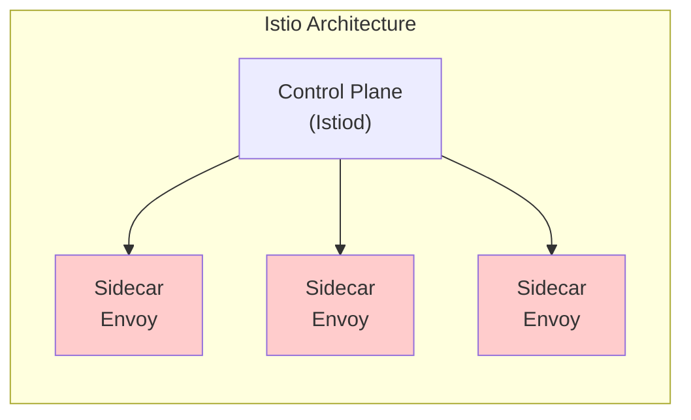
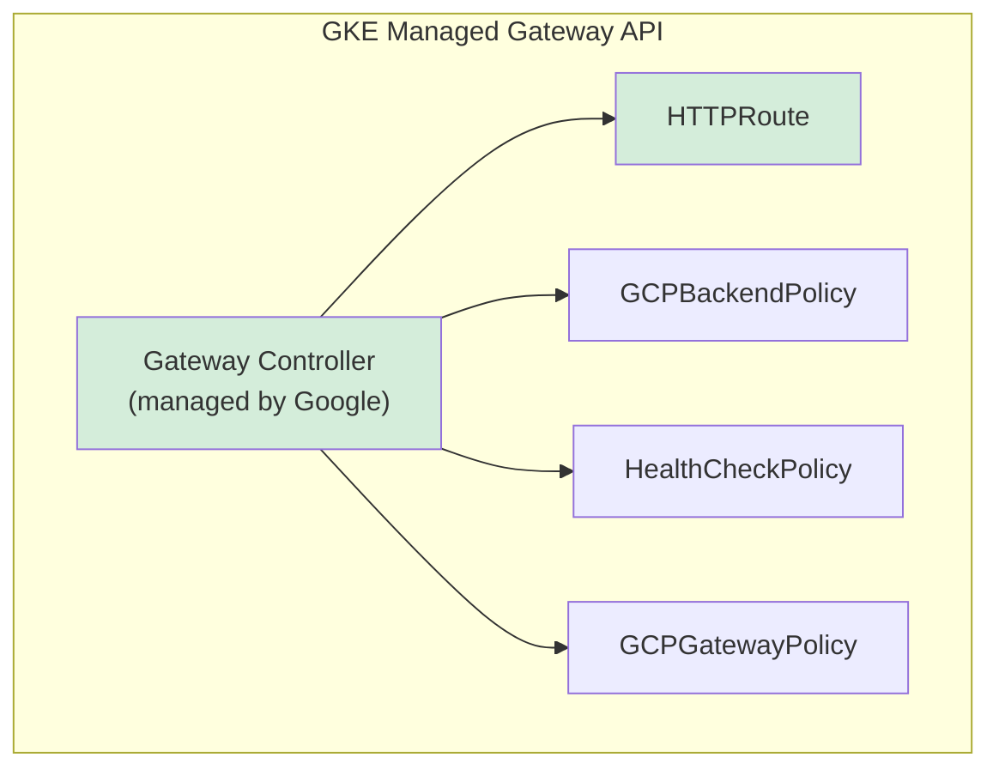
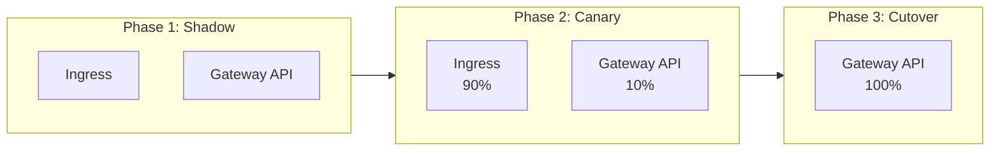
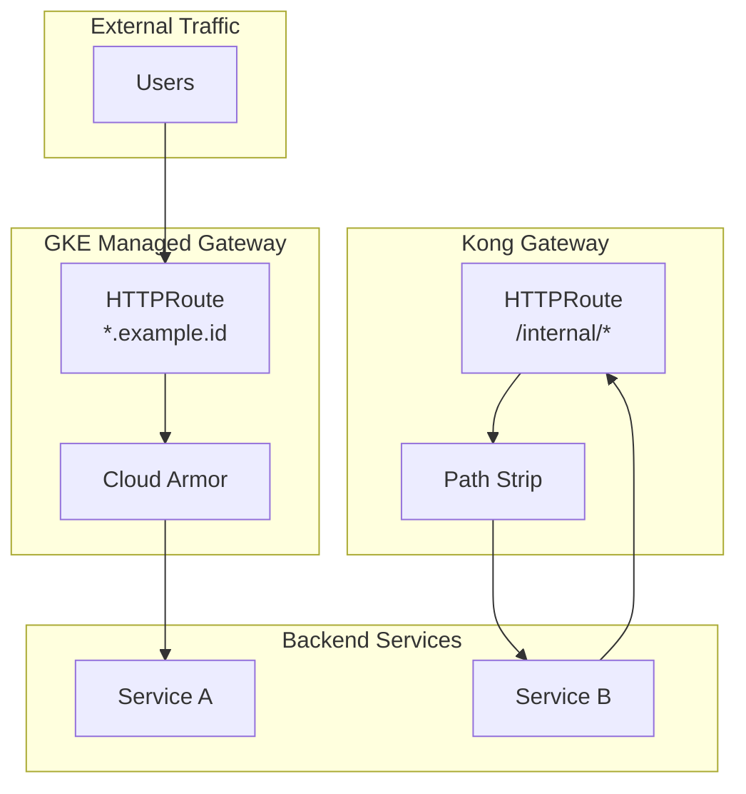

# Why We Migrated from Ingress to Gateway API on GKE — A Production Retrospective

## Table of Contents

| Section | Topic | Description |
| :---: | :--- | :--- |
| **01** | [The Breaking Point](#1-the-breaking-point) | When Ingress annotations became unsustainable at scale. |
| **02** | [Evaluating Options](#2-evaluating-options) | Istio, Envoy Gateway, and why we chose GKE Managed Gateway API. |
| **03** | [What Changed in Production](#3-what-changed-in-production) | Concrete improvements after migrating 50+ services across 3 environments. |
| **04** | [The Migration Strategy](#4-the-migration-strategy) | How we moved without downtime using a dual-runtime approach. |
| **05** | [GKE-Specific Advantages](#5-gke-specific-advantages) | Cloud Armor, global LB, and managed gateway classes. |
| **06** | [The Kong Twist](#6-the-kong-twist) | Running two gateways for external and internal traffic. |
| **07** | [Real Cost Impact](#7-real-cost-impact) | What we saved and what we spent. |
| **08** | [What We'd Do Differently](#8-what-wed-do-differently) | Mistakes we made and lessons from the trenches. |
| **09** | [The Verdict](#9-the-verdict) | Gateway API is not perfect, but it's the right trade-off. |

---

## 1. The Breaking Point

We didn't migrate because Gateway API was trendy. We migrated because our Ingress setup was actively slowing us down.

### The Annotation Hell

Every service in our cluster had its own Ingress resource with 15-20 annotations. Some were NGINX-specific, some were GKE-specific, and some were copy-pasted from Stack Overflow with no one sure what they did anymore.

```yaml
# This was our reality
metadata:
  annotations:
    nginx.ingress.kubernetes.io/rewrite-target: /
    nginx.ingress.kubernetes.io/ssl-redirect: "true"
    nginx.ingress.kubernetes.io/proxy-body-size: "50m"
    nginx.ingress.kubernetes.io/rate-limit: "100"
    nginx.ingress.kubernetes.io/cors-allow-origin: "*"
    nginx.ingress.kubernetes.io/configuration-snippet: |
      more_set_headers "X-Frame-Options: DENY";
      more_set_headers "X-Content-Type-Options: nosniff";
    # ... 10 more lines
```

When we switched from NGINX to GKE's native Ingress, half of these annotations silently broke. No errors, just different behavior.

### The Security Gap

Cloud Armor was bolted on as an annotation afterthought:

```yaml
annotations:
  cloud.google.com/backend-config: '{"default": "my-backend-config"}'
```

There was no way to version-control security policies alongside the service definition. The Cloud Armor policy was a separate entity with a separate lifecycle. Engineers would deploy a service, forget to attach the policy, and we'd discover the gap during a security audit.

### The Multi-Team Bottleneck

Every Ingress change required the platform team. A backend engineer couldn't add a new route without filing a ticket, waiting for review, and hoping the annotation they copied actually worked. We became the bottleneck.

---

## 2. Evaluating Options

### Istio — Too Heavy

We ran Istio for 6 months. The sidecar proxy on every pod consumed 128MB of memory per pod. Across 500+ pods, that's 64GB of RAM doing nothing but proxying. The operational overhead of managing Istio's control plane, upgrades, and certificate rotation was a full-time job.



### Envoy Gateway — Promising but Unmanaged

Envoy Gateway is lightweight, but it's self-managed. We'd still need to handle upgrades, HA for the control plane, and monitoring. On GKE, we wanted managed infrastructure, not another thing to babysit.

### GKE Managed Gateway API — The Sweet Spot

GKE's managed gateway class gave us:

- **No control plane to manage** — Google handles it
- **Native Cloud Armor integration** — Security policies as CRDs
- **Global and regional options** — Cost optimization for non-prod
- **Standard Gateway API** — Portable across clouds



---

## 3. What Changed in Production

### Before vs After

| Metric | Before (Ingress) | After (Gateway API) | Impact |
| :--- | :--- | :--- | :--- |
| Annotation count per service | 15-20 | 3-5 | 70% less config noise |
| Time to add new route | 2-3 days (ticket) | 15 min (self-service) | 95% faster |
| Cloud Armor policy mgmt | Separate UI | CRD in Git | GitOps-native |
| Health check config | Global per LB | Per-service CRD | Granular control |
| TLS management | Manual cert-manager | Pre-shared certs | Less overhead |
| Cross-env consistency | Copy-paste YAML | Template-based | Drift eliminated |

### Self-Service Routing

The biggest win wasn't technical — it was organizational. Backend teams now own their HTTPRoute. They add a route, define their health check, attach their Cloud Armor policy. No platform team involved.

```yaml
# A backend engineer can now do this themselves
apiVersion: gateway.networking.k8s.io/v1
kind: HTTPRoute
metadata:
  name: my-service-httproute
  namespace: my-team
spec:
  parentRefs:
  - name: shared-gateway
    namespace: gateway-api
    sectionName: https
  hostnames:
  - my-service.example.id
  rules:
  - backendRefs:
    - name: my-service-svc
      port: 80
```

---

## 4. The Migration Strategy

We didn't do a big-bang migration. We ran Ingress and Gateway API in parallel for 3 months.

### Phase 1: Shadow Mode (Weeks 1-4)

Deploy Gateway API resources alongside existing Ingress. Traffic still hits Ingress. We validated routing correctness by comparing logs.

### Phase 2: Canary Shift (Weeks 5-8)

For each service, shift 10% of traffic to Gateway API using weighted routing. Monitor error rates, latency, and Cloud Armor logs.

### Phase 3: Full Cutover (Weeks 9-12)

Remove Ingress resources once confidence was high. Delete old BackendConfig CRDs.



### The Dual-Runtime Trick

During migration, we used two Ingress classes simultaneously:

```bash
# Existing Ingress (NGINX)
kubectl annotate ingress my-service \
  kubernetes.io/ingress.class=nginx

# New Gateway API route
kubectl apply -f my-service-httproute.yaml
```

Cloud DNS weighted records split traffic between the old LB and the new Gateway.

---

## 5. GKE-Specific Advantages

### Global vs Regional Gateway Classes

GKE offers two managed gateway classes. We use both:

| Environment | Gateway Class | Rationale |
| :--- | :--- | :--- |
| **Production** | `gke-l7-global-external-managed` | Global anycast, lowest latency |
| **Staging/Beta** | `gke-l7-regional-external-managed` | ~35% cost reduction |

### Cloud Armor as a CRD

Before: Cloud Armor policies were configured in the console, attached via annotation.

After: Security policies are defined as `GCPBackendPolicy` and version-controlled:

```yaml
apiVersion: networking.gke.io/v1
kind: GCPBackendPolicy
metadata:
  name: payment-service-security
  namespace: payments
spec:
  default:
    securityPolicy: payment-service-armor-policy
    timeoutSec: 30
    connectionDraining:
      drainingTimeoutSec: 0
  targetRef:
    kind: Service
    name: payment-service-svc
```

### Health Checks Per Service

Ingress gave us one health check per backend service. Gateway API gives us per-service `HealthCheckPolicy` with HTTP and TCP variants:

```yaml
apiVersion: networking.gke.io/v1
kind: HealthCheckPolicy
metadata:
  name: api-health-check
  namespace: api
spec:
  default:
    checkIntervalSec: 10
    timeoutSec: 5
    healthyThreshold: 1
    unhealthyThreshold: 3
    config:
      type: HTTP
      httpHealthCheck:
        requestPath: /health
        port: 8080
  targetRef:
    kind: Service
    name: api-svc
```

---

## 6. The Kong Twist

We run two gateways:

- **GKE Managed Gateway** — External traffic (internet → services)
- **Kong Gateway** — Internal traffic (service → service)

This isn't a limitation — it's intentional separation of concerns. External traffic goes through Cloud Armor, WAF rules, and global load balancing. Internal traffic goes through Kong's path-based routing with zero latency from external hops.



Kong uses `konghq.com/strip-path` to remove the prefix before forwarding:

```yaml
apiVersion: gateway.networking.k8s.io/v1
kind: HTTPRoute
metadata:
  name: service-b-internal
  annotations:
    konghq.com/strip-path: "true"
spec:
  parentRefs:
  - name: kong-gateway
    namespace: gateway-api
    sectionName: http
  hostnames:
  - internal.example.id
  rules:
  - matches:
    - path:
        type: PathPrefix
        value: /service-b
    backendRefs:
    - name: service-b-svc
      port: 80
```

---

## 7. Real Cost Impact

### Infrastructure Savings

| Component | Monthly Cost (Ingress) | Monthly Cost (Gateway API) | Savings |
| :--- | :--- | :--- | :--- |
| Load Balancer | $73 (per Ingress) x 8 = $584 | $180 (2 global GW) | 69% |
| Cloud Armor | $5 + $1/GB | Same (integrated) | — |
| Health checks | Included in LB | Included in LB | — |
| **Total networking** | **~$800** | **~$250** | **~69%** |

### Operational Savings

| Activity | Before | After |
| :--- | :--- | :--- |
| New route deployment | 2-3 days (ticket) | 15 minutes (self-service) |
| Security policy update | Console + annotation | Git commit |
| Health check tuning | Global (one size fits all) | Per-service CRD |
| Controller upgrades | Manual (every quarter) | Managed (automatic) |

### Dev Environment Optimization

For staging and beta, we switched to `gke-l7-regional-external-managed` with `standard-ephemeral-ipv4-address`. This reduced non-prod networking costs by ~35% with no functional impact.

---

## 8. What We'd Do Differently

### Mistake 1: Migrating Everything at Once

We tried to migrate 50 services in 2 weeks. It was chaos. We now recommend a phased approach: one service per week, validate, then move on.

### Mistake 2: Ignoring DNS TTLs

When we cut over from Ingress to Gateway, DNS cached the old IP for 5 minutes. Users hitting the old IP got 502 errors. Set DNS TTL to 60s a week before migration.

### Mistake 3: Forgetting `sectionName`

Multiple HTTPRoutes attached to the same Gateway but different listeners (HTTP vs HTTPS). Without `sectionName`, they all defaulted to the first listener. Always specify `sectionName: https` for external routes.

### Mistake 4: No Health Check Policy = Silent Failures

Gateway API created the route, Cloud Armor was attached, but the health check defaulted to TCP port 80. Services with HTTP health endpoints on port 8080 were marked unhealthy. Always deploy `HealthCheckPolicy` alongside `HTTPRoute`.

### Mistake 5: Mixing Ingress and Gateway Annotations

During the dual-runtime period, some engineers added Ingress annotations to Gateway API resources. They're not compatible. Keep them completely separate.

---

## 9. The Verdict

Gateway API is not perfect. The multi-resource model is more complex than a single Ingress. The learning curve is real. Some features (like GAMMA for service mesh) are still experimental.

But for our use case — 50+ services, 3 environments, multiple teams, GCP-native infrastructure — it was the right trade-off.

### When to Use Gateway API

| Scenario | Recommendation |
| :--- | :--- |
| Simple app, single team, basic routing | Stick with Ingress |
| Multi-team, self-service routing needs | Gateway API |
| Cloud Armor / WAF integration required | Gateway API |
| Cost optimization across environments | Gateway API (regional for dev) |
| Service mesh / mTLS | Wait for GAMMA or use Istio |

### When to Stick with Ingress

- Single service, single team
- No need for advanced routing
- Budget constraints (Ingress-NGINX is free)
- Legacy clusters on older Kubernetes versions

---

## References

- [GKE Gateway API Documentation](https://cloud.google.com/kubernetes-engine/docs/concepts/gateway-api)
- [Gateway API Specification](https://gateway-api.sigs.k8s.io/)
- [GKE Gateway API vs Ingress](https://cloud.google.com/kubernetes-engine/docs/how-to/gateway-api)
- [Kong Gateway API Integration](https://docs.konghq.com/gateway/3.x/key-concepts/gateway-api/)
- [Migrating from Ingress to Gateway API at Kitabisa](https://medium.com/inside-kitabisa/migrating-from-kubernetes-ingress-to-gateway-api-at-kitabisa-why-we-made-the-switch-9b68754257b6)
