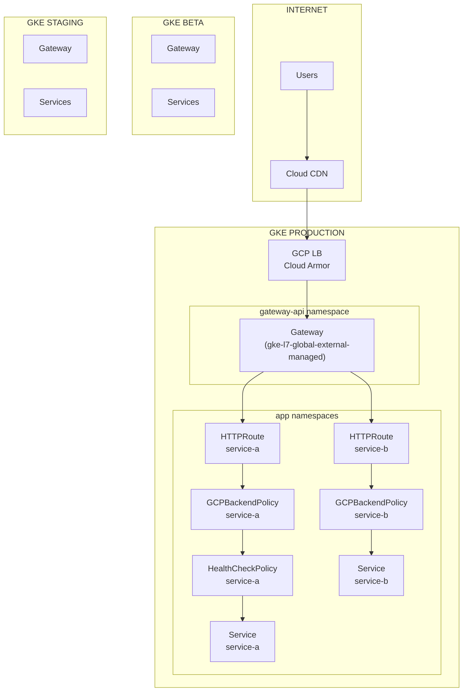
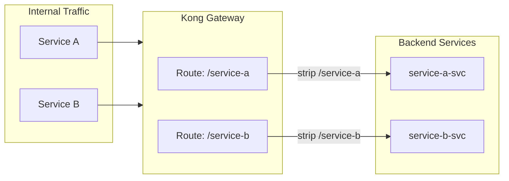

# GKE Gateway API — Production Migration from Ingress to Gateway API

## Table of Contents

| Section | Topic | Description |
| :---: | :--- | :--- |
| **01** | [Why Gateway API](#1-why-gateway-api) | The problem with Ingress and why Gateway API is the future. |
| **02** | [Architecture Overview](#2-architecture-overview) | Multi-environment Gateway API topology across stg, beta, and prod. |
| **03** | [Gateway Resource](#3-gateway-resource) | Global external managed gateway with TLS termination. |
| **04** | [HTTPRoute — Traffic Routing](#4-httproute--traffic-routing) | Path-based routing, hostnames, and backend service binding. |
| **05** | [GCPBackendPolicy — Security & Resilience](#5-gcpbackendpolicy--security--resilience) | Cloud Armor, timeouts, connection draining, and rate limiting. |
| **06** | [GCPGatewayPolicy — Policy Binding](#6-gcpgatewaypolicy--policy-binding) | Associating backend and health check policies at the gateway level. |
| **07** | [HealthCheckPolicy — Liveness Probes](#7-healthcheckpolicy--liveness-probes) | HTTP and TCP health check configuration. |
| **08** | [Kong Internal Gateway](#8-kong-internal-gateway) | Internal routing with Kong and path stripping. |
| **09** | [Migration Playbook](#9-migration-playbook) | Step-by-step guide from Ingress to Gateway API. |
| **10** | [Lessons Learned](#10-lessons-learned) | Real-world pitfalls and production insights. |

---

## 1. Why Gateway API

Kubernetes Ingress was designed for simple HTTP routing. As our platform scaled to multiple services across three environments, Ingress hit its limits:

- **No native TLS policy management** — Certificates were handled outside the Ingress spec
- **Limited traffic splitting** — No built-in canary or weighted routing
- **No security policy binding** — Cloud Armor had to be configured separately via annotations
- **Vendor lock-in** — Ingress annotations differ across GKE, EKS, and AKS

Gateway API solves all of this with a role-oriented, portable, and expressive API.

### What We Migrated

| Component | Before (Ingress) | After (Gateway API) |
| :--- | :--- | :--- |
| Routing | `Ingress` + annotations | `HTTPRoute` |
| TLS | Manual cert-manager | Gateway `tls` section with pre-shared certs |
| Security | Cloud Armor via annotation | `GCPBackendPolicy` |
| Health checks | Service-level config | `HealthCheckPolicy` |
| Policy binding | Scattered | `GCPGatewayPolicy` |

---

## 2. Architecture Overview

Our Gateway API implementation spans three GKE clusters — staging, beta, and production — each with a dedicated Gateway and shared routing patterns.



---

## 3. Gateway Resource

The Gateway defines the load balancer entry point. We use GKE's managed gateway classes for L7 HTTP(S) routing — **global** for production, **regional** for dev/cost-optimized environments.

### Production — Global External

```yaml
apiVersion: gateway.networking.k8s.io/v1
kind: Gateway
metadata:
  name: example-gateway
  namespace: gateway-api
  annotations:
    networking.gke.io/ingress.class: gke-l7-global-external-managed
  labels:
    app.kubernetes.io/name: example-gateway
    app.kubernetes.io/part-of: example
    app.kubernetes.io/component: gateway
    app.kubernetes.io/managed-by: DevOpsTeam
    app.kubernetes.io/version: "v1.34.0"
spec:
  gatewayClassName: gke-l7-global-external-managed
  listeners:
  - name: http
    protocol: HTTP
    port: 80
    hostname: "*.example.id"
    allowedRoutes:
      namespaces:
        from: All
  - name: https
    protocol: HTTPS
    port: 443
    hostname: "*.example.id"
    tls:
      mode: Terminate
      options:
        networking.gke.io/pre-shared-certs: [certificate_name]
    allowedRoutes:
      namespaces:
        from: All
```

### Dev / Cost-Optimized — Regional External

```yaml
apiVersion: gateway.networking.k8s.io/v1
kind: Gateway
metadata:
  name: example-gateway-dev
  namespace: gateway-api
  annotations:
    networking.gke.io/ingress.class: gke-l7-regional-external-managed
  labels:
    app.kubernetes.io/name: example-gateway-dev
    app.kubernetes.io/part-of: example
    app.kubernetes.io/component: gateway
    app.kubernetes.io/managed-by: DevOpsTeam
    app.kubernetes.io/version: "v1.34.0"
spec:
  gatewayClassName: gke-l7-regional-external-managed
  listeners:
  - name: http
    protocol: HTTP
    port: 80
    hostname: "*.dev.example.id"
    allowedRoutes:
      namespaces:
        from: All
  - name: https
    protocol: HTTPS
    port: 443
    hostname: "*.dev.example.id"
    tls:
      mode: Terminate
      options:
        networking.gke.io/pre-shared-certs: [certificate_name]
    addresses:
    - type: networking.gke.io/standard-ephemeral-ipv4-address
    allowedRoutes:
      namespaces:
        from: All
```

### Gateway Class Comparison

| Feature | `gke-l7-global-external-managed` | `gke-l7-regional-external-managed` |
| :--- | :--- | :--- |
| **Scope** | Global (anycast IP) | Regional (single region IP) |
| **Use case** | Production, multi-region | Dev, staging, single-region |
| **Cost** | Higher (global LB fees) | Lower (~30-40% savings) |
| **Latency** | Lowest (anycast edge) | Region-bound |
| **Cloud Armor** | Supported | Supported |
| **SSL Policy** | Global, premium | Regional, standard |
| **IP Address** | `premium-ephemeral-ipv4-address` | `standard-ephemeral-ipv4-address` |

### Key Decisions

| Choice | Rationale |
| :--- | :--- |
| Global for prod | Anycast IP for lowest latency across regions |
| Regional for dev | Cost savings without sacrificing functionality |
| `allowedRoutes: All` | Any namespace can attach routes — flexible for multi-team |
| Pre-shared certs | Certificates managed outside GKE via Google Cloud Certificate Manager |
| Ephemeral IPs | No static IP management — GKE handles allocation/deallocation |

---

## 4. HTTPRoute — Traffic Routing

HTTPRoute defines how traffic is routed from the Gateway to backend services. Each service gets its own HTTPRoute.

```yaml
apiVersion: gateway.networking.k8s.io/v1
kind: HTTPRoute
metadata:
  name: service-a-httproute
  namespace: service-a-ns
  labels:
    app: service-a
    env: prod
    team: backend
    app.kubernetes.io/name: service-a
    app.kubernetes.io/component: gateway
    app.kubernetes.io/part-of: example
    app.kubernetes.io/managed-by: GatewayAPI
spec:
  parentRefs:
  - name: example-gateway
    namespace: gateway-api
    sectionName: https
  hostnames:
  - service-a.example.id
  rules:
  - matches:
    - path:
        type: PathPrefix
        value: /
    backendRefs:
    - name: service-a-svc
      port: 80
      weight: 100
```

### Path-Based Routing (Kong Internal)

For internal services routed through Kong, we use path stripping:

```yaml
apiVersion: gateway.networking.k8s.io/v1
kind: HTTPRoute
metadata:
  name: service-a-internal-httproute
  namespace: service-a-ns
  annotations:
    konghq.com/strip-path: "true"
spec:
  parentRefs:
  - name: kong-gateway
    namespace: gateway-api
    sectionName: http
  hostnames:
  - internal.example.id
  rules:
  - matches:
    - path:
        type: PathPrefix
        value: /service-a
    backendRefs:
    - name: service-a-svc
      port: 80
      weight: 100
```

---

## 5. GCPBackendPolicy — Security & Resilience

GCPBackendPolicy is where Cloud Armor, timeouts, and connection draining are configured per service.

```yaml
apiVersion: networking.gke.io/v1
kind: GCPBackendPolicy
metadata:
  name: service-a-backend-policy
  namespace: service-a-ns
  labels:
    app: service-a
    env: prod
    team: backend
    app.kubernetes.io/name: service-a
    app.kubernetes.io/component: gateway
    app.kubernetes.io/part-of: example
    app.kubernetes.io/managed-by: GatewayAPI
spec:
  default:
    securityPolicy: [cloud-armor-policy-name]
    timeoutSec: 30
    connectionDraining:
      drainingTimeoutSec: 0
    # logging:
    #   enable: true
    #   sampleRate: 500000
    # maxRatePerEndpoint: 10  # Rate limiting
  targetRef:
    group: ""
    kind: Service
    name: service-a-svc
```

### Configuration Breakdown

| Field | Value | Purpose |
| :--- | :--- | :--- |
| `securityPolicy` | Cloud Armor policy name | WAF rules, geo-blocking, rate limiting |
| `timeoutSec` | 30 | Maximum request duration before timeout |
| `drainingTimeoutSec` | 0 | Immediate drain on health check failure |
| `maxRatePerEndpoint` | (optional) | Per-backend rate limiting |

---

## 6. GCPGatewayPolicy — Policy Binding

GCPGatewayPolicy binds backend and health check policies together at the gateway level.

```yaml
apiVersion: networking.gke.io/v1
kind: GCPGatewayPolicy
metadata:
  name: service-a-gateway-policy
  namespace: service-a-ns
  labels:
    app: service-a
    env: prod
    team: backend
    app.kubernetes.io/name: service-a
    app.kubernetes.io/component: gateway
    app.kubernetes.io/part-of: example
    app.kubernetes.io/managed-by: GatewayAPI
spec:
  default:
    backendPolicy:
      name: service-a-backend-policy
      namespace: service-a-ns
    healthCheckPolicy:
      name: service-a-hc-policy
      namespace: service-a-ns
  targetRef:
    group: ""
    kind: Service
    name: service-a-svc
```

---

## 7. HealthCheckPolicy — Liveness Probes

HealthCheckPolicy configures how the GCP load balancer checks service health. We support both HTTP and TCP health checks.

### HTTP Health Check (Spring Boot Actuator)

```yaml
apiVersion: networking.gke.io/v1
kind: HealthCheckPolicy
metadata:
  name: service-a-hc-policy
  namespace: service-a-ns
  labels:
    app: service-a
    env: prod
    team: backend
    app.kubernetes.io/name: service-a
    app.kubernetes.io/component: gateway
    app.kubernetes.io/part-of: example
    app.kubernetes.io/managed-by: GatewayAPI
spec:
  default:
    checkIntervalSec: 10
    timeoutSec: 5
    healthyThreshold: 1
    unhealthyThreshold: 3
    config:
      type: HTTP
      httpHealthCheck:
        requestPath: /actuator/health
        port: 8080
  targetRef:
    group: ""
    kind: Service
    name: service-a-svc
```

### TCP Health Check (Non-HTTP Services)

```yaml
spec:
  default:
    checkIntervalSec: 10
    timeoutSec: 5
    healthyThreshold: 1
    unhealthyThreshold: 3
    config:
      type: TCP
      tcpHealthCheck:
        port: 8080
```

### Health Check Tuning

| Parameter | Value | Rationale |
| :--- | :--- | :--- |
| `checkIntervalSec` | 10 | Frequent checks catch failures quickly |
| `timeoutSec` | 5 | Fail fast if service is unresponsive |
| `healthyThreshold` | 1 | Recover immediately after one success |
| `unhealthyThreshold` | 3 | Avoid flapping on transient failures |

---

## 8. Kong Internal Gateway

For internal service-to-service communication, we run Kong as an internal gateway alongside the GKE managed gateway. Kong handles path-based routing with the `konghq.com/strip-path` annotation, which removes the prefix before forwarding to the backend.



---

## 9. Migration Playbook

### Phase 1: Preparation

```bash
# 1. Enable Gateway API on the GKE cluster
gcloud container clusters update [CLUSTER_NAME] \
  --enable-gateway-api \
  --region=[REGION]

# 2. Create the gateway-api namespace
kubectl create namespace gateway-api

# 3. Deploy the Gateway resource
kubectl apply -f Gateway.yml
```

### Phase 2: Service Migration

```bash
# 4. Deploy HTTPRoute for the service
kubectl apply -f HTTPRoute.yml -n [SERVICE_NAMESPACE]

# 5. Deploy HealthCheckPolicy
kubectl apply -f HealthCheckPolicy.yml -n [SERVICE_NAMESPACE]

# 6. Deploy GCPBackendPolicy
kubectl apply -f GCPBackendPolicy.yml -n [SERVICE_NAMESPACE]

# 7. Deploy GCPGatewayPolicy
kubectl apply -f GCPGatewayPolicy.yml -n [SERVICE_NAMESPACE]
```

### Phase 3: Validation

```bash
# 8. Verify Gateway is ready
kubectl get gateway -n gateway-api

# 9. Verify HTTPRoute is accepted
kubectl get httproute -n [SERVICE_NAMESPACE]

# 10. Check GKE Gateway status
gcloud container gateway-api list --region=[REGION]

# 11. Test the endpoint
curl -v https://[SERVICE].example.id/actuator/health
```

### Phase 4: Cleanup

```bash
# 12. Delete the old Ingress resource
kubectl delete ingress [INGRESS_NAME] -n [SERVICE_NAMESPACE]

# 13. Remove Ingress-related annotations from Service
kubectl annotate service [SERVICE_NAME] [KEY]- --namespace=[SERVICE_NAMESPACE]
```

---

## 10. Lessons Learned

### What Worked Well

| Aspect | Outcome |
| :--- | :--- |
| **Role-oriented model** | Teams own their HTTPRoute and policies without touching the Gateway |
| **Cloud Armor integration** | Security policies bound via GCPBackendPolicy — no annotation hacks |
| **Health check flexibility** | HTTP and TCP probes per service, not global |
| **Kong coexistence** | Internal and external gateways run side-by-side cleanly |

### Pitfalls to Avoid

| Pitfall | Impact | Mitigation |
| :--- | :--- | :--- |
| Forgetting `sectionName` in `parentRefs` | Route attaches to wrong listener | Always specify `sectionName: https` for external |
| Mixing namespaces without RBAC | Services can't attach routes | Use `allowedRoutes: Namespaces` with a label selector |
| Health check path mismatch | LB marks healthy pods as unhealthy | Test `/actuator/health` locally before deploying |
| Missing `networkUser` IAM binding | Gateway creation fails silently | Grant `roles/compute.networkUser` to the Gateway service agent |

### Performance Observations

- **Global external managed gateway** scales automatically — no capacity planning needed
- **Connection draining timeout 0** prevents stale connections during rolling updates
- **`checkIntervalSec: 10`** catches failures within 15 seconds (10s interval + 3x unhealthy threshold)

---

## References

- [GKE Gateway API Overview](https://cloud.google.com/kubernetes-engine/docs/concepts/gateway-api)
- [GCPGatewayPolicy](https://cloud.google.com/kubernetes-engine/docs/how-to/gateway-api#gatewaypolicy)
- [GCPBackendPolicy](https://cloud.google.com/kubernetes-engine/docs/how-to/gateway-api#backendpolicy)
- [HealthCheckPolicy](https://cloud.google.com/kubernetes-engine/docs/how-to/gateway-api#healthcheckpolicy)
- [Kong Gateway API Support](https://docs.konghq.com/gateway/3.x/key-concepts/gateway-api/)
- [Migrate from Ingress to Gateway API](https://cloud.google.com/kubernetes-engine/docs/how-to/gateway-api-ingress)
