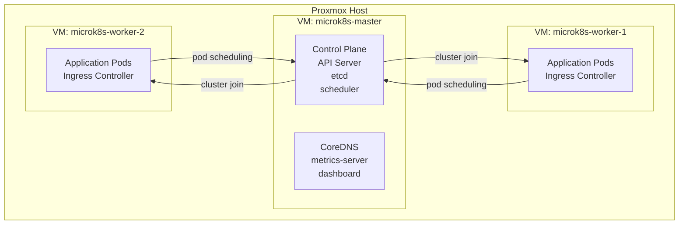

# Building a MicroK8s Sandbox Cluster on Proxmox

## Table of Contents

| Section | Topic | Description |
| :---: | :--- | :--- |
| **01** | [Why MicroK8s on Proxmox](#1-why-microk8s-on-proxmox) | Lightweight Kubernetes for local development. |
| **02** | [Architecture Overview](#2-architecture-overview) | 3-node cluster topology on Proxmox VMs. |
| **03** | [Proxmox VM Setup](#3-proxmox-vm-setup) | VM configuration for master and worker nodes. |
| **04** | [MicroK8s Installation](#4-microk8s-installation) | Snap-based install and addon enablement. |
| **05** | [Cluster Join](#5-cluster-join) | Adding worker nodes to the cluster. |
| **06** | [Deployment Hardening](#6-deployment-hardening) | Security contexts, affinity, and resource limits. |
| **07** | [Service & Autoscaling](#7-service--autoscaling) | ClusterIP service and HPA configuration. |
| **08** | [GCP Artifact Registry Access](#8-gcp-artifact-registry-access) | Pulling private images from GCR. |
| **09** | [Cluster Admin Access](#9-cluster-admin-access) | kubeconfig setup for remote access. |
| **10** | [Teardown](#10-teardown) | Clean removal of MicroK8s. |

---

## 1. Why MicroK8s on Proxmox

For local development and testing, running a full GKE cluster is overkill. MicroK8s gives us a lightweight, single-binary Kubernetes distribution that runs on commodity VMs.

| Option | Pros | Cons |
| :--- | :--- | :--- |
| **Minikube** | Simple, single-node | No multi-node, no cluster join |
| **kind** | Docker-based, fast | Limited networking, no MetalLB |
| **k3s** | Lightweight, production-grade | Separate install from snap |
| **MicroK8s** | Snap install, addons, multi-node | Snap dependency |

### Why Proxmox

| Reason | Detail |
| :--- | :--- |
| **Self-hosted** | No cloud costs for sandbox workloads |
| **Snapshots** | Roll back broken experiments instantly |
| **Resource control** | CPU/memory limits per VM |
| **Network isolation** | VLANs for lab environments |

---

## 2. Architecture Overview

Three VMs on a single Proxmox host — 1 control plane, 2 workers.



### VM Resource Allocation

| Node | CPU | RAM | Disk | Role |
| :--- | :--- | :--- | :--- | :--- |
| `microk8s-master` | 2 vCPU | 4 GB | 40 GB | Control plane |
| `microk8s-worker-1` | 2 vCPU | 4 GB | 40 GB | Worker |
| `microk8s-worker-2` | 2 vCPU | 4 GB | 40 GB | Worker |
| **Total** | 6 vCPU | 12 GB | 120 GB | |

---

## 3. Proxmox VM Setup

### VM Configuration (master)

```ini
# /etc/pve/qemu-server/100.conf
balloon: 0
boot: order=scsi0
cores: 2
cpu: host
memory: 4096
name: microk8s-master
net0: virtio=AA:BB:CC:DD:EE:01,bridge=vmbr0
scsi0: local-lvm:vm-100-disk-0,size=40G
scsihw: virtio-scsi-pci
```

### VM Configuration (workers)

```ini
# /etc/pve/qemu-server/101.conf (worker-1)
# /etc/pve/qemu-server/102.conf (worker-2)
balloon: 0
boot: order=scsi0
cores: 2
cpu: host
memory: 4096
name: microk8s-worker-1
net0: virtio=AA:BB:CC:DD:EE:02,bridge=vmbr0
scsi0: local-lvm:vm-101-disk-0,size=40G
scsihw: virtio-scsi-pci
```

### OS Preparation (all nodes)

```bash
# Update and install dependencies
sudo apt-get update -y
sudo apt-get install -y apt-transport-https ca-certificates curl gnupg lsb-release

# Ensure snap is installed
command -v snap >/dev/null 2>&1 || {
  echo 'Snap is not installed. Installing it.'
  sudo apt-get install -y snapd
}
```

---

## 4. MicroK8s Installation

### Install on All Nodes

```bash
# Install MicroK8s
sudo snap install microk8s --classic

# Wait for node to be ready
sudo microk8s status --wait-ready
```

### Enable Addons (Master Only)

```bash
sudo microk8s enable dashboard ingress dns rbac metrics-server cert-manager observability rook-ceph metallb
sudo microk8s start
sudo microk8s status
```

### Addon Summary

| Addon | Purpose |
| :--- | :--- |
| `dashboard` | Kubernetes web UI |
| `ingress` | NGINX ingress controller |
| `dns` | CoreDNS for service discovery |
| `rbac` | Role-based access control |
| `metrics-server` | HPA resource metrics |
| `cert-manager` | TLS certificate automation |
| `observability` | Prometheus + Grafana stack |
| `rook-ceph` | Distributed storage |
| `metallb` | LoadBalancer for bare metal |

---

## 5. Cluster Join

### Generate Join Token (Master)

```bash
sudo microk8s add-node
```

Output:

```
microk8s join 10.4.252.45:25000/<token>/<node-id>
```

### Join as Worker (Worker Nodes)

```bash
# On worker-1 and worker-2
microk8s join <master-node-ip>:25000/<token>/<node-id> --worker
```

The `--worker` flag ensures the node joins as a worker only — it does not run control plane components.

### Verify Cluster

```bash
# On master
kubectl get nodes
```

```
NAME                 STATUS   ROLES    AGE   VERSION
microk8s-master      Ready    <none>   5m    v1.28.x
microk8s-worker-1    Ready    <none>   2m    v1.28.x
microk8s-worker-2    Ready    <none>   1m    v1.28.x
```

### Network Considerations

If nodes are not reachable through the default interface:

```bash
# Specify the interface explicitly
microk8s join <master-ip>:25000/<token>/<node-id> --worker

# Or leave the cluster from a worker
microk8s leave
```

---

## 6. Deployment Hardening

Our deployment manifest includes production-grade security and scheduling hardening.

### Full Manifest

```yaml
apiVersion: apps/v1
kind: Deployment
metadata:
  name: [environment]-[app_name]
  namespace: [namespace]
  labels:
    app: [app_name]
    env: [environment]
    team: [team]
    app.kubernetes.io/name: [app_name]
    app.kubernetes.io/instance: [environment]-[app_name]
    app.kubernetes.io/component: [component]
    app.kubernetes.io/part-of: [team]
    app.kubernetes.io/managed-by: DevOpsTeam
spec:
  replicas: 1
  selector:
    matchLabels:
      app: [app_name]
  template:
    metadata:
      labels:
        app: [app_name]
    spec:
      affinity:
        nodeAffinity:
          requiredDuringSchedulingIgnoredDuringExecution:
            nodeSelectorTerms:
              - matchExpressions:
                  - key: pool-type
                    operator: In
                    values:
                      - [node-pool]
        podAntiAffinity:
          preferredDuringSchedulingIgnoredDuringExecution:
            - weight: 60
              podAffinityTerm:
                labelSelector:
                  matchLabels:
                    app: [app_name]
                topologyKey: "kubernetes.io/hostname"
      topologySpreadConstraints:
        - maxSkew: 1
          topologyKey: "kubernetes.io/hostname"
          whenUnsatisfiable: ScheduleAnyway
          labelSelector:
            matchLabels:
              app: [app_name]
      securityContext:
        runAsNonRoot: true
        runAsUser: 1000
        runAsGroup: 1000
        fsGroup: 1000
        seccompProfile:
          type: RuntimeDefault
      tolerations:
          - key: "app-type"
            operator: "Equal"
            value: "[app-type]"
            effect: "NoSchedule"
      containers:
        - name: [app_name]
          image: [image]
          imagePullPolicy: IfNotPresent
          securityContext:
            allowPrivilegeEscalation: false
            readOnlyRootFilesystem: true
            runAsNonRoot: true
            runAsUser: 1000
            runAsGroup: 1000
            capabilities:
              drop:
                - ALL
          ports:
            - containerPort: [port]
              name: http
          resources:
            limits:
              memory: [memory]
            requests:
              cpu: [cpu]
              memory: [memory]
          env:
            - name: APP_ENV
              value: production
          livenessProbe:
            httpGet:
              path: /
              port: [port]
            initialDelaySeconds: 10
            periodSeconds: 10
            timeoutSeconds: 5
            failureThreshold: 3
          readinessProbe:
            httpGet:
              path: /
              port: [port]
            periodSeconds: 10
            timeoutSeconds: 5
            failureThreshold: 3
  strategy:
    type: RollingUpdate
    rollingUpdate:
      maxSurge: 50%
      maxUnavailable: 0
```

### Security Hardening Breakdown

| Layer | Configuration | Purpose |
| :--- | :--- | :--- |
| **User** | `runAsUser: 1000` | Non-root execution |
| **Filesystem** | `readOnlyRootFilesystem: true` | Prevent runtime writes |
| **Capabilities** | `drop: [ALL]` | Remove all Linux capabilities |
| **Seccomp** | `RuntimeDefault` | Restrict syscalls |
| **Privilege** | `allowPrivilegeEscalation: false` | Block suid binaries |

### Scheduling Breakdown

| Policy | Config | Effect |
| :--- | :--- | :--- |
| **Node affinity** | `pool-type: [node-pool]` | Pin to specific node pool |
| **Pod anti-affinity** | `weight: 60`, `hostname` | Prefer different nodes for same app |
| **Topology spread** | `maxSkew: 1` | Even distribution across nodes |
| **Tolerations** | `app-type: [app-type]` | Schedule on tainted nodes |

### Rolling Update Strategy

| Field | Value | Why |
| :--- | :--- | :--- |
| `maxSurge: 50%` | New pods before old are killed | Zero downtime |
| `maxUnavailable: 0` | Never reduce below desired count | Capacity maintained |

---

## 7. Service & Autoscaling

### ClusterIP Service

```yaml
apiVersion: v1
kind: Service
metadata:
  name: [environment]-[app_name]-svc
  namespace: [namespace]
  labels:
    app: [app_name]
    env: [environment]
    team: [team]
    app.kubernetes.io/name: [app_name]
    app.kubernetes.io/instance: [environment]-[app_name]
    app.kubernetes.io/component: [component]
    app.kubernetes.io/part-of: [team]
    app.kubernetes.io/managed-by: DevOpsTeam
spec:
  selector:
    app: [app_name]
  type: ClusterIP
  ports:
    - name: http
      port: 80
      targetPort: [port]
      protocol: TCP
```

### Horizontal Pod Autoscaler

```yaml
apiVersion: autoscaling/v2
kind: HorizontalPodAutoscaler
metadata:
  name: [environment]-[app_name]-hpa
  namespace: [namespace]
  labels:
    app: [app_name]
    env: [environment]
    team: [team]
    app.kubernetes.io/name: [app_name]
    app.kubernetes.io/instance: [environment]-[app_name]
    app.kubernetes.io/component: [component]
    app.kubernetes.io/part-of: [team]
    app.kubernetes.io/managed-by: DevOpsTeam
spec:
  scaleTargetRef:
    apiVersion: apps/v1
    kind: Deployment
    name: [environment]-[app_name]
  minReplicas: 2
  maxReplicas: 5
  metrics:
    - type: Resource
      resource:
        name: cpu
        target:
          type: Utilization
          averageUtilization: 80
    - type: Resource
      resource:
        name: memory
        target:
          type: Utilization
          averageUtilization: 85
```

### HPA Behavior

| Metric | Target | Scale Up | Scale Down |
| :--- | :--- | :--- | :--- |
| CPU | 80% utilization | Add pods when threshold exceeded | Remove pods when underutilized |
| Memory | 85% utilization | Add pods when threshold exceeded | Remove pods when underutilized |
| **Min replicas** | 2 | Always at least 2 running | |
| **Max replicas** | 5 | Never exceed 5 | |

---

## 8. GCP Artifact Registry Access

To pull private images from Google Container Registry into MicroK8s:

### Create Service Account

```bash
# Create service account
gcloud iam service-accounts create microk8s-dev-cluster \
  --display-name="MicroK8s Image Puller"

# Grant Artifact Registry reader
gcloud projects add-iam-policy-binding YOUR_PROJECT_ID \
  --member="serviceAccount:microk8s-dev-cluster@YOUR_PROJECT_ID.iam.gserviceaccount.com" \
  --role="roles/artifactregistry.reader"

# Create and download key
gcloud iam service-accounts keys create key.json \
  --iam-account=microk8s-dev-cluster@YOUR_PROJECT_ID.iam.gserviceaccount.com
```

### Create Kubernetes Secret

```bash
kubectl create secret docker-registry gcr-secret \
  --docker-server=asia.gcr.io \
  --docker-username=_json_key \
  --docker-password="$(cat key.json)" \
  --docker-email=microk8s-dev-cluster@YOUR_PROJECT_ID.iam.gserviceaccount.com \
  -n workload
```

### Reference in Deployment

```yaml
spec:
  template:
    spec:
      imagePullSecrets:
        - name: gcr-secret
```

---

## 9. Cluster Admin Access

### Export kubeconfig

```bash
# On the master node
microk8s config > ~/.kube/config
```

### Cluster Admin kubeconfig

```yaml
apiVersion: v1
clusters:
- cluster:
    certificate-authority-data: LS0tLS1CRUdJTiBDRVJUSUZJQ0FURS0tLS0t...
    server: https://10.4.252.45:16443
  name: microk8s-dev-cluster
contexts:
- context:
    cluster: microk8s-dev-cluster
    user: microk8s-dev-admin
  name: microk8s-dev-cluster
current-context: microk8s-dev-cluster
kind: Config
preferences: {}
users:
- name: microk8s-dev-admin
  user:
    client-certificate-data: LS0tLS1CRUdJTiBDRVJUSUZJQ0FURS0tLS0t...
    client-key-data: LS0tLS1CRUdJTiBSU0EgUFJJVkFURSBLRVktLS0tLQp...
```

### Copy to Local Machine

```bash
# From master
scp microk8s-master:~/.kube/config ~/.kube/microk8s-dev

# Set KUBECONFIG
export KUBECONFIG=~/.kube/microk8s-dev

# Verify
kubectl get nodes
```

---

## 10. Teardown

### Remove MicroK8s

```bash
sudo snap remove microk8s
```

### Delete VMs (Proxmox)

```bash
# Stop and destroy VMs
qm stop 100 && qm destroy 100
qm stop 101 && qm destroy 101
qm stop 102 && qm destroy 102
```

---

## References

- [MicroK8s Documentation](https://microk8s.io/docs)
- [Proxmox VE Documentation](https://pve.proxmox.com/pve-docs/)
- [Kubernetes Scheduling](https://kubernetes.io/docs/concepts/scheduling-eviction/)
- [HPA Documentation](https://kubernetes.io/docs/tasks/run-application/horizontal-pod-autoscale/)