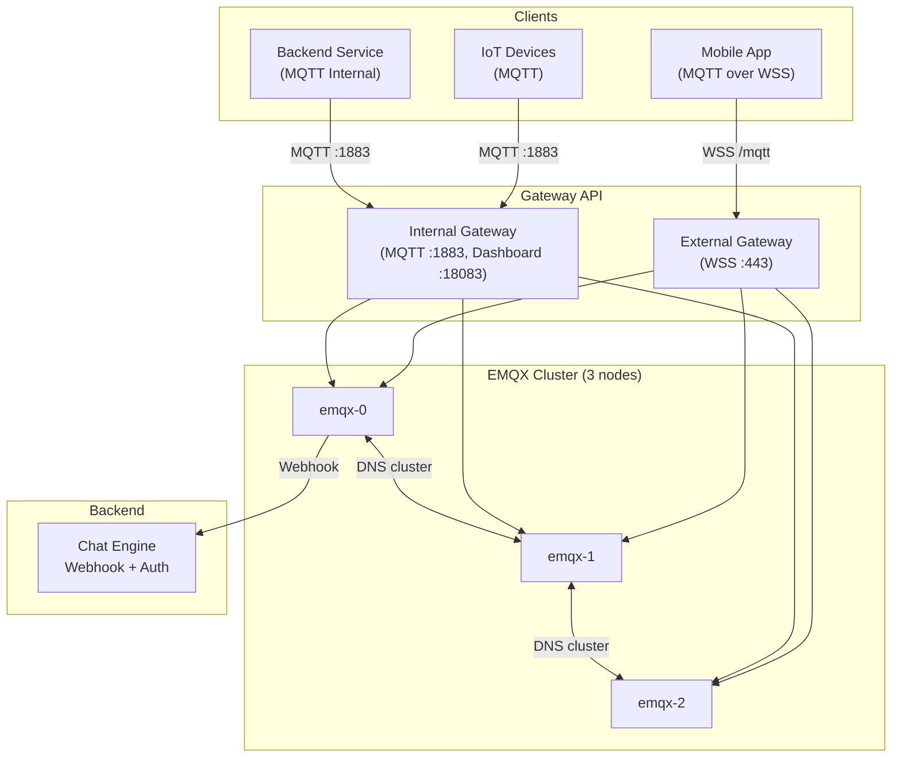
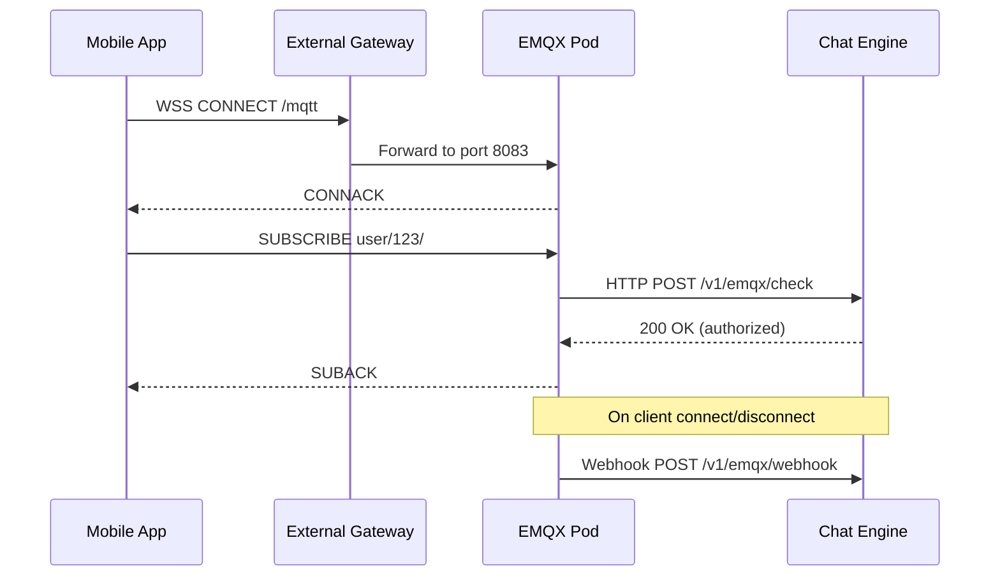
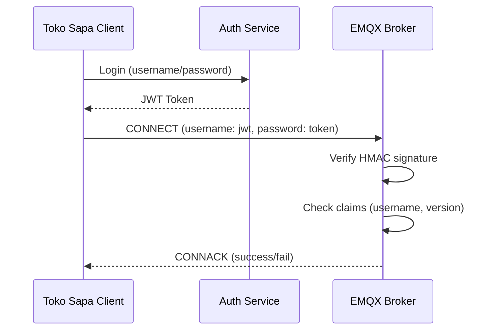

# EMQX on GKE — MQTT Broker with Gateway API (YAML from Scratch)

## Table of Contents

| Section | Topic | Description |
| :---: | :--- | :--- |
| **01** | [Why EMQX on GKE](#1-why-emqx-on-gke) | MQTT broker for real-time messaging at scale. |
| **02** | [Architecture](#2-architecture) | EMQX cluster topology on GKE with Gateway API. |
| **03** | [StatefulSet](#3-statefulset) | YAML from scratch — no Helm. |
| **04** | [Configuration](#4-configuration) | ConfigMap-based EMQX config via environment variables. |
| **05** | [Services](#5-services) | ClusterIP, Headless, and Dashboard services. |
| **06** | [Gateway API Integration](#6-gateway-api-integration) | HTTPRoute for MQTT, WSS, and Dashboard. |
| **07** | [Security](#7-security) | JWT auth, ACL rules, API keys. |
| **08** | [Autoscaling & Monitoring](#8-autoscaling--monitoring) | HPA and health checks. |

---

## 1. Why EMQX on GKE

EMQX is a distributed MQTT broker built for IoT and real-time messaging. Running it on GKE with raw YAML gives full control without Helm abstraction overhead.

| Option | Pros | Cons |
| :--- | :--- | :--- |
| **EMQX Operator** | Auto-clustering, CRDs | Extra operator dependency |
| **Helm chart** | Quick deploy, defaults | Hidden config, harder to customize |
| **YAML from scratch** | Full control, audit-friendly | More manifests to maintain |

### Why YAML from Scratch

| Reason | Detail |
| :--- | :--- |
| **No hidden defaults** | Every setting is explicit in the manifest |
| **GitOps friendly** | Exact diffs on every change |
| **Security review** | No surprises from chart templates |
| **Cluster independence** | Works on any K8s cluster, not tied to EMQX Helm |

---

## 2. Architecture



### EMQX Port Reference

| Port | Protocol | Purpose | External? |
| :--- | :--- | :--- | :--- |
| 1883 | TCP | MQTT (plain) | Internal only |
| 8883 | TCP | MQTT/TLS | Internal only |
| 8083 | TCP | MQTT over WebSocket | External (WSS) |
| 8084 | TCP | MQTT over WSS | External |
| 18083 | TCP | Dashboard + REST API | Internal only |
| 4370 | TCP | Cluster (Ekka) | Pod-to-pod only |

---

## 3. StatefulSet

### Why StatefulSet, Not Deployment

| Aspect | Deployment | StatefulSet |
| :--- | :--- | :--- |
| Pod identity | Random names | Stable names (emqx-0, emqx-1, emqx-2) |
| Network | Ephemeral DNS | Stable DNS via Headless Service |
| Storage | Shared or none | Per-pod PVC |
| Cluster discovery | Complex | DNS SRV records work naturally |

### Full StatefulSet

```yaml
apiVersion: apps/v1
kind: StatefulSet
metadata:
  name: emqx-app-chat
  namespace: infrastructure
  labels:
    app: emqx-app-chat
    env: production
    team: infrastructure
    app.kubernetes.io/name: emqx-app-chat
    app.kubernetes.io/instance: emqx-app-chat
    app.kubernetes.io/component: mqttbroker
    app.kubernetes.io/part-of: example
    app.kubernetes.io/managed-by: DevOpsTeam
spec:
  replicas: 3
  serviceName: emqx-app-chat-headless
  selector:
    matchLabels:
      app.kubernetes.io/instance: emqx-app-chat
      app.kubernetes.io/name: emqx-app-chat
  template:
    metadata:
      labels:
        app: emqx-app-chat
        app.kubernetes.io/instance: emqx-app-chat
        app.kubernetes.io/name: emqx-app-chat
        version: 5.8.7
    spec:
      securityContext:
        fsGroup: 1000
        runAsUser: 1000
        runAsGroup: 1000
      affinity:
        nodeAffinity:
          requiredDuringSchedulingIgnoredDuringExecution:
            nodeSelectorTerms:
            - matchExpressions:
              - key: pool-type
                operator: In
                values:
                - apo
        podAntiAffinity:
          preferredDuringSchedulingIgnoredDuringExecution:
          - weight: 60
            podAffinityTerm:
              labelSelector:
                matchLabels:
                  app.kubernetes.io/name: emqx-app-chat
              topologyKey: kubernetes.io/hostname
      topologySpreadConstraints:
      - maxSkew: 1
        topologyKey: kubernetes.io/hostname
        whenUnsatisfiable: ScheduleAnyway
        labelSelector:
          matchLabels:
            app.kubernetes.io/name: emqx-app-chat
      containers:
      - name: emqx-app-chat
        image: emqx/emqx:5.8.5
        imagePullPolicy: IfNotPresent
        ports:
        - containerPort: 1883
          name: mqtt
        - containerPort: 8883
          name: mqttssl
        - containerPort: 8083
          name: ws
        - containerPort: 8084
          name: wss
        - containerPort: 18083
          name: dashboard
        env:
        - name: POD_NAME
          valueFrom:
            fieldRef:
              apiVersion: v1
              fieldPath: metadata.name
        - name: EMQX_HOST
          value: "$(POD_NAME).emqx-app-chat-headless.infrastructure.svc.cluster.local"
        envFrom:
        - configMapRef:
            name: emqx-app-chat-cfg
        resources:
          requests:
            cpu: 500m
            memory: 1024Mi
          limits:
            memory: 1024Mi
        securityContext:
          allowPrivilegeEscalation: false
          readOnlyRootFilesystem: true
          capabilities:
            drop: ["ALL"]
          seccompProfile:
            type: RuntimeDefault
        livenessProbe:
          httpGet:
            path: /api/v5/status
            port: 18083
            scheme: HTTP
          initialDelaySeconds: 60
          periodSeconds: 30
          failureThreshold: 5
        readinessProbe:
          httpGet:
            path: /api/v5/status
            port: 18083
            scheme: HTTP
          initialDelaySeconds: 20
          periodSeconds: 10
          failureThreshold: 3
        volumeMounts:
        - mountPath: /opt/emqx/data
          name: emqx-app-chat-data
        - mountPath: /opt/emqx/etc/acl.conf
          name: emqx-app-chat-acl-volume
          subPath: acl.conf
        - mountPath: /opt/emqx/etc/default_api_key.conf
          name: emqx-app-chat-bootstrap-api-keys
          subPath: default_api_key.conf
      volumes:
      - name: emqx-app-chat-acl-volume
        configMap:
          name: emqx-app-chat-acl-cfg
      - name: emqx-app-chat-bootstrap-api-keys
        configMap:
          name: emqx-app-chat-bootstrap-api-keys
  volumeClaimTemplates:
  - metadata:
      name: emqx-app-chat-data
    spec:
      accessModes:
      - ReadWriteOnce
      resources:
        requests:
          storage: 1Gi
      storageClassName: standard-rwo
      volumeMode: Filesystem
```

### Key Design Decisions

| Decision | Rationale |
| :--- | :--- |
| `readOnlyRootFilesystem: true` | EMQX writes only to `/opt/emqx/data` |
| `EMQX_HOST` from `POD_NAME` | DNS-based cluster discovery |
| `envFrom` ConfigMap | All config via env vars, no mounted config files |
| `volumeClaimTemplates` | Each node gets its own persistent data |
| `fsGroup: 1000` | EMQX runs as non-root (UID 1000) |

---

## 4. Configuration

EMQX 5.x supports configuration via environment variables with `__` as path separator.

### ConfigMap

```yaml
apiVersion: v1
kind: ConfigMap
metadata:
  name: emqx-app-chat-cfg
  namespace: infrastructure
  labels:
    app: emqx-app-chat
    env: production
    team: infrastructure
    app.kubernetes.io/name: emqx-app-chat
    app.kubernetes.io/instance: emqx-app-chat
    app.kubernetes.io/component: mqttbroker
    app.kubernetes.io/part-of: example
    app.kubernetes.io/managed-by: DevOpsTeam
data:
  # Cluster
  EMQX_NAME: emqx-app-chat
  EMQX_NODE__COOKIE: nodecookie
  EMQX_CLUSTER__DISCOVERY_STRATEGY: dns
  EMQX_CLUSTER__DNS__NAME: emqx-app-chat-headless.infrastructure.svc.cluster.local
  EMQX_CLUSTER__DNS__RECORD_TYPE: srv

  # Authentication (JWT)
  EMQX_AUTHENTICATION__1__ENABLE: "true"
  EMQX_AUTHENTICATION__1__MECHANISM: jwt
  EMQX_AUTHENTICATION__1__ALGORITHM: hmac-based
  EMQX_AUTHENTICATION__1__FROM: password
  EMQX_AUTHENTICATION__1__SECRET: YOUR_HMAC_SECRET
  EMQX_AUTHENTICATION__1__SECRET_BASE64_ENCODED: "false"
  EMQX_AUTHENTICATION__1__USE_JWKS: "false"
  EMQX_AUTHENTICATION__1__VERIFY_CLAIMS: '{"username": "${username}", "version": "1.0"}'

  # Authorization
  EMQX_AUTHORIZATION__NO_MATCH: deny
  EMQX_AUTHORIZATION__SOURCES__1__ENABLE: "true"
  EMQX_AUTHORIZATION__SOURCES__1__TYPE: file
  EMQX_AUTHORIZATION__SOURCES__1__PATH: /opt/emqx/etc/acl.conf
  EMQX_AUTHORIZATION__SOURCES__2__ENABLE: "true"
  EMQX_AUTHORIZATION__SOURCES__2__TYPE: http
  EMQX_AUTHORIZATION__SOURCES__2__METHOD: post
  EMQX_AUTHORIZATION__SOURCES__2__URL: http://chat-engine-svc/v1/emqx/check
  EMQX_AUTHORIZATION__SOURCES__2__CONNECT_TIMEOUT: 5s
  EMQX_AUTHORIZATION__SOURCES__2__REQUEST_TIMEOUT: 5s
  EMQX_AUTHORIZATION__SOURCES__2__HEADERS__CONTENT_TYPE: application/json
  EMQX_AUTHORIZATION__SOURCES__2__BODY: '{"username":"${username}","action":"${action}","topic":"${topic}","qos":"${qos}","clientid":"${clientid}"}'

  # Webhook (client events)
  EMQX_RULE_ENGINE__RULES__WEBHOOK_CLIENT_EVENTS__ENABLE: "true"
  EMQX_RULE_ENGINE__RULES__WEBHOOK_CLIENT_EVENTS__SQL: 'SELECT * FROM "$events/client_connected","$events/client_disconnected"'
  EMQX_RULE_ENGINE__RULES__WEBHOOK_CLIENT_EVENTS__ACTIONS__1: webhook:chat_webhook
  EMQX_BRIDGES__WEBHOOK__CHAT_WEBHOOK__ENABLE: "true"
  EMQX_BRIDGES__WEBHOOK__CHAT_WEBHOOK__URL: http://chat-engine-svc/v1/emqx/webhook
  EMQX_BRIDGES__WEBHOOK__CHAT_WEBHOOK__METHOD: post
  EMQX_BRIDGES__WEBHOOK__CHAT_WEBHOOK__HEADERS__CONTENT_TYPE: application/json
  EMQX_BRIDGES__WEBHOOK__CHAT_WEBHOOK__POOL_SIZE: "32"

  # Listeners
  EMQX_LISTENER__WS__DEFAULT__PATH: /mqtt
  EMQX_LISTENER__WSS__DEFAULT__ENABLE: "true"
  EMQX_LISTENER__WSS__DEFAULT__PATH: /mqtt
  EMQX_LISTENER__WSS__DEFAULT__SSL_OPTIONS__FAIL_IF_NO_PEER_CERT: "false"
  EMQX_LISTENER__WSS__DEFAULT__SSL_OPTIONS__VERIFY: verify_none
  EMQX_LISTENERS__SSL__DEFAULT__PROXY_PROTOCOL: "true"

  # Limits
  EMQX_MQTT__MAX_CLIENTID_LEN: "128"
  EMQX_MQTT__MAX_SESSION_EXPIRE_INTERVAL: 2h
  EMQX_MQTT__MAX_SUBSCRIPTION: "128"
  EMQX_MQTT__MAX_TOPIC_LEVELS: "128"
  EMQX_ZONE__external__idle_timeout: 60s
  EMQX_ZONE__external__mqtt__keepalive_backoff: "0.75"
  EMQX_ZONE__external__mqtt__max_inflight: "32"
  EMQX_ZONE__external__mqtt__max_packet_size: 1MB
  EMQX_ZONE__external__mqtt__max_qos: "1"
  EMQX_ZONE__external__mqtt__retry_interval: 30s
  EMQX_ZONE__internal__mqtt__max_inflight: "64"
  EMQX_ZONE__internal__mqtt__max_packet_size: 10MB

  # Dashboard
  EMQX_DASHBOARD__DEFAULT_USERNAME: admin
  EMQX_DASHBOARD__DEFAULT_PASSWORD: CHANGE_ME

  # Logging
  EMQX_LOG__CONSOLE__ENABLE: "true"
  EMQX_LOG__CONSOLE__FORMATTER: json
  EMQX_LOG__CONSOLE__LEVEL: info
  EMQX_LOG__CONSOLE__TIME_OFFSET: system
  EMQX_LOG__CONSOLE__TIMESTAMP_FORMAT: auto

  # API Keys
  EMQX_API_KEY__BOOTSTRAP_FILE: etc/default_api_key.conf
```

### Environment Variable Mapping

| EMQX Config | Env Variable | Purpose |
| :--- | :--- | :--- |
| `cluster.discovery.strategy` | `EMQX_CLUSTER__DISCOVERY_STRATEGY` | DNS-based discovery |
| `authentication[1].mechanism` | `EMQX_AUTHENTICATION__1__MECHANISM` | JWT authentication |
| `authorization.no_match` | `EMQX_AUTHORIZATION__NO_MATCH` | Default deny policy |
| `listener.wss.default.enable` | `EMQX_LISTENER__WSS__DEFAULT__ENABLE` | Enable WebSocket |

### ACL Rules

```yaml
apiVersion: v1
kind: ConfigMap
metadata:
  name: emqx-app-chat-acl-cfg
  namespace: infrastructure
data:
  acl.conf: |
    {allow, {username, "admin"}, subscribe, ["#"]}.
    {allow, {username, "admin"}, publish, ["#"]}.
    {allow, all, subscribe, ["clientid/${clientid}"]}.
    {deny, all, subscribe, ["$SYS/#"]}.
    {deny, all, publish, ["#"]}.
```

| Rule | Effect |
| :--- | :--- |
| `admin` subscribes to `#` | Admin can subscribe to all topics |
| `admin` publishes to `#` | Admin can publish to all topics |
| All subscribe to `clientid/${clientid}` | Clients can subscribe to their own topic |
| All subscribe to `$SYS/#` denied | System topics blocked |
| All publish to `#` denied | Default publish denied (must go through webhook) |

### Bootstrap API Keys

```yaml
apiVersion: v1
kind: ConfigMap
metadata:
  name: emqx-app-chat-bootstrap-api-keys
  namespace: infrastructure
data:
  default_api_key.conf: |
    alfagift-emqx:YOUR_API_KEY_HERE
    my-app:YOUR_APP_KEY_HERE
```

---

## 5. Services

### ClusterIP (Main Service)

```yaml
apiVersion: v1
kind: Service
metadata:
  name: emqx-app-chat
  namespace: infrastructure
  labels:
    app: emqx-app-chat
    app.kubernetes.io/name: emqx-app-chat
    app.kubernetes.io/instance: emqx-app-chat
    app.kubernetes.io/component: mqttbroker
spec:
  selector:
    app.kubernetes.io/instance: emqx-app-chat
    app.kubernetes.io/name: emqx-app-chat
  ports:
  - name: mqtt
    port: 1883
    targetPort: mqtt
  - name: mqttssl
    port: 8883
    targetPort: mqttssl
  - name: ws
    port: 8083
    targetPort: ws
  - name: wss
    port: 8084
    targetPort: wss
  - name: dashboard
    port: 18083
    targetPort: dashboard
  type: ClusterIP
```

### Headless (Cluster Discovery)

```yaml
apiVersion: v1
kind: Service
metadata:
  name: emqx-app-chat-headless
  namespace: infrastructure
  labels:
    app: emqx-app-chat
    app.kubernetes.io/name: emqx-app-chat
    app.kubernetes.io/instance: emqx-app-chat
    app.kubernetes.io/component: mqttbroker
spec:
  clusterIP: None
  publishNotReadyAddresses: true
  selector:
    app.kubernetes.io/instance: emqx-app-chat
    app.kubernetes.io/name: emqx-app-chat
  ports:
  - name: mqtt
    port: 1883
    targetPort: mqtt
  - name: mqttssl
    port: 8883
    targetPort: mqttssl
  - name: ws
    port: 8083
    targetPort: ws
  - name: wss
    port: 8084
    targetPort: wss
  - name: dashboard
    port: 18083
    targetPort: dashboard
  - name: ekka
    port: 4370
    targetPort: ekka
```

### Service Purpose Comparison

| Service | Type | Purpose |
| :--- | :--- | :--- |
| `emqx-app-chat` | ClusterIP | Client connections, load balanced |
| `emqx-app-chat-headless` | None (Headless) | DNS SRV records for EMQX clustering |
| `emqx-app-chat-dashboard` | ClusterIP | Dashboard-only access |

### Internal LoadBalancer (Optional)

For direct MQTT access from outside the cluster without Gateway API:

```yaml
apiVersion: v1
kind: Service
metadata:
  name: emqx-app-chat-internal-lb
  namespace: infrastructure
  annotations:
    cloud.google.com/load-balancer-type: "Internal"
spec:
  type: LoadBalancer
  selector:
    app: emqx-app-chat
  ports:
  - name: ws
    port: 8083
    targetPort: 8083
    protocol: TCP
  - name: mqtt
    port: 1883
    targetPort: 1883
    protocol: TCP
```

---

## 6. Gateway API Integration

### External — WebSocket (WSS)

```yaml
apiVersion: gateway.networking.k8s.io/v1
kind: HTTPRoute
metadata:
  name: emqx-app-chat-httproute
  namespace: infrastructure
  labels:
    app: emqx-app-chat
    app.kubernetes.io/name: emqx-app-chat
    app.kubernetes.io/component: gateway
spec:
  parentRefs:
  - name: example-gateway
    namespace: gateway-api
    sectionName: https
  hostnames:
  - wss-app-chat.example.id
  rules:
  - matches:
    - path:
        type: PathPrefix
        value: /
    backendRefs:
    - name: emqx-app-chat
      port: 8083
      weight: 100
```

### Internal — MQTT

```yaml
apiVersion: gateway.networking.k8s.io/v1
kind: HTTPRoute
metadata:
  name: emqx-app-chat-mqtt-internal-httproute
  namespace: infrastructure
  labels:
    app: emqx-app-chat
    app.kubernetes.io/component: gateway
spec:
  parentRefs:
  - name: example-internal-gateway
    namespace: gateway-api
    sectionName: http
  hostnames:
  - mqtt-app-chat-prod.example.internal
  rules:
  - matches:
    - path:
        type: PathPrefix
        value: /mqtt
    backendRefs:
    - name: emqx-app-chat
      port: 1883
      weight: 100
```

### Internal — Dashboard

```yaml
apiVersion: gateway.networking.k8s.io/v1
kind: HTTPRoute
metadata:
  name: emqx-app-chat-dashboard-internal-httproute
  namespace: infrastructure
  labels:
    app: emqx-app-chat-dashboard
    app.kubernetes.io/component: gateway
spec:
  parentRefs:
  - name: example-internal-gateway
    namespace: gateway-api
    sectionName: http
  hostnames:
  - dashboard-emqx-app-chat-prod.example.internal
  rules:
  - matches:
    - path:
        type: PathPrefix
        value: /
    backendRefs:
    - name: emqx-app-chat-dashboard
      port: 18083
      weight: 100
```

### Health Check Policy

```yaml
apiVersion: networking.gke.io/v1
kind: HealthCheckPolicy
metadata:
  name: emqx-app-chat-hc-policy
  namespace: infrastructure
spec:
  default:
    checkIntervalSec: 10
    timeoutSec: 5
    healthyThreshold: 1
    unhealthyThreshold: 3
    config:
      type: HTTP
      httpHealthCheck:
        port: 18083
        requestPath: /api/v5/status
  targetRef:
    group: ""
    kind: Service
    name: emqx-app-chat
```

### GCPBackendPolicy

```yaml
apiVersion: networking.gke.io/v1
kind: GCPBackendPolicy
metadata:
  name: emqx-app-chat-backend-policy
  namespace: infrastructure
spec:
  default:
    timeoutSec: 120
  targetRef:
    group: ""
    kind: Service
    name: emqx-app-chat
```

### Traffic Flow



---

## 7. Security

### JWT Authentication Flow



### Authorization Layers

| Layer | Type | Config |
| :--- | :--- | :--- |
| **Layer 1** | File ACL | `acl.conf` — static rules |
| **Layer 2** | HTTP | Chat engine webhook — dynamic rules |
| **Layer 3** | Default | `NO_MATCH: deny` — reject unauthorized |

### Webhook Authorization

```yaml
EMQX_AUTHORIZATION__SOURCES__2__URL: http://chat-engine-svc/v1/emqx/check
EMQX_AUTHORIZATION__SOURCES__2__BODY: |
  {
    "username": "${username}",
    "action": "${action}",
    "topic": "${topic}",
    "qos": "${qos}",
    "clientid": "${clientid}"
  }
```

### Rule Engine — Client Events

```yaml
EMQX_RULE_ENGINE__RULES__WEBHOOK_CLIENT_EVENTS__SQL: |
  SELECT * FROM "$events/client_connected","$events/client_disconnected"
EMQX_RULE_ENGINE__RULES__WEBHOOK_CLIENT_EVENTS__ACTIONS__1: webhook:chat_webhook
```

---

## 8. Autoscaling & Monitoring

### HPA

```yaml
apiVersion: autoscaling/v2
kind: HorizontalPodAutoscaler
metadata:
  name: emqx-app-chat-hpa
  namespace: infrastructure
spec:
  scaleTargetRef:
    apiVersion: apps/v1
    kind: StatefulSet
    name: emqx-app-chat
  minReplicas: 3
  maxReplicas: 3
  metrics:
  - type: Resource
    resource:
      name: cpu
      target:
        type: Utilization
        averageUtilization: 85
  - type: Resource
    resource:
      name: memory
      target:
        type: Utilization
        averageUtilization: 85
  behavior:
    scaleDown:
      stabilizationWindowSeconds: 240
      policies:
      - type: Pods
        value: 1
        periodSeconds: 60
    scaleUp:
      stabilizationWindowSeconds: 120
      policies:
      - type: Pods
        value: 1
        periodSeconds: 60
```

> **Note:** `minReplicas: maxReplicas: 3` — HPA is configured but fixed at 3 replicas. EMQX clustering requires manual scaling decisions.

### Health Check Endpoints

| Endpoint | Purpose | Used By |
| :--- | :--- | :--- |
| `GET /api/v5/status` | Broker status | K8s liveness/readiness probes |
| `GET /api/v5/` | REST API | Dashboard, monitoring |
| `GET /api/v5/stats` | Cluster stats | Prometheus scrape |

### Key Metrics

| Metric | Description |
| :--- | :--- |
| `emqx_connections_count` | Active MQTT connections |
| `emqx_messages_received` | Messages received per second |
| `emqx_messages_sent` | Messages sent per second |
| `emqx_messages_dropped` | Messages dropped (queue full) |
| `emqx_topics_count` | Active topic count |
| `emqx_subscriptions_count` | Active subscriptions |

---

## References

- [EMQX Documentation](https://www.emqx.io/docs/en/latest/)
- [EMQX Environment Variables](https://www.emqx.io/docs/en/latest/configuration/configuration.html)
- [EMQX Kubernetes Deployment](https://www.emqx.io/docs/en/latest/deployments/kubernetes.html)
- [Gateway API](https://gateway-api.sigs.k8s.io/)
- [GKE Gateway API](https://cloud.google.com/kubernetes-engine/docs/concepts/gateway-api)
