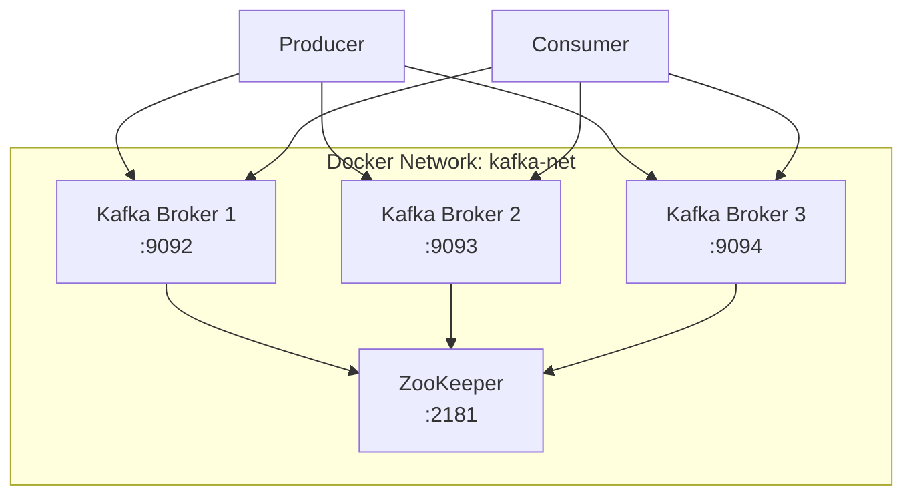
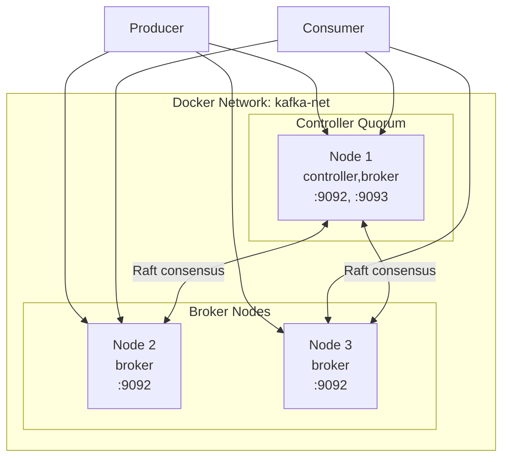

# Kafka Cluster with Docker — Multi-Broker with ZooKeeper and KRaft

## Table of Contents

| Section | Topic | Description |
| :---: | :--- | :--- |
| **01** | [Why Docker for Kafka](#1-why-docker-for-kafka) | Quick multi-broker testing without VM overhead. |
| **02** | [Architecture: ZooKeeper Mode](#2-architecture-zookeeper-mode) | Traditional 3-broker + ZooKeeper cluster. |
| **03** | [Docker Compose — ZooKeeper Mode](#3-docker-compose--zookeeper-mode) | Full compose file with volumes. |
| **04** | [Architecture: KRaft Mode](#4-architecture-kraft-mode) | ZooKeeper-free Kafka cluster. |
| **05** | [Docker Compose — KRaft Mode](#5-docker-compose--kraft-mode) | 3-node KRaft cluster. |
| **06** | [Docker Run — Single Node KRaft](#6-docker-run--single-node-kraft) | Quick single-node KRaft setup. |
| **07** | [Topic Operations](#7-topic-operations) | Create, list, describe, delete. |
| **08** | [Kafka UI](#8-kafka-ui) | Kafbat UI for web-based management. |

---

## 1. Why Docker for Kafka

Docker allows running a full Kafka cluster locally in minutes — no JVM installation, no systemd management, no port conflicts.

| Setup | Time to Run | Isolation | Persistence |
| :--- | :--- | :--- | :--- |
| Bare metal | 30+ min | Shared OS | Native disk |
| **Docker** | **2 min** | **Container** | **Volume mount** |
| Kubernetes | 10+ min | Pod | PVC |

### Docker Images Available

| Image | Source | Use Case |
| :--- | :--- | :--- |
| `confluentinc/cp-kafka:7.6.0` | Confluent | Production parity, Schema Registry compatible |
| `bitnami/kafka:3.9.0` | Bitnami | Simplified env var configuration |
| `apache/kafka:3.9.1` | Apache | Official image, minimal |

> **Note:** All images are pulled from private registry: `asia-southeast2-docker.pkg.dev/example-prd/devops/tools/`

---

## 2. Architecture: ZooKeeper Mode



### Port Mapping

| Container | Host Port | Purpose |
| :--- | :--- | :--- |
| zookeeper | 2181 | ZooKeeper client |
| kafka-1 | 9092 | Broker 1 |
| kafka-2 | 9093 | Broker 2 |
| kafka-3 | 9094 | Broker 3 |

---

## 3. Docker Compose — ZooKeeper Mode

```yaml
version: '3'
services:
  zookeeper:
    image: asia-southeast2-docker.pkg.dev/example-prd/devops/tools/cp-zookeeper:7.6.0
    container_name: zookeeper
    ports:
      - "2181:2181"
    environment:
      ZOOKEEPER_CLIENT_PORT: 2181
      ZOOKEEPER_TICK_TIME: 2000
    volumes:
      - ./zookeeper/data:/var/lib/zookeeper/data
    networks:
      - kafka-net

  kafka-1:
    image: asia-southeast2-docker.pkg.dev/example-prd/devops/tools/cp-kafka:7.6.0
    container_name: kafka-1
    ports:
      - "9092:9092"
    environment:
      KAFKA_BROKER_ID: 1
      KAFKA_ZOOKEEPER_CONNECT: zookeeper:2181
      KAFKA_LISTENERS: PLAINTEXT://0.0.0.0:9092
      KAFKA_ADVERTISED_LISTENERS: PLAINTEXT://localhost:9092
      KAFKA_LOG_DIRS: /var/lib/kafka/data
      KAFKA_OFFSETS_TOPIC_REPLICATION_FACTOR: 3
      KAFKA_TRANSACTION_STATE_LOG_MIN_ISR: 2
      KAFKA_TRANSACTION_STATE_LOG_REPLICATION_FACTOR: 3
      KAFKA_AUTO_CREATE_TOPICS_ENABLE: "false"
      KAFKA_DELETE_TOPIC_ENABLE: "true"
      KAFKA_LOG_RETENTION_HOURS: 168
    volumes:
      - ./broker-1/data:/var/lib/kafka/data
    depends_on:
      - zookeeper
    networks:
      - kafka-net

  kafka-2:
    image: asia-southeast2-docker.pkg.dev/example-prd/devops/tools/cp-kafka:7.6.0
    container_name: kafka-2
    ports:
      - "9093:9093"
    environment:
      KAFKA_BROKER_ID: 2
      KAFKA_ZOOKEEPER_CONNECT: zookeeper:2181
      KAFKA_LISTENERS: PLAINTEXT://0.0.0.0:9093
      KAFKA_ADVERTISED_LISTENERS: PLAINTEXT://localhost:9093
      KAFKA_LOG_DIRS: /var/lib/kafka/data
      KAFKA_OFFSETS_TOPIC_REPLICATION_FACTOR: 3
      KAFKA_TRANSACTION_STATE_LOG_MIN_ISR: 2
      KAFKA_TRANSACTION_STATE_LOG_REPLICATION_FACTOR: 3
      KAFKA_AUTO_CREATE_TOPICS_ENABLE: "false"
      KAFKA_DELETE_TOPIC_ENABLE: "true"
      KAFKA_LOG_RETENTION_HOURS: 168
    volumes:
      - ./broker-2/data:/var/lib/kafka/data
    depends_on:
      - zookeeper
    networks:
      - kafka-net

  kafka-3:
    image: asia-southeast2-docker.pkg.dev/example-prd/devops/tools/cp-kafka:7.6.0
    container_name: kafka-3
    ports:
      - "9094:9094"
    environment:
      KAFKA_BROKER_ID: 3
      KAFKA_ZOOKEEPER_CONNECT: zookeeper:2181
      KAFKA_LISTENERS: PLAINTEXT://0.0.0.0:9094
      KAFKA_ADVERTISED_LISTENERS: PLAINTEXT://localhost:9094
      KAFKA_LOG_DIRS: /var/lib/kafka/data
      KAFKA_OFFSETS_TOPIC_REPLICATION_FACTOR: 3
      KAFKA_TRANSACTION_STATE_LOG_MIN_ISR: 2
      KAFKA_TRANSACTION_STATE_LOG_REPLICATION_FACTOR: 3
      KAFKA_AUTO_CREATE_TOPICS_ENABLE: "false"
      KAFKA_DELETE_TOPIC_ENABLE: "true"
      KAFKA_LOG_RETENTION_HOURS: 168
    volumes:
      - ./broker-3/data:/var/lib/kafka/data
    depends_on:
      - zookeeper
    networks:
      - kafka-net

  kafka-ui:
    image: asia-southeast2-docker.pkg.dev/example-prd/devops/tools/kafka-ui:latest
    container_name: kafka-ui
    ports:
      - "8080:8080"
    environment:
      DYNAMIC_CONFIG_ENABLED: "true"
      KAFKA_CLUSTERS_0_NAME: local-cluster
      KAFKA_CLUSTERS_0_BOOTSTRAPSERVERS: kafka-1:9092,kafka-2:9093,kafka-3:9094
    depends_on:
      - kafka-1
      - kafka-2
      - kafka-3
    networks:
      - kafka-net

networks:
  kafka-net:
    driver: bridge
```

### Start Cluster

```bash
mkdir -p zookeeper/data broker-{1,2,3}/data
docker compose up -d
docker compose ps
```

### Verify Cluster

```bash
# Check all brokers
docker exec kafka-1 kafka-broker-api-versions --bootstrap-server kafka-1:9092 | head -5

# Describe cluster
docker exec kafka-1 kafka-metadata --snapshot /var/lib/kafka/metadata-2.bin --command-config /dev/null 2>/dev/null || \
docker exec kafka-1 kafka-topics --bootstrap-server kafka-1:9092 --describe --topic __consumer_offsets
```

---

## 4. Architecture: KRaft Mode

KRaft (Kafka Raft) eliminates ZooKeeper — the controller quorum is built into Kafka itself.



### KRaft vs ZooKeeper

| Aspect | ZooKeeper Mode | KRaft Mode |
| :--- | :--- | :--- |
| **External dependency** | ZooKeeper required | No external dependency |
| **Controller election** | ZooKeeper | Raft quorum |
| **Metadata storage** | ZooKeeper | Kafka logs |
| **Scalability** | Limited by ZK | Better metadata scalability |
| **Operations** | Two systems to manage | Single system |
| **Kafka version** | All versions | 3.3+ (production ready in 3.4+) |

---

## 5. Docker Compose — KRaft Mode

```yaml
version: '3'
services:
  kafka:
    image: asia-southeast2-docker.pkg.dev/example-prd/devops/tools/bitnami-kafka:3.9.0
    container_name: kafka-kraft
    environment:
      KAFKA_CFG_PROCESS_ROLES: controller,broker
      KAFKA_CFG_NODE_ID: 1
      KAFKA_CFG_CONTROLLER_QUORUM_VOTERS: 1@kafka:9093
      KAFKA_CFG_LISTENERS: PLAINTEXT://:9092,CONTROLLER://:9093
      KAFKA_CFG_ADVERTISED_LISTENERS: PLAINTEXT://kafka:9092
      KAFKA_CFG_CONTROLLER_LISTENER_NAMES: CONTROLLER
      KAFKA_CFG_LISTENER_SECURITY_PROTOCOL_MAP: CONTROLLER:PLAINTEXT,PLAINTEXT:PLAINTEXT
      KAFKA_KRAFT_CLUSTER_ID: kraft-cluster-id-001
      KAFKA_CFG_AUTO_CREATE_TOPICS_ENABLE: "false"
      KAFKA_CFG_LOG_RETENTION_HOURS: 72
      KAFKA_CFG_LOG_RETENTION_BYTES: 1073741824
      KAFKA_CFG_LOG_SEGMENT_BYTES: 268435456
      KAFKA_CFG_LOG_SEGMENT_MS: 3600000
      KAFKA_CFG_OFFSETS_TOPIC_REPLICATION_FACTOR: 3
      KAFKA_CFG_DEFAULT_REPLICATION_FACTOR: 3
      KAFKA_CFG_MIN_INSYNC_REPLICAS: 2
    ports:
      - "9092:9092"
    volumes:
      - ./kafka/data:/bitnami/kafka
    networks:
      - kafka-net

  kafka-broker:
    image: asia-southeast2-docker.pkg.dev/example-prd/devops/tools/bitnami-kafka:3.9.0
    container_name: kafka-kraft-broker
    environment:
      KAFKA_CFG_PROCESS_ROLES: broker
      KAFKA_CFG_NODE_ID: 2
      KAFKA_CFG_CONTROLLER_QUORUM_VOTERS: 1@kafka:9093
      KAFKA_CFG_LISTENERS: PLAINTEXT://:9092
      KAFKA_CFG_ADVERTISED_LISTENERS: PLAINTEXT://kafka-kraft-broker:9092
      KAFKA_KRAFT_CLUSTER_ID: kraft-cluster-id-001
      KAFKA_CFG_AUTO_CREATE_TOPICS_ENABLE: "false"
      KAFKA_CFG_LOG_RETENTION_HOURS: 72
      KAFKA_CFG_LOG_RETENTION_BYTES: 1073741824
      KAFKA_CFG_LOG_SEGMENT_BYTES: 268435456
      KAFKA_CFG_LOG_SEGMENT_MS: 3600000
    ports:
      - "9093:9092"
    volumes:
      - ./broker/data:/bitnami/kafka
    depends_on:
      - kafka
    networks:
      - kafka-net

  kafka-broker-2:
    image: asia-southeast2-docker.pkg.dev/example-prd/devops/tools/bitnami-kafka:3.9.0
    container_name: kafka-kraft-broker-2
    environment:
      KAFKA_CFG_PROCESS_ROLES: broker
      KAFKA_CFG_NODE_ID: 3
      KAFKA_CFG_CONTROLLER_QUORUM_VOTERS: 1@kafka:9093
      KAFKA_CFG_LISTENERS: PLAINTEXT://:9092
      KAFKA_CFG_ADVERTISED_LISTENERS: PLAINTEXT://kafka-kraft-broker-2:9092
      KAFKA_KRAFT_CLUSTER_ID: kraft-cluster-id-001
      KAFKA_CFG_AUTO_CREATE_TOPICS_ENABLE: "false"
      KAFKA_CFG_LOG_RETENTION_HOURS: 72
      KAFKA_CFG_LOG_RETENTION_BYTES: 1073741824
      KAFKA_CFG_LOG_SEGMENT_BYTES: 268435456
      KAFKA_CFG_LOG_SEGMENT_MS: 3600000
    ports:
      - "9094:9092"
    volumes:
      - ./broker-2/data:/bitnami/kafka
    depends_on:
      - kafka
    networks:
      - kafka-net

  kafka-ui:
    image: asia-southeast2-docker.pkg.dev/example-prd/devops/tools/kafka-ui:latest
    container_name: kafka-ui
    ports:
      - "8080:8080"
    environment:
      KAFKA_CLUSTERS_0_NAME: kraft-cluster
      KAFKA_CLUSTERS_0_BOOTSTRAPSERVERS: kafka:9092
    depends_on:
      - kafka
    networks:
      - kafka-net

networks:
  kafka-net:
    driver: bridge
```

### Start KRaft Cluster

```bash
mkdir -p kafka/data broker/data broker-2/data
docker compose up -d
```

---

## 6. Docker Run — Single Node KRaft

For quick testing without Compose:

```bash
docker run -d \
  --name kafka-kraft \
  -p 9092:9092 \
  -e KAFKA_CFG_PROCESS_ROLES=controller,broker \
  -e KAFKA_CFG_NODE_ID=1 \
  -e KAFKA_CFG_CONTROLLER_QUORUM_VOTERS=1@kafka-kraft:9093 \
  -e KAFKA_CFG_LISTENERS=PLAINTEXT://:9092,CONTROLLER://:9093 \
  -e KAFKA_CFG_ADVERTISED_LISTENERS=PLAINTEXT://localhost:9092 \
  -e KAFKA_CFG_CONTROLLER_LISTENER_NAMES=CONTROLLER \
  -e KAFKA_CFG_LISTENER_SECURITY_PROTOCOL_MAP=CONTROLLER:PLAINTEXT,PLAINTEXT:PLAINTEXT \
  -e KAFKA_KRAFT_CLUSTER_ID=kraft-cluster-id-01 \
  -e KAFKA_CFG_AUTO_CREATE_TOPICS_ENABLE=false \
  -e KAFKA_CFG_LOG_RETENTION_HOURS=72 \
  -e KAFKA_CFG_LOG_RETENTION_BYTES=1073741824 \
  -e KAFKA_CFG_LOG_SEGMENT_BYTES=268435456 \
  -v $(pwd)/kafka/data:/bitnami/kafka \
  --network kafka-net \
  asia-southeast2-docker.pkg.dev/example-prd/devops/tools/bitnami-kafka:3.9.0
```

---

## 7. Topic Operations

### Create Topic

```bash
docker exec kafka-1 kafka-topics \
  --create \
  --topic my-topic \
  --bootstrap-server kafka-1:9092 \
  --replication-factor 3 \
  --partitions 3
```

### List Topics

```bash
docker exec kafka-1 kafka-topics \
  --list \
  --bootstrap-server kafka-1:9092
```

### Describe Topic

```bash
docker exec kafka-1 kafka-topics \
  --describe \
  --topic my-topic \
  --bootstrap-server kafka-1:9092
```

### Delete Topic

```bash
docker exec kafka-1 kafka-topics \
  --delete \
  --topic my-topic \
  --bootstrap-server kafka-1:9092
```

### Produce Messages

```bash
docker exec -it kafka-1 kafka-console-producer \
  --topic my-topic \
  --bootstrap-server kafka-1:9092
```

### Consume Messages

```bash
docker exec -it kafka-1 kafka-console-consumer \
  --topic my-topic \
  --from-beginning \
  --bootstrap-server kafka-1:9092
```

---

## 8. Kafka UI

### Kafbat UI (Docker)

```yaml
kafka-ui:
  image: asia-southeast2-docker.pkg.dev/example-prd/devops/tools/kafka-ui:latest
  container_name: kafka-ui
  ports:
    - "8080:8080"
  environment:
    DYNAMIC_CONFIG_ENABLED: "true"
```

### Access UI

```
http://localhost:8080
```

### Features

| Feature | Description |
| :--- | :--- |
| Topic browser | View all topics, partitions, configs |
| Consumer groups | Monitor lag, reset offsets |
| Message viewer | Browse messages with filters |
| Cluster metrics | Broker stats, throughput |

---

## References

- [Apache Kafka Docker](https://hub.docker.com/r/apache/kafka)
- [Confluent CP-Kafka](https://hub.docker.com/r/confluentinc/cp-kafka)
- [Bitnami Kafka](https://hub.docker.com/r/bitnami/kafka)
- [KRaft Documentation](https://kafka.apache.org/documentation/#kraft)
- [Kafbat UI](https://github.com/kafbat/kafka-ui)
