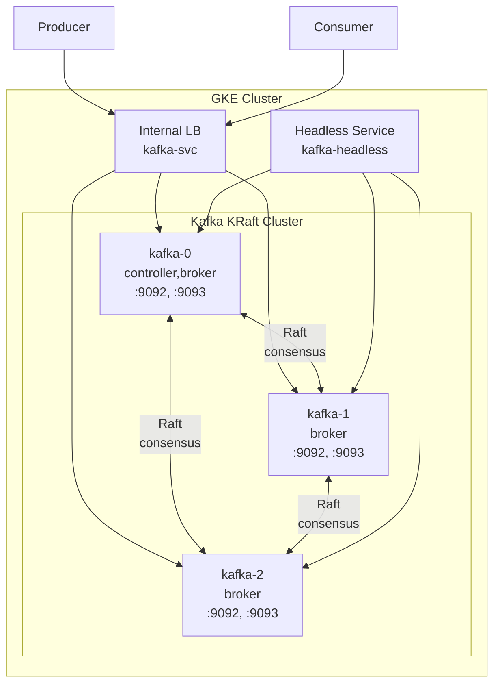

# Kafka on GKE with KRaft — No ZooKeeper

## Table of Contents

| Section | Topic | Description |
| :---: | :--- | :--- |
| **01** | [Why KRaft on GKE](#1-why-kraft-on-gke) | Eliminate ZooKeeper for simpler operations. |
| **02** | [Architecture](#2-architecture) | 3-node KRaft cluster on GKE. |
| **03** | [server.properties as ConfigMap](#3-serverproperties-as-configmap) | KRaft configuration in Kubernetes. |
| **04** | [StatefulSet](#4-statefulset) | Init container for storage format. |
| **05** | [Services](#5-services) | Headless + Internal LoadBalancer. |
| **06** | [Scaling KRaft](#6-scaling-kraft) | Adding broker nodes to the quorum. |
| **07** | [ZooKeeper vs KRaft Comparison](#7-zookeeper-vs-kraft-comparison) | Side-by-side feature matrix. |
| **08** | [Production Checklist](#8-production-checklist) | Hardening for production workloads. |

---

## 1. Why KRaft on GKE

KRaft (Kafka Raft) mode eliminates ZooKeeper — reducing operational complexity, resource usage, and failure surface.

| Aspect | ZooKeeper Mode | KRaft Mode |
| :--- | :--- | :--- |
| **Components** | 2 systems (Kafka + ZK) | 1 system (Kafka) |
| **StatefulSets** | 2 (Kafka + ZK) | 1 (Kafka) |
| **Resource overhead** | ~50% more (ZK nodes) | Lower |
| **Metadata storage** | ZooKeeper | Kafka logs |
| **Controller election** | ZooKeeper | Raft quorum |
| **Minimum nodes** | 6 (3 Kafka + 3 ZK) | 3 (all Kafka) |
| **Kafka version** | All | 3.3+ (production ready 3.4+) |

### When to Use KRaft

| Scenario | Use KRaft? |
| :--- | :--- |
| New Kafka deployment | Yes |
| Existing ZooKeeper cluster | Migrate gradually |
| Kafka < 3.3 | No (not supported) |
| Complex multi-cluster | Evaluate (KRaft matures each release) |

---

## 2. Architecture



### Node Roles

| Node | Role | Port | Purpose |
| :--- | :--- | :--- | :--- |
| kafka-0 | controller + broker | 9092, 9093 | Quorum voter + message broker |
| kafka-1 | broker | 9092, 9093 | Message broker only |
| kafka-2 | broker | 9092, 9093 | Message broker only |

---

## 3. server.properties as ConfigMap

```yaml
apiVersion: v1
kind: ConfigMap
metadata:
  name: kafka-config
  namespace: kafka
  labels:
    app: kafka
    app.kubernetes.io/name: kafka
    app.kubernetes.io/component: broker
    app.kubernetes.io/part-of: kafka
data:
  server.properties: |
    # KRaft mode
    process.roles=broker,controller
    node.id=0

    # Controller quorum
    controller.listener.names=CONTROLLER
    controller.quorum.voters=0@kafka-0.kafka-headless.kafka.svc.cluster.local:9093,1@kafka-1.kafka-headless.kafka.svc.cluster.local:9093,2@kafka-2.kafka-headless.kafka.svc.cluster.local:9093
    kraft.cluster.id=kraft-cluster-id-gke

    # Listeners
    listeners=PLAINTEXT://:9092,CONTROLLER://:9093
    advertised.listeners=PLAINTEXT://kafka-0.kafka-headless.kafka.svc.cluster.local:9092
    inter.broker.listener.name=PLAINTEXT
    listener.security.protocol.map=PLAINTEXT:PLAINTEXT,EXTERNAL:PLAINTEXT,CONTROLLER:PLAINTEXT

    # Log storage
    log.dirs=/bitnami/kafka/data

    # Topic configuration
    auto.create.topics.enable=false
    default.replication.factor=3
    offsets.topic.replication.factor=3
    transaction.state.log.replication.factor=3
    transaction.state.log.min.isr=2

    # Retention
    log.retention.hours=168
    log.retention.bytes=1073741824
    log.segment.bytes=268435456
    log.segment.ms=3600000
```

### ConfigMap Breakdown

| Section | Parameter | Purpose |
| :--- | :--- | :--- |
| **KRaft** | `process.roles=broker,controller` | Node runs both roles |
| **KRaft** | `node.id` | Unique node identifier |
| **KRaft** | `controller.quorum.voters` | All controller nodes in quorum |
| **KRaft** | `kraft.cluster.id` | Unique cluster identifier |
| **Listener** | `listeners` | Bind addresses |
| **Listener** | `advertised.listeners` | Client-facing addresses |
| **Replication** | `default.replication.factor=3` | Replicate to all brokers |
| **Replication** | `transaction.state.log.min.isr=2` | Min ISR for transaction log |

### Generate Cluster ID

```bash
# Generate a new cluster ID
kafka-storage.sh random-uuid
```

---

## 4. StatefulSet

```yaml
apiVersion: apps/v1
kind: StatefulSet
metadata:
  name: kafka
  namespace: kafka
  labels:
    app: kafka
    app.kubernetes.io/name: kafka
    app.kubernetes.io/component: broker
    app.kubernetes.io/part-of: kafka
spec:
  serviceName: kafka-headless
  replicas: 3
  podManagementPolicy: Parallel
  selector:
    matchLabels:
      app: kafka
  template:
    metadata:
      labels:
        app: kafka
    spec:
      securityContext:
        fsGroup: 1001
        runAsUser: 1001
        runAsGroup: 1001
      affinity:
        podAntiAffinity:
          requiredDuringSchedulingIgnoredDuringExecution:
          - labelSelector:
              matchLabels:
                app: kafka
            topologyKey: kubernetes.io/hostname
        nodeAffinity:
          requiredDuringSchedulingIgnoredDuringExecution:
            nodeSelectorTerms:
            - matchExpressions:
              - key: pool-type
                operator: In
                values:
                - messaging
      topologySpreadConstraints:
      - maxSkew: 1
        topologyKey: topology.kubernetes.io/zone
        whenUnsatisfiable: DoNotSchedule
        labelSelector:
          matchLabels:
            app: kafka
      containers:
      - name: kafka
        image: asia-southeast2-docker.pkg.dev/example-prd/devops/tools/bitnami-kafka:3.9.0
        command:
        - /bin/bash
        - -c
        - |
          if [ ! -f "/bitnami/kafka/data/meta.properties" ]; then
            kafka-storage.sh format -t kraft-cluster-id-gke -c /opt/bitnami/kafka/config/server.properties
          fi
          exec kafka-server-start.sh /opt/bitnami/kafka/config/server.properties
        ports:
        - containerPort: 9092
          name: plaintext
        - containerPort: 9093
          name: controller
        env:
        - name: POD_NAME
          valueFrom:
            fieldRef:
              apiVersion: v1
              fieldPath: metadata.name
        - name: NODE_ID
          valueFrom:
            fieldRef:
              apiVersion: v1
              fieldPath: metadata.name
        resources:
          requests:
            cpu: 500m
            memory: 1Gi
          limits:
            memory: 1Gi
        livenessProbe:
          tcpSocket:
            port: 9092
          initialDelaySeconds: 90
          periodSeconds: 30
          failureThreshold: 5
        readinessProbe:
          tcpSocket:
            port: 9092
          initialDelaySeconds: 60
          periodSeconds: 10
          failureThreshold: 3
        volumeMounts:
        - name: kafka-data
          mountPath: /bitnami/kafka/data
        - name: kafka-config
          mountPath: /opt/bitnami/kafka/config/server.properties
          subPath: server.properties
      volumes:
      - name: kafka-config
        configMap:
          name: kafka-config
  volumeClaimTemplates:
  - metadata:
      name: kafka-data
    spec:
      accessModes: ["ReadWriteOnce"]
      resources:
        requests:
          storage: 10Gi
```

### Key Design Decisions

| Decision | Rationale |
| :--- | :--- |
| `podManagementPolicy: Parallel` | All pods start simultaneously (KRaft needs quorum) |
| `requiredDuringScheduling` anti-affinity | Each pod on a different node |
| Init script for `kafka-storage.sh format` | Format storage only on first start |
| `command` instead of default entrypoint | Custom init logic for KRaft |

### Storage Format Init Logic

```bash
# Check if already formatted
if [ ! -f "/bitnami/kafka/data/meta.properties" ]; then
  kafka-storage.sh format -t kraft-cluster-id-gke -c /opt/bitnami/kafka/config/server.properties
fi
exec kafka-server-start.sh /opt/bitnami/kafka/config/server.properties
```

---

## 5. Services

### Headless Service (Cluster Discovery)

```yaml
apiVersion: v1
kind: Service
metadata:
  name: kafka-headless
  namespace: kafka
  labels:
    app: kafka
    app.kubernetes.io/name: kafka
    app.kubernetes.io/component: broker
    app.kubernetes.io/part-of: kafka
spec:
  clusterIP: None
  selector:
    app: kafka
  ports:
  - name: plaintext
    port: 9092
  - name: controller
    port: 9093
```

### Internal LoadBalancer (Client Access)

```yaml
apiVersion: v1
kind: Service
metadata:
  name: kafka-svc
  namespace: kafka
  labels:
    app: kafka
    app.kubernetes.io/name: kafka
    app.kubernetes.io/component: broker
    app.kubernetes.io/part-of: kafka
  annotations:
    cloud.google.com/load-balancer-type: "Internal"
spec:
  type: LoadBalancer
  selector:
    app: kafka
  ports:
  - name: plaintext
    port: 9092
    targetPort: 9092
    protocol: TCP
```

### Service Comparison

| Service | Type | Purpose |
| :--- | :--- | :--- |
| `kafka-headless` | None | DNS SRV for Raft quorum and broker discovery |
| `kafka-svc` | Internal LB | Client connections from other services |

---

## 6. Scaling KRaft

### Adding a New Broker

```bash
# 1. Update ConfigMap — add new voter to quorum
# Add: 3@kafka-3.kafka-headless.kafka.svc.cluster.local:9093
kubectl edit configmap kafka-config -n kafka

# 2. Update StatefulSet replicas
kubectl scale statefulset kafka -n kafka --replicas=4

# 3. Verify new node joins quorum
kubectl logs kafka-3 -n kafka | grep "controller"
```

### Removing a Broker

```bash
# 1. Remove from ConfigMap quorum voters
# 2. Scale down
kubectl scale statefulset kafka -n kafka --replicas=2
```

### Scale Considerations

| Aspect | Detail |
| :--- | :--- |
| Quorum size | Must be odd (1, 3, 5, 7) for consensus |
| Minimum for HA | 3 nodes (tolerates 1 failure) |
| Maximum recommended | 7 nodes (tolerates 3 failures) |
| Scaling method | Update ConfigMap + scale StatefulSet |

---

## 7. ZooKeeper vs KRaft Comparison

| Feature | ZooKeeper Mode | KRaft Mode |
| :--- | :--- | :--- |
| **Components** | 2 (Kafka + ZK) | 1 (Kafka) |
| **StatefulSets** | 2 | 1 |
| **Min nodes (HA)** | 6 (3+3) | 3 |
| **Metadata storage** | ZooKeeper | Kafka logs |
| **Controller election** | ZooKeeper | Raft quorum |
| **Startup order** | ZK first, then Kafka | Kafka only |
| **Partition limit** | ~200K per cluster | ~400K per cluster |
| **Metadata sync** | ZK polling | Direct log replay |
| **Operational complexity** | Higher | Lower |
| **Maturity** | 10+ years | Production ready since 3.4 |
| **Monitoring** | Separate ZK metrics | Unified Kafka metrics |
| **Recovery** | ZK snapshot restore | Kafka log restore |

### Migration: ZooKeeper to KRaft

| Step | Action |
| :--- | :--- |
| 1 | Upgrade to Kafka 3.4+ |
| 2 | Deploy KRaft cluster alongside ZK cluster |
| 3 | Use `kafka-metadata-migration` tool |
| 4 | Verify all topics/offsets migrated |
| 5 | Decommission ZooKeeper cluster |

---

## 8. Production Checklist

| Category | Item | Status |
| :--- | :--- | :--- |
| **Replication** | `default.replication.factor >= 3` | Required |
| **Min ISR** | `min.insync.replicas = 2` | Required |
| **Quorum size** | Odd number (3, 5, 7) | Required |
| **Topic creation** | `auto.create.topics.enable = false` | Required |
| **Persistence** | PVC with `ReadWriteOnce` | Required |
| **Anti-affinity** | `requiredDuringScheduling` across nodes | Required |
| **Zone spread** | `topologySpreadConstraints` | Recommended |
| **Security context** | `runAsUser`, `fsGroup` | Recommended |
| **Resource limits** | CPU and memory set | Required |
| **Health checks** | Liveness + readiness probes | Required |
| **Init script** | `kafka-storage.sh format` on first start | Required |
| **Cluster ID** | Fixed `kraft.cluster.id` | Required |
| **Internal LB** | `cloud.google.com/load-balancer-type: Internal` | If needed |

---

## References

- [KRaft Documentation](https://kafka.apache.org/documentation/#kraft)
- [KRaft Migration Guide](https://kafka.apache.org/documentation/#kraft_migration)
- [Bitnami Kafka on Kubernetes](https://github.com/bitnami/charts/tree/main/bitnami/kafka)
- [Kafka KIP-500](https://cwiki.apache.org/confluence/display/KAFKA/KIP-500%3A+Replace+ZooKeeper+with+a+Self-Managed+Metadata+Quorum)
