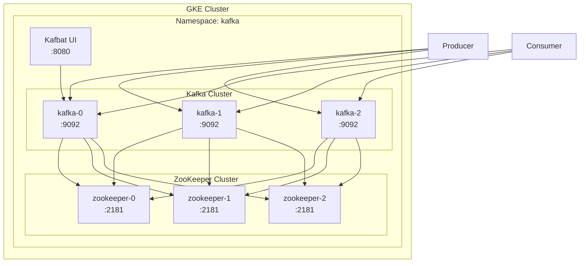

# Kafka on GKE with ZooKeeper — StatefulSet Deployment

## Table of Contents

| Section | Topic | Description |
| :---: | :--- | :--- |
| **01** | [Why Kafka on GKE](#1-why-kafka-on-gke) | Managed Kubernetes for stateful messaging workloads. |
| **02** | [Architecture](#2-architecture) | 3-broker Kafka + 3-node ZooKeeper on GKE. |
| **03** | [Namespace & Prerequisites](#3-namespace--prerequisites) | Cluster setup. |
| **04** | [ZooKeeper StatefulSet](#4-zookeeper-statefulset) | ZooKeeper cluster with Headless Service. |
| **05** | [Kafka StatefulSet](#5-kafka-statefulset) | Kafka brokers with ConfigMap and PVC. |
| **06** | [Kafka UI](#6-kafka-ui) | Kafbat UI via Deployment. |
| **07** | [Topic Operations](#7-topic-operations) | CLI commands inside the cluster. |
| **08** | [Production Checklist](#8-production-checklist) | Hardening for production workloads. |

---

## 1. Why Kafka on GKE

Running Kafka on GKE gives you managed Kubernetes with persistent storage, autoscaling, and networking — without managing the underlying infrastructure.

| Option | Pros | Cons |
| :--- | :--- | :--- |
| **VM + bare metal** | Full control | Manual patching, scaling |
| **Docker Compose** | Quick dev setup | No HA, no auto-restart |
| **GKE + StatefulSet** | HA, rolling updates, PVC | More YAML to manage |
| **Managed Kafka (Confluent)** | Zero ops | Expensive, vendor lock-in |

### Why StatefulSet

| Aspect | Deployment | StatefulSet |
| :--- | :--- | :--- |
| Pod names | Random | Stable (kafka-0, kafka-1, kafka-2) |
| Network | Ephemeral | Stable DNS via Headless Service |
| Storage | Shared or none | Per-pod PVC |
| Scaling | Any order | Ordered, one at a time |
| Identity | None | Ordinal index |

---

## 2. Architecture



### Resource Allocation

| Component | Replicas | CPU | Memory | Storage |
| :--- | :--- | :--- | :--- | :--- |
| ZooKeeper | 3 | 250m | 512Mi | 5Gi |
| Kafka | 3 | 500m | 1Gi | 10Gi |
| Kafbat UI | 1 | 100m | 256Mi | - |

---

## 3. Namespace & Prerequisites

```bash
kubectl create namespace kafka
```

### Private Registry Secret

```bash
kubectl create secret docker-registry regcred \
  --docker-server=asia-southeast2-docker.pkg.dev \
  --docker-username=_json_key \
  --docker-password="$(cat key.json)" \
  --docker-email=your@email.com \
  -n kafka
```

---

## 4. ZooKeeper StatefulSet

### Headless Service

```yaml
apiVersion: v1
kind: Service
metadata:
  name: zookeeper
  namespace: kafka
  labels:
    app: zookeeper
    app.kubernetes.io/name: zookeeper
    app.kubernetes.io/component: coordination
    app.kubernetes.io/part-of: kafka
spec:
  clusterIP: None
  selector:
    app: zookeeper
  ports:
  - name: client
    port: 2181
  - name: election
    port: 3888
  - name: leader
    port: 2888
```

### StatefulSet

```yaml
apiVersion: apps/v1
kind: StatefulSet
metadata:
  name: zookeeper
  namespace: kafka
  labels:
    app: zookeeper
    app.kubernetes.io/name: zookeeper
    app.kubernetes.io/component: coordination
    app.kubernetes.io/part-of: kafka
spec:
  serviceName: zookeeper
  replicas: 3
  selector:
    matchLabels:
      app: zookeeper
  template:
    metadata:
      labels:
        app: zookeeper
    spec:
      securityContext:
        fsGroup: 1000
        runAsUser: 1000
        runAsGroup: 1000
      affinity:
        podAntiAffinity:
          preferredDuringSchedulingIgnoredDuringExecution:
          - weight: 100
            podAffinityTerm:
              labelSelector:
                matchLabels:
                  app: zookeeper
              topologyKey: kubernetes.io/hostname
      topologySpreadConstraints:
      - maxSkew: 1
        topologyKey: topology.kubernetes.io/zone
        whenUnsatisfiable: DoNotSchedule
        labelSelector:
          matchLabels:
            app: zookeeper
      containers:
      - name: zookeeper
        image: asia-southeast2-docker.pkg.dev/example-prd/devops/tools/cp-zookeeper:7.6.0
        ports:
        - containerPort: 2181
          name: client
        - containerPort: 3888
          name: election
        - containerPort: 2888
          name: leader
        env:
        - name: ZOOKEEPER_CLIENT_PORT
          value: "2181"
        - name: ZOOKEEPER_TICK_TIME
          value: "2000"
        - name: ZOOKEEPER_INIT_LIMIT
          value: "10"
        - name: ZOOKEEPER_SYNC_LIMIT
          value: "5"
        - name: ZOOKEEPER_SERVERS
          value: "zookeeper-0.zookeeper.kafka.svc.cluster.local:2888:3888,zookeeper-1.zookeeper.kafka.svc.cluster.local:2888:3888,zookeeper-2.zookeeper.kafka.svc.cluster.local:2888:3888"
        resources:
          requests:
            cpu: 250m
            memory: 512Mi
          limits:
            memory: 512Mi
        livenessProbe:
          exec:
            command:
            - /bin/sh
            - -c
            - echo ruok | nc localhost 2181 | grep imok
          initialDelaySeconds: 30
          periodSeconds: 10
        readinessProbe:
          exec:
            command:
            - /bin/sh
            - -c
            - echo ruok | nc localhost 2181 | grep imok
          initialDelaySeconds: 10
          periodSeconds: 10
        volumeMounts:
        - name: zookeeper-data
          mountPath: /var/lib/zookeeper/data
  volumeClaimTemplates:
  - metadata:
      name: zookeeper-data
    spec:
      accessModes: ["ReadWriteOnce"]
      resources:
        requests:
          storage: 5Gi
```

### ZooKeeper Configuration Reference

| Parameter | Value | Purpose |
| :--- | :--- | :--- |
| `ZOOKEEPER_CLIENT_PORT` | 2181 | Client connections |
| `ZOOKEEPER_TICK_TIME` | 2000 | Heartbeat interval (ms) |
| `ZOOKEEPER_INIT_LIMIT` | 10 | Leader election timeout |
| `ZOOKEEPER_SYNC_LIMIT` | 5 | Sync timeout |
| `ZOOKEEPER_SERVERS` | DNS addresses | Peer discovery |

---

## 5. Kafka StatefulSet

### Headless Service

```yaml
apiVersion: v1
kind: Service
metadata:
  name: kafka-headless
  namespace: kafka
  labels:
    app: kafka
    app.kubernetes.io/name: kafka
    app.kubernetes.io/component: broker
    app.kubernetes.io/part-of: kafka
spec:
  clusterIP: None
  selector:
    app: kafka
  ports:
  - name: broker
    port: 9092
```

### ConfigMap

```yaml
apiVersion: v1
kind: ConfigMap
metadata:
  name: kafka-config
  namespace: kafka
  labels:
    app: kafka
    app.kubernetes.io/name: kafka
    app.kubernetes.io/component: broker
    app.kubernetes.io/part-of: kafka
data:
  KAFKA_ZOOKEEPER_CONNECT: "zookeeper.kafka.svc.cluster.local:2181"
  KAFKA_DEFAULT_REPLICATION_FACTOR: "3"
  KAFKA_OFFSETS_TOPIC_REPLICATION_FACTOR: "3"
  KAFKA_TRANSACTION_STATE_LOG_REPLICATION_FACTOR: "3"
  KAFKA_TRANSACTION_STATE_LOG_MIN_ISR: "2"
  KAFKA_AUTO_CREATE_TOPICS_ENABLE: "false"
  KAFKA_DELETE_TOPIC_ENABLE: "true"
  KAFKA_LOG_RETENTION_HOURS: "168"
```

### StatefulSet

```yaml
apiVersion: apps/v1
kind: StatefulSet
metadata:
  name: kafka
  namespace: kafka
  labels:
    app: kafka
    app.kubernetes.io/name: kafka
    app.kubernetes.io/component: broker
    app.kubernetes.io/part-of: kafka
spec:
  serviceName: kafka-headless
  replicas: 3
  selector:
    matchLabels:
      app: kafka
  template:
    metadata:
      labels:
        app: kafka
    spec:
      securityContext:
        fsGroup: 1000
        runAsUser: 1000
        runAsGroup: 1000
      affinity:
        podAntiAffinity:
          preferredDuringSchedulingIgnoredDuringExecution:
          - weight: 100
            podAffinityTerm:
              labelSelector:
                matchLabels:
                  app: kafka
              topologyKey: kubernetes.io/hostname
        nodeAffinity:
          requiredDuringSchedulingIgnoredDuringExecution:
            nodeSelectorTerms:
            - matchExpressions:
              - key: pool-type
                operator: In
                values:
                - messaging
      topologySpreadConstraints:
      - maxSkew: 1
        topologyKey: topology.kubernetes.io/zone
        whenUnsatisfiable: ScheduleAnyway
        labelSelector:
          matchLabels:
            app: kafka
      containers:
      - name: kafka
        image: asia-southeast2-docker.pkg.dev/example-prd/devops/tools/cp-kafka:7.6.0
        ports:
        - containerPort: 9092
          name: broker
        env:
        - name: POD_NAME
          valueFrom:
            fieldRef:
              apiVersion: v1
              fieldPath: metadata.name
        - name: KAFKA_BROKER_ID
          value: "$(POD_NAME)"
        - name: KAFKA_ADVERTISED_LISTENERS
          value: "PLAINTEXT://$(POD_NAME).kafka-headless.kafka.svc.cluster.local:9092"
        - name: KAFKA_LISTENERS
          value: "PLAINTEXT://0.0.0.0:9092"
        - name: KAFKA_LOG_DIRS
          value: "/var/lib/kafka/data"
        envFrom:
        - configMapRef:
            name: kafka-config
        resources:
          requests:
            cpu: 500m
            memory: 1Gi
          limits:
            memory: 1Gi
        livenessProbe:
          tcpSocket:
            port: 9092
          initialDelaySeconds: 60
          periodSeconds: 30
        readinessProbe:
          tcpSocket:
            port: 9092
          initialDelaySeconds: 30
          periodSeconds: 10
        volumeMounts:
        - name: kafka-data
          mountPath: /var/lib/kafka/data
  volumeClaimTemplates:
  - metadata:
      name: kafka-data
    spec:
      accessModes: ["ReadWriteOnce"]
      resources:
        requests:
          storage: 10Gi
```

### Kafka Configuration Reference

| Parameter | Value | Purpose |
| :--- | :--- | :--- |
| `KAFKA_BROKER_ID` | `$(POD_NAME)` | Unique broker ID from pod name |
| `KAFKA_ADVERTISED_LISTENERS` | DNS name | Client-facing address |
| `KAFKA_ZOOKEEPER_CONNECT` | `zookeeper:2181` | ZooKeeper connection |
| `KAFKA_DEFAULT_REPLICATION_FACTOR` | 3 | Replicate across all brokers |
| `KAFKA_OFFSETS_TOPIC_REPLICATION_FACTOR` | 3 | `__consumer_offsets` replication |
| `KAFKA_TRANSACTION_STATE_LOG_MIN_ISR` | 2 | Min in-sync for transaction log |
| `KAFKA_AUTO_CREATE_TOPICS_ENABLE` | false | Prevent accidental topic creation |
| `KAFKA_LOG_RETENTION_HOURS` | 168 | 7-day retention |

---

## 6. Kafka UI

### Deployment

```yaml
apiVersion: apps/v1
kind: Deployment
metadata:
  name: kafbat-ui
  namespace: kafka
  labels:
    app: kafbat-ui
    app.kubernetes.io/name: kafbat-ui
    app.kubernetes.io/component: management
    app.kubernetes.io/part-of: kafka
spec:
  replicas: 1
  selector:
    matchLabels:
      app: kafbat-ui
  template:
    metadata:
      labels:
        app: kafbat-ui
    spec:
      containers:
      - name: kafka-ui
        image: asia-southeast2-docker.pkg.dev/example-prd/devops/tools/kafka-ui:latest
        ports:
        - containerPort: 8080
          name: http
        env:
        - name: KAFKA_CLUSTERS_0_NAME
          value: "gke-cluster"
        - name: KAFKA_CLUSTERS_0_BOOTSTRAPSERVERS
          value: "kafka-0.kafka-headless.kafka.svc.cluster.local:9092"
        resources:
          requests:
            cpu: 100m
            memory: 256Mi
          limits:
            memory: 256Mi
```

### Service

```yaml
apiVersion: v1
kind: Service
metadata:
  name: kafbat-ui
  namespace: kafka
  labels:
    app: kafbat-ui
    app.kubernetes.io/name: kafbat-ui
    app.kubernetes.io/component: management
    app.kubernetes.io/part-of: kafka
spec:
  type: ClusterIP
  selector:
    app: kafbat-ui
  ports:
  - name: http
    port: 80
    targetPort: 8080
```

### Access via Port Forward

```bash
kubectl port-forward svc/kafbat-ui 8080:80 -n kafka
```

---

## 7. Topic Operations

### Create Topic

```bash
kubectl -n kafka exec -it kafka-0 -- \
  kafka-topics \
  --bootstrap-server kafka-0.kafka-headless.kafka.svc.cluster.local:9092 \
  --create \
  --topic my-topic \
  --partitions 3 \
  --replication-factor 3
```

### List Topics

```bash
kubectl -n kafka exec -it kafka-0 -- \
  kafka-topics \
  --bootstrap-server kafka-0.kafka-headless.kafka.svc.cluster.local:9092 \
  --list
```

### Describe Topic

```bash
kubectl -n kafka exec -it kafka-0 -- \
  kafka-topics \
  --bootstrap-server kafka-0.kafka-headless.kafka.svc.cluster.local:9092 \
  --describe \
  --topic my-topic
```

### Delete Topic

```bash
kubectl -n kafka exec -it kafka-0 -- \
  kafka-topics \
  --bootstrap-server kafka-0.kafka-headless.kafka.svc.cluster.local:9092 \
  --delete \
  --topic my-topic
```

### Consume Messages

```bash
kubectl -n kafka exec -it kafka-0 -- \
  kafka-console-consumer \
  --topic my-topic \
  --from-beginning \
  --bootstrap-server kafka-0.kafka-headless.kafka.svc.cluster.local:9092
```

---

## 8. Production Checklist

| Category | Item | Status |
| :--- | :--- | :--- |
| **Replication** | `default.replication.factor >= 3` | Required |
| **Min ISR** | `min.insync.replicas = 2` | Required |
| **Topic creation** | `auto.create.topics.enable = false` | Required |
| **Persistence** | PVC with `ReadWriteOnce` | Required |
| **Anti-affinity** | `podAntiAffinity` across nodes | Required |
| **Zone spread** | `topologySpreadConstraints` | Recommended |
| **Security context** | `runAsUser`, `fsGroup` | Recommended |
| **Resource limits** | CPU and memory set | Required |
| **Health checks** | Liveness + readiness probes | Required |
| **Log retention** | `log.retention.hours` tuned | Required |
| **Internal LB** | `cloud.google.com/load-balancer-type: Internal` | If needed |

---

## References

- [GKE Persistent Volumes](https://cloud.google.com/kubernetes-engine/docs/concepts/persistent-volumes)
- [Kafka on Kubernetes](https://kafka.apache.org/documentation/#operations)
- [Confluent Docker Images](https://hub.docker.com/r/confluentinc/cp-kafka)
- [StatefulSet Documentation](https://kubernetes.io/docs/concepts/workloads/controllers/statefulset/)
