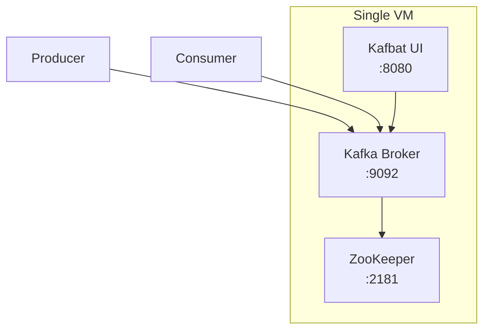

# Kafka Standalone on VM — Bare Metal Installation with ZooKeeper

## Table of Contents

| Section | Topic | Description |
| :---: | :--- | :--- |
| **01** | [Why Standalone Kafka](#1-why-standalone-kafka) | Single-broker setup for development and learning. |
| **02** | [Architecture](#2-architecture) | Kafka + ZooKeeper on a single VM. |
| **03** | [Installation](#3-installation) | Java, Kafka binaries, directory structure. |
| **04** | [ZooKeeper Configuration](#4-zookeeper-configuration) | Properties and systemd service. |
| **05** | [Kafka Broker Configuration](#5-kafka-broker-configuration) | server.properties breakdown. |
| **06** | [Worker Broker](#6-worker-broker) | Adding a second broker to the cluster. |
| **07** | [Systemd Services](#7-systemd-services) | Auto-start, restart, and management. |
| **08** | [Kafka CLI Operations](#8-kafka-cli-operations) | Topic and consumer group management. |
| **09** | [Kafka UI](#9-kafka-ui) | Kafbat UI for web-based management. |

---

## 1. Why Standalone Kafka

A single-broker Kafka installation is ideal for local development, learning, and small workloads where cluster overhead is unnecessary.

| Setup | Best For | Limitations |
| :--- | :--- | :--- |
| **Standalone VM** | Dev, learning, single-app | No replication, single point of failure |
| Docker Compose | Quick testing | Ephemeral storage unless mounted |
| Kubernetes | Production, HA | Complex for local development |

### When to Use Standalone

| Scenario | Use Standalone? |
| :--- | :--- |
| Local development | Yes |
| Learning Kafka CLI | Yes |
| Single microservice testing | Yes |
| Production traffic | No — use cluster |
| Multi-team shared broker | No — use cluster |

---

## 2. Architecture



### Port Reference

| Port | Service | Protocol |
| :--- | :--- | :--- |
| 2181 | ZooKeeper | TCP |
| 9092 | Kafka Broker | TCP |
| 8080 | Kafbat UI | HTTP |

---

## 3. Installation

### Prerequisites

```bash
sudo apt update && sudo apt upgrade -y
sudo apt install openjdk-17-jdk wget curl net-tools gnupg2 -y
```

### Download and Install Kafka

```bash
KAFKA_VERSION="3.7.0"
SCALA_VERSION="2.13"
wget https://downloads.apache.org/kafka/$KAFKA_VERSION/kafka_${SCALA_VERSION}-${KAFKA_VERSION}.tgz
tar -xvzf kafka_${SCALA_VERSION}-${KAFKA_VERSION}.tgz
sudo mv kafka_${SCALA_VERSION}-${KAFKA_VERSION} /opt/kafka
sudo chown -R $USER:$USER /opt/kafka
```

### Create User and Directories

```bash
sudo useradd kafka -m
sudo mkdir -p /data/kafka /data/zookeeper
sudo chown -R kafka:kafka /data
```

### Directory Structure

```
/opt/kafka/
├── bin/                    # CLI scripts
├── config/                 # Configuration files
│   ├── server.properties
│   ├── zookeeper.properties
│   └── ...
└── libs/                   # JAR files
```

---

## 4. ZooKeeper Configuration

### zookeeper.properties

```properties
dataDir=/data/zookeeper
clientPort=2181
maxClientCnxns=0
tickTime=2000
initLimit=5
syncLimit=2
```

### Configuration Breakdown

| Parameter | Value | Purpose |
| :--- | :--- | :--- |
| `dataDir` | `/data/zookeeper` | ZooKeeper data storage |
| `clientPort` | 2181 | Client connection port |
| `maxClientCnxns` | 0 | Unlimited connections per IP |
| `tickTime` | 2000 | Heartbeat interval (ms) |
| `initLimit` | 5 | Leader election timeout (ticks) |
| `syncLimit` | 2 | Sync timeout (ticks) |

### Systemd Service

```ini
[Unit]
Description=Apache Zookeeper server
After=network.target

[Service]
Type=simple
User=kafka
ExecStart=/opt/kafka/bin/zookeeper-server-start.sh /opt/kafka/config/zookeeper.properties
Restart=on-abnormal

[Install]
WantedBy=multi-user.target
```

### Start ZooKeeper

```bash
sudo systemctl daemon-reload
sudo systemctl enable zookeeper
sudo systemctl start zookeeper
sudo systemctl status zookeeper
```

---

## 5. Kafka Broker Configuration

### server.properties

```properties
broker.id=1
log.dirs=/data/kafka
num.network.threads=3
num.io.threads=8
socket.send.buffer.bytes=102400
socket.receive.buffer.bytes=102400
socket.request.max.bytes=104857600

log.retention.hours=168
log.segment.bytes=1073741824
log.retention.check.interval.ms=300000

num.partitions=5
default.replication.factor=1
offsets.topic.replication.factor=1

zookeeper.connect=localhost:2181
listeners=PLAINTEXT://0.0.0.0:9092
advertised.listeners=PLAINTEXT://your.ip.address:9092

auto.create.topics.enable=false
delete.topic.enable=true
```

### Configuration Breakdown

| Parameter | Value | Purpose |
| :--- | :--- | :--- |
| `broker.id` | 1 | Unique broker identifier |
| `log.dirs` | `/data/kafka` | Kafka log storage |
| `num.network.threads` | 3 | Network handler threads |
| `num.io.threads` | 8 | I/O handler threads |
| `num.partitions` | 5 | Default partitions per topic |
| `default.replication.factor` | 1 | Single broker = replication 1 |
| `auto.create.topics.enable` | false | Prevent accidental topic creation |
| `delete.topic.enable` | true | Allow topic deletion |
| `log.retention.hours` | 168 | Retain messages for 7 days |
| `advertised.listeners` | IP:9092 | Client-facing address |

### Systemd Service

```ini
[Unit]
Description=Apache Kafka Server
After=zookeeper.service

[Service]
Type=simple
User=kafka
ExecStart=/opt/kafka/bin/kafka-server-start.sh /opt/kafka/config/server.properties
Restart=on-failure
RestartSec=10

[Install]
WantedBy=multi-user.target
```

### Start Kafka

```bash
sudo systemctl daemon-reload
sudo systemctl enable kafka
sudo systemctl start kafka
sudo systemctl status kafka
```

---

## 6. Worker Broker

Add a second broker to the same VM for testing replication.

### worker.properties

```properties
broker.id=2
listeners=PLAINTEXT://:9093
advertised.listeners=PLAINTEXT://<IP_PUBLIC_OR_LOCAL>:9093
log.dirs=/data/kafka-logs-2

num.network.threads=3
num.io.threads=8
socket.send.buffer.bytes=102400
socket.receive.buffer.bytes=102400
socket.request.max.bytes=104857600

num.partitions=3
default.replication.factor=2
offsets.topic.replication.factor=2

zookeeper.connect=localhost:2181
log.retention.hours=168
log.segment.bytes=1073741824
log.retention.check.interval.ms=300000

auto.create.topics.enable=false
delete.topic.enable=true
```

### Key Differences from Primary

| Parameter | Primary (broker.id=1) | Worker (broker.id=2) |
| :--- | :--- | :--- |
| `broker.id` | 1 | 2 |
| `port` | 9092 | 9093 |
| `default.replication.factor` | 1 | 2 |
| `log.dirs` | `/data/kafka` | `/data/kafka-logs-2` |

### Start Worker

```bash
/opt/kafka/bin/kafka-server-start.sh /opt/kafka/config/worker.properties
```

---

## 7. Systemd Services

### ZooKeeper Service

```ini
[Unit]
Description=Apache Zookeeper server
After=network.target

[Service]
Type=simple
User=kafka
ExecStart=/opt/kafka/bin/zookeeper-server-start.sh /opt/kafka/config/zookeeper.properties
Restart=on-abnormal

[Install]
WantedBy=multi-user.target
```

### Kafka Service

```ini
[Unit]
Description=Apache Kafka Server
After=zookeeper.service

[Service]
Type=simple
User=kafka
ExecStart=/opt/kafka/bin/kafka-server-start.sh /opt/kafka/config/server.properties
Restart=on-failure
RestartSec=10

[Install]
WantedBy=multi-user.target
```

### Management Commands

```bash
# Status
sudo systemctl status kafka
sudo systemctl status zookeeper

# Restart
sudo systemctl restart kafka
sudo systemctl restart zookeeper

# Logs
sudo journalctl -u kafka -f
sudo journalctl -u zookeeper -f

# Enable on boot
sudo systemctl enable kafka
sudo systemctl enable zookeeper
```

---

## 8. Kafka CLI Operations

### Topic Management

```bash
# Create topic
kafka-topics.sh --create \
  --topic my-topic \
  --bootstrap-server localhost:9092 \
  --replication-factor 1 \
  --partitions 10

# List topics
kafka-topics.sh --list --bootstrap-server localhost:9092

# Describe topic
kafka-topics.sh --describe --topic my-topic --bootstrap-server localhost:9092

# Alter topic (increase partitions)
kafka-topics.sh --alter \
  --topic my-topic \
  --bootstrap-server localhost:9092 \
  --partitions 20

# Delete topic
kafka-topics.sh --delete --topic my-topic --bootstrap-server localhost:9092
```

### Consumer Group Management

```bash
# List consumer groups
kafka-consumer-groups.sh --list --bootstrap-server localhost:9092

# Describe consumer group
kafka-consumer-groups.sh --describe \
  --group my-group \
  --bootstrap-server localhost:9092

# Reset offsets (dry run)
kafka-consumer-groups.sh --group my-group \
  --topic my-topic \
  --reset-offsets --to-earliest \
  --dry-run \
  --bootstrap-server localhost:9092

# Reset offsets (execute)
kafka-consumer-groups.sh --group my-group \
  --topic my-topic \
  --reset-offsets --to-earliest \
  --execute \
  --bootstrap-server localhost:9092
```

### Check Version

```bash
kafka-topics.sh --version
```

---

## 9. Kafka UI

### Kafbat UI Setup

```bash
cd /opt/kafka-ui
wget https://github.com/tchiotludo/akhq/releases/download/0.24.0/akhq-0.24.0-all.jar -O kafka-ui.jar
```

### Configuration

```yaml
server:
  port: 8080

akhq:
  connections:
    kafka-cluster:
      properties:
        bootstrap.servers: "localhost:9092"
```

### Systemd Service

```ini
[Unit]
Description=UI for Apache Kafka
After=network.target

[Service]
User=kafka
WorkingDirectory=/opt/kafka-ui
ExecStart=/usr/bin/java -jar kafka-ui.jar --spring.config.location=file:/opt/kafka-ui/application.yml
Restart=on-failure

[Install]
WantedBy=multi-user.target
```

### Start UI

```bash
sudo systemctl daemon-reload
sudo systemctl enable kafka-ui
sudo systemctl start kafka-ui
```

---

## References

- [Apache Kafka Documentation](https://kafka.apache.org/documentation/)
- [Kafka Quickstart](https://kafka.apache.org/quickstart)
- [ZooKeeper Configuration](https://zookeeper.apache.org/doc/current/zookeeperAdmin.html)
- [Kafbat UI](https://github.com/kafbat/kafka-ui)
