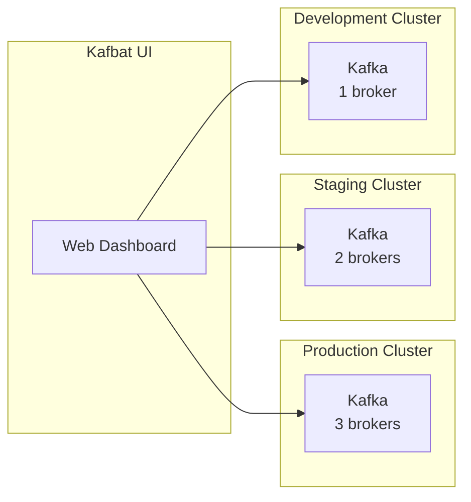

# Kafka UI on GKE — Kafbat UI via YAML and Helm

## Table of Contents

| Section | Topic | Description |
| :---: | :--- | :--- |
| **01** | [Why Kafka UI](#1-why-kafka-ui) | Web-based management for Kafka clusters. |
| **02** | [Kafbat UI vs AKHQ](#2-kafbat-ui-vs-akhq) | Choosing the right UI tool. |
| **03** | [YAML Deployment](#3-yaml-deployment) | Raw manifests without Helm. |
| **04** | [Helm Deployment](#4-helm-deployment) | Quick install via Helm chart. |
| **05** | [Gateway API Integration](#5-gateway-api-integration) | Expose UI via Gateway API. |
| **06** | [Multi-Cluster Support](#6-multi-cluster-support) | Connect multiple Kafka clusters. |
| **07** | [Security & RBAC](#7-security--rbac) | Protecting the UI. |

---

## 1. Why Kafka UI

A web UI for Kafka provides visibility into topics, consumer groups, and messages without running CLI commands.

| Tool | Type | Features |
| :--- | :--- | :--- |
| **Kafbat UI** | Web | Topics, consumers, messages, metrics |
| **AKHQ** | Web | Topics, consumers, schema registry, connect |
| **CLI** | Terminal | Full control, scriptable |
| **Conduktor** | Web (SaaS) | Commercial, team features |

### When to Use Kafka UI

| Scenario | Use UI? |
| :--- | :--- |
| Quick topic inspection | Yes |
| Consumer lag monitoring | Yes |
| Message browsing with filters | Yes |
| Production debugging | Yes |
| Automated pipelines | No (use CLI/API) |
| Schema management | Yes (with Schema Registry) |

---

## 2. Kafbat UI vs AKHQ

| Feature | Kafbat UI | AKHQ |
| :--- | :--- | :--- |
| **Maintained by** | Kafbat community | Tchiotludo |
| **License** | Apache 2.0 | Apache 2.0 |
| **Kafka support** | 3.x+ | 2.x+ |
| **Schema Registry** | Yes | Yes |
| **Kafka Connect** | Yes | Yes |
| **Auth** | OAuth2, LDAP, basic | Basic, LDAP |
| **Multi-cluster** | Yes | Yes |
| **Docker image** | `kafbat/kafka-ui` | `tchiotludo/akhq` |
| **Active development** | Yes | Slower pace |

---

## 3. YAML Deployment

### ConfigMap

```yaml
apiVersion: v1
kind: ConfigMap
metadata:
  name: kafbat-ui-configmap
  namespace: kafka
  labels:
    app: kafbat-ui
    app.kubernetes.io/name: kafbat-ui
    app.kubernetes.io/component: management
    app.kubernetes.io/part-of: kafka
data:
  config.yml: |-
    kafka:
      clusters:
        - name: gke-cluster
          bootstrapServers: kafka-0.kafka-headless.kafka.svc.cluster.local:9092
    auth:
      type: disabled
    management:
      health:
        ldap:
          enabled: false
```

### Deployment

```yaml
apiVersion: apps/v1
kind: Deployment
metadata:
  name: kafbat-ui
  namespace: kafka
  labels:
    app: kafbat-ui
    app.kubernetes.io/name: kafbat-ui
    app.kubernetes.io/component: management
    app.kubernetes.io/part-of: kafka
spec:
  replicas: 1
  selector:
    matchLabels:
      app: kafbat-ui
  template:
    metadata:
      labels:
        app: kafbat-ui
        app.kubernetes.io/name: kafbat-ui
        app.kubernetes.io/component: management
    spec:
      affinity:
        nodeAffinity:
          requiredDuringSchedulingIgnoredDuringExecution:
            nodeSelectorTerms:
            - matchExpressions:
              - key: kubernetes.io/os
                operator: In
                values:
                - linux
      containers:
      - name: kafka-ui
        image: asia-southeast2-docker.pkg.dev/example-prd/devops/tools/kafka-ui:latest
        ports:
        - containerPort: 8080
          name: http
          protocol: TCP
        env:
        - name: KAFKA_CLUSTERS_0_NAME
          value: "gke-cluster"
        - name: KAFKA_CLUSTERS_0_BOOTSTRAPSERVERS
          value: "kafka-0.kafka-headless.kafka.svc.cluster.local:9092"
        resources:
          requests:
            cpu: 100m
            memory: 256Mi
          limits:
            memory: 256Mi
        livenessProbe:
          httpGet:
            path: /api/health
            port: 8080
          initialDelaySeconds: 30
          periodSeconds: 10
        readinessProbe:
          httpGet:
            path: /api/health
            port: 8080
          initialDelaySeconds: 10
          periodSeconds: 10
```

### Service

```yaml
apiVersion: v1
kind: Service
metadata:
  name: kafbat-ui
  namespace: kafka
  labels:
    app: kafbat-ui
    app.kubernetes.io/name: kafbat-ui
    app.kubernetes.io/component: management
    app.kubernetes.io/part-of: kafka
spec:
  type: ClusterIP
  selector:
    app: kafbat-ui
  ports:
  - name: http
    port: 80
    targetPort: 8080
```

### Apply and Access

```bash
kubectl apply -f kafbat-ui-configmap.yaml -n kafka
kubectl apply -f kafbat-ui-deployment.yaml -n kafka
kubectl apply -f kafbat-ui-service.yaml -n kafka

# Port forward
kubectl port-forward svc/kafbat-ui 8080:80 -n kafka
```

---

## 4. Helm Deployment

### Add Repo

```bash
helm repo add kafbat-ui https://kafbat.github.io/helm-charts
helm repo update
```

### Install with Custom ConfigMap

```bash
helm upgrade --install kafbat-ui kafbat-ui/kafka-ui \
  -n kafka \
  -f values.yaml
```

### values.yaml

```yaml
yamlApplicationConfig:
  kafka:
    clusters:
      - name: gke-cluster
        bootstrapServers: kafka-svc:9092
  auth:
    type: disabled
  management:
    health:
      ldap:
        enabled: false
```

### Install with Existing ConfigMap

```bash
helm install kafbat-ui kafbat-ui/kafka-ui \
  -n kafka \
  --set yamlApplicationConfigConfigMap.name="kafbat-ui-configmap" \
  --set yamlApplicationConfigConfigMap.keyName="config.yml"
```

### Helm vs YAML

| Aspect | Helm | YAML |
| :--- | :--- | :--- |
| Install speed | 1 command | 3+ commands |
| Customization | `values.yaml` | Edit manifests directly |
| Upgrade | `helm upgrade` | `kubectl apply` |
| Rollback | `helm rollback` | `kubectl rollout undo` |
| Visibility | Hidden templates | All resources visible |
| Dependencies | Chart manages | You manage |

---

## 5. Gateway API Integration

### External Access

```yaml
apiVersion: gateway.networking.k8s.io/v1
kind: HTTPRoute
metadata:
  name: kafbat-ui-httproute
  namespace: kafka
  labels:
    app: kafbat-ui
    app.kubernetes.io/name: kafbat-ui
    app.kubernetes.io/component: gateway
spec:
  parentRefs:
  - name: example-gateway
    namespace: gateway-api
    sectionName: https
  hostnames:
  - kafka-ui.example.id
  rules:
  - matches:
    - path:
        type: PathPrefix
        value: /
    backendRefs:
    - name: kafbat-ui
      port: 80
      weight: 100
```

### Health Check Policy

```yaml
apiVersion: networking.gke.io/v1
kind: HealthCheckPolicy
metadata:
  name: kafbat-ui-hc-policy
  namespace: kafka
spec:
  default:
    checkIntervalSec: 10
    timeoutSec: 5
    healthyThreshold: 1
    unhealthyThreshold: 3
    config:
      type: HTTP
      httpHealthCheck:
        port: 8080
        requestPath: /api/health
  targetRef:
    group: ""
    kind: Service
    name: kafbat-ui
```

---

## 6. Multi-Cluster Support

### ConfigMap with Multiple Clusters

```yaml
apiVersion: v1
kind: ConfigMap
metadata:
  name: kafbat-ui-configmap
  namespace: kafka
data:
  config.yml: |-
    kafka:
      clusters:
        - name: production
          bootstrapServers: kafka-prod-0.kafka-headless.kafka.svc.cluster.local:9092
        - name: staging
          bootstrapServers: kafka-stg-0.kafka-headless.staging.svc.cluster.local:9092
        - name: development
          bootstrapServers: kafka-dev-0.kafka-headless.dev.svc.cluster.local:9092
    auth:
      type: disabled
```

### Cluster Topology



---

## 7. Security & RBAC

### Basic Auth (Nginx Sidecar)

```yaml
apiVersion: apps/v1
kind: Deployment
metadata:
  name: kafbat-ui
  namespace: kafka
spec:
  replicas: 1
  selector:
    matchLabels:
      app: kafbat-ui
  template:
    metadata:
      labels:
        app: kafbat-ui
    spec:
      containers:
      - name: nginx
        image: asia-southeast2-docker.pkg.dev/example-prd/devops/tools/nginx:alpine
        ports:
        - containerPort: 80
        volumeMounts:
        - name: nginx-config
          mountPath: /etc/nginx/nginx.conf
          subPath: nginx.conf
      - name: kafka-ui
        image: asia-southeast2-docker.pkg.dev/example-prd/devops/tools/kafka-ui:latest
        ports:
        - containerPort: 8080
        env:
        - name: KAFKA_CLUSTERS_0_NAME
          value: "gke-cluster"
        - name: KAFKA_CLUSTERS_0_BOOTSTRAPSERVERS
          value: "kafka-0.kafka-headless.kafka.svc.cluster.local:9092"
      volumes:
      - name: nginx-config
        configMap:
          name: kafbat-ui-nginx-config
```

### NetworkPolicy

```yaml
apiVersion: networking.k8s.io/v1
kind: NetworkPolicy
metadata:
  name: kafbat-ui-netpol
  namespace: kafka
spec:
  podSelector:
    matchLabels:
      app: kafbat-ui
  policyTypes:
  - Ingress
  - Egress
  ingress:
  - from:
    - namespaceSelector:
        matchLabels:
          kubernetes.io/metadata.name: gateway-api
    ports:
    - protocol: TCP
      port: 8080
  egress:
  - to:
    - podSelector:
        matchLabels:
          app: kafka
    ports:
    - protocol: TCP
      port: 9092
```

### Access Summary

| Layer | Control | Purpose |
| :--- | :--- | :--- |
| **Service** | ClusterIP | Cluster-only access |
| **Gateway API** | HTTPRoute hostname | External access with TLS |
| **NetworkPolicy** | Pod/namespace selectors | Network segmentation |
| **Auth** | OAuth2/LDAP | User authentication |
| **RBAC** | K8s RBAC | API access control |

---

## References

- [Kafbat UI Documentation](https://docs.kafbat.io/)
- [Kafbat UI Helm Chart](https://github.com/kafbat/helm-charts)
- [AKHQ Documentation](https://akhq.io/)
- [Gateway API](https://gateway-api.sigs.k8s.io/)
