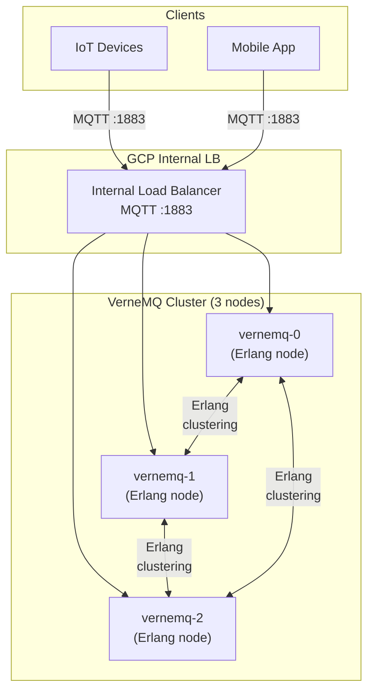
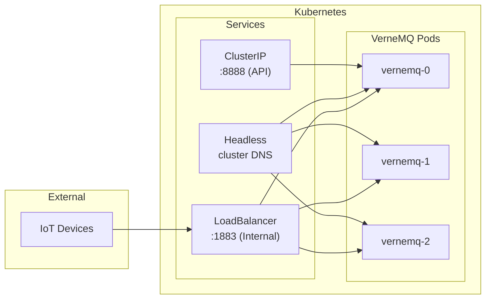

# VerneMQ on GKE — MQTT Broker via Helm

## Table of Contents

| Section | Topic | Description |
| :---: | :--- | :--- |
| **01** | [VerneMQ vs EMQX](#1-vernemq-vs-emqx) | Which broker fits your use case. |
| **02** | [Architecture](#2-architecture) | VerneMQ cluster topology on GKE. |
| **03** | [Helm Installation](#3-helm-installation) | Quick deploy with Helm chart. |
| **04** | [Values Configuration](#4-values-configuration) | Production values.yaml breakdown. |
| **05** | [Services & Networking](#5-services--networking) | LoadBalancer, Headless, and ingress. |
| **06** | [Security & ACL](#6-security--acl) | Anonymous access, ACL rules, TLS. |
| **07** | [EMQX vs VerneMQ Comparison](#7-emqx-vs-vernemq-comparison) | Side-by-side feature matrix. |

---

## 1. VerneMQ vs EMQX

Both are open-source MQTT brokers, but they have different strengths.

| Aspect | VerneMQ | EMQX |
| :--- | :--- | :--- |
| **Language** | Erlang/OTP | Erlang/OTP |
| **License** | Apache 2.0 | Apache 2.0 (EMQX Enterprise is commercial) |
| **Clustering** | Automatic (Erlang distribution) | DNS-based or etcd |
| **Plugin system** | Lua hooks | EMQX extensions (native + Lua) |
| **Dashboard** | No built-in (use vmq-admin CLI) | Built-in REST API + Dashboard |
| **WebSocket** | Supported | Supported |
| **Rule engine** | No | Yes (SQL-based) |
| **Webhook** | Lua hooks | Native bridges |
| **Community** | Smaller, focused | Large, active |
| **Best for** | Simple MQTT, Erlang-native clustering | Feature-rich IoT, complex event processing |

---

## 2. Architecture



### Key Differences from EMQX

| Aspect | VerneMQ | EMQX |
| :--- | :--- | :--- |
| **Cluster discovery** | Erlang EPMD (built-in) | DNS SRV or etcd |
| **Headless service** | Uses Kubernetes DNS | Uses DNS SRV records |
| **Config format** | `DOCKER_VERNEMQ_*` env vars | `EMQX_*` env vars |
| **Health check** | `/metrics` on port 8888 | `/api/v5/status` on port 18083 |

---

## 3. Helm Installation

### Add Helm Repo

```bash
helm repo add vernemq https://vernemq.github.io/docker-vernemq
helm repo update
```

### Install / Upgrade

```bash
helm upgrade --install vernemq vernemq/vernemq \
  -n <namespace> \
  -f values.yaml
```

### Verify

```bash
kubectl get pods -n <namespace> -l app.kubernetes.io/name=vernemq
kubectl get svc -n <namespace>
```

---

## 4. Values Configuration

### Full values.yaml

```yaml
replicaCount: 3

image:
  repository: vernemq/vernemq
  tag: 2.0.1-alpine
  pullPolicy: IfNotPresent

nameOverride: ""
fullnameOverride: ""

service:
  enabled: true
  type: LoadBalancer
  annotations:
    cloud.google.com/load-balancer-type: Internal
  mqtt:
    enabled: true
    port: 1883
    targetPort: 1883
  api:
    enabled: true
    type: ClusterIP
    port: 8888
  mqtts:
    enabled: false
    port: 8883
    nodePort: 8883
  ws:
    enabled: false
    port: 8080
    nodePort: 8080
  wss:
    enabled: false
    port: 8443
    nodePort: 8443

headlessService:
  customPorts: []

ingress:
  className: ""
  enabled: false
  labels: {}
  annotations: {}
  hosts: []
  paths:
    - path: /
      pathType: ImplementationSpecific
  tls: []

resources: {}

securityContext:
  runAsUser: 10000
  runAsGroup: 10000
  fsGroup: 10000

rbac:
  create: true
  serviceAccount:
    create: true

persistentVolume:
  enabled: true
  accessModes:
    - ReadWriteOnce
  size: 5Gi
  storageClassName: standard

statefulset:
  podManagementPolicy: OrderedReady
  updateStrategy: RollingUpdate
  terminationGracePeriodSeconds: 60
  livenessProbe:
    initialDelaySeconds: 60
    periodSeconds: 10
    timeoutSeconds: 5
    successThreshold: 1
    failureThreshold: 3
  readinessProbe:
    initialDelaySeconds: 60
    periodSeconds: 10
    timeoutSeconds: 5
    successThreshold: 1
    failureThreshold: 3
  podAnnotations:
    prometheus.io/path: "/metrics"
    prometheus.io/scrape: "true"
    prometheus.io/scheme: "http"
    prometheus.io/servicemonitor: "true"
    prometheus.io/port: "8888"

pdb:
  enabled: false
  minAvailable: 1
  maxUnavailable: 0

additionalEnv:
  - name: DOCKER_VERNEMQ_ALLOW_REGISTER_DURING_NETSPLIT
    value: "on"
  - name: DOCKER_VERNEMQ_ALLOW_PUBLISH_DURING_NETSPLIT
    value: "on"
  - name: DOCKER_VERNEMQ_ALLOW_SUBSCRIBE_DURING_NETSPLIT
    value: "on"
  - name: DOCKER_VERNEMQ_ALLOW_UNSUBSCRIBE_DURING_NETSPLIT
    value: "on"
  - name: DOCKER_VERNEMQ_ACCEPT_EULA
    value: "yes"
  - name: DOCKER_VERNEMQ_ALLOW_ANONYMOUS
    value: "on"

acl:
  enabled: false
  content: |-
    topic #
```

### Key Configuration Breakdown

| Setting | Value | Purpose |
| :--- | :--- | :--- |
| `replicaCount: 3` | 3-node cluster | Erlang cluster quorum |
| `service.type: LoadBalancer` | GCP Internal LB | Direct MQTT access |
| `service.annotations: Internal` | Internal only | No public exposure |
| `persistentVolume.size: 5Gi` | Per-node storage | Offline message queue |
| `terminationGracePeriodSeconds: 60` | Graceful shutdown | Offline queue migration |
| `ALLOW_ANONYMOUS: on` | Open auth | For development (disable in prod) |

### Netsplit Handling

| Env Variable | Value | Effect |
| :--- | :--- | :--- |
| `ALLOW_REGISTER_DURING_NETSPLIT` | on | Clients can connect during partition |
| `ALLOW_PUBLISH_DURING_NETSPLIT` | on | Messages can be published |
| `ALLOW_SUBSCRIBE_DURING_NETSPLIT` | on | Subscriptions can be created |
| `ALLOW_UNSUBSCRIBE_DURING_NETSPLIT` | on | Unsubscriptions allowed |

> **Warning:** These settings are for development. In production, set to `off` to prevent split-brain issues.

---

## 5. Services & Networking

### Service Architecture



### Port Reference

| Port | Protocol | Service Type | Purpose |
| :--- | :--- | :--- | :--- |
| 1883 | TCP | LoadBalancer (Internal) | MQTT |
| 8888 | TCP | ClusterIP | REST API + metrics |
| 8883 | TCP | (disabled) | MQTT/TLS |
| 8080 | TCP | (disabled) | MQTT over WebSocket |
| 8443 | TCP | (disabled) | MQTT over WSS |

### Internal LoadBalancer

```yaml
service:
  type: LoadBalancer
  annotations:
    cloud.google.com/load-balancer-type: Internal
  mqtt:
    enabled: true
    port: 1883
    targetPort: 1883
```

This creates a GCP Internal TCP/UDP Load Balancer — MQTT traffic stays within the VPC.

---

## 6. Security & ACL

### Anonymous Access

| Setting | Value | Production Recommendation |
| :--- | :--- | :--- |
| `ALLOW_ANONYMOUS` | `on` | **Set to `off`** |

```yaml
additionalEnv:
  - name: DOCKER_VERNEMQ_ALLOW_ANONYMOUS
    value: "off"  # Production
```

### ACL Rules

```yaml
acl:
  enabled: true
  content: |-
    # Allow specific user to publish/subscribe to all topics
    {allow, {user, "admin"}, publish, ["#"]}.
    {allow, {user, "admin"}, subscribe, ["#"]}.
    
    # Allow clients to subscribe to their own topic
    {allow, all, subscribe, ["clientid/${clientid}"]}.
    
    # Deny system topics
    {deny, all, subscribe, ["$SYS/#"]}.
    
    # Deny all other publish
    {deny, all, publish, ["#"]}.
```

### ACL Syntax

| Pattern | Effect |
| :--- | :--- |
| `{allow, {user, "X"}, publish, ["topic"]}` | User X can publish to topic |
| `{allow, all, subscribe, ["pattern"]}` | All users can subscribe to pattern |
| `{deny, all, publish, ["#"]}` | Default deny all publish |

### TLS Configuration

```yaml
# Enable in values.yaml
service:
  mqtts:
    enabled: true
    port: 8883
  wss:
    enabled: true
    port: 8443

# Mount TLS certificates
certificates:
  cafile: /etc/ssl/vernemq/ca.crt
  certfile: /etc/ssl/vernemq/tls.crt
  keyfile: /etc/ssl/vernemq/tls.key
```

---

## 7. EMQX vs VerneMQ Comparison

| Feature | VerneMQ | EMQX |
| :--- | :--- | :--- |
| **Deployment** | Helm only | Helm, Operator, YAML |
| **Clustering** | Erlang native (automatic) | DNS SRV or etcd |
| **Dashboard** | None (CLI only) | Built-in web UI |
| **REST API** | Limited (`vmq-admin`) | Full REST API v5 |
| **Rule engine** | No | Yes (SQL-based) |
| **Webhook** | Lua hooks | Native bridges |
| **Authentication** | Built-in + plugins | JWT, HTTP, LDAP, PostgreSQL |
| **Authorization** | ACL file | File, HTTP, PostgreSQL |
| **WebSocket** | Yes | Yes |
| **TLS** | Yes | Yes |
| **Prometheus** | Yes (port 8888) | Yes (port 19001) |
| **Lua scripting** | Yes | Yes |
| **Offline messages** | Yes (per-node) | Yes (persistent sessions) |
| **Message queuing** | Yes (QoS 1/2) | Yes |
| **Session persistence** | Per-node | Distributed |
| **Max connections** | ~100K per node | ~5M per node |
| **License** | Apache 2.0 | Apache 2.0 (Enterprise: commercial) |

### When to Use VerneMQ

| Use Case | Why VerneMQ |
| :--- | :--- |
| Simple MQTT deployment | Lightweight, less config |
| Erlang-native clustering | Automatic node discovery |
| No dashboard needed | CLI-only management |
| Budget constraints | Fully open-source |
| Existing Erlang infrastructure | Same stack |

### When to Use EMQX

| Use Case | Why EMQX |
| :--- | :--- |
| Complex event processing | Built-in rule engine |
| Need dashboard | Web UI for monitoring |
| High connection count | Better horizontal scaling |
| Multiple auth backends | JWT, HTTP, LDAP, PostgreSQL |
| Webhook integration | Native bridge support |
| Production SLA | Enterprise support available |

### Migration: VerneMQ to EMQX

| Step | Action |
| :--- | :--- |
| 1 | Deploy EMQX cluster alongside VerneMQ |
| 2 | Update client connection strings to EMQX |
| 3 | Verify client reconnection |
| 4 | Monitor EMQX metrics |
| 5 | Decommission VerneMQ |

---

## References

- [VerneMQ Documentation](https://vernemq.com/docs/)
- [VerneMQ Helm Chart](https://github.com/vernemq/docker-vernemq)
- [VerneMQ Configuration](https://vernemq.com/docs/configuring/)
- [EMQX Documentation](https://www.emqx.io/docs/en/latest/)
- [MQTT Protocol](https://mqtt.org/)
