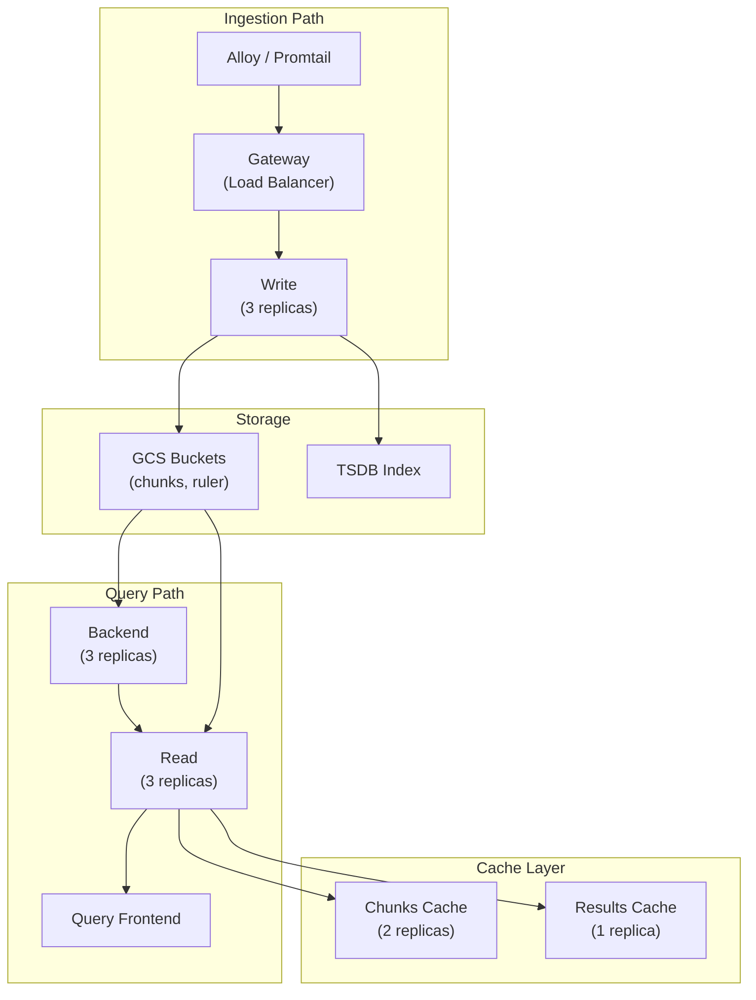

# Loki Distributed on Kubernetes with Helm

Production-grade deployment of Grafana Loki using the Helm chart with SimpleScalable mode, GCS storage, and structured retention.

## Table of Contents

| Section | Topic | Description |
| :---: | :--- | :--- |
| **01** | [Chart Version and Deployment Mode](#1-chart-version-and-deployment-mode) | SingleBinary to SimpleScalable. |
| **02** | [Storage Backend](#2-storage-backend) | GCS buckets and TSDB schema. |
| **03** | [Authentication](#3-authentication) | GKE Workload Identity for GCS. |
| **04** | [Retention Policy](#4-retention-policy) | 30-day retention with compactor. |
| **05** | [Ingestion Limits](#5-ingestion-limits) | Rate, stream limits, structured metadata. |
| **06** | [Resource Summary](#6-resource-summary) | All component resource allocations. |
| **07** | [Architecture](#7-architecture) | Separate read/write/backend paths. |
| **08** | [Deployment Checklist](#8-deployment-checklist) | Pre-flight and post-deploy verification. |

---

## 1. Chart Version and Deployment Mode

Chart version: `6.24.0`

| Key | Default | Custom | Reason |
|-----|---------|--------|--------|
| `deploymentMode` | `SingleBinary` | `SimpleScalable` | Separate read/write/backend paths for independent scaling |

### Deployment Mode Comparison

| Mode | Components | Best For | Scaling |
|------|-----------|----------|---------|
| SingleBinary | 1 replica, all-in-one | Development, testing | Vertical only |
| SimpleScalable | Write, Read, Backend, Gateway | Production | Horizontal per path |
| Microservices | Individual components | Large-scale | Full independent scaling |

### Why SimpleScalable

SimpleScalable provides the production sweet spot: independent scaling for ingestion (Write) and query (Read) paths without the operational complexity of full microservices mode. The Backend component handles background tasks like compaction and ruler evaluation.

---

## 2. Storage Backend

| Key | Default | Custom | Reason |
|-----|---------|--------|--------|
| `loki.storage.type` | `filesystem` | `gcs` | Durable object storage for production; unlimited capacity |
| `loki.storage.gcs.bucketNames.chunks` | (none) | `company-loki-chunks-prod` | GCS bucket for log chunk data |
| `loki.storage.gcs.bucketNames.ruler` | (none) | `company-loki-ruler-prod` | GCS bucket for ruler state |
| `loki.schemaConfig` | v11/boltdb | v13/tsdb/gcs | Latest schema version with TSDB index for better performance |

### Bucket Naming Convention

| Bucket | Purpose | Lifecycle |
|--------|---------|-----------|
| `company-loki-chunks-prod` | Log chunk data | Retention matches `retention_period` |
| `company-loki-ruler-prod` | Ruler evaluation state | Retention matches rule groups |

### Schema Versions

| Version | Index | Store | Notes |
|---------|-------|-------|-------|
| v11 | boltdb-shipper | filesystem/gcs | Legacy, no longer recommended |
| v12 | boltdb-shipper | gcs | Transitional |
| v13 | tsdb | gcs | Recommended: better query performance, compaction |

---

## 3. Authentication

Uses GKE Workload Identity for GCS access:

- Annotate the Kubernetes service account with `iam.gke.io/gcp-service-account`
- Bind to a GCP service account with `roles/storage.objectAdmin` on the Loki buckets

```yaml
apiVersion: v1
kind: ServiceAccount
metadata:
  name: loki
  namespace: observability
  annotations:
    iam.gke.io/gcp-service-account: loki@your-project.iam.gserviceaccount.com
```

### GCP Service Account Setup

```bash
# Create GCP service account
gcloud iam service-accounts create loki \
    --display-name="Loki Service Account" \
    --project=your-project

# Grant GCS access
gcloud projects add-iam-policy-binding your-project \
    --member="serviceAccount:loki@your-project.iam.gserviceaccount.com" \
    --role="roles/storage.objectAdmin"

# Allow KSA to impersonate GSA
gcloud iam service-accounts add-iam-policy-binding loki@your-project.iam.gserviceaccount.com \
    --role="roles/iam.workloadIdentityUser" \
    --member="serviceAccount:your-project.svc.id.goog[observability/loki]"
```

---

## 4. Retention Policy

| Key | Default | Custom | Reason |
|-----|---------|--------|--------|
| `loki.limits_config.retention_period` | `0` (infinite) | `720h` (30 days) | 30-day log retention matching compliance requirements |
| `loki.compactor.retention_enabled` | `false` | `true` | Enable compactor-based retention enforcement |
| `loki.compactor.retention_delete_delay` | `2h` | `2h` | Grace period before deletions are applied |

### Retention Enforcement

The compactor is responsible for enforcing retention. When `retention_enabled` is set to `true`:

1. Compactor scans TSDB blocks for chunks older than `retention_period`
2. Marks chunks for deletion after `retention_delete_delay` (grace period)
3. Permanently deletes marked chunks from GCS

### Compliance Considerations

| Requirement | Configuration |
|-------------|---------------|
| 30-day retention | `retention_period: 720h` |
| 90-day retention | `retention_period: 2160h` |
| Infinite retention | `retention_period: 0` |
| Immediate deletion | `retention_delete_delay: 0s` |

---

## 5. Ingestion Limits

| Key | Default | Custom | Reason |
|-----|---------|--------|--------|
| `ingestion_rate_mb` | `4` | `20` | Handle high log volume from microservices |
| `per_stream_rate_limit` | `3MB` | `5MB` | Allow bursty log streams |
| `max_global_streams_per_user` | `5000` | `10000` | Support large number of label combinations |
| `allow_structured_metadata` | `false` | `true` | Enable structured metadata for better querying |

### Tuning Guidelines

| Metric | Small Cluster | Medium Cluster | Large Cluster |
|--------|--------------|----------------|---------------|
| `ingestion_rate_mb` | 4 | 10 | 20-50 |
| `per_stream_rate_limit` | 3MB | 5MB | 10MB |
| `max_global_streams_per_user` | 5000 | 10000 | 20000 |
| Write replicas | 1-2 | 3 | 5+ |

### Structured Metadata

When `allow_structured_metadata: true`, clients can attach additional metadata fields to log entries without creating new label combinations. This reduces label cardinality while enabling richer queries.

---

## 6. Resource Summary

| Component | Replicas | CPU Req | CPU Limit | Mem Req | Mem Limit | Storage |
|-----------|----------|---------|-----------|---------|-----------|---------|
| Write | 3 | 500m | 2 | 1Gi | 2Gi | 20Gi |
| Read | 3 | 500m | 2 | 1Gi | 2Gi | 10Gi |
| Backend | 3 | 250m | 1 | 512Mi | 1Gi | 20Gi |
| Gateway | 2 | 100m | 500m | 128Mi | 256Mi | -- |
| Chunks Cache | 2 | 100m | 500m | 512Mi | 1Gi | -- |
| Results Cache | 1 | 100m | 500m | 256Mi | 512Mi | -- |

### Resource Total

| Resource | Total Requests | Total Limits |
|----------|---------------|--------------|
| CPU | 2.35 cores | 7.5 cores |
| Memory | 4.25 Gi | 8.25 Gi |
| Storage | 50 Gi | -- |

---

## 7. Architecture



### Path Separation

| Path | Components | Purpose |
|------|-----------|---------|
| Ingestion | Gateway, Write | Receive and store log data |
| Query | Read, Query Frontend, Backend | Execute queries against stored data |
| Background | Backend, Compactor | Maintenance, retention, compaction |

---

## 8. Deployment Checklist

### Pre-Flight

```
[ ] GCS buckets created with correct IAM
[ ] GCP service account created with roles/storage.objectAdmin
[ ] Workload Identity configured (KSA annotation)
[ ] Schema config set to v13/tsdb/gcs
[ ] Storage type set to gcs
```

### Post-Deploy Verification

```bash
# Check all pods are running
kubectl get pods -n observability -l app.kubernetes.io/name=loki

# Verify GCS connectivity
kubectl logs -n observability loki-write-0 | grep "flush"

# Check compactor is running
kubectl logs -n observability loki-backend-0 | grep "compactor"

# Test query
curl -s 'http://localhost:3100/loki/api/v1/labels' | python3 -m json.tool
```

---

## References

- [Loki Helm Chart](https://github.com/grafana/loki/tree/main/production/helm/loki)
- [Loki Documentation](https://grafana.com/docs/loki/)
- [GKE Workload Identity](https://cloud.google.com/kubernetes-engine/docs/how-to/workload-identity)
