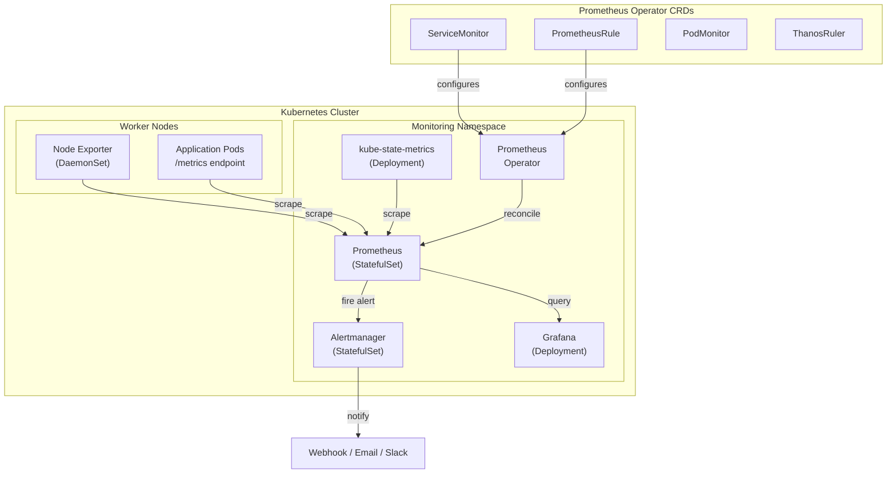

# Prometheus on Kubernetes — kube-prometheus-stack Helm (v3.12)

## Table of Contents

| Section | Topic | Description |
| :---: | :--- | :--- |
| **01** | [Why kube-prometheus-stack](#1-why-kube-prometheus-stack) | All-in-one monitoring for Kubernetes. |
| **02** | [Architecture](#2-architecture) | Operator pattern, CRDs, and component topology. |
| **03** | [Prerequisites](#3-prerequisites) | Cluster requirements, storage, Helm. |
| **04** | [Helm Deployment](#4-helm-deployment) | Production-grade values.yaml. |
| **05** | [Prometheus Operator CRDs](#5-prometheus-operator-crds) | ServiceMonitor, PrometheusRule, PodMonitor. |
| **06** | [Storage & Retention](#6-storage--retention) | TSDB persistence, WAL, remote write. |
| **07** | [Alertmanager](#7-alertmanager) | Configuration, routing, and receivers. |
| **08** | [Grafana Integration](#8-grafana-integration) | Dashboards, data sources, provisioning. |
| **09** | [Best Practices](#9-best-practices) | Security, performance, and operations. |

---

## 1. Why kube-prometheus-stack

The `kube-prometheus-stack` Helm chart bundles the entire Prometheus monitoring ecosystem into a single deployable package: Prometheus, Grafana, Alertmanager, Prometheus Operator, Node Exporter, and kube-state-metrics. One `helm install` gives you end-to-end Kubernetes cluster monitoring.

| Component | Role |
| :--- | :--- |
| **Prometheus** | Metrics collection, storage, PromQL engine |
| **Prometheus Operator** | Manages Prometheus via CRDs (ServiceMonitor, PrometheusRule) |
| **Grafana** | Visualization dashboards |
| **Alertmanager** | Alert routing, grouping, deduplication |
| **Node Exporter** | Host-level metrics (CPU, memory, disk, network) |
| **kube-state-metrics** | Kubernetes object metrics (pods, deployments, jobs) |

### Why Operator Pattern

| Approach | Config Method | Reload |
| :--- | :--- | :--- |
| **Static config** | Edit `prometheus.yml`, restart | Manual restart |
| **Operator + CRDs** | Create `ServiceMonitor` / `PrometheusRule` | Automatic hot-reload |

The Operator watches for CRD changes and reconfigures Prometheus without restarts.

### Latest Versions (2025)

| Component | Version |
| :--- | :--- |
| **kube-prometheus-stack chart** | v86.1.1 |
| **Prometheus** | v3.12.0 (stable) / v3.5.4 (LTS) |
| **Prometheus Operator** | v0.82.2 |
| **Grafana** | v12.3.0 |
| **Alertmanager** | v0.28.0 |
| **Node Exporter** | v1.9.0 |
| **kube-state-metrics** | v2.15.0 |

---

## 2. Architecture



### Resource Flow

| Step | Action |
| :--- | :--- |
| 1. Developer creates | `ServiceMonitor` pointing to app service |
| 2. Operator detects | Watches CRD changes via Kubernetes API |
| 3. Operator reconciles | Updates `prometheus.yml` secret |
| 4. Prometheus reload | Hot-reloads config via `/-/reload` |
| 5. Scraping begins | Prometheus scrapes new targets |

---

## 3. Prerequisites

| Requirement | Minimum | Recommended |
| :--- | :--- | :--- |
| **Kubernetes** | 1.25+ | 1.28+ |
| **Helm** | 3.10+ | 3.14+ |
| **CPU (Prometheus)** | 500m | 2 cores |
| **Memory (Prometheus)** | 512Mi | 4Gi |
| **Storage** | 10Gi SSD | 50Gi+ SSD |
| **Node Exporter** | 1 per node | 1 per node |

### StorageClass

Prometheus requires fast persistent storage for TSDB. Use SSD-backed StorageClass:

```bash
kubectl get storageclass
```

---

## 4. Helm Deployment

### Production Values

```yaml
# values-prometheus.yaml

# -- Global settings
nameOverride: ""
fullnameOverride: ""

# Prometheus Operator
prometheusOperator:
  replicas: 2
  resources:
    requests:
      cpu: 200m
      memory: 256Mi
    limits:
      cpu: "1"
      memory: 512Mi
  admissionWebhooks:
    enabled: true
  serviceMonitorSelectorNilUsesHelmValues: false
  serviceMonitorNamespaceSelector: {}

# Prometheus
prometheus:
  replicas: 2
  retention: 15d
  retentionSize: "45GB"
  scrapeInterval: 30s
  evaluationInterval: 30s
  resources:
    requests:
      cpu: "1"
      memory: 2Gi
    limits:
      cpu: "2"
      memory: 8Gi
  storageSpec:
    volumeClaimTemplate:
      spec:
        accessModes: ["ReadWriteOnce"]
        storageClassName: standard-rwo
        resources:
          requests:
            storage: 50Gi
  service:
    type: ClusterIP
    port: 9090
  thanosService:
    enabled: true  # Enable if using Thanos
  additionalScrapeConfigs:
  - job_name: 'custom-app'
    kubernetes_sd_configs:
    - role: endpoints
      namespaces:
        names: ['default']
    relabel_configs:
    - source_labels: [__meta_kubernetes_service_annotation_prometheus_io_scrape]
      action: keep
      regex: true

# Alertmanager
alertmanager:
  replicas: 3
  retention: 120h
  resources:
    requests:
      cpu: 100m
      memory: 128Mi
    limits:
      cpu: 500m
      memory: 512Mi
  storage:
    volumeClaimTemplate:
      spec:
        accessModes: ["ReadWriteOnce"]
        storageClassName: standard-rwo
        resources:
          requests:
            storage: 10Gi
  config:
    global:
      resolve_timeout: 5m
    route:
      group_by: ['alertname', 'namespace']
      group_wait: 30s
      group_interval: 5m
      repeat_interval: 4h
      receiver: 'default'
      routes:
      - match:
          severity: critical
        receiver: 'critical'
        group_wait: 10s
      - match:
          severity: warning
        receiver: 'warning'
    receivers:
    - name: 'default'
    - name: 'critical'
      webhook_configs:
      - url: 'http://alertmanager-webhook.monitoring.svc:9095/webhook'
    - name: 'warning'
      webhook_configs:
      - url: 'http://alertmanager-webhook.monitoring.svc:9095/webhook'

# Grafana
grafana:
  enabled: true
  replicas: 2
  adminUser: admin
  adminPassword: ""  # Set via secret
  persistence:
    enabled: true
    size: 5Gi
    storageClassName: standard-rwo
  resources:
    requests:
      cpu: 100m
      memory: 256Mi
    limits:
      cpu: 500m
      memory: 1Gi
  dashboardProviders:
    dashboardproviders.yaml:
      apiVersion: 1
      providers:
      - name: 'default'
        orgId: 1
        folder: 'Kubernetes'
        type: file
        disableDeletion: false
        editable: true
        options:
          path: /var/lib/grafana/dashboards/default
  dashboards:
    default:
      kubernetes-cluster:
        gnetId: 7249
        revision: 1
        datasource: Prometheus
      node-exporter:
        gnetId: 1860
        revision: 37
        datasource: Prometheus
      prometheus-stats:
        gnetId: 2
        revision: 1
        datasource: Prometheus
  sidecar:
    dashboards:
      enabled: true
      searchNamespace: ALL
    datasources:
      enabled: true

# Node Exporter
nodeExporter:
  enabled: true
  resources:
    requests:
      cpu: 50m
      memory: 64Mi
    limits:
      cpu: 250m
      memory: 128Mi

# kube-state-metrics
kubeStateMetrics:
  enabled: true
  resources:
    requests:
      cpu: 50m
      memory: 64Mi
    limits:
      cpu: 250m
      memory: 256Mi

# Default exporters
defaultRules:
  create: true
  rules:
    alertmanager: true
    etcd: true
    configReloaders: true
    general: true
    k8s: true
    kubeApiserverAvailability: true
    kubeApiserverBurnrate: true
    kubeApiserverHistogram: true
    kubeApiserverSlos: true
    kubeControllerManager: true
    kubelet: true
    kubeProxy: true
    kubePrometheusGeneral: true
    kubePrometheusNodeRecording: true
    kubernetesApps: true
    kubernetesResources: true
    kubernetesStorage: true
    kubernetesSystem: true
    kubeSchedulerAlerting: true
    kubeSchedulerRecording: true
    kubeStateMetrics: true
    network: true
    node: true
    nodeExporterAlerting: true
    nodeExporterRecording: true
    prometheus: true
    prometheusOperator: true
```

### Install

```bash
helm repo add prometheus-community https://prometheus-community.github.io/helm-charts
helm repo update

helm install kube-prom prometheus-community/kube-prometheus-stack \
  --namespace monitoring \
  --create-namespace \
  -f values-prometheus.yaml
```

### Upgrade

```bash
helm upgrade kube-prom prometheus-community/kube-prometheus-stack \
  --namespace monitoring \
  -f values-prometheus.yaml
```

---

## 5. Prometheus Operator CRDs

### ServiceMonitor

Tells Prometheus which services to scrape:

```yaml
apiVersion: monitoring.coreos.com/v1
kind: ServiceMonitor
metadata:
  name: my-app
  namespace: monitoring
  labels:
    release: kube-prom  # Must match Prometheus selector
spec:
  namespaceSelector:
    matchNames:
    - default
  selector:
    matchLabels:
      app: my-app
  endpoints:
  - port: http-metrics
    interval: 15s
    path: /metrics
    scheme: http
```

### PrometheusRule

Defines alerting and recording rules:

```yaml
apiVersion: monitoring.coreos.com/v1
kind: PrometheusRule
metadata:
  name: my-app-alerts
  namespace: monitoring
  labels:
    release: kube-prom
spec:
  groups:
  - name: my-app
    rules:
    - alert: HighErrorRate
      expr: |
        sum(rate(http_requests_total{status=~"5.."}[5m]))
        /
        sum(rate(http_requests_total[5m])) > 0.05
      for: 5m
      labels:
        severity: critical
      annotations:
        summary: "High error rate on {{ $labels.instance }}"
        description: "Error rate is {{ $value | humanizePercentage }}"

    - record: http_request_duration_seconds:p99
      expr: |
        histogram_quantile(0.99,
          sum(rate(http_request_duration_seconds_bucket[5m])) by (le, service)
        )
```

### PodMonitor

For pods without a Service:

```yaml
apiVersion: monitoring.coreos.com/v1
kind: PodMonitor
metadata:
  name: my-app
  namespace: monitoring
  labels:
    release: kube-prom
spec:
  selector:
    matchLabels:
      app: my-app
  podMetricsEndpoints:
  - port: metrics
    interval: 30s
```

---

## 6. Storage & Retention

### TSDB Storage

| Setting | Purpose | Recommended |
| :--- | :--- | :--- |
| `retention` | How long to keep data | `15d` (with Thanos for longer) |
| `retentionSize` | Max TSDB size | 80% of PVC size |
| `storageSpec` | PVC configuration | SSD, 50Gi+ |

### WAL (Write-Ahead Log)

Prometheus writes to WAL before TSDB blocks. Ensure fast disk:

| Component | Disk Requirement |
| :--- | :--- |
| WAL | Fast SSD, 10–20Gi headroom |
| TSDB blocks | SSD, sized per retention |
| `remote_write` queue | Memory-bounded, optional disk |

### Remote Write (Optional)

Send metrics to external storage (Thanos, Mimir, Cortex):

```yaml
prometheus:
  remoteWrite:
  - url: "http://thanos-receive.monitoring:19291/api/v1/receive"
  - url: "http://mimir.monitoring:8080/api/v1/push"
```

### Storage Sizing

| Metrics Volume | 15d Retention | Monthly Cost (SSD) |
| :--- | :--- | :--- |
| 10K series | ~5Gi | ~$1 |
| 100K series | ~50Gi | ~$10 |
| 1M series | ~500Gi | ~$100 |

---

## 7. Alertmanager

### Routing Tree

```yaml
route:
  group_by: ['alertname', 'namespace']
  group_wait: 30s        # Wait before first notification
  group_interval: 5m     # Wait between group updates
  repeat_interval: 4h    # Re-send if not resolved
  receiver: 'default'
  routes:
  - match:
      severity: critical
    receiver: 'pagerduty-critical'
    group_wait: 10s
  - match:
      severity: warning
    receiver: 'slack-warning'
  - match_re:
      alertname: '.*Down'
    receiver: 'email-oncall'
```

### Receiver Types

| Receiver | Use Case |
| :--- | :--- |
| `slack` | Team notifications |
| `pagerduty` | On-call escalation |
| `email` | Low-priority alerts |
| `webhook` | Custom integrations (Grafana OnCall, OpsGenie) |
| `opsgenie` | Incident management |

### Inhibition Rules

Suppress lower-severity alerts when critical is firing:

```yaml
inhibit_rules:
- source_match:
    severity: 'critical'
  target_match:
    severity: 'warning'
  equal: ['alertname', 'namespace']
```

---

## 8. Grafana Integration

### Built-in Dashboards

| Dashboard | ID | Description |
| :--- | :--- | :--- |
| Kubernetes Cluster Monitoring | 7249 | Overview of cluster health |
| Node Exporter Full | 1860 | Detailed node metrics |
| Prometheus Stats | 2 | Prometheus self-monitoring |
| K8s Pod Metrics | 6417 | Per-pod resource usage |
| K8s Namespace Metrics | 8535 | Namespace-level aggregation |

### Custom Dashboard Provisioning

```yaml
grafana:
  dashboards:
    custom:
      my-app:
        gnetId: 12345  # Grafana.com dashboard ID
        revision: 1
        datasource: Prometheus
      custom-dashboard:
        json: |
          {
            "annotations": {"list": []},
            "panels": [...],
            "title": "My Custom Dashboard",
            "uid": "custom-uid"
          }
```

### Data Source Auto-Provisioning

Grafana auto-discovers Prometheus as a data source via the sidecar. The default data source points to:

```
http://kube-prom-prometheus.monitoring:9090
```

---

## 9. Best Practices

### Security

| Practice | Rationale |
| :--- | :--- |
| Restrict namespace for ServiceMonitors | Prevent cross-namespace scraping |
| Use RBAC for Operator | Least-privilege for CRD management |
| Enable admission webhooks | Validate PrometheusRule resources |
| Encrypt Prometheus API | TLS for external access |
| Set `adminPassword` via Secret | Don't store plaintext in values |

### Reliability

| Practice | Rationale |
| :--- | --- |
| 2+ Prometheus replicas | HA with deduplication |
| 3+ Alertmanager replicas | Quorum-based alert routing |
| PVC for all stateful components | Data persistence across restarts |
| Pod anti-affinity | Spread replicas across nodes |
| Resource limits | Prevent OOM killing |

### Performance

| Practice | Rationale |
| :--- | --- |
| Set `scrapeInterval: 30s` | Balance granularity vs storage |
| Use `relabel_configs` | Drop high-cardinality labels |
| Set `retentionSize` | Prevent TSDB from filling disk |
| Enable `query_cache` | Speed up repeated PromQL queries |
| Use recording rules | Pre-compute expensive expressions |

### Operational Checklist

| Task | Frequency |
| :--- | :--- |
| Check Prometheus targets | Daily |
| Review alert rules | Weekly |
| Check storage usage | Weekly |
| Update Helm chart | Monthly |
| Review Grafana dashboards | Monthly |
| Test Alertmanager receivers | Quarterly |

---

## References

- [kube-prometheus-stack Helm Chart](https://github.com/prometheus-community/helm-charts/tree/main/charts/kube-prometheus-stack)
- [Prometheus Operator Documentation](https://prometheus-operator.dev/docs/)
- [Prometheus v3.12 Release Notes](https://github.com/prometheus/prometheus/releases/tag/v3.12.0)
- [Prometheus LTS Policy](https://prometheus.io/docs/introduction/release-cycle/)
- [Grafana Dashboard Library](https://grafana.com/grafana/dashboards/)
