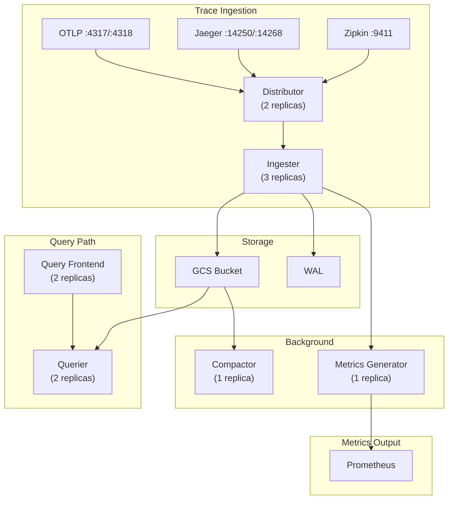

# Tempo Distributed on Kubernetes with Helm

Production-grade deployment of Grafana Tempo using the Helm chart with GCS storage, metrics generation, and comprehensive trace ingestion.

## Table of Contents

| Section | Topic | Description |
| :---: | :--- | :--- |
| **01** | [Chart Version and Storage](#1-chart-version-and-storage) | GCS backend and vParquet4. |
| **02** | [Receivers](#2-receivers) | OTLP, Jaeger, Zipkin protocols. |
| **03** | [Retention](#3-retention) | 72-hour trace retention with compaction. |
| **04** | [Metrics Generator](#4-metrics-generator) | span_metrics, service_graphs, remote_write. |
| **05** | [Ingestion Limits](#5-ingestion-limits) | Max traces, bytes, rate limits. |
| **06** | [Resource Summary](#6-resource-summary) | All component resource allocations. |
| **07** | [Architecture](#7-architecture) | Component overview. |
| **08** | [Deployment Checklist](#8-deployment-checklist) | Pre-flight and post-deploy verification. |

---

## 1. Chart Version and Storage

Chart version: `1.27.0`

| Key | Default | Custom | Reason |
|-----|---------|--------|--------|
| `storage.trace.backend` | `local` | `gcs` | Durable object storage for production |
| `storage.trace.gcs.bucket_name` | (none) | `company-tempo-traces-prod` | GCS bucket for trace blocks |
| `storage.trace.block.version` | `vParquet3` | `vParquet4` | Latest Parquet format for better query performance |

### Block Format Comparison

| Version | Format | Query Performance | Storage Efficiency |
|---------|--------|-------------------|-------------------|
| vParquet3 | Parquet v3 | Good | Good |
| vParquet4 | Parquet v4 | Better | Better |

vParquet4 provides improved column pruning and predicate pushdown, resulting in faster queries with less data scanned.

---

## 2. Receivers

All standard trace protocols are enabled for maximum compatibility:

| Protocol | Port | Purpose |
|----------|------|---------|
| OTLP gRPC | 4317 | Primary receiver — OpenTelemetry native |
| OTLP HTTP | 4318 | HTTP alternative for OTLP |
| Jaeger gRPC | 14250 | Legacy Jaeger client support |
| Jaeger Thrift HTTP | 14268 | HTTP-based Jaeger traces |
| Jaeger Thrift Compact | 6831 | UDP-based Jaeger agent protocol |
| Zipkin | 9411 | Zipkin format support |

### Recommended Protocol

For new applications, use OTLP gRPC (port 4317). It is the OpenTelemetry native protocol and provides the best performance and feature support.

### Receiver Configuration

```yaml
receivers:
  otlp:
    protocols:
      grpc:
        endpoint: 0.0.0.0:4317
      http:
        endpoint: 0.0.0.0:4318
  jaeger:
    protocols:
      grpc:
        endpoint: 0.0.0.0:14250
      thrift_http:
        endpoint: 0.0.0.0:14268
      thrift_compact:
        endpoint: 0.0.0.0:6831
  zipkin:
    endpoint: 0.0.0.0:9411
```

---

## 3. Retention

| Key | Default | Custom | Reason |
|-----|---------|--------|--------|
| `compactor.compaction.block_retention` | `48h` | `72h` | 3 days of trace retention; balance cost vs debugging needs |

### Retention Strategy

| Duration | Use Case | Storage Impact |
|----------|----------|----------------|
| 24h | Development/testing | Low |
| 48h | Default, cost-sensitive | Medium |
| 72h | Production, debugging | High |
| 168h (7 days) | Extended debugging | Very High |

### Compaction Behavior

The compactor merges smaller trace blocks into larger ones and enforces retention:

1. **Level 1 compaction**: Merges recent blocks within ingester set
2. **Level 2 compaction**: Merges L1 blocks across time windows
3. **Retention enforcement**: Deletes blocks older than `block_retention`

---

## 4. Metrics Generator

Enabled to generate RED metrics (Rate, Errors, Duration) from span data and write them back to Prometheus:

- **span_metrics**: Service name, HTTP method, status code, target
- **service_graphs**: Auto-generated service dependency graph
- **remote_write**: Sends generated metrics to Prometheus for dashboard use

```yaml
metricsGenerator:
  enabled: true
  config:
    registry:
      external_labels:
        cluster: production
    processor:
      span_metrics:
        dimensions:
          - http.method
          - http.target
          - http.status_code
      service_graphs: {}
    storage:
      path: /var/tempo/wal
      remote_write:
        - url: http://prometheus.monitoring.svc.cluster.local:9090/api/v1/write
```

### Generated Metrics

| Metric | Type | Labels |
|--------|------|--------|
| `traces_spanmetrics_calls_total` | Counter | service_name, http_method, http_status_code |
| `traces_spanmetrics_duration_milliseconds` | Histogram | service_name, http_method, http_status_code |
| `traces_spanmetrics_bytes_total` | Counter | service_name, http_method, http_status_code |
| `traces_service_graph_request_total` | Counter | source, target, method |
| `traces_service_graph_request_milliseconds` | Histogram | source, target, method |

### Prometheus Integration

The metrics generator writes directly to Prometheus via remote_write. Ensure Prometheus is configured to accept remote write:

```yaml
# prometheus values.yaml
remoteWrite:
  - url: http://prometheus.monitoring.svc.cluster.local:9090/api/v1/write
```

---

## 5. Ingestion Limits

| Key | Default | Custom | Reason |
|-----|---------|--------|--------|
| `max_traces_per_user` | `10000` | `200000` | Support high-throughput microservice environment |
| `max_bytes_per_trace` | `5000000` | `50000000` | Allow large traces (50MB) for complex workflows |
| `rate_limit_bytes` | `15000000` | `20000000` | Higher ingest rate for production load |

### Tuning Guidelines

| Metric | Small | Medium | Large |
|--------|-------|--------|-------|
| `max_traces_per_user` | 10000 | 50000 | 200000 |
| `max_bytes_per_trace` | 5MB | 20MB | 50MB |
| `rate_limit_bytes` | 15MB | 20MB | 50MB |
| Distributor replicas | 1-2 | 2 | 3+ |
| Ingester replicas | 2 | 3 | 5+ |

### Drop Behavior

When limits are exceeded:

- **`max_traces_per_user`**: New traces are dropped, existing traces continue
- **`max_bytes_per_trace`**: Individual spans exceeding the limit are dropped
- **`rate_limit_bytes`**: Ingestion is throttled or dropped

Monitor the `tempo_ingester_bytes_received_total` metric to detect dropped data.

---

## 6. Resource Summary

| Component | Replicas | CPU Req | CPU Limit | Mem Req | Mem Limit | Storage |
|-----------|----------|---------|-----------|---------|-----------|---------|
| Distributor | 2 | 500m | 1 | 512Mi | 1Gi | -- |
| Ingester | 3 | 500m | 2 | 1Gi | 2Gi | 20Gi |
| Query Frontend | 2 | 300m | 1 | 512Mi | 1Gi | -- |
| Querier | 2 | 300m | 1 | 512Mi | 1Gi | -- |
| Compactor | 1 | 250m | 1 | 512Mi | 1Gi | 20Gi |
| Metrics Generator | 1 | 250m | 1 | 512Mi | 1Gi | 10Gi |
| Gateway | 2 | 100m | 500m | 128Mi | 256Mi | -- |

### Resource Total

| Resource | Total Requests | Total Limits |
|----------|---------------|--------------|
| CPU | 2.7 cores | 7 cores |
| Memory | 4.5 Gi | 8.25 Gi |
| Storage | 50 Gi | -- |

---

## 7. Architecture



### Component Roles

| Component | Role |
|-----------|------|
| Distributor | Receives traces, distributes to ingesters |
| Ingester | Writes traces to WAL and flushes to GCS |
| Query Frontend | Splits and caches queries |
| Querier | Executes queries against storage |
| Compactor | Merges and compacts trace blocks |
| Metrics Generator | Generates RED metrics from spans |
| Gateway | Load balancer for all components |

### Data Flow

1. Application sends trace via OTLP/Jaeger/Zipkin
2. Gateway load balances to Distributor
3. Distributor hashes and routes to appropriate Ingester
4. Ingester writes to local WAL and flushes to GCS
5. Compactor merges blocks and enforces retention
6. Querier reads from GCS for trace queries
7. Metrics Generator produces RED metrics for Prometheus

---

## 8. Deployment Checklist

### Pre-Flight

```
[ ] GCS bucket created with correct IAM
[ ] GCP service account created with roles/storage.objectAdmin
[ ] Workload Identity configured (KSA annotation)
[ ] Storage backend set to gcs
[ ] Block version set to vParquet4
```

### Post-Deploy Verification

```bash
# Check all pods are running
kubectl get pods -n observability -l app.kubernetes.io/name=tempo

# Verify distributor is receiving traces
kubectl logs -n observability tempo-distributor-0 | grep "push"

# Check ingester flushing to GCS
kubectl logs -n observability tempo-ingester-0 | grep "flush"

# Verify compactor is running
kubectl logs -n observability tempo-compactor-0 | grep "compaction"

# Test query
curl -s 'http://localhost:3200/api/traces/1234567890abcdef' | python3 -m json.tool
```

### Prometheus Metrics Verification

```bash
# Check metrics generator is producing RED metrics
curl -s 'http://prometheus:9090/api/v1/query?query=traces_spanmetrics_calls_total' | python3 -m json.tool
```

---

## References

- [Tempo Helm Chart](https://github.com/grafana/tempo/tree/main/operations/helm)
- [Tempo Documentation](https://grafana.com/docs/tempo/)
- [OpenTelemetry Protocol](https://opentelemetry.io/docs/specs/otlp/)
