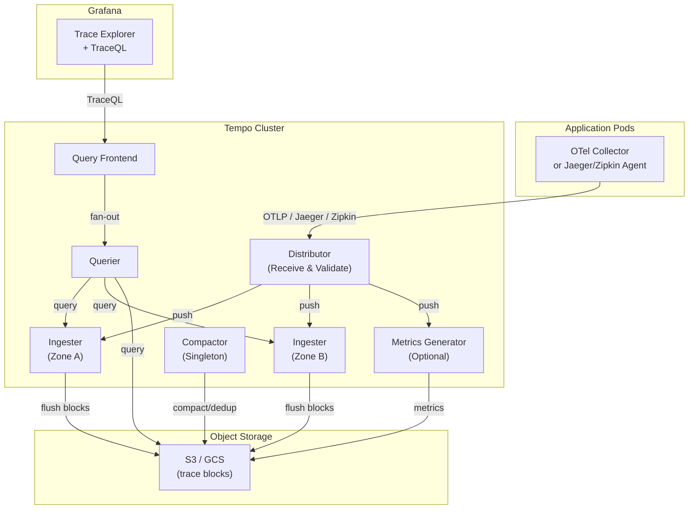

# Grafana Tempo on Kubernetes — Distributed Tracing with Helm

## Table of Contents

| Section | Topic | Description |
| :---: | :--- | :--- |
| **01** | [Why Tempo](#1-why-tempo) | Object-storage-only tracing backend. |
| **02** | [Architecture](#2-architecture) | Tempo components and trace pipeline. |
| **03** | [Prerequisites](#3-prerequisites) | Object storage, OpenTelemetry, Grafana. |
| **04** | [Helm Deployment](#4-helm-deployment) | Grafana Helm chart configuration. |
| **05** | [Component Deep Dive](#5-component-deep-dive) | Distributor, Ingester, Compactor, Querier. |
| **06** | [Trace Ingestion](#6-trace-ingestion) | OTLP, Jaeger, Zipkin protocols. |
| **07** | [TraceQL Queries](#7-traceql-queries) | Query language and Grafana integration. |
| **08** | [Metrics Generator](#8-metrics-generator) | Derive RED metrics from traces. |
| **09** | [Best Practices](#9-best-practices) | Production hardening and cost optimization. |

---

## 1. Why Tempo

Grafana Tempo is a distributed tracing backend that stores traces exclusively in object storage. Unlike Jaeger or Zipkin, Tempo doesn't index trace data — it uses a block-based approach similar to Thanos/Mimir, keeping costs extremely low while maintaining fast query performance.

| Feature | Tempo | Jaeger | Zipkin |
| :--- | :--- | :--- | :--- |
| **Storage backend** | Object storage only (S3, GCS) | Cassandra, Elasticsearch, Kafka | Cassandra, Elasticsearch |
| **Indexing** | None (block-based) | Full trace indexing | Full trace indexing |
| **Query language** | TraceQL | Jaeger Query | Zipkin Query |
| **Cost at scale** | Very low (object storage) | High (Cassandra/ES cluster) | High (Cassandra/ES cluster) |
| **Grafana integration** | Native | Via plugin | Via plugin |
| **Metrics from traces** | Built-in (Metrics Generator) | No | No |
| **OTLP support** | Native | Via collector | Via collector |

### When to Use Tempo

| Scenario | Why Tempo |
| :--- | :--- |
| **Already using Grafana** | Native integration, no plugin needed |
| **Cost-sensitive at scale** | Object storage is 10–50x cheaper than Cassandra/ES |
| **High trace volume** | Block-based storage handles billions of traces |
| **Need metrics from traces** | Metrics Generator derives RED metrics without separate instrumentation |
| **Multi-cluster tracing** | Single query endpoint across all clusters |

---

## 2. Architecture



### Component Overview

| Component | Role | Scaling |
| :--- | :--- | :--- |
| **Distributor** | Receives traces, validates, distributes to ingesters via hash ring | Horizontal (2–3 replicas) |
| **Ingester** | Batches traces into blocks, flushes to object storage | Horizontal (3+ replicas, zone-aware) |
| **Compactor** | Merges small blocks, deduplicates, applies retention | Singleton (1 replica) |
| **Querier** | Queries ingesters (recent) + object storage (historical) | Horizontal (2+ replicas) |
| **Query Frontend** | Splits queries, caches results, provides API | Horizontal (2+ replicas) |
| **Metrics Generator** | Derives RED metrics (rate, error, duration) from traces | Horizontal (2+ replicas) |

---

## 3. Prerequisites

### Object Storage

| Provider | Best For | Config |
| :--- | :--- | :--- |
| **AWS S3** | EKS deployments | IRSA for IAM |
| **GCP GCS** | GKE deployments | Workload Identity |
| **Azure Blob** | AKS deployments | Workload Identity |
| **MinIO** | Self-hosted / testing | S3-compatible API |

### OpenTelemetry Collector

Applications instrument traces via OpenTelemetry SDK → OTel Collector → Tempo. The collector handles:
- Protocol translation (OTLP → Tempo)
- Batch processing
- Sampling (tail-based or head-based)

### Grafana

Grafana 9.0+ has native Tempo support. Add Tempo as a data source pointing to the Query Frontend endpoint.

---

## 4. Helm Deployment

### Production Values

```yaml
# values-tempo.yaml

tempo:
  repository: grafana/tempo
  tag: "2.6.0"

# Distributor
distributor:
  replicas: 2
  resources:
    requests:
      cpu: 200m
      memory: 256Mi
    limits:
      cpu: "1"
      memory: 512Mi

# Ingester
ingester:
  replicas: 3
  persistence:
    enabled: true
    size: 10Gi
    storageClass: standard-rwo
  resources:
    requests:
      cpu: 500m
      memory: 512Mi
    limits:
      cpu: "2"
      memory: 2Gi
  zoneAwareReplication:
    enabled: true
    zones:
    - name: zone-a
      maxUnavailable: 1
    - name: zone-b
      maxUnavailable: 1

# Compactor
compactor:
  replicas: 1
  persistence:
    enabled: true
    size: 20Gi
    storageClass: standard-rwo
  resources:
    requests:
      cpu: 200m
      memory: 256Mi
    limits:
      cpu: "1"
      memory: 1Gi

# Querier
querier:
  replicas: 2
  resources:
    requests:
      cpu: 200m
      memory: 256Mi
    limits:
      cpu: "1"
      memory: 512Mi

# Query Frontend
queryFrontend:
  replicas: 2
  resources:
    requests:
      cpu: 100m
      memory: 128Mi
    limits:
      cpu: 500m
      memory: 512Mi

# Metrics Generator (optional)
metricsGenerator:
  enabled: true
  replicas: 2
  persistence:
    enabled: true
    size: 10Gi
  resources:
    requests:
      cpu: 200m
      memory: 256Mi
    limits:
      cpu: "1"
      memory: 1Gi

# Storage
storage:
  type: s3
  s3:
    region: ap-southeast-1
    bucket: tempo-traces
    endpoint: s3.ap-southeast-1.amazonaws.com
    accessKey: ""  # Use IRSA instead
    secretKey: ""
  traces:
    backend: s3
    s3:
      bucket: tempo-traces
      endpoint: s3.ap-southeast-1.amazonaws.com
      region: ap-southeast-1
    block:
      version: vParquet3
    wal:
      path: /var/tempo/wal
      level: ~
    local:
      path: /var/tempo/traces

# Service
service:
  type: ClusterIP
  port: 3200

# Overrides
overrides:
  defaults:
    ingestion:
      rate_limit_bytes: 15000000   # 15MB/s per tenant
      burst_size_bytes: 20000000   # 20MB burst
    metrics_generator:
      processors:
      - service_graphs
      - span_metrics
```

### Install

```bash
helm repo add grafana https://grafana.github.io/helm-charts
helm repo update

helm install tempo grafana/tempo \
  --namespace monitoring \
  --create-namespace \
  -f values-tempo.yaml
```

### Distributed Mode (Monolithic vs Microservices)

| Mode | When to Use | Components |
| :--- | :--- | :--- |
| **Monolithic** | < 10K traces/s, single binary | All-in-one |
| **Microservices** | > 10K traces/s, need per-component scaling | Distributor, Ingester, Querier, etc. |

The Helm chart above deploys **microservices mode** by default.

---

## 5. Component Deep Dive

### Distributor

The distributor is the entry point. It receives traces via OTLP/Jaeger/Zipkin, validates them, and uses a consistent hash ring to distribute to ingesters.

| Configuration | Purpose |
| :--- | :--- |
| `ingestion.rate_limit_bytes` | Max bytes/s per tenant |
| `ingestion.burst_size_bytes` | Max burst size |
| `distributor.replicas` | Run 2+ for HA |

### Ingester

Ingester receives traces from the distributor, batches them into blocks, and flushes to object storage when the block reaches a size limit or time threshold.

| Configuration | Purpose |
| :--- | :--- |
| `replicas` | Minimum 3 for zone-aware replication |
| `zoneAwareReplication` | Spread ingesters across failure domains |
| `persistence.size` | WAL size for crash recovery |

### Compactor

Compactor runs as a singleton and performs:
- **Block compaction** — merges small blocks into larger ones
- **Deduplication** — removes duplicate spans from HA pairs
- **Retention** — deletes blocks older than configured retention

| Configuration | Purpose |
| :--- | --- |
| `compaction.v2_compact_block_duration` | Block duration (default: 4h) |
| `compaction.max_block_bytes` | Max block size before compaction |
| `retention` | Delete traces older than this |

---

## 6. Trace Ingestion

### OTLP (Recommended)

```yaml
# OTel Collector config
receivers:
  otlp:
    protocols:
      grpc:
        endpoint: 0.0.0.0:4317
      http:
        endpoint: 0.0.0.0:4318

exporters:
  otlp:
    endpoint: tempo-distributor.monitoring.svc.cluster.local:4317
    tls:
      insecure: true

service:
  pipelines:
    traces:
      receivers: [otlp]
      processors: [batch]
      exporters: [otlp]
```

### Jaeger Protocol

```yaml
exporters:
  jaeger:
    endpoint: tempo-distributor.monitoring.svc.cluster.local:14250
    tls:
      insecure: true
```

### Sampling Strategies

| Strategy | Description | Trade-off |
| :--- | :--- | :--- |
| **Head-based** | Sample at trace start (e.g., 10%) | Simple, may miss errors |
| **Tail-based** | Sample after seeing full trace | Keeps interesting traces, more complex |
| **Rate limiting** | Fixed bytes/s per tenant | Predictable cost, may drop high-value traces |

### Tail-Based Sampling (OTel Collector)

```yaml
processors:
  tail_sampling:
    decision_wait: 10s
    num_traces: 100000
    policies:
    - name: errors
      type: status_code
      status_code: {status_codes: [ERROR]}
    - name: slow-traces
      type: latency
      latency: {threshold_ms: 1000}
    - name: probabilistic
      type: probabilistic
      probabilistic: {sampling_percentage: 10}
```

---

## 7. TraceQL Queries

TraceQL is Tempo's query language — similar to PromQL but for traces.

### Basic Queries

```traceql
# Find traces with HTTP method GET
http.method = "GET"

# Find traces with errors
status = error

# Find slow traces (> 1s)
duration > 1s

# Find traces touching a specific service
resource.service.name = "api-gateway"

# Combine conditions
http.method = "POST" && duration > 500ms && status = error
```

### Advanced Queries

```traceql
# Spans with specific attribute
span.db.system = "postgresql"

# Regex matching
http.url =~ "/api/v[12]/.*"

# Aggregate: p99 latency by service
{resource.service.name} | select(duration) | quantile_over_time(0.99, duration)

# Compare two time ranges
{resource.service.name = "api"} | rate() by (span.name)
```

### Grafana Integration

1. Add Tempo data source in Grafana
2. Set URL to `http://tempo-query-frontend.monitoring.svc.cluster.local:3200`
3. Use **Explore** → **Tempo** to search traces
4. Link from logs (Loki) to traces via TraceQL

---

## 8. Metrics Generator

The Metrics Generator derives RED metrics (Rate, Error, Duration) from traces without additional instrumentation. It runs inside Tempo and generates Prometheus-compatible metrics.

### Generated Metrics

| Metric | Type | Description |
| :--- | :--- | :--- |
| `traces_spanmetrics_calls_total` | Counter | Total spans per service/operation |
| `traces_spanmetrics_duration_seconds` | Histogram | Span duration distribution |
| `traces_spanmetrics_size_total` | Counter | Total bytes per service/operation |
| `traces_service_graph_request_total` | Counter | Service graph edge counts |
| `traces_service_graph_request_duration_seconds` | Histogram | Service graph edge latency |

### Processors

| Processor | Generates | Use Case |
| :--- | :--- | :--- |
| `span_metrics` | RED metrics per span | Service-level SLOs |
| `service_graphs` | Service dependency graph | Architecture visualization |

### Configuration

```yaml
metricsGenerator:
  enabled: true
  config:
    processor:
      service_graphs:
        dimensions:
        - service.name
        - http.method
      span_metrics:
        dimensions:
        - service.name
        - http.method
        - http.status_code
    storage:
      path: /var/tempo/generator/wal
      remote_write:
      - url: http://prometheus.monitoring.svc.cluster.local:9090/api/v1/write
```

---

## 9. Best Practices

### Security

| Practice | Rationale |
| :--- | :--- |
| Use IRSA / Workload Identity | No static credentials in Pods |
| Encrypt object storage | Traces may contain sensitive request data |
| Rate limit per tenant | Prevent runaway ingestion from consuming resources |
| Restrict distributor access | Only OTel Collectors should reach the distributor |

### Reliability

| Practice | Rationale |
| :--- | --- |
| Zone-aware ingester replication | Survive zone failure without data loss |
| 3+ ingester replicas | Minimum for quorum-based block ownership |
| WAL persistence | Ingester crash recovery without re-flushing |
| Singleton compactor | Prevents compaction conflicts |

### Performance

| Practice | Rationale |
| :--- | --- |
| Use `vParquet3` block format | Best compression and query performance |
| Enable Query Frontend caching | Reduces repeated trace lookups |
| Set appropriate ingestion limits | Prevent OOM on distributors/ingesters |
| Tail-based sampling at OTel Collector | Reduces volume before reaching Tempo |

### Cost Optimization

| Practice | Rationale |
| :--- | :--- |
| Tail-based sampling | Store only interesting traces (errors, slow) |
| Short retention for raw data | 7–30d is usually sufficient |
| Use S3 Intelligent-Tiering | Auto-move old blocks to cheaper storage |
| Disable Metrics Generator if not needed | Saves CPU and storage |

### Operational Checklist

| Task | Frequency |
| :--- | :--- |
| Monitor ingestion rate and errors | Continuous |
| Check compactor block count | Daily |
| Review trace storage growth | Weekly |
| Update Tempo version | Monthly |
| Test disaster recovery | Quarterly |

---

## References

- [Grafana Tempo Documentation](https://grafana.com/docs/tempo/latest/)
- [TraceQL Documentation](https://grafana.com/docs/tempo/latest/traceql/)
- [Tempo Helm Chart](https://github.com/grafana/helm-charts/tree/main/charts/tempo)
- [Metrics Generator](https://grafana.com/docs/tempo/latest/configuration/metrics-generator/)
- [OpenTelemetry Collector](https://opentelemetry.io/docs/collector/)
