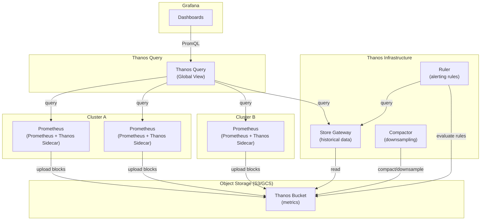
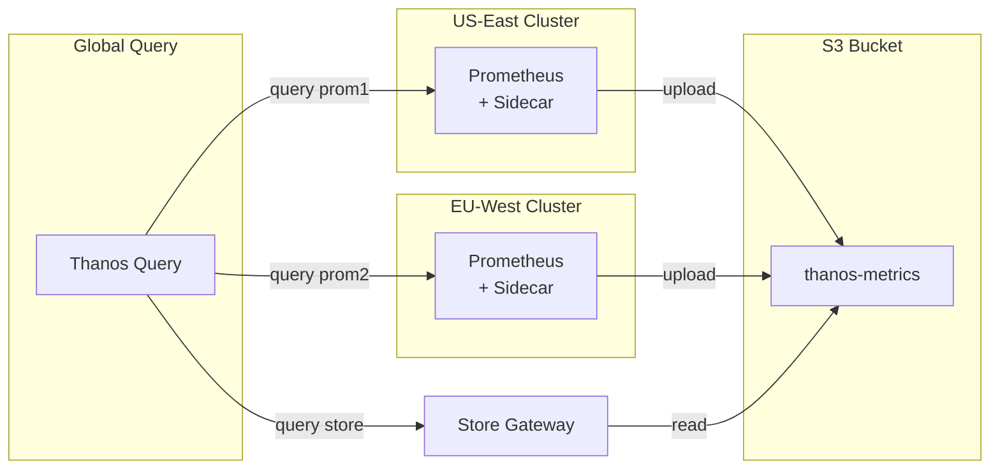

# Thanos on Kubernetes — Global Prometheus with Helm

## Table of Contents

| Section | Topic | Description |
| :---: | :--- | :--- |
| **01** | [Why Thanos](#1-why-thanos) | Unlimited retention, global view, high availability. |
| **02** | [Architecture](#2-architecture) | Thanos components and data flow. |
| **03** | [Prerequisites](#3-prerequisites) | Object storage, Prometheus setup, Helm. |
| **04** | [Helm Deployment](#4-helm-deployment) | Bitnami Thanos Helm chart configuration. |
| **05** | [Component Deep Dive](#5-component-deep-dive) | Sidecar, Store Gateway, Query, Compactor, Ruler. |
| **06** | [Object Storage](#6-object-storage) | S3, GCS, MinIO configuration. |
| **07** | [Query & Federation](#7-query--federation) | Global query view and multi-cluster setup. |
| **08** | [Retention & Downsampling](#8-retention--downsampling) | Data lifecycle management. |
| **09** | [Best Practices](#9-best-practices) | Production hardening and operational tips. |

---

## 1. Why Thanos

Prometheus is excellent for real-time monitoring but has inherent limitations: single-instance data is ephemeral (typically 15d retention), no global cross-cluster view, and no built-in deduplication for HA pairs. Thanos adds a layer on top of Prometheus to solve all three.

| Problem | Prometheus Alone | Thanos Solution |
| :--- | :--- | :--- |
| **Data retention** | Local disk, typically 15d | Unlimited retention via object storage |
| **Global view** | Single cluster only | Query across multiple Prometheus instances |
| **High availability** | Dedup required at query time | Automatic deduplication of HA pairs |
| **Downsampling** | Not supported | 5m and 1h downsampling for old data |
| **Cost** | SSD/EBS for long-term storage | Cheap object storage (S3/GCS) |

### Thanos vs Alternatives

| Solution | Approach | Trade-offs |
| :--- | :--- | :--- |
| **Thanos** | Sidecar + object storage | Non-invasive, works with existing Prometheus |
| **Cortex** | Remote write to central store | Requires push-based architecture change |
| **Mimir** | Grafana's Cortex fork | Similar to Cortex, Grafana-native |
| **VictoriaMetrics** | PromQL-compatible alternative | Different storage engine, migration required |

---

## 2. Architecture



### Component Overview

| Component | Role | Deployment |
| :--- | :--- | :--- |
| **Sidecar** | Uploads Prometheus TSDB blocks to object storage, serves recent data | Runs as sidecar container in Prometheus Pod |
| **Store Gateway** | Serves historical data from object storage | Separate Deployment |
| **Query** | Fans out queries across all stores (Prometheus + Store Gateway) | Separate Deployment |
| **Query Frontend** | Caches and splits queries for performance (optional) | Separate Deployment |
| **Compactor** | Downsamples and compacts old data in object storage | StatefulSet (singleton) |
| **Ruler** | Evaluates recording/alerting rules against Thanos data | Separate Deployment |
| **Bucket Web** | Web UI for inspecting object storage | Optional Deployment |

---

## 3. Prerequisites

### Object Storage

| Provider | Config Example | Notes |
| :--- | :--- | :--- |
| **AWS S3** | `s3://thanos-metrics` | Use IRSA for IAM in EKS |
| **GCP GCS** | `gcs://thanos-metrics` | Use Workload Identity in GKE |
| **Azure Blob** | `azure://thanos-metrics` | Use Workload Identity in AKS |
| **MinIO** | `s3://thanos-metrics` | S3-compatible, self-hosted |
| **Filesystem** | `filesystem:///data` | Testing only, no HA support |

### Prometheus Requirements

Prometheus must run with `--prometheus.retention.time=6h` (short local retention) since Thanos handles long-term storage via object storage.

### Helm Chart

This guide uses the **Bitnami Thanos Helm chart** (`bitnami/thanos`).

```bash
helm repo add bitnami https://charts.bitnami.com/bitnami
helm repo update
```

---

## 4. Helm Deployment

### Production Values

```yaml
# values-thanos.yaml

# Global settings
objstoreConfig:
  type: S3
  config:
    bucket: "thanos-metrics"
    endpoint: "s3.ap-southeast-1.amazonaws.com"
    region: "ap-southeast-1"
    sse_config:
      sse_type: "SSE-S3"
    http_config:
      idle_conn_timeout: 90s
      response_header_timeout: 2m
      insecure_skip_verify: false

# Thanos Sidecar (deployed with Prometheus)
sidecar:
  enabled: true
  retentionResolutionRaw: 6h
  retentionResolution5m: 0d
  retentionResolution1h: 0d
  thriftEndpoint: ""
  prometheus:
    url: "http://prometheus.monitoring.svc.cluster.local:9090"
  service:
    type: ClusterIP
    port: 10901
  resources:
    requests:
      cpu: 100m
      memory: 128Mi
    limits:
      cpu: 500m
      memory: 256Mi

# Store Gateway
storegateway:
  enabled: true
  sharded:
    enabled: true
    shards: 2
  persistence:
    enabled: true
    size: 10Gi
    storageClass: standard-rwo
  resources:
    requests:
      cpu: 200m
      memory: 256Mi
    limits:
      cpu: "1"
      memory: 1Gi

# Query (Global Query)
query:
  enabled: true
  replicaCount: 2
  dnsDiscovery:
    sidecarService: "thanos-sidecar.monitoring.svc.cluster.local"
    storeEndpoints: "thanos-storegateway.monitoring.svc.cluster.local"
  resources:
    requests:
      cpu: 200m
      memory: 256Mi
    limits:
      cpu: "1"
      memory: 1Gi
  service:
    type: ClusterIP
    port: 9090

# Query Frontend (optional, adds caching)
queryFrontend:
  enabled: true
  replicaCount: 2
  config:
    splitQueriesByInterval: 24h
  resources:
    requests:
      cpu: 100m
      memory: 128Mi
    limits:
      cpu: 500m
      memory: 512Mi

# Compactor
compactor:
  enabled: true
  retentionResolutionRaw: 30d
  retentionResolution5m: 90d
  retentionResolution1h: 365d
  persistence:
    enabled: true
    size: 50Gi
    storageClass: standard-rwo
  resources:
    requests:
      cpu: 200m
      memory: 512Mi
    limits:
      cpu: "1"
      memory: 2Gi

# Ruler (optional)
ruler:
  enabled: false
  evalInterval: 1m
  ruleFiles:
    - /etc/thanos/rules/*.yml

# Bucket Web (optional UI)
bucketweb:
  enabled: true
  replicaCount: 1
  resources:
    requests:
      cpu: 50m
      memory: 64Mi

# MinIO (built-in for testing, disable in production)
minio:
  enabled: false
```

### Install

```bash
helm install thanos bitnami/thanos \
  --namespace monitoring \
  --create-namespace \
  -f values-thanos.yaml
```

### Upgrade

```bash
helm upgrade thanos bitnami/thanos \
  --namespace monitoring \
  -f values-thanos.yaml
```

---

## 5. Component Deep Dive

### Sidecar

The sidecar container runs alongside Prometheus in the same Pod. It watches the Prometheus TSDB directory and uploads new blocks to object storage. It also serves the most recent data (within Prometheus retention) for queries.

| Configuration | Purpose |
| :--- | :--- |
| `retentionResolutionRaw` | How long sidecar retains raw resolution data locally |
| `prometheus.url` | Internal Prometheus service URL for block uploads |
| `objstoreConfig` | Object storage credentials and bucket config |

### Store Gateway

Store Gateway is a caching layer that serves historical data from object storage. It maintains a cache of recently accessed blocks to reduce object storage API calls.

| Configuration | Purpose |
| :--- | :--- |
| `sharded.enabled` | Shard the bucket across multiple instances for scale |
| `sharded.shards` | Number of shards (2–4 for most deployments) |
| `persistence.size` | Local cache size for block metadata |

### Query (Query Frontend)

Query fans out requests to all stores — Prometheus sidecars (recent data) and Store Gateway (historical data). Query Frontend sits in front and adds caching and query splitting.

| Configuration | Purpose |
| :--- | :--- |
| `replicaCount` | Run 2+ for HA |
| `dnsDiscovery` | Auto-discover sidecar and store endpoints via DNS |
| `queryFrontend.splitQueriesByInterval` | Split long-range queries into 24h chunks |

### Compactor

Compactor runs as a **singleton** — it compacts and downsamples blocks in object storage. It reduces storage costs and improves query performance for old data.

| Retention | Purpose |
| :--- | :--- |
| `retentionResolutionRaw: 30d` | Keep raw data for 30 days |
| `retentionResolution5m: 90d` | Keep 5-minute downsampled data for 90 days |
| `retentionResolution1h: 365d` | Keep 1-hour downsampled data for 1 year |

---

## 6. Object Storage

### AWS S3 (Production)

```yaml
objstoreConfig:
  type: S3
  config:
    bucket: "thanos-metrics-prod"
    endpoint: "s3.ap-southeast-1.amazonaws.com"
    region: "ap-southeast-1"
    sse_config:
      sse_type: "SSE-S3"
    http_config:
      idle_conn_timeout: 90s
      response_header_timeout: 2m
```

### GCP GCS

```yaml
objstoreConfig:
  type: GCS
  config:
    bucket: "thanos-metrics-prod"
    service_account: ""  # Use Workload Identity
```

### MinIO (Self-Hosted)

```yaml
objstoreConfig:
  type: S3
  config:
    bucket: "thanos-metrics"
    endpoint: "minio.minio.svc.cluster.local:9000"
    insecure: true
    sse_config:
      sse_type: "SSE-S3"
```

### Storage Sizing

| Retention | Metrics Volume | Estimated S3 Cost |
| :--- | :--- | :--- |
| 30d raw + 90d 5m + 365d 1h | 10K active series | ~$5–10/month |
| 30d raw + 90d 5m + 365d 1h | 100K active series | ~$50–100/month |
| 30d raw + 90d 5m + 365d 1h | 1M active series | ~$500–1000/month |

---

## 7. Query & Federation

### Global Query View

Query component discovers all stores via DNS and merges results into a single PromQL endpoint:

```
thanos-query.monitoring.svc.cluster.local:9090
```

Grafana points to this single endpoint and can query metrics from any cluster.

### Multi-Cluster Setup



### Query Configuration

| Setting | Recommended | Purpose |
| :--- | :--- | :--- |
| `query.auto-downsampling` | Enable | Automatically query downsampled data for long ranges |
| `query.replica-label` | `prometheus_replica` | Deduplicate HA pairs |

---

## 8. Retention & Downsampling

### Data Lifecycle

| Age | Resolution | Retention | Action |
| :--- | :--- | :--- | :--- |
| 0–6h | Raw (scrape interval) | Local Prometheus | Sidecar uploads to S3 |
| 6h–30d | Raw | S3 (full resolution) | Compactor deduplicates |
| 30d–90d | 5-minute downsampled | S3 | Compactor downsamples |
| 90d–365d | 1-hour downsampled | S3 | Compactor downsamples |
| >365d | Deleted | — | Compactor deletes |

### Downsampling Benefits

| Metric | Raw (15s) | 5m Downsampled | 1h Downsampled |
| :--- | :--- | :--- | :--- |
| **Query speed** | Baseline | 3–5x faster | 10–20x faster |
| **Storage per series** | ~10KB/day | ~2KB/day | ~500B/day |
| **Accuracy** | 100% | ~99.9% | ~99.5% |

---

## 9. Best Practices

### Security

| Practice | Rationale |
| :--- | :--- |
| Use IRSA (EKS) / Workload Identity (GKE) | No static AWS/GCP credentials in Pods |
| Encrypt object storage (SSE-S3 / SSE-KMS) | Data at rest encryption |
| Restrict Bucket Web access | Status UI should be internal-only |
| Use IAM least-privilege | Sidecar needs only `s3:PutObject`, Store Gateway needs `s3:GetObject` |

### Reliability

| Practice | Rationale |
| :--- | :--- |
| Run 2+ Query replicas | HA for the global query endpoint |
| Run 2+ Store Gateway shards | Horizontal scaling for historical queries |
| Singleton Compactor | Prevents compaction conflicts |
| PVC for Store Gateway and Compactor | Cache persistence across restarts |
| Monitor Thanos components | Add Thanos sidecar metrics to your monitoring |

### Performance

| Practice | Rationale |
| :--- | :--- |
| Enable Query Frontend caching | Reduces repeated queries for dashboards |
| Use `splitQueriesByInterval: 24h` | Parallelizes long-range queries |
| Shard Store Gateway | More shards = more parallelism for large buckets |
| Set appropriate downsampling | 1h resolution for data >90d old |

### Cost Optimization

| Practice | Rationale |
| :--- | :--- |
| Use S3 Intelligent-Tiering | Auto-move old data to cheaper storage classes |
| Downsample aggressively | 1h resolution for data >90d reduces storage 20x |
| Set retention limits | Don't keep raw data forever — 30d is usually sufficient |
| Use GCS Nearline/Coldline | For GCP, archive old blocks to cheaper storage |

---

## References

- [Thanos Documentation](https://thanos.io/tip/thanos/components/)
- [Thanos Helm Chart](https://github.com/bitnami/charts/tree/main/bitnami/thanos)
- [Thanos Object Storage Config](https://thanos.io/tip/thanos/storage.md/)
- [Prometheus + Thanos Guide](https://prometheus.io/docs/prometheus/latest/storage/#remote-storage-integrations)
