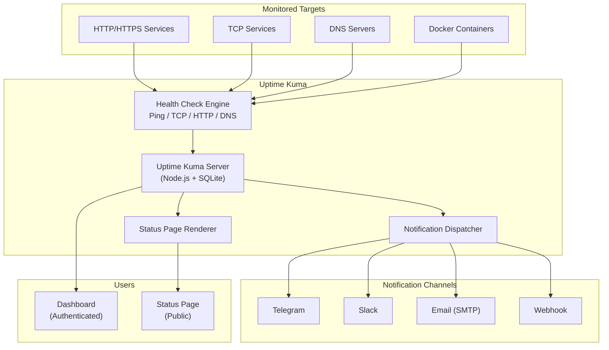

# Uptime Kuma — Self-Hosted Monitoring & Status Pages

## Table of Contents

| Section | Topic | Description |
| :---: | :--- | :--- |
| **01** | [Why Uptime Kuma](#1-why-uptime-kuma) | Self-hosted alternative to commercial uptime monitors. |
| **02** | [Architecture](#2-architecture) | Deployment topology and data flow. |
| **03** | [Docker Deployment](#3-docker-deployment) | Single-container setup with persistence. |
| **04** | [Kubernetes Deployment](#4-kubernetes-deployment) | Production-grade deployment on K8s. |
| **05** | [Monitor Types](#5-monitor-types) | HTTP, TCP, DNS, Docker, and more. |
| **06** | [Notifications](#6-notifications) | Alerting via Telegram, Slack, email, webhooks. |
| **07** | [Status Pages](#7-status-pages) | Public and private status pages. |
| **08** | [Best Practices](#8-best-practices) | Security, reliability, and production tips. |

---

## 1. Why Uptime Kuma

Uptime Kuma is a self-hosted monitoring tool that tracks uptime, response time, and SSL certificate expiry for services. It's a lightweight alternative to commercial solutions like UptimeRobot, Pingdom, or StatusPage.io — with full data ownership.

| Feature | Uptime Kuma | UptimeRobot | Pingdom |
| :--- | :--- | :--- | :--- |
| **Self-hosted** | Yes | No | No |
| **Data ownership** | Full | Cloud only | Cloud only |
| **Cost** | Free (OSS) | Free tier + paid | Paid only |
| **Monitor types** | HTTP, TCP, DNS, Docker, Steam, etc. | HTTP, TCP, port | HTTP, TCP |
| **Status pages** | Built-in, customizable | Built-in | Built-in |
| **Notifications** | 90+ providers | Limited | Limited |
| **Response time tracking** | Yes | Yes | Yes |
| **SSL certificate monitoring** | Yes | Yes | Yes |

### When to Use Uptime Kuma

| Scenario | Why Uptime Kuma |
| :--- | :--- |
| **Homelab / small team** | Zero cost, simple setup |
| **Compliance requirements** | Data stays on-premise |
| **Multi-cloud monitoring** | Monitors endpoints across any provider |
| **Customer-facing status page** | Built-in, branded status pages |
| **Supplement to Prometheus** | Uptime-focused checks complement Prometheus metrics |

---

## 2. Architecture



### Data Flow

| Step | Action |
| :--- | :--- |
| 1. Check interval | Uptime Kuma triggers a health check (e.g., every 60s) |
| 2. Probe target | Sends HTTP request, TCP SYN, DNS query, or Docker API call |
| 3. Evaluate result | Compares response code, latency, SSL expiry, or container status |
| 4. Record result | Stores response time, status, and uptime percentage in SQLite |
| 5. Trigger alert | If status changes (up→down or down→up), dispatches notifications |
| 6. Update status page | Public status page reflects latest state |

---

## 3. Docker Deployment

### Basic Setup

```yaml
# docker-compose.yml
version: "3.8"

services:
  uptime-kuma:
    image: louislam/uptime-kuma:1
    container_name: uptime-kuma
    restart: unless-stopped
    ports:
      - "3001:3001"
    volumes:
      - uptime-kuma-data:/app/data
    environment:
      - TZ=Asia/Jakarta

volumes:
  uptime-kuma-data:
    driver: local
```

```bash
docker compose up -d
```

Access the dashboard at `http://localhost:3001` and complete the initial setup wizard.

### With Reverse Proxy (Nginx)

```nginx
# /etc/nginx/conf.d/uptime-kuma.conf
server {
    listen 443 ssl http2;
    server_name status.example.com;

    ssl_certificate     /etc/ssl/certs/status.example.com.pem;
    ssl_certificate_key /etc/ssl/private/status.example.com.key;

    location / {
        proxy_pass http://127.0.0.1:3001;
        proxy_http_version 1.1;
        proxy_set_header Upgrade $http_upgrade;
        proxy_set_header Connection "upgrade";
        proxy_set_header Host $host;
        proxy_set_header X-Real-IP $remote_addr;
        proxy_set_header X-Forwarded-For $proxy_add_x_forwarded_for;
        proxy_set_header X-Forwarded-Proto $scheme;
    }
}
```

### Docker Best Practices

| Practice | Rationale |
| :--- | :--- |
| Use named volumes | Data persistence across container restarts |
| Set `restart: unless-stopped` | Auto-recovery after crashes or host reboots |
| Pin image version (`:1`) | Prevents unexpected upgrades breaking config |
| Set `TZ` environment variable | Correct timestamps in logs and status pages |
| Restrict port binding | Don't expose `3001` publicly — use reverse proxy |

---

## 4. Kubernetes Deployment

### Deployment

```yaml
apiVersion: apps/v1
kind: Deployment
metadata:
  name: uptime-kuma
  namespace: monitoring
  labels:
    app: uptime-kuma
    app.kubernetes.io/name: uptime-kuma
    app.kubernetes.io/component: monitoring
spec:
  replicas: 1
  selector:
    matchLabels:
      app: uptime-kuma
  template:
    metadata:
      labels:
        app: uptime-kuma
    spec:
      containers:
      - name: uptime-kuma
        image: louislam/uptime-kuma:1
        ports:
        - containerPort: 3001
          name: web
        env:
        - name: TZ
          value: "Asia/Jakarta"
        resources:
          requests:
            cpu: 100m
            memory: 128Mi
          limits:
            cpu: 500m
            memory: 512Mi
        livenessProbe:
          httpGet:
            path: /
            port: 3001
          initialDelaySeconds: 30
          periodSeconds: 30
        readinessProbe:
          httpGet:
            path: /
            port: 3001
          initialDelaySeconds: 10
          periodSeconds: 10
        volumeMounts:
        - name: data
          mountPath: /app/data
      volumes:
      - name: data
        persistentVolumeClaim:
          claimName: uptime-kuma-data
```

### Service

```yaml
apiVersion: v1
kind: Service
metadata:
  name: uptime-kuma
  namespace: monitoring
spec:
  selector:
    app: uptime-kuma
  ports:
  - name: web
    port: 3001
    targetPort: 3001
  type: ClusterIP
```

### PVC

```yaml
apiVersion: v1
kind: PersistentVolumeClaim
metadata:
  name: uptime-kuma-data
  namespace: monitoring
spec:
  accessModes:
  - ReadWriteOnce
  resources:
    requests:
      storage: 1Gi
  storageClassName: standard-rwo
```

### Kubernetes Best Practices

| Practice | Rationale |
| :--- | :--- |
| Single replica | SQLite doesn't support multi-writer — use 1 replica |
| PVC for `/app/data` | Persists monitor history and config across pod restarts |
| Set resource limits | Prevents memory leaks from consuming node resources |
| Liveness/readiness probes | Auto-restart if the web server becomes unresponsive |
| Network policy | Restrict access to monitoring namespace only |

---

## 5. Monitor Types

### HTTP/HTTPS Monitor

| Field | Example | Purpose |
| :--- | :--- | :--- |
| URL | `https://api.example.com/health` | Target endpoint |
| Method | GET / POST | HTTP method |
| Expected Status | 200 | Required response code |
| Max Response Time | 5000ms | Alert if slower |
| Keyword | `healthy` | Search response body for string |
| TLS/SSL Verify | Yes | Check certificate expiry |

### TCP Port Monitor

| Field | Example | Purpose |
| :--- | :--- | :--- |
| Host | `db.example.com` | Target hostname |
| Port | 5432 | Target port |
| Timeout | 10s | Connection timeout |

### DNS Monitor

| Field | Example | Purpose |
| :--- | :--- | :--- |
| DNS Server | `8.8.8.8` | Resolver to query |
| Resolve Name | `api.example.com` | Hostname to resolve |
| Resolve Type | A / AAAA / MX | Record type |
| Expected Result | `203.0.113.10` | Required IP or value |

### Docker Container Monitor

| Field | Example | Purpose |
| :--- | :--- | :--- |
| Docker Host | `unix:///var/run/docker.sock` | Docker socket path |
| Container | `nginx-proxy` | Container name or ID |
| Condition | running | Expected container state |

### Push Monitor (Heartbeat)

| Field | Example | Purpose |
| :--- | :--- | :--- |
| Push URL | `https://status.example.com/api/push/abc123` | External systems POST here |
| Max Interval | 60s | Alert if no heartbeat received |

---

## 6. Notifications

### Telegram Bot

| Field | Value |
| :--- | :--- |
| Bot Token | `123456:ABC-DEF1234ghIkl-zyx57W2v1u123ew11` |
| Chat ID | `-1001234567890` |

### Slack Webhook

| Field | Value |
| :--- | :--- |
| Webhook URL | `https://hooks.slack.com/services/T00/B00/xxx` |
| Channel | `#alerts` |

### Email (SMTP)

| Field | Value |
| :--- | :--- |
| SMTP Host | `smtp.gmail.com` |
| Port | 465 |
| Username | `alerts@example.com` |
| Password | `app-password` |
| From | `Uptime Kuma <alerts@example.com>` |
| To | `team@example.com` |

### Webhook (Generic)

| Field | Value |
| :--- | :--- |
| URL | `https://hooks.example.com/uptime` |
| Method | POST |
| Headers | `Authorization: Bearer <token>` |
| Body | `{"monitor": "{{NAME}}", "status": "{{STATUS}}"}` |

### Notification Best Practices

| Practice | Rationale |
| :--- | :--- |
| Use multiple channels | Telegram + Slack + email for redundancy |
| Set heartbeat interval | Avoid alert storms — minimum 60s between checks |
| Configure retry | `retries: 3` before alerting prevents flapping |
| Use status page for customers | Reduce notification noise — status page is self-service |
| Tag monitors | Group by service, environment, or team for targeted alerts |

---

## 7. Status Pages

### Public Status Page Setup

1. Go to **Status Pages** → **Add New Status Page**
2. Select monitors to include
3. Set custom domain (e.g., `status.example.com`)
4. Customize branding (logo, colors, title)

### Status Page Features

| Feature | Detail |
| :--- | :--- |
| Custom domain | CNAME to your Uptime Kuma instance |
| Incident management | Create postmortems with timeline |
| Subscription | Users can subscribe to email/SMS updates |
| Theme | Light/dark mode, custom CSS |
| API | Embed status via iframe or JSON endpoint |

### Embedding

```html
<!-- iframe embed -->
<iframe
  src="https://status.example.com/embed-status/abc123"
  width="100%"
  height="400"
  frameborder="0"
></iframe>
```

---

## 8. Best Practices

### Security

| Practice | Rationale |
| :--- | :--- |
| Use HTTPS reverse proxy | Encrypt dashboard and status page traffic |
| Enable 2FA | Protect admin dashboard from unauthorized access |
| Restrict network access | Status page can be public, dashboard should be internal |
| Regular backups | SQLite file at `/app/data/uptime-kuma.db` |
| Update regularly | Security patches in new releases |

### Reliability

| Practice | Rationale |
| :--- | :--- |
| Monitor from multiple locations | Uptime Kuma supports distributed monitoring via push |
| Set appropriate intervals | 60s for critical services, 300s for non-critical |
| Configure retries | 3 retries before alerting prevents false positives |
| Use keywords + status codes | Both checks catch more failure modes |
| Backup SQLite regularly | `cron` job to copy `uptime-kuma.db` |

### Integration with Existing Stack

| Integration | Method |
| :--- | :--- |
| **Prometheus** | Export Uptime Kuma metrics via `/metrics` endpoint (if enabled) |
| **Grafana** | Display status page as embedded panel |
| **Alertmanager** | Forward webhook notifications to Alertmanager |
| **PagerDuty** | Use webhook notification type with PagerDuty API |
| **Grafana OnCall** | Webhook integration for incident management |

---

## References

- [Uptime Kuma Documentation](https://uptime.kuma.pet/)
- [Uptime Kuma GitHub](https://github.com/louislam/uptime-kuma)
- [Supported Notifications](https://github.com/louislam/uptime-kuma/wiki/Notifications)
- [Push Monitor Documentation](https://github.com/louislam/uptime-kuma/wiki/Push-Monitor)
