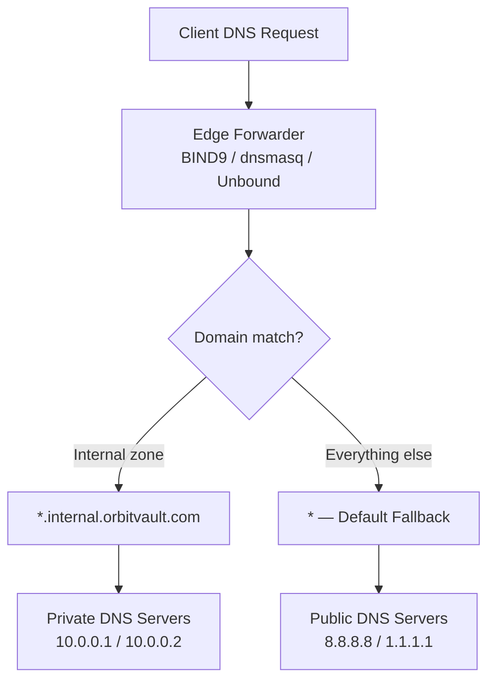

# Split-Horizon DNS Forwarding Guide (BIND9, dnsmasq, Unbound)

## Table of Contents

| Section | Topic | Description |
| :---: | :--- | :--- |
| **01** | [Why Split-Horizon DNS](#1-why-split-horizon-dns) | Different DNS answers for internal vs external clients. |
| **02** | [Architecture](#2-architecture) | Forward-only split-horizon design pattern. |
| **03** | [BIND9 Implementation](#3-bind9-implementation) | Enterprise-grade conditional forwarding. |
| **04** | [dnsmasq Implementation](#4-dnsmasq-implementation) | Lightweight edge forwarding. |
| **05** | [Unbound Implementation](#5-unbound-implementation) | High-performance hardened resolver. |
| **06** | [Verification & Troubleshooting](#6-verification--troubleshooting) | Testing, logging, and common issues. |
| **07** | [Best Practices](#7-best-practices) | Security hardening, caching, and production tips. |
| **08** | [Selection Matrix](#8-selection-matrix) | Choosing the right DNS forwarder. |

---

## 1. Why Split-Horizon DNS

Split-horizon DNS (also called split-view or split-brain DNS) serves different DNS records depending on where the query comes from. Internal clients get private IPs; external clients get public IPs. This is fundamental for hybrid cloud architectures, VPN setups, and any environment where the same hostname needs to resolve differently inside and outside the network.

### Common Use Cases

| Scenario | Why Split-Horizon |
| :--- | :--- |
| **Hybrid cloud** | Internal services resolve to private VPC IPs, external to public LB |
| **VPN environments** | Remote offices resolve internal hostnames via private DNS |
| **Multi-tenant clusters** | Each tenant gets isolated internal DNS zones |
| **Development vs production** | Dev resolves to staging IPs, prod resolves to production IPs |
| **Security isolation** | Internal service IPs never exposed to public DNS |

### Forward-Only vs Authoritative

| Mode | How It Works | When to Use |
| :--- | :--- | :--- |
| **Forward-only** | Server proxies queries to upstream resolvers, no local zone files | Simple split routing, no record hosting needed |
| **Authoritative** | Server hosts its own zone files with different records per view | Full control over DNS records, complex multi-view setups |

This guide focuses on **forward-only** mode — simpler to maintain, no zone file management, and ideal for environments that already have upstream authoritative servers.

---

## 2. Architecture

### Scenario

**Domain:** `orbitvault.com`

- `*.internal.orbitvault.com` → forward to private DNS (`10.0.0.1`, `10.0.0.2`)
- `*.orbitvault.com` (everything else) → forward to public DNS (`8.8.8.8`, `1.1.1.1`)



### Key Design Principles

| Principle | Detail |
| :--- | :--- |
| **No local zone files** | Forwarder only — upstream servers hold authoritative data |
| **Conditional routing** | Domain pattern matching determines upstream target |
| **Defense in depth** | Private IPs never leak to public DNS queries |
| **Observability** | Full query logging for audit and troubleshooting |

---

## 3. BIND9 Implementation

BIND9 is the industry standard for enterprise-grade DNS. Forward-only mode with conditional zones provides granular routing without hosting zone files.

### Global Options

**File:** `/etc/bind/named.conf.options`

```named
options {
    directory "/var/cache/bind";

    recursion yes;
    allow-recursion { any; };
    allow-query { any; };

    forward first;
    forwarders {
        8.8.8.8;
        1.1.1.1;
    };

    dnssec-validation no;

    listen-on port 53 { any; };
    listen-on-v6 { none; };
};

logging {
    channel default_log {
        file "/var/log/named/bind.log" versions 3 size 5m;
        severity info;
        print-time yes;
        print-severity yes;
        print-category yes;
    };

    category default { default_log; };
    category queries { default_log; };
    category config { default_log; };
    category resolver { default_log; };
};
```

### Split Forward Zones

**File:** `/etc/bind/named.conf.local`

```named
zone "internal.orbitvault.com" {
    type forward;
    forward only;
    forwarders {
        10.0.0.1;
        10.0.0.2;
    };
};
```

### Activation

```bash
named-checkconf /etc/bind/named.conf.options
named-checkconf /etc/bind/named.conf.local
sudo systemctl restart bind9
```

### BIND9 Best Practices

| Practice | Rationale |
| :--- | :--- |
| Use `forward first` (not `forward only`) in global options | Allows fallback to recursion if forwarders fail |
| Use `forward only` in zone blocks | Forces strict forwarding for internal zones |
| Set `versions 3 size 5m` on log files | Prevents log disk exhaustion |
| Run `named-checkconf` before restart | Catches syntax errors before service disruption |
| Disable DNSSEC validation for internal-only zones | Avoids validation failures on private resolvers |

---

## 4. dnsmasq Implementation

dnsmasq is ideal for lightweight environments — edge proxies, homelabs, container sidecars, and resource-constrained nodes.

### Configuration

**File:** `/etc/dnsmasq.conf`

```ini
port=53
domain-needed
bogus-priv
no-resolv

# Conditional forwarding — internal zone
server=/internal.orbitvault.com/10.0.0.1
server=/internal.orbitvault.com/10.0.0.2

# Default public DNS
server=8.8.8.8
server=1.1.1.1

# Caching
cache-size=1000
min-cache-ttl=300

# Logging
log-queries
log-facility=/var/log/dnsmasq.log

# Interface binding
listen-address=127.0.0.1,0.0.0.0
bind-interfaces
```

### Activation

```bash
dnsmasq --test
sudo systemctl restart dnsmasq
```

### dnsmasq Best Practices

| Practice | Rationale |
| :--- | :--- |
| Always set `no-resolv` | Prevents dnsmasq from reading `/etc/resolv.conf` and bypassing your rules |
| Set `domain-needed` | Drops queries for bare names without dots, reducing noise |
| Set `bogus-priv` | Prevents reverse lookups for private IPs from leaking upstream |
| Use `bind-interfaces` | Security — only listens on specified interfaces |
| Set `cache-size=1000` | Balances memory use vs cache hit rate for small deployments |

---

## 5. Unbound Implementation

Unbound is a high-security, high-performance validating resolver. Ideal for environments that need DNSSEC support, aggressive caching, and hardened defaults.

### Configuration

**File:** `/etc/unbound/unbound.conf.d/forward-split-horizon.conf`

```yaml
server:
  verbosity: 1
  interface: 0.0.0.0
  port: 53
  access-control: 0.0.0.0/0 allow

  do-ip4: yes
  do-udp: yes
  do-tcp: yes

  hide-identity: yes
  hide-version: yes
  use-caps-for-id: no

  cache-min-ttl: 300
  cache-max-ttl: 300
  prefetch: yes
  prefetch-key: yes

  logfile: "/var/log/unbound.log"

# Internal zone — private resolvers
forward-zone:
  name: "internal.orbitvault.com."
  forward-tls-upstream: no
  forward-addr: 10.0.0.1
  forward-addr: 10.0.0.2

# Catch-all — public resolvers
forward-zone:
  name: "."
  forward-addr: 8.8.8.8
  forward-addr: 1.1.1.1
```

### Activation

```bash
unbound-checkconf /etc/unbound/unbound.conf.d/forward-split-horizon.conf
sudo systemctl restart unbound
```

### Unbound Best Practices

| Practice | Rationale |
| :--- | :--- |
| Set `access-control` per subnet | Don't allow `0.0.0.0/0` in production — restrict to trusted networks |
| Enable `prefetch` and `prefetch-key` | Refreshes expiring cache entries in background, reduces latency |
| Set `cache-min-ttl` and `cache-max-ttl` | Bounded cache lifetime prevents stale records |
| Use `forward-tls-upstream: yes` | Encrypts forwarding traffic to upstream resolvers |
| Set `hide-identity: yes` and `hide-version: yes` | Prevents fingerprinting of your DNS software |

---

## 6. Verification & Troubleshooting

### Test with dig

```bash
# Internal zone — should resolve via 10.0.0.1
dig internal.orbitvault.com @127.0.0.1

# Public zone — should resolve via 8.8.8.8
dig www.orbitvault.com @127.0.0.1

# Verify forwarding path
dig +trace internal.orbitvault.com @127.0.0.1
```

### Expected Results

| Query | Expected Upstream | Expected Answer |
| :--- | :--- | :--- |
| `internal.orbitvault.com` | `10.0.0.1` | Private IP (e.g., `10.0.1.50`) |
| `www.orbitvault.com` | `8.8.8.8` | Public IP (e.g., `203.0.113.10`) |
| `api.internal.orbitvault.com` | `10.0.0.1` | Private IP |

### Log Locations

| DNS Server | Log File | What to Check |
| :--- | :--- | :--- |
| BIND9 | `/var/log/named/bind.log` | Query categories, resolution paths |
| dnsmasq | `/var/log/dnsmasq.log` | Forwarding decisions, cache hits |
| Unbound | `/var/log/unbound.log` | Validation results, prefetch activity |

### Common Issues

| Issue | Cause | Fix |
| :--- | :--- | :--- |
| Internal zone resolves to public IP | Forward zone not configured | Verify zone block exists in config |
| SERVFAIL on internal queries | Private DNS unreachable | Check network connectivity to `10.0.0.1` |
| DNSSEC validation failures | Upstream doesn't support DNSSEC | Set `dnssec-validation no` (BIND9) or disable validation |
| Queries bypass forwarder | `/etc/resolv.conf` overriding | Set `no-resolv` (dnsmasq) or remove default nameservers |
| Log file grows unbounded | No log rotation configured | Add `logrotate` config or set `versions 3 size 5m` |

---

## 7. Best Practices

### Security Hardening

| Practice | BIND9 | dnsmasq | Unbound |
| :--- | :--- | :--- | :--- |
| Restrict query source | `allow-query { acl; };` | `interface=` + `bind-interfaces` | `access-control: 10.0.0.0/8 allow` |
| Disable open recursion | `allow-recursion { trusted; };` | `no-resolv` + explicit servers | `access-control` restricts access |
| Hide software version | N/A (not exposed in responses) | N/A | `hide-version: yes` |
| Encrypt forwarding | N/A (forwarders are plaintext) | N/A | `forward-tls-upstream: yes` |
| Rate limiting | `rate-limit` clause | `--dns-forward-max` | `num-queries-per-thread` |

### Caching Strategy

| Parameter | Recommended | Rationale |
| :--- | :--- | :--- |
| `cache-size` (dnsmasq) | 1000–10000 | Balance memory vs hit rate |
| `cache-min-ttl` (Unbound) | 300s | Prevents excessive upstream queries |
| `cache-max-ttl` (Unbound) | 86400s | Bounded staleness |
| `prefetch` (Unbound) | yes | Background refresh reduces latency spikes |
| Log rotation | All servers | Prevents disk exhaustion |

### Logging & Observability

| Goal | Implementation |
| :--- | :--- |
| Audit trail | Log all queries with timestamps |
| Performance monitoring | Track cache hit ratio, query latency |
| Security alerts | Monitor for unusual query patterns (DDoS, exfiltration) |
| Compliance | Retain logs per organizational policy |

### DNSSEC Considerations

| Environment | Recommendation |
| :--- | :--- |
| Internal-only resolvers | Disable DNSSEC validation — private zones aren't signed |
| Public-facing resolvers | Enable DNSSEC validation for trust anchor verification |
| Mixed environments | Use `dnssec-validation auto` with managed trust anchors |

---

## 8. Selection Matrix

| Criterion | BIND9 | dnsmasq | Unbound |
| :--- | :--- | :--- | :--- |
| **Best for** | Enterprise, complex routing | Edge, homelab, containers | High-security, high-throughput |
| **Memory footprint** | Moderate–Heavy | Minimal | Optimized |
| **Zone support** | Full authoritative + forwarding | Forwarding + hosts only | Forwarding + validation |
| **DNSSEC** | Full support | None | Full support |
| **Config complexity** | High | Low | Medium |
| **Logging** | Granular per-category | Simple facility-based | Structured with verbosity levels |
| **Conditional forwarding** | Zone-based | `server=/domain/ip` syntax | `forward-zone` blocks |
| **Production readiness** | Proven at scale | Proven at edge | Proven in security-critical environments |

---

## References

- [BIND9 Administrator Reference Manual](https://kb.isc.org/docs/aa-00886)
- [dnsmasq Manual](https://thekelleys.org.uk/dnsmasq/doc.html)
- [Unbound Documentation](https://nlnetlabs.nl/documentation/unbound/)
- [RFC 1035 — Domain Names](https://datatracker.ietf.org/doc/html/rfc1035)
- [RFC 2782 — DNS SRV Records](https://datatracker.ietf.org/doc/html/rfc2782)
