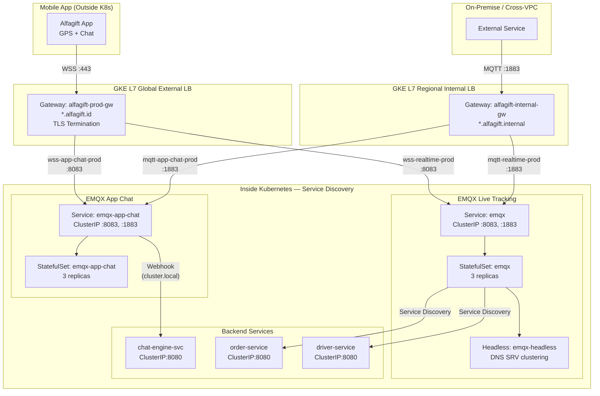

# CFP Submission — KCD Indonesia 2026

> **Event:** Kubernetes Community Days Indonesia 2026
> **Date:** October 24, 2026 — Bandung, Indonesia
> **Track:** Service Mesh & Networking
> **Format:** Lightning Talk (10 min)
> **CFP Deadline:** July 15, 2026

---

## Title

**Real-Time Networking in Kubernetes: Live Tracking & Chat with Gateway API**

## Subtitle

How Alfagift uses Kubernetes Gateway API to power live tracking and chat for millions of users — dual-gateway architecture, EMQX WebSocket clustering, and production webhook integration.

---

## Speaker Information

| Field | Value |
|---|---|
| **Name** | Ahmad Nurhidayat |
| **Role** | Platform / Infrastructure Engineer at Alfagift (GLI) |
| **Bio** | Infrastructure engineer focused on Kubernetes, networking, and real-time systems. Building and operating production clusters on GKE serving millions of users for Alfagift. |
| **Twitter / LinkedIn** | [Your handles] |
| **Location** | [Your city — mention if outside Jakarta for travel support] |

---

## Talk Summary (2-3 sentences)

Alfagift serves millions of active users with real-time GPS live tracking and in-app chat. Every second, WebSocket connections must be correctly routed to the EMQX MQTT broker. This talk explains how we use Kubernetes Gateway API with a dual-gateway pattern (external + internal) to run this real-time infrastructure in production GKE — covering WebSocket long-lived connections, canary deployment, and webhook integration for the chat system.

### Sessionize Abstract (max 900 chars)

> **Copy-paste ready:**

Alfagift serves millions of active users with real-time GPS live tracking and in-app chat. Every second, WebSocket connections must be correctly routed to EMQX MQTT brokers.

This talk explains how we use Kubernetes Gateway API with a dual-gateway architecture — an external gateway (gke-l7-global-external-managed) for mobile apps via WSS, and an internal gateway (gke-l7-rilb) for cross-VPC MQTT communication. Inside the cluster, native Kubernetes service discovery handles pod-to-pod routing.

We run two isolated EMQX clusters (3-replica StatefulSets) — one for live tracking with JWT auth and open ACL on location/# topics, another for chat with webhook integration and HTTP-based authorization. GKE-native CRDs (GCPBackendPolicy, HealthCheckPolicy) provide 120-second timeouts for long-lived WebSocket connections and health monitoring.

Key takeaways: role separation between platform and app teams, WebSocket routing without special config, canary deployment via native weight splitting, and when to use Gateway API vs service discovery.

### Sessionize Description

> **Copy-paste ready:**

Live tracking and chat are critical features for any delivery and loyalty platform. When millions of users depend on real-time GPS updates and instant messaging, the networking layer must be rock solid.

In this talk, I'll share how Alfagift — one of Indonesia's largest fintech and loyalty platforms — uses Kubernetes Gateway API to power live tracking and chat for millions of active users on production GKE.

We run a dual-gateway architecture:
- External Gateway (gke-l7-global-external-managed) serves mobile apps via WSS with TLS termination
- Internal Gateway (gke-l7-rilb) handles cross-VPC and on-premise MQTT communication
- Inside the cluster, native Kubernetes service discovery (ClusterIP + Headless) routes pod-to-pod traffic

The infrastructure runs two isolated EMQX MQTT broker clusters (3-replica StatefulSets each):
- Live Tracking: JWT authentication, open ACL for location/# and tracking/# topics
- Chat System: Webhook integration to external chat engine, HTTP-based authorization, strict ACL

GKE-native CRDs (GCPBackendPolicy, HealthCheckPolicy, GCPGatewayPolicy) provide fine-grained control — 120-second timeouts for long-lived WebSocket connections, HTTP health checks, and backend security policies.

What you'll learn:
- How Gateway API separates concerns between platform and app teams
- WebSocket routing without special controller configuration
- When to use Gateway API vs native service discovery
- Canary deployment via weight-based and header-based routing
- Real production challenges and how we solved them

---

## Abstract (Full Description)

### Problem

Alfagift requires reliable networking infrastructure for two critical real-time use cases:

1. **Live Tracking** — Every delivery driver sends GPS coordinates every few seconds via MQTT over WebSocket. If the WebSocket connection drops or the gateway is misconfigured, live tracking goes down for all users.

2. **Chat System** — Users can chat directly with drivers from the app. The chat system integrates with EMQX via webhooks to an external chat engine, with HTTP-based authorization.

Before adopting Gateway API, we faced several challenges with Ingress:
- ingress-nginx retired (March 2026) — no more security patches
- WebSocket long-lived connections required difficult timeout tuning in Ingress
- No native support for weight-based or header-based canary deployment
- Difficult to separate concerns between the platform team (gateway config) and app team (routing rules)

### Solution

We adopted Kubernetes Gateway API on GKE with a **dual-gateway** architecture:

**External Gateway** (`gke-l7-global-external-managed`):
- Serves public traffic to `*.alfagift.id`
- TLS termination at the load balancer
- HTTPRoutes route by hostname to the correct service

**Internal Gateway** (`gke-l7-rilb`):
- Serves internal traffic to `*.alfagift.internal`
- Regional Internal Load Balancer
- For service-to-service communication and monitoring dashboards

**EMQX MQTT Broker** (3-replica StatefulSet):
- Live Tracking: JWT authentication, ACL rules for `location/#` and `tracking/#` topics
- Chat System: Webhook integration to external chat engine, HTTP-based authorization
- WebSocket exposed via Gateway API on port 8083

**GKE-Native CRDs**:
- `GCPBackendPolicy` — 120-second timeout for WebSocket connections
- `HealthCheckPolicy` — HTTP health check to `/api/v5/status`
- `GCPGatewayPolicy` — links backend policy to service

### Key Takeaways

1. Gateway API is not just an Ingress replacement — it is a role-oriented API that separates concerns between platform and app teams
2. WebSocket routing works without special controller configuration
3. Canary deployment (weight-based and header-based) is a native feature, not an annotation hack
4. The dual-gateway pattern (external + internal) provides flexibility for hybrid traffic patterns
5. GKE-native CRDs offer better control compared to generic annotations

---

## Technical Details

### Architecture

### Three Communication Layers

| Layer | Gateway | Consumer | Protocol | DNS |
|---|---|---|---|---|
| **External** | `gke-l7-global-external-managed` | Mobile App | WSS :443 | `wss-realtime-prod.alfagift.id` |
| **Internal** | `gke-l7-rilb` | On-premise, cross-VPC | MQTT :1883 | `mqtt-realtime-prod.alfagift.internal` |
| **Inside K8s** | None — Service Discovery | Pod-to-pod | ClusterIP / Headless | `emqx.infrastructure.svc.cluster.local` |

**Key insight:** Gateway API handles traffic entering/leaving the cluster. Inside the cluster, native Kubernetes service discovery (ClusterIP for singletons, Headless for StatefulSet clustering) handles pod-to-pod communication.

### EMQX Configuration Highlights

| Setting | Live Tracking | Chat System |
|---|---|---|
| Auth | JWT (hmac-based) | HTTP webhook |
| ACL | Open publish on `location/#`, `tracking/#` | Strict deny-all, admin-only publish |
| WebSocket | Port 8083, path `/mqtt` | Port 8083, path `/mqtt` |
| Session TTL | 24 hours | 24 hours |
| Connection limit | 2M | 2M |
| GCPBackendPolicy timeout | 120s | 120s |

### Gateway API Resources Used

| Resource | Purpose |
|---|---|
| `GatewayClass` | `gke-l7-global-external-managed` (external), `gke-l7-rilb` (internal) |
| `Gateway` | Wildcard `*.alfagift.id`, TLS termination, listeners |
| `HTTPRoute` | Per-service hostname routing, path matching |
| `GCPBackendPolicy` | Timeout, security policy, rate limiting |
| `HealthCheckPolicy` | HTTP health checks for EMQX |
| `GCPGatewayPolicy` | Links backend + health check policies |

---

## Why This Talk Fits KCD Indonesia

| Criteria | Match |
|---|---|
| **Service Mesh & Networking** | Gateway API is a core networking topic |
| **Production experience** | Real production system serving millions of users |
| **Not a tutorial** | Architecture decisions, trade-offs, real challenges |
| **Indonesian context** | Alfagift is a major Indonesian fintech/loyalty platform |
| **Actionable** | Audience can apply the dual-gateway pattern to their own systems |
| **Beginner-friendly** | Lightning talk format, focused on concepts not deep code |

---

## Additional Notes for Reviewers

- This is a **production system** running on GKE in `asia-southeast1`
- The talk focuses on **networking patterns**, not EMQX internals
- No vendor-specific content — Gateway API is CNCF standard, works on any Kubernetes
- The dual-gateway pattern (external + internal) is applicable to any organization with similar requirements
- I have hands-on experience operating this system, not just reading documentation

---

## References

- [Kubernetes Gateway API](https://gateway-api.sigs.k8s.io/)
- [GKE Gateway API](https://cloud.google.com/kubernetes-engine/docs/how-to/gateway-api)
- [EMQX Documentation](https://www.emqx.io/docs/en/latest/)
- [Alfagift](https://alfagift.id)

---

**Submitted:** July 2026
**Status:** Draft — pending review
