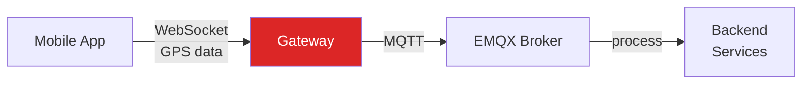
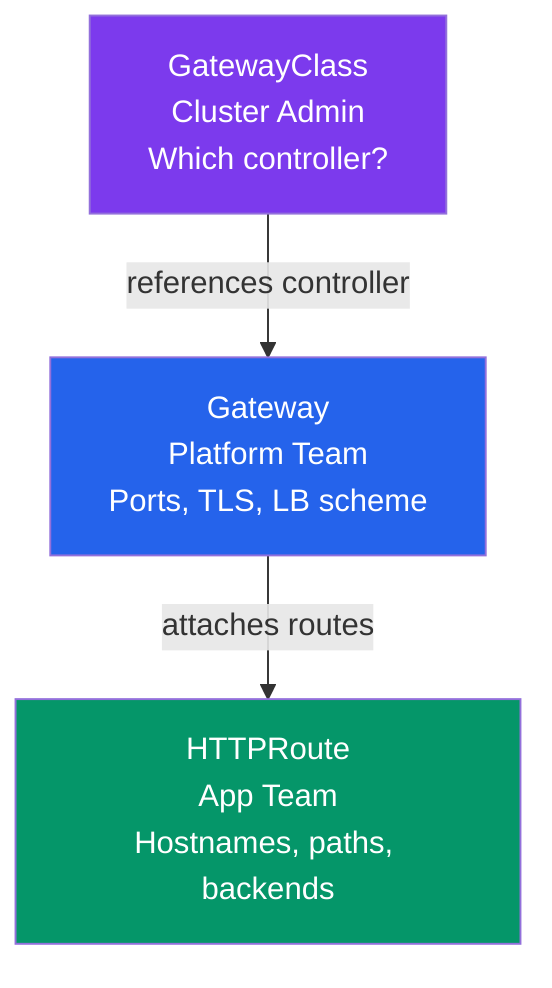
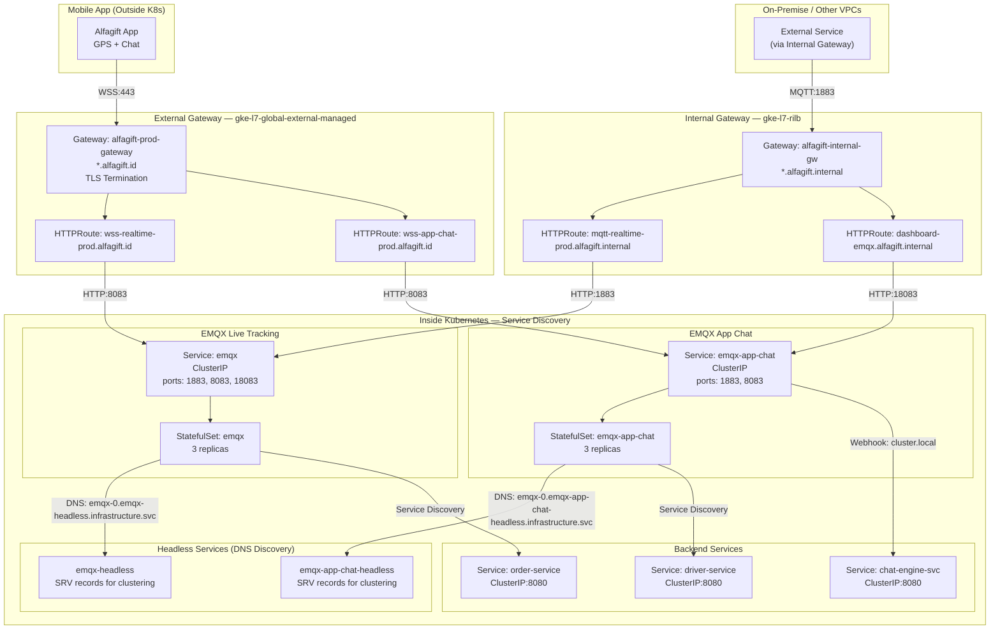
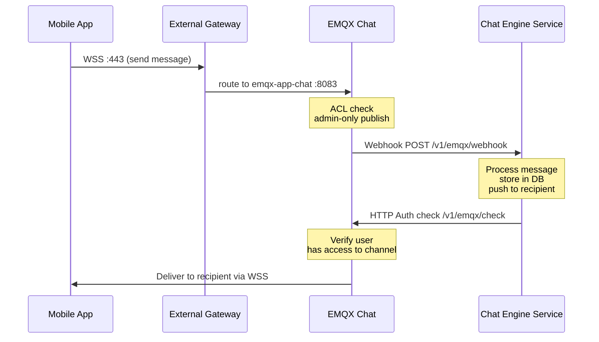
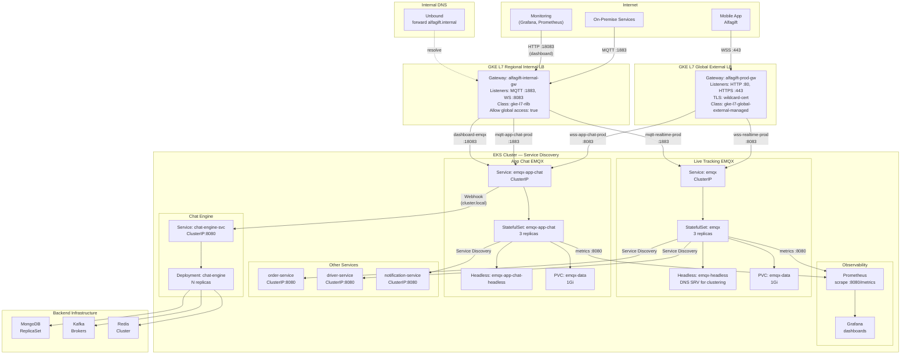

# Presentation Draft — KCD Indonesia 2026

> **Talk:** Real-Time Networking di Kubernetes: Live Tracking & Chat dengan Gateway API
> **Format:** Lightning Talk (10 minutes)
> **Event:** Kubernetes Community Days Indonesia — October 24, 2026, Bandung

---

## Slide 1 — Title (0:00 - 0:30)

**Real-Time Networking di Kubernetes**
**Live Tracking & Chat dengan Gateway API**

Ahmad Nurhidayat — Platform Engineer, Alfagift

> **Speaker Notes:**
> Open with energy. This is a 10-minute lightning talk — no time for slow introductions.
>
> "Halo semua. Nama saya Ahmad, saya platform engineer di Alfagift. Hari ini saya mau sharing bagaimana kami menjalankan live tracking dan chat untuk jutaan user di Kubernetes — menggunakan Gateway API."
>
> Pause 2 detik sebelum lanjut. Biarkan judul tersimpan di slide.

---

## Slide 2 — The Problem (0:30 - 1:30)

**Alfagift punya jutaan user aktif. Setiap detik ada data masuk.**

- Live Tracking: Driver kurir kirim GPS coordinates via WebSocket
- Chat System: User chat langsung dengan kurir dari aplikasi
- Semua berjalan di atas MQTT over WebSocket

**Kalau WebSocket mati — live tracking hilang untuk semua user.**



> **Speaker Notes:**
> Ini bukan toy example. Ini production system.
>
> "Bayangkan — setiap driver kurir Alfagift kirim GPS coordinates setiap beberapa detik. User bisa lihat posisi kurir real-time di aplikasi. Di saat yang sama, user bisa chat dengan kurir itu langsung. Semua jalan di atas WebSocket connection."
>
> "Tantangan kami: kalau WebSocket connection mati, atau gateway salah config, live tracking hilang untuk semua user. Bukan satu user — semua user."
>
> Tunjukkan diagram sederhana: Mobile App -> Gateway -> EMQX -> Backend.

---

## Slide 3 — Why Ingress Wasn't Enough (1:30 - 2:30)

**Ingress punya batasan untuk real-time systems:**

| Problem | Impact |
|---|---|
| WebSocket timeout | Connection mati setelah idle timeout default |
| Tidak ada weight-based routing | Canary deployment harus manual |
| ingress-nginx retired (March 2026) | Tidak ada security patches |
| Single resource owns everything | Platform team dan app team harus coordinate |

> **Speaker Notes:**
> Jangan terlalu lama di sini — audiens tahu masalah Ingress. Cukup highlight 2-3 poin.
>
> "Kami coba Ingress dulu. Tapi ada beberapa masalah. Pertama, WebSocket connections punya timeout. Kalau tidak di-tune, connection mati setelah beberapa menit idle. Kedua, tidak ada native canary deployment — harus pakai annotation hack. Ketiga, ingress-nginx sudah retired. Tidak ada security patches lagi."
>
> "Yang paling penting: Ingress adalah single resource yang menguasai semua — TLS, listeners, routing, backends. Platform team dan app team harus coordinate terus."

---

## Slide 4 — Gateway API: Role Separation (2:30 - 3:30)

**Gateway API memisahkan concerns:**



| Resource | Owner | Controls |
|---|---|---|
| GatewayClass | Cluster admin | Which controller |
| Gateway | Platform team | Ports, TLS, LB scheme, allowed namespaces |
| HTTPRoute | App team | Hostnames, paths, backends, weights |

> **Speaker Notes:**
> Ini poin terpenting dari talk ini.
>
> "Gateway API bukan hanya pengganti Ingress. Ini adalah role-oriented API. Setiap resource punya owner berbeda."
>
> "Cluster admin tentukan GatewayClass — controller mana yang dipakai. Platform team buat Gateway — ports, TLS certs, siapa yang boleh route. App team buat HTTPRoute — hostnames, paths, backends."
>
> "Di Alfagift, ini memisahkan tugas. Platform team setup gateway sekali. App team bisa tambah route sendiri tanpa coordinate."

---

## Slide 5 — Dual Gateway Architecture (3:30 - 5:00)

**Alfagift: Dua Gateway untuk tiga layer komunikasi**



### Three Communication Layers

| Layer | Gateway | Consumer | Protocol | DNS |
|---|---|---|---|---|
| **External** | `gke-l7-global-external-managed` | Mobile App | WSS :443 | `wss-realtime-prod.alfagift.id` |
| **Internal (cross-VPC)** | `gke-l7-rilb` | On-premise, other services | MQTT :1883 | `mqtt-realtime-prod.alfagift.internal` |
| **Inside K8s** | None — Service Discovery | Pod-to-pod | ClusterIP / Headless | `emqx.infrastructure.svc.cluster.local` |

### Key Insight

> **Mobile App** → External Gateway (WSS) → EMQX
> **On-premise / cross-VPC** → Internal Gateway (MQTT) → EMQX
> **Pod-to-pod inside K8s** → Service Discovery (ClusterIP/Headless) → EMQX

**External Gateway** — traffic publik, TLS termination, `*.alfagift.id`
**Internal Gateway** — traffic internal dari luar cluster, `*.alfagift.internal`
**Service Discovery** — komunikasi antar pod di dalam cluster, tanpa gateway

> **Speaker Notes:**
> Tunjukkan diagram ini. Biarkan audiens baca sebelum jelaskan.
>
> "Kami pakai tiga layer komunikasi. Pertama, External Gateway — user mobile app connect ke WebSocket lewat `wss-realtime.alfagift.id`. Ini public internet, TLS termination di load balancer."
>
> "Kedua, Internal Gateway — service dari on-premise atau VPC lain butuh akses MQTT. Mereka connect ke `mqtt-realtime-prod.alfagift.internal`. Ini regional internal load balancer, tidak bisa diakses dari internet."
>
> "Ketiga, di dalam Kubernetes sendiri — pod-to-pod communication pakai service discovery. ClusterIP untuk singleton services, headless untuk EMQX clustering. Tidak perlu lewat gateway."
>
> "Ini penting dipahami: Gateway API hanya untuk traffic yang MASUK atau KELUAR cluster. Traffic di dalam cluster pakai native Kubernetes service discovery."

---

## Slide 6 — Live Tracking: EMQX + Gateway API (5:00 - 6:30)

**Live Tracking: GPS data via MQTT over WebSocket**

```yaml
# External HTTPRoute for live tracking
apiVersion: gateway.networking.k8s.io/v1
kind: HTTPRoute
metadata:
  name: live-tracking-wss
  namespace: infrastructure
spec:
  parentRefs:
  - name: alfagift-prod-gateway
    namespace: gateway-api
    sectionName: https
  hostnames:
  - "wss-realtime-prod.alfagift.id"
  rules:
  - backendRefs:
    - name: emqx
      port: 8083
```

**MQTT Topic Structure:**

| Topic | Purpose | Access |
|---|---|---|
| `location/#` | GPS coordinates | Open publish + subscribe |
| `tracking/#` | Tracking data | Open publish + subscribe |
| `channels/+/receive` | Chat messages | Admin publish, user subscribe |
| `users/+/receive` | User messages | Admin publish, user subscribe |

> **Speaker Notes:**
> "Live tracking pakai EMQX — MQTT broker yang di-expose via WebSocket. Gateway API route `wss-realtime-prod.alfagift.id` ke EMQX port 8083."
>
> "Yang menarik adalah topic structure. Kami pakai MQTT topics untuk organize data. `location/#` untuk GPS, `tracking/#` untuk tracking data. ACL rules memastikan hanya data yang boleh di-publish bisa di-publish."
>
> Jangan terlalu lama di YAML — cukup highlight parentRefs dan hostnames.

---

## Slide 7 — Chat System: Webhook Integration (6:30 - 7:30)

**Chat: EMQX + External Chat Engine via Webhook**



| Setting | Live Tracking | Chat |
|---|---|---|
| Auth method | JWT token | HTTP webhook |
| ACL | Open on `location/#` | Strict deny-all |
| Integration | Direct MQTT | Webhook ke chat engine |
| Publish rights | All clients | Admin only |

> **Speaker Notes:**
> "Chat system berbeda. Sama-sama pakai EMQX, tapi konfigurasi berbeda."
>
> "Live tracking open — semua client boleh publish GPS data. Chat strict — hanya admin yang boleh publish. User hanya boleh subscribe ke channel mereka sendiri."
>
> "Chat system terintegrasi dengan external chat engine via webhook. Setiap pesan lewat EMQX diteruskan ke chat engine untuk diproses. Authorization juga via HTTP — EMQX tanya ke chat engine, apakah user ini boleh akses channel ini."
>
> "Ini menunjukkan fleksibilitas Gateway API + EMQX. Pola yang sama, konfigurasi berbeda untuk use case berbeda."

---

## Slide 8 — Key Takeaways (7:30 - 8:30)

**Apa yang kami pelajari:**

1. **Gateway API bukan hanya pengganti Ingress** — ini role-oriented API yang memisahkan concerns
2. **WebSocket routing tanpa special config** — HTTPRoute langsung route ke WebSocket port
3. **Canary deployment native** — weight-based dan header-based, bukan annotation hack
4. **Dual-gateway pattern** — external + internal untuk fleksibilitas traffic routing
5. **GKE-native CRDs** — `GCPBackendPolicy` untuk timeout, `HealthCheckPolicy` untuk health checks

> **Speaker Notes:**
> Ringkas dan clear. Jangan baca satu per satu — cukup highlight poin 2-3.
>
> "Lima hal yang kami pelajari. Pertama, Gateway API bukan cuma pengganti Ingress — ini API baru yang lebih expressive. Kedua, WebSocket routing langsung jalan tanpa special controller config. Ketiga, canary deployment adalah native feature."
>
> "Keempat, dual-gateway pattern memberikan fleksibilitas. External untuk publik, internal untuk service-to-service. Kelima, GKE-native CRDs memberikan kontrol lebih baik."

---

## Slide 9 — Full Production Architecture (8:30 - 9:15)



### Architecture Summary

| Component | Access Method | Protocol | Use Case |
|---|---|---|---|
| EMQX Live Tracking | External Gateway | WSS :443 | Mobile app GPS |
| EMQX Live Tracking | Internal Gateway | MQTT :1883 | On-premise services |
| EMQX Live Tracking | Service Discovery | ClusterIP | Pod-to-pod |
| EMQX App Chat | External Gateway | WSS :443 | Mobile app chat |
| EMQX App Chat | Internal Gateway | MQTT :1883 | On-premise services |
| Chat Engine | Service Discovery | ClusterIP :8080 | EMQX webhook |
| Backend Services | Service Discovery | ClusterIP | Order, Driver, Notification |

> **Speaker Notes:**
> "Ini arsitektur production kami. Tiga layer komunikasi:"
>
> "External Gateway melayani mobile app — WSS untuk live tracking dan chat. Internal Gateway melayani on-premise dan monitoring — MQTT dan dashboard. Di dalam cluster, semua komunikasi pakai service discovery."
>
> "Perhatikan: EMQX punya dua deployment terpisah — live tracking dan chat. Keduanya pakai StatefulSet 3 replicas dengan headless service untuk clustering via DNS SRV records."
>
> "Chat engine terintegrasi via webhook — EMQX push pesan ke chat engine via cluster-local service call. Tidak perlu lewat gateway."

---

## Slide 10 — CTA & Contact (9:15 - 10:00)

**Terima kasih!**

- Documentation: [docs-gli repo]
- Gateway API: [gateway-api.sigs.k8s.io](https://gateway-api.sigs.k8s.io/)
- EMQX: [emqx.io](https://www.emqx.io/)

**Questions?**

Ahmad Nurhidayat
Platform Engineer @ Alfagift

> **Speaker Notes:**
> "Terima kasih. Kalau ada pertanyaan, silakan. Atau bisa DM saya setelah session."
>
> Jangan lupa sebut: "Slide ini tersedia di [link]. Documentation lengkap ada di repo kami."
>
> Tersenyum. Jangan lari dari stage. Biarkan MC yang tutup.

---

## Timing Summary

| Slide | Content | Time | Cumulative |
|---|---|---|---|
| 1 | Title | 0:30 | 0:30 |
| 2 | Problem | 1:00 | 1:30 |
| 3 | Why Ingress wasn't enough | 1:00 | 2:30 |
| 4 | Gateway API role separation | 1:00 | 3:30 |
| 5 | Dual gateway architecture | 1:30 | 5:00 |
| 6 | Live tracking | 1:30 | 6:30 |
| 7 | Chat system | 1:00 | 7:30 |
| 8 | Key takeaways | 1:00 | 8:30 |
| 9 | Architecture visual | 0:45 | 9:15 |
| 10 | CTA & contact | 0:45 | 10:00 |

---

## Speaker Tips

1. **Practice with timer** — 10 minutes is VERY short. Rehearse at least 5 times.
2. **Speak Indonesian** — KCD ID audience is Indonesian. Use English only for technical terms.
3. **Don't read slides** — audience can read. Talk about the "why" and "how".
4. **Show confidence** — you built this system. You know it better than anyone in the room.
5. **Engage the audience** — "Siapa di sini yang pakai Ingress-nginx?" then "Well, it's retired."
6. **Prepare for questions** — common questions:
   - "Why EMQX not Kafka?" -> MQTT lebih cocok untuk real-time pub/sub dengan WebSocket
   - "Why not use AWS ALB?" -> Kami di GKE, tapi pattern yang sama bisa dipakai di AWS
   - "Berapa latency?" -> WebSocket + EMQX sub-10ms untuk message delivery

---

## Slide Design Notes

| Slide | Visual Style |
|---|---|
| 1 | Dark background, logo Alfagift + KCD |
| 2 | Simple diagram: App -> Gateway -> EMQX -> Backend |
| 3 | Table with red highlights on problems |
| 4 | Vertical flow diagram: GatewayClass -> Gateway -> HTTPRoute |
| 5 | Two-column: External Gateway (left) + Internal Gateway (right) |
| 6 | Code snippet + topic table side by side |
| 7 | Webhook flow diagram + comparison table |
| 8 | Numbered list with icons |
| 9 | Full architecture diagram (production) |
| 10 | Contact info + QR code to docs repo |

---

**Status:** Draft — review before submission
**Last updated:** July 2026
